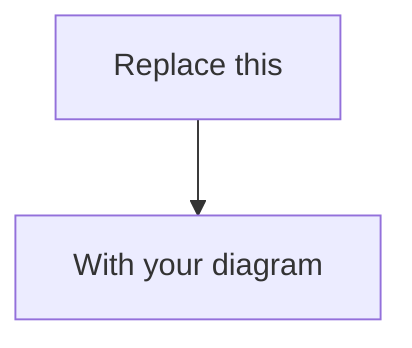

## 🔗 Related User Story
Link the related User Story issue.

Example:
- Closes #12
- Related to #12

If there is no User Story, explain why this feature is engineering-driven or create one first.

## ✨ Proposed feature
Describe the concrete feature or enhancement being proposed.

This should describe the **solution**, not just the problem.

## 🎯 Problem being solved
What problem or limitation does this feature address?

Why is this feature needed?

## 🧩 Proposed solution
Explain how this should work.

Include relevant details such as:

- UI changes (if any):
- API changes (if any):
- Domain behavior changes:
- Infra / data / background job impact (if any):

## 🖼️ Visualized diagram (required for non-trivial features)
Include at least one of the following when behavior is non-trivial:

- Mermaid
- UML
- structured flow / architecture diagram

Paste the diagram below and photos.

## 😇 Expected behavior

Describe what the system should do after this feature is implemented.

Focus on observable behavior.

## ✅ Success criteria

How will we know this feature works?

Examples:

* PR subset eval pass rate ≥ `95%` on `dataset vX`
* Latency reduced from `A` to `B`
* Judge score average increases from `A` to `B`

Write yours:

* Metric(s): `...`
* Target(s): `...`

## 🚫 Non-goals

What is explicitly out of scope?

Examples:
This feature does not aim to:
- redesign the full dashboard layout
- add agent creation or deletion
- persist user filter preferences
- introduce backend analytics

## 🔍 Alternatives considered

What other approaches were considered, and why were they not chosen?

## 🧪 Testing expectations

What tests should confirm this works?

* [ ] Unit tests added/updated
* [ ] Integration tests added/updated
* [ ] Evals updated/added (datasets/rubrics/configs)
* [ ] CI passing required

## 📎 Additional context

Screenshots, examples, prompts, references, related ADRs, or supporting notes.