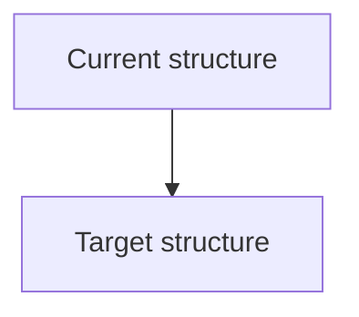

## 🔧 Technical task summary
Describe the internal engineering work to be done.

Examples:
- split service layers
- reduce coupling
- rename modules
- improve testability
- simplify config loading

## 🎯 Why is this needed?
Why should this task be done?

Examples:
- reduce maintenance burden
- improve code clarity
- improve extensibility
- reduce risk
- improve performance
- support future features

## 🧩 Proposed change
Explain the intended technical change.

Include relevant details such as:

- affected modules:
- expected refactor scope:
- behavior changes (if any):
- migration concerns (if any):

## 🚫 Non-goals
What is explicitly out of scope?

Examples:
This feature does not aim to:
- redesign the full dashboard layout
- add agent creation or deletion
- persist user filter preferences
- introduce backend analytics

## 🖼️ Diagram (optional but recommended for non-trivial changes)
If the refactor affects flow, structure, or component boundaries, include a Mermaid / UML / architecture diagram.

## ✅ Success criteria

How will we know this task is complete?

Examples:

* duplicated logic removed
* service boundaries clarified
* tests still pass
* behavior unchanged unless explicitly intended

Write yours:

* Metric(s): `...`
* Target(s): `...`

## 🧪 Testing expectations

What tests should confirm this works?

* [ ] Existing tests still pass
* [ ] Unit tests added/updated
* [ ] Integration tests added/updated
* [ ] CI passing required

## 📎 Additional context

References, related issues, related ADRs, code pointers, or cleanup notes.