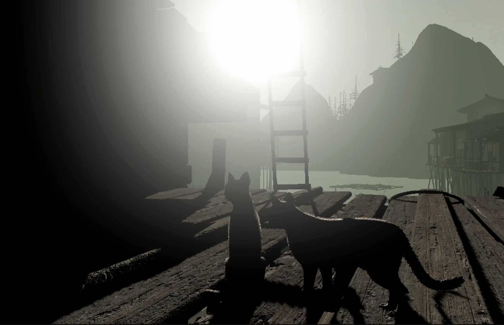
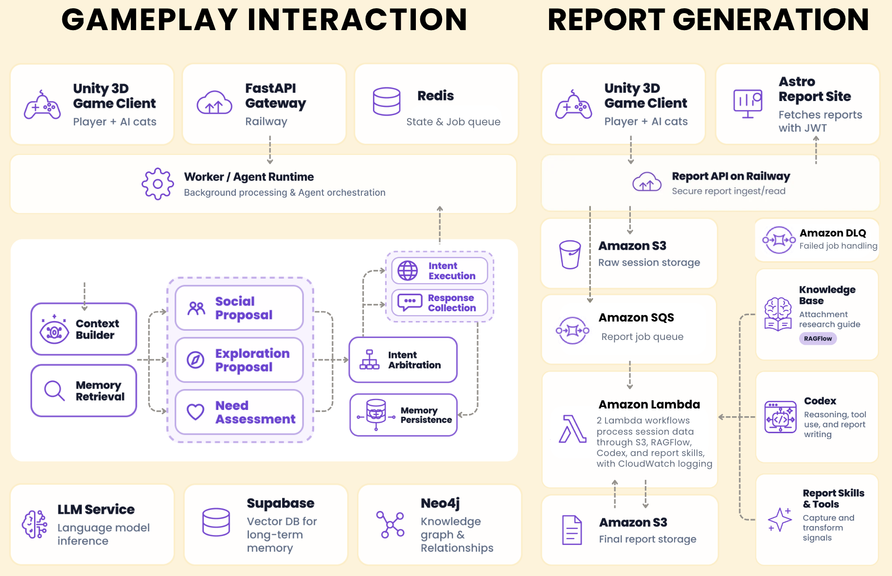

# Mewi

> *A game about the kinds of connection that time shapes and eventually separates.*

<p align="center">
  
  <br>
  <sub>16 stray cats living in a Unity 3D fishing village, with or without you.</sub>
</p>

https://github.com/user-attachments/assets/1ddffc32-9ab8-42e0-ab41-690801003e30

## Why

Many of us carry the quiet grief of good relationships that time pulled apart: not broken, just gone different ways. The friend who moved cities. The person you grew alongside, then gradually didn't. These weren't failures. They were real. And somehow that makes the missing harder.

People are increasingly open to companionship that asks nothing of them, such as Casio's Moflin, a presence that responds without judging. Mewi starts there, then asks a harder question, borrowed from John Berger's *Ways of Seeing*: *the way we see things is affected by what we know or what we believe.* Every encounter leaves a trace, and that trace shapes how we meet whoever comes next.

Mewi is a place to sit with that feeling and live it again.

## What

Each stray is like a different person you bond with.

Each has its own temperament. Some open up quickly. Some make you work for it. Some drift before you feel ready. They are shaped by your habits, changed by your presence.

Then you get busy. You stop showing up. Life pulls you both elsewhere. When you return, the closeness is already gone: no goodbye, just the quiet gap time leaves behind. You can try to rebuild with the same stray, or meet a new one and begin again.

We call them **Wandering Agents**: sixteen memory-driven cats that decide, explore, and socialize on their own, whether or not a player is watching.

## The Two Loops

### 1. Short-term: the thrill of being chosen

Each stray has its own personality. Some play hard to get. Some are cautious. Some are bold. You try to earn trust and be chosen, just as you do with all kinds of people you meet in life.

> *The stray does not comply. It considers. And when it chooses to acknowledge you, that moment feels earned because it was.*

Design intent: quick reflexes driven by personality. Curiosity, not compliance. Unpredictable warmth, not programmed response.

### 2. Long-term: the passing bond

Over time, a stray is influenced by you. It notices when you arrive. It remembers how you approach, what you offer, how patient you are. The bond deepens.

But the world keeps moving. While you're away, the stray meets other cats, other people, other things. Bonds drift the way living bonds do, not through betrayal but through time and the pull of other lives. Your place fades naturally.

And when it wanders on, it carries you with it. The next person who meets this cat meets a little of who you were to it. Through the cat, strangers who never met become quietly connected, like a shared diary written in behavior instead of words.

> *The departure was always coming. The bond was real anyway.*

<sub>Current timescale (prototype): short-term ≤ 1 min · mid-term 1–10 min · long-term > 10 min</sub>

## Design Principles

**The cat decides.** The stray never tells you what to do; it shows you. Whether patience beats pursuit depends on who the cat is, and you only find out by paying attention.

**The world doesn't wait for you.** Cats keep living when you're gone: claiming territory, competing for food, forming their own ties. Your absence has consequences because their lives have momentum.

**Memory is the medium.** What a cat remembers of you shapes how it treats the next person. Personality isn't fixed at spawn; it accumulates.

## The Emotional Arc

```
Stranger → Interaction → Bonding → Drift → Departure → Remembrance
```

## What Mewi Is Not

- **Not a pet simulator.** The stray is never tamed, never owned.
- **Not a sad game.** The parting is gentle. It holds loss without wallowing in it.
- **Not a game about cats.** It is a game about the kinds of connection that time shapes and eventually separates.

## What We Built

The full vision is the long loop: cats that carry memories across players. Within the scope of our capstone timeline, we focused on making the short loop feel alive and revealing what that loop says about the player.

- **A living village.** 16 autonomous cat agents in a Unity 3D open-world fishing village, each with a distinct starting personality.
- **Personality-driven feedback.** The same player action gets different, immediate reactions depending on which cat you approach.
- **Reading the player back.** Interaction behaviors (how you approach, how long you wait, when you give up) are captured and mapped to an Attachment Theory profile. The game quietly tells you something about how you bond.

### System Architecture

<p align="center">
  
</p>

This diagram shows only the backend architecture. The Unity side is omitted. It is designed to support multiple concurrent players: the game-agent backend is on the left, and the attachment-theory report pipeline is on the right.

## Where It's Going

**Seeing from other sides.** In conversations with counselors at our university's counseling center, we explored using Mewi for people with limited social experience or low mood. Cats clash over territory or food, and the player pieces together what happened by listening to each side, practicing perspective-taking in a low-stakes world.

**From virtual strays to real ones.** Many shelter animals go unseen. We'd like to capture real cats' behavior on camera, rebuild them as agents with the same temperament, and let them roam a 24-hour livestream linked to adoption and donation info, turning time spent with a virtual cat into attention for a real one.

**Strangers connected through an agent.** The original idea, still unbuilt: a cat that wanders between players, its personality shaped by everyone who met it. Can people who never meet form a bond through a creature they each cared for?

## Assets & Credits

| Type | Asset | Source / Author | License |
|---|---|---|---|
| Engine | Unity 6.3 (`6000.3.11f1`) | Unity Technologies | Unity Personal |
| 3D model | Cat models | [MalberS Animations](https://www.malbersanimations.com/) | [Standard Unity Asset Store EULA](https://unity.com/legal/as-terms) |
| Animation / controller | Animal Controller | [MalberS Animations](https://www.malbersanimations.com/) | [Standard Unity Asset Store EULA](https://unity.com/legal/as-terms) |
| Environment | Fishing village (docks, boats, sea) | Leartes Studios | [Standard Unity Asset Store EULA](https://unity.com/legal/as-terms) |
| AI | [LangGraph](https://github.com/langchain-ai/langgraph) | LangChain, Inc. | MIT |

Third-party assets were purchased from their respective creators and are not included in this repository.
