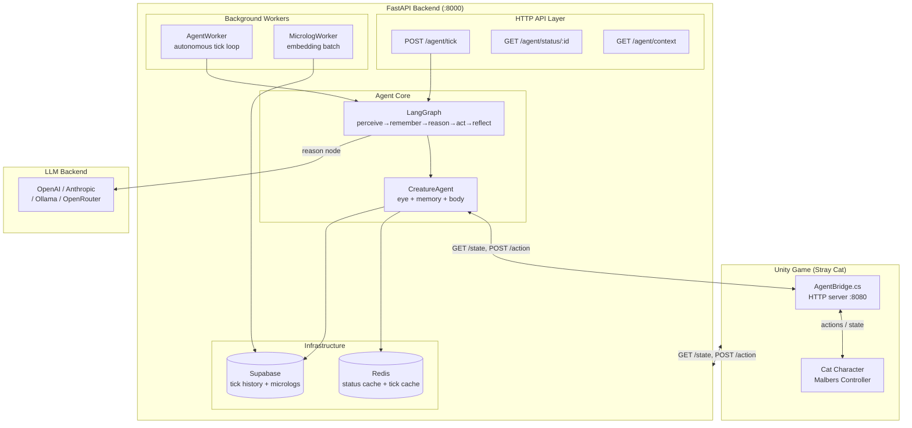
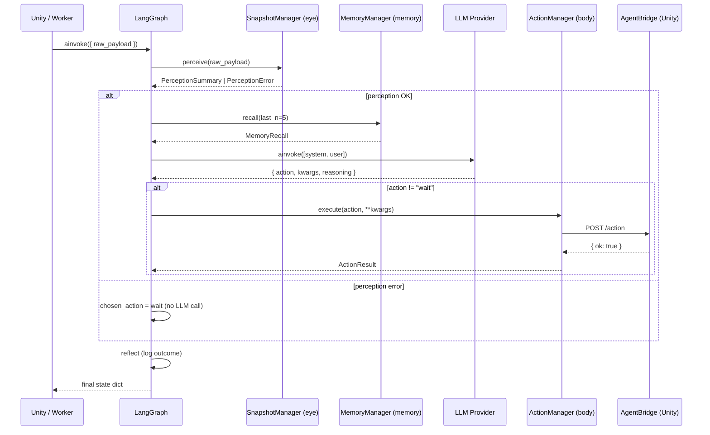
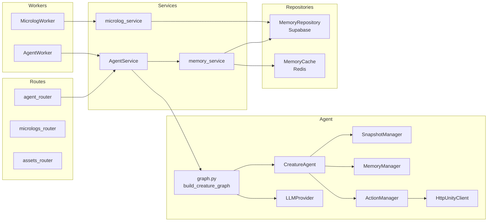
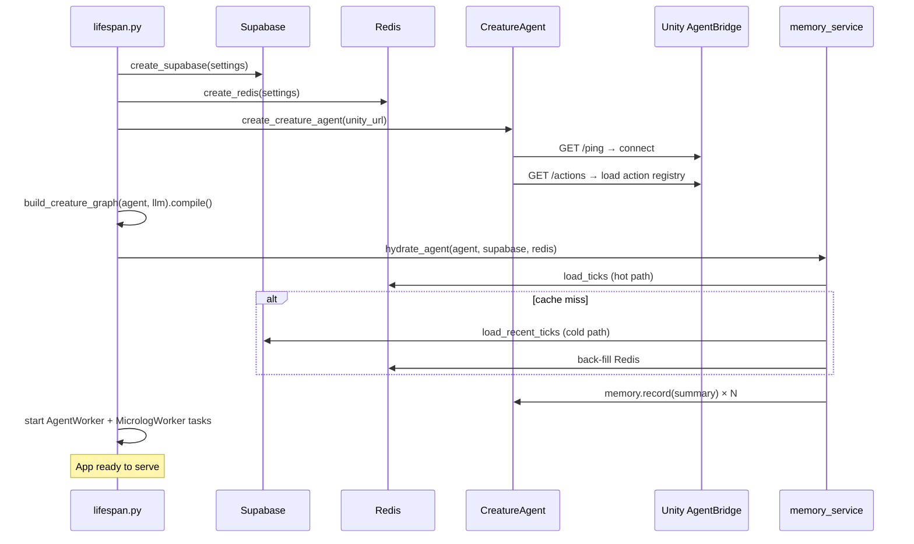
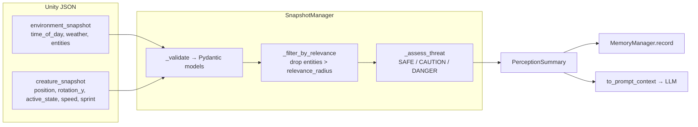
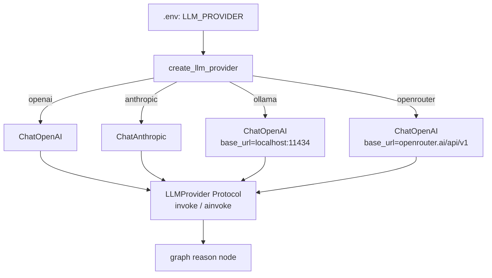

# Mewi Backend — Architecture

## System Overview

## Agent Tick Flow

Each tick (triggered by Unity POST or the autonomous worker) runs a 5-node LangGraph:

## Module Dependency Map

## Startup Sequence

## Data Flow: Perception Payload (Unity → Agent)

## LLM Provider Configuration

## Key Design Decisions

| Decision | Why |
|---|---|
| `CreatureAgent` is the **body**, LangGraph is the **brain** | Swap graphs (reactive, planning, hardcoded) without touching the creature |
| Node factories close over `agent` — graph state is pure data | State is serializable; LangGraph can checkpoint it |
| `LLMProvider` is a Protocol, not a base class | Any LangChain `ChatModel` satisfies it; no inheritance coupling |
| `UnityClientProtocol` injected into `ActionManager` | Swap `HttpUnityClient` ↔ `MockUnityClient` without touching logic |
| `AgentService` owns status transitions (`thinking` / `idle`) | Router stays thin; status always resets even on graph failure |
| `persist_tick` runs as FastAPI `BackgroundTask` | Supabase write never blocks the Unity response |
| Integration tests guarded by `CONFIRM_PAID=1` | Prevent accidental real LLM / DB calls in CI |
