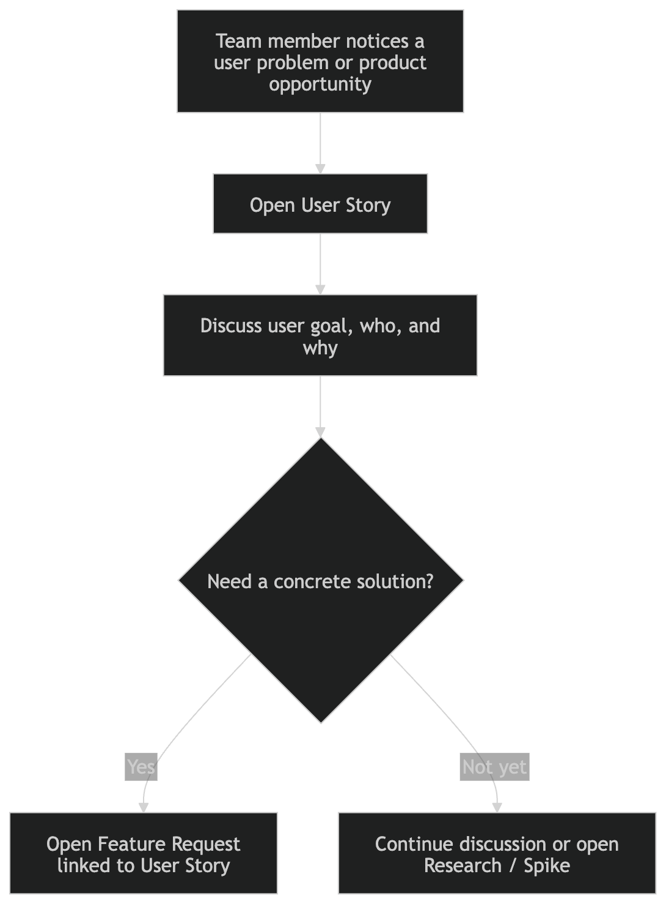
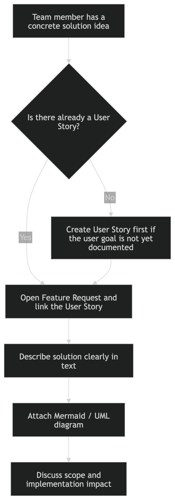
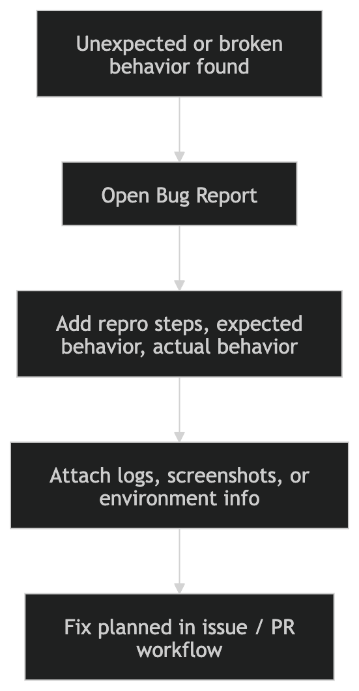
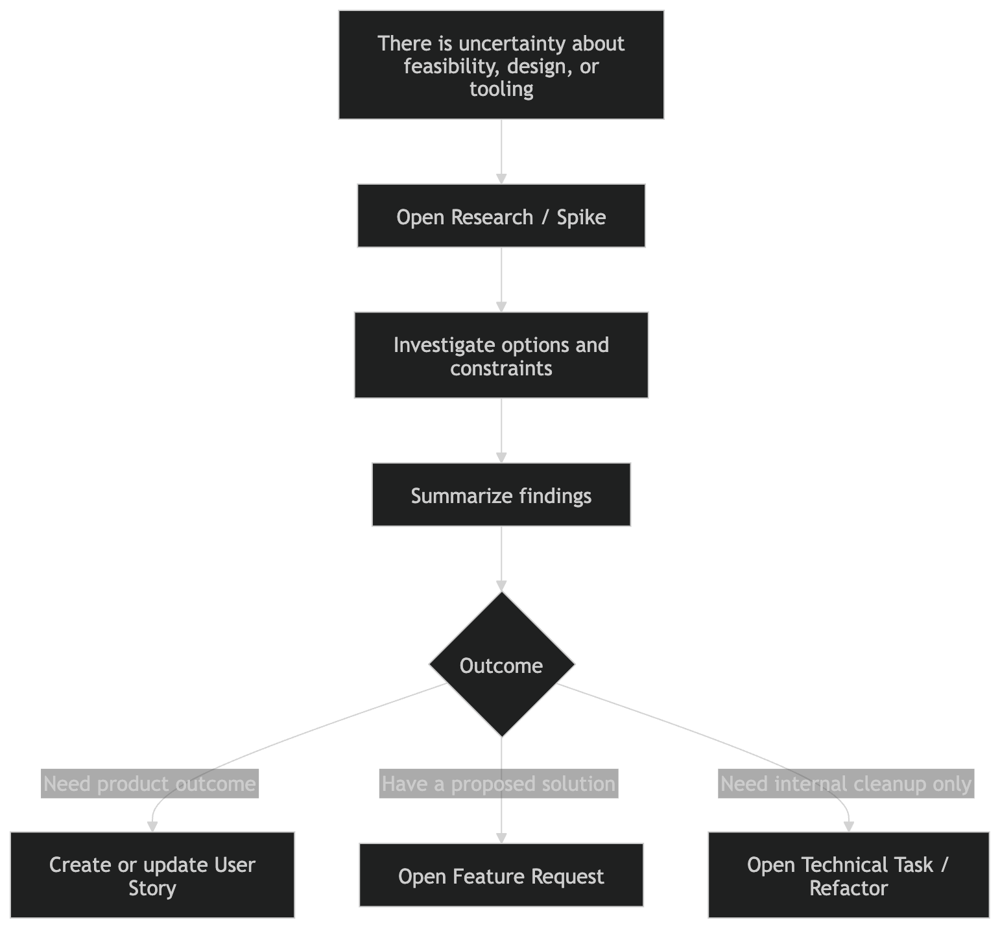
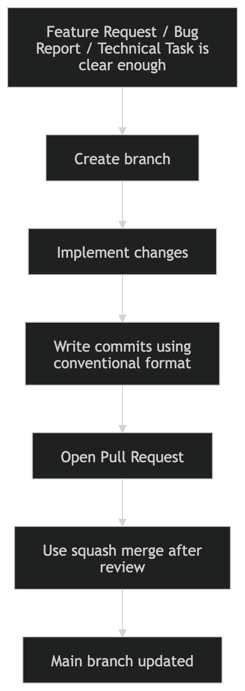
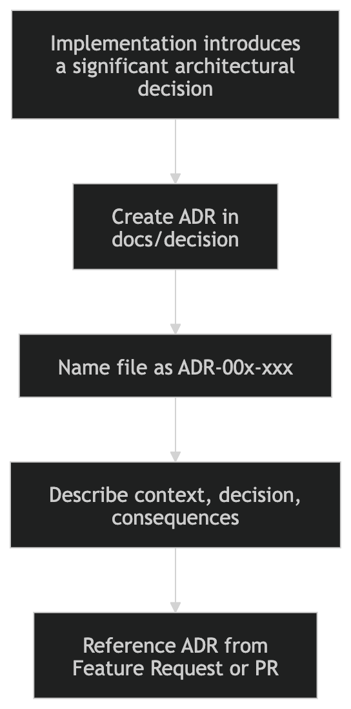
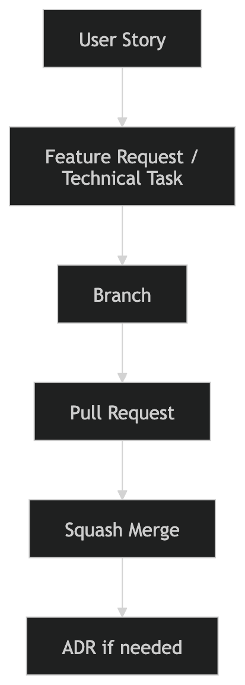

# ⭐ Contributing Guide

Thank you for contributing to this project.

This repository uses a lightweight product-to-engineering workflow so that ideas, solutions, implementation work, and architecture decisions stay organized and traceable.


## 🧭 Core Principles

We intentionally separate:

- **user needs**
- **proposed solutions**
- **implementation work**
- **architecture decisions**

This helps us avoid:

- jumping into implementation too early
- mixing vague product goals with concrete engineering tasks
- losing architectural context behind code changes


## 🗂️ Workflow Overview

We currently use the following issue and documentation types:

1. **User Story**
2. **Feature Request**
3. **Bug Report**

Optional issue types for later as the project grows:

4. **Technical Task / Refactor**
5. **Research / Spike**

We also use:

- **Pull Requests** for reviewed code changes
- **ADR documents** for major architectural decisions


## 👤 1. User Story

A **User Story** describes a high-level user need.

It answers:

- **who**
- **why**
- **goal**

A User Story should stay intentionally abstract. It describes the **problem or desired outcome**, not the implementation.

### ✅ Use it when

Open a **User Story** when you have:

- a user problem
- a product goal
- a desired outcome
- but **no fixed solution yet**

### 📌 A User Story must include

- the user or actor
- the desired outcome
- why it matters
- enough context for others to understand the need

### 🚫 A User Story must not include

- implementation details
- specific UI, API, database, or framework choices
- technical design unless absolutely necessary for context

### 💡 Example

> As a user, I want to quickly understand the status of all agents, so that I can decide where to intervene.

A single User Story may later lead to:

- one Feature Request
- multiple Feature Requests
- one or more Technical Tasks


## 🛠️ 2. Feature Request

A **Feature Request** is a concrete proposed solution to a User Story.

It answers:

- **what we propose to build**
- **how it should behave**
- **what scope it covers**

A Feature Request should be clear enough for engineering discussion and implementation planning.

### ✅ Use it when

Open a **Feature Request** when you:

- already have a concrete proposed solution
- can explain the expected behavior clearly
- can describe the scope
- can provide a visualized diagram when the change is non-trivial

### 📌 A Feature Request must include

- the problem being solved
- the proposed solution in clear text
- expected behavior and scope
- a linked **User Story** when the work is user-driven
- a **diagram** for non-trivial features

### 🖼️ Acceptable diagram formats

At least one of the following is acceptable:

- **Mermaid**
- **UML**
- another structured architecture / flow diagram

For very small changes, a lightweight flow or mock may be acceptable, but the intended behavior must still be clear.

### 🧩 A Feature Request should also include

- linked User Story
- proposed UX or system flow
- API / domain / infra impact if relevant
- edge cases or constraints
- testing expectations

### 🚫 A Feature Request must not include

- a solution that is still too vague to implement
- multiple unrelated features in one issue
- a missing diagram for non-trivial behavior changes

### 💡 Example

A User Story says:

> As a user, I want to quickly understand the status of all agents, so that I can decide where to intervene.

A Feature Request may propose:

> Add a hex-grid agent dashboard with per-agent state badges, hover details, and status filtering.


## 🐞 3. Bug Report

A **Bug Report** documents incorrect, broken, or unexpected behavior.

### ✅ Use it when

Open a **Bug Report** when something behaves incorrectly or differently from the intended behavior.

### 📌 A Bug Report should include

- expected behavior
- actual behavior
- steps to reproduce
- screenshots or logs if available
- environment information when relevant
- severity or impact if known
- workaround if one exists

### 🚫 A Bug Report is not for

- vague product ideas
- feature proposals
- refactor suggestions
- open-ended research questions


## 🔧 4. Technical Task / Refactor *(Optional)*

A **Technical Task / Refactor** is for internal engineering work that does not directly represent a new user-facing feature.

### ✅ Use it when

Use this when the work is mainly technical and does not need a User Story.

### Examples

- split service layers
- rename modules
- reduce coupling
- improve testability
- migrate config structure
- optimize performance without changing behavior


## 🔬 5. Research / Spike *(Optional)*

A **Research / Spike** is for investigation before committing to implementation.

### ✅ Use it when

Open a **Research / Spike** when the team needs to:

- evaluate a library
- compare design options
- reduce uncertainty
- validate feasibility
- estimate complexity

### 📌 A Spike should end with

- findings
- recommendation
- next step

A Spike is not production work by itself.

<br>
<br>

# ✨ Recommended Decision Flow

If you find any part of this workflow contradictory, misleading, or unnecessary, please raise it for discussion.

## ❓ When should I open a User Story?

Open a **User Story** when you understand the need, but not yet the solution.

## ❓ When should I open a Feature Request?

Open a **Feature Request** when you already have a concrete proposed solution.

## ❓ When should I open a Bug Report?

Open a **Bug Report** when something is broken or behaves incorrectly.

## ❓ When should I open a Technical Task / Refactor?

Open it when the work is engineering-focused and not primarily user-facing.

## ❓ When should I open a Research / Spike?

Open it when investigation is needed before design or implementation.

<br>
<br>

# 🔄 End-to-End Contribution Scenarios

Below are common scenarios you may encounter. More cases can be added later if needed.

## 🧠 Scenario A: A teammate has an idea, but no solution yet
<p align="center">

</p>

## 💭 Scenario B: A teammate already has a proposed solution
<p align="center">

</p>

## 🐞 Scenario C: A teammate found broken behavior
<p align="center">

</p>

## 🔍 Scenario D: A teammate needs to investigate before building
<p align="center">

</p>

## 🚀 Scenario E: A teammate is ready to implement
<p align="center">

</p>

## 🏛️ Scenario F: A major architectural decision is involved
<p align="center">

</p>

<br>
<br>

# 🌿 Branch Naming

Use lowercase kebab-case for branch names.

### Allowed prefixes

- `feature/`
- `fix/`
- `refactor/`
- `docs/`

### Examples

```bash
feature/agent-status-dashboard
feature/audio-upload-retry
feature/eval-runner-config-cleanup
fix/sse-reconnect-timeout
refactor/split-eval-runner-service
docs/update-contributing-guide
````

<br>
<br>

# 📝 Commit Message Convention

Use the following format:

```text
<type>: <short summary>
```

### Common commit types

* `feat`
* `fix`
* `refactor`
* `docs`
* `test`
* `chore`

### Rules

* keep messages short and action-oriented
* use one logical change per commit where possible
* use imperative mood

### Examples

```
feat: add agent status panel
feat: improve voice upload validation
fix: handle missing eval config
refactor: split runner and formatter logic
docs: update contributing workflow
test: add eval runner config tests
chore: clean up docker compose service names
```

<br>
<br>

# 🔀 Pull Request Rules

### 📌 Before opening a PR

Make sure:

* the branch name follows convention
* the related issue is linked
* the scope is clear
* tests are updated if needed
* docs are updated if needed
* ADR is added or referenced if architecture changed

### 🏷️ PR title format

Use:

```text
type(what): short summary
```

### Examples

```text
feat(eval system): add hex-grid agent dashboard
fix(eval system): handle missing upload state
refactor(eval system): split evaluation pipeline service
```

### ✅ Merge strategy

We use **Squash and Merge**.

This keeps the `main` branch history clean and makes each PR one reviewed unit of change.

<br>
<br>

# 🏛️ ADR (Architecture Decision Record)

For important architecture or system design decisions, create an ADR under:

* `docs/decision/ADR-00x-xxx`

### Examples

```text
docs/decision/ADR-001-eval-runner-entrypoint.md
docs/decision/ADR-002-agent-routing-strategy.md
```

### Create an ADR when

* the decision significantly affects architecture
* the change has meaningful trade-offs
* the team may revisit the reasoning later
* the implementation changes cross-cutting behavior

### An ADR should include

* context
* decision
* alternatives considered
* consequences

<br>
<br>

# 🔗 Traceability Rule

The intended traceability is:
- A Pull Request must resolve a Feature Request or Bug Report.
- A Feature Request must satisfy a User Story.
- A Major Architecture Change must be documented in an ADR.

<p align="center">

</p>

This helps future contributors understand:

* why the work exists
* what solution was chosen
* how it was implemented
* what architectural trade-offs were made


## Best emoji separators to keep

- ⭐ main guide
- 🧭 principles
- 🗂️ overview
- 👤 user story
- 🛠️ feature request
- 🐞 bug report
- 🔧 refactor
- 🔬 spike
- ✨ decision flow
- 🔄 scenarios
- 🌿 branch naming
- 📝 commit convention
- 🔀 pull request
- 🏛️ ADR
- 🔗 traceability

## Final recommendation
The three most important fixes are:
1. fill in **Pull Request Rules**
2. complete **Traceability Rule**
3. strengthen the **User Story vs Feature Request** boundary

If you want, I can next turn this into a **fully polished final CONTRIBUTING.md with shorter wording and more industry-style tone**.

