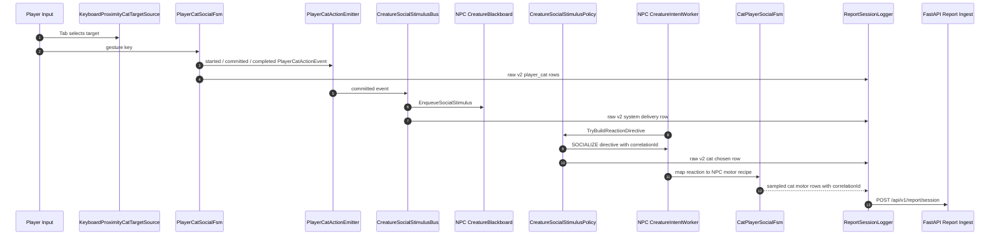

# PR: ADR-029 / ADR-030 Player-Cat Social Interaction And Raw v2 Reporting

## Summary

This PR implements the code-side slice of ADR-029 and ADR-030:

- A keyboard-driven player cat can proximity-lock an NPC cat and perform authored social gestures.
- NPC cats can opt into a guarded local social-stimulus interrupt lane.
- Unity records explicit raw v2 report rows with event ids, phases, actor ids, target ids, and shared `correlation_id`.
- Live motor execution reports also carry the same `correlationId`, so player gesture, delivered stimulus, NPC reaction, and motor steps can be joined later.
- The backend accepts raw v2 payloads, normalizes them for the current report processor, and has an opt-in local enqueue mode for ADR-030's future out-of-band processing path.

The implementation keeps the ADR-029 player-control scripts under `Assets/Scripts/Player/Cat/` and leaves NPC/creature reaction code under `Assets/Scripts/Creature/`.

## ADRs

- ADR-029: PlayerCat Action FSM
- ADR-030: Post-Session Report Processing And Narrative Generation

## Implemented Slices

### PR 0: Schema And Correlation Seam

- Added `IntentMessage.CorrelationId`.
- Added `PlanExecutionReport.correlationId` and `PlanStepExecutionReport.correlationId`.
- Propagated correlation ids through graph-authored and recipe-authored micro-actions.
- Extended `ReportSessionPayload` to support `mewi.report.raw.v2`.
- Updated backend Pydantic report models and report processor normalization for raw v2.

### PR 1: Player Target Source And Markers

- Added `KeyboardProximityCatTargetSource`.
- Added `PlayerCatTargetLock` and `IPlayerTargetSource`.
- Added `PlayerCatTargetFeedbackHud` for green candidate markers and blue locked-target marker.

### PR 2: Player Camera Mode And Observe-Only Switcher

- Added `PlayerCatCameraModeController`.
- Added `PlayerCatSocialInputRouter`.
- Refactored `MultiCatCameraManager` so observe mode frames cats without changing the stable player actor.
- Kept legacy possession behavior behind `possessCatWhenFraming`, default false.

### PR 3: Player FSM, Emitter, Logger, Outbox

- Added `PlayerCatSocialFsm`.
- Added `PlayerCatActionEvent` and `PlayerCatActionEmitter`.
- Added `PlayerCatMotorHelpers`.
- Updated `ReportSessionLogger` to subscribe to player action, stimulus delivery, and NPC reaction events.
- Added optional pending-outbox replay on start in `ReportSessionFileOutbox`.

### PR 4: NPC Social Stimulus Lane

- Added `SocialStimulus`.
- Added `CreatureSocialStimulusBus`.
- Added `CreatureSocialStimulusPolicy`.
- Added social-stimulus queue APIs to `CreatureBlackboard`.
- Updated `CreatureIntentWorker` with a null-safe, opt-in `enableSocialStimulusPolicy` path.

### PR 5 Local Slice: Backend Enqueue Seam

- Added `QueuedProcessingTrigger`.
- Added `LocalFileProcessingQueue`.
- Added `MEWI_REPORT_PROCESSING_MODE=queue` support.
- Kept `inline` as the default so existing local report processing still works.

Cloud S3, SQS/EventBridge, Lambda, RAGFlow, and production Astro fetch are not implemented in this Unity/backend code slice. The local queue seam is ready for those replacements later.

## Main Unity Files

Player-owned code:

- `Assets/Scripts/Player/Cat/PlayerCatUserConfig.cs`
- `Assets/Scripts/Player/Cat/KeyboardProximityCatTargetSource.cs`
- `Assets/Scripts/Player/Cat/PlayerCatTargetLock.cs`
- `Assets/Scripts/Player/Cat/PlayerCatTargetFeedbackHud.cs`
- `Assets/Scripts/Player/Cat/PlayerCatCameraModeController.cs`
- `Assets/Scripts/Player/Cat/PlayerCatSocialInputRouter.cs`
- `Assets/Scripts/Player/Cat/PlayerCatSocialFsm.cs`
- `Assets/Scripts/Player/Cat/PlayerCatMalbersActionDriver.cs`
- `Assets/Scripts/Player/Cat/PlayerCatMotorHelpers.cs`
- `Assets/Scripts/Player/Cat/PlayerCatActionEvent.cs`
- `Assets/Scripts/Player/Cat/PlayerCatActionEmitter.cs`

NPC/creature-owned code:

- `Assets/Scripts/Creature/Core/CreatureBlackBoard.cs`
- `Assets/Scripts/Creature/Motor/ActionFSM/CreatureIntentWorker.cs`
- `Assets/Scripts/Creature/Motor/ActionFSM/SocialStimulus.cs`
- `Assets/Scripts/Creature/Motor/ActionFSM/CreatureSocialStimulusBus.cs`
- `Assets/Scripts/Creature/Motor/ActionFSM/CreatureSocialStimulusPolicy.cs`
- `Assets/Scripts/Creature/Motor/ActionFSM/CatPlayerSocialFsm.cs`
- `Assets/Scripts/Creature/Motor/ActionFSM/CatBehaviorGraph.cs`
- `Assets/Scripts/Creature/Motor/ActionFSM/CatSocialMotionRecipe.cs`

Report code:

- `Assets/Scripts/Report/Session/ReportSessionPayload.cs`
- `Assets/Scripts/Report/Session/ReportSessionLogger.cs`
- `Assets/Scripts/Report/Session/ReportSessionFileOutbox.cs`
- `Assets/Scripts/Report/PlanExecution/PlanExecutionReport.cs`

Backend code:

- `mewi-backend/app/models/report.py`
- `mewi-backend/app/services/report/processor.py`
- `mewi-backend/app/services/report/trigger.py`
- `mewi-backend/app/api/deps.py`
- `mewi-backend/tests/unit/services/test_report_ingestion.py`

## Manual Unity Wiring

### 1. Player Cat Components

Attach these to the player cat root GameObject, the Malbers cat controlled by the user:

- Existing or already required:
  - `CreatureBlackboard`
  - Malbers `MAnimal`
  - Malbers `MInput`
- New player scripts:
  - `KeyboardProximityCatTargetSource`
  - `PlayerCatTargetFeedbackHud`
  - `PlayerCatActionEmitter`
  - `PlayerCatSocialFsm`
  - `PlayerCatSocialInputRouter`
  - `PlayerCatMalbersActionDriver`
  - `PlayerCatCameraModeController`

`CreatureMotorWorker` and `MalbersAnimalAdapter` are optional on the player cat. Use them only if you intentionally want the player cat to consume blackboard motor queues like an NPC. The normal embodied-player path is `PlayerCatSocialInputRouter` -> `PlayerCatSocialFsm` -> `PlayerCatMalbersActionDriver` -> Malbers `MAnimal` Action mode. Player social actions are in-place: they do not approach, enqueue `go_to`, enqueue `look_at`, or rotate the player cat toward the selected target.

Recommended player-cat values:

| Component | Field | Value |
|---|---|---|
| `CreatureBlackboard` | `Creature Id` | stable player-cat id, such as `vanillaSky00` |
| `KeyboardProximityCatTargetSource` | `Player Root` | player cat root |
| `KeyboardProximityCatTargetSource` | `Player Blackboard` | player cat `CreatureBlackboard` |
| `KeyboardProximityCatTargetSource` | `Acquisition Radius Meters` | `3.5` |
| `KeyboardProximityCatTargetSource` | `Minimum Facing Dot` | `0.35` |
| `KeyboardProximityCatTargetSource` | `Distance Weight` | `0.35` |
| `KeyboardProximityCatTargetSource` | `Facing Weight` | `1.0` |
| `KeyboardProximityCatTargetSource` | `Require Entity Cat Tag` | false until all NPC cats have `SmartObject` tag `entity.cat` |
| `KeyboardProximityCatTargetSource` | `Remember Target On Player Blackboard` | true |
| `PlayerCatTargetFeedbackHud` | `Target Source` | player `KeyboardProximityCatTargetSource` |
| `PlayerCatTargetFeedbackHud` | `Marker Height` | `1.25` |
| `PlayerCatTargetFeedbackHud` | `Candidate Scale` | `0.16` |
| `PlayerCatTargetFeedbackHud` | `Locked Scale` | `0.24` |
| `PlayerCatSocialFsm` | `Player Root` | player cat root |
| `PlayerCatSocialFsm` | `Player Blackboard` | player cat `CreatureBlackboard` |
| `PlayerCatSocialFsm` | `Target Source` | player `KeyboardProximityCatTargetSource` |
| `PlayerCatSocialFsm` | `Emitter` | `PlayerCatActionEmitter` |
| `PlayerCatSocialFsm` | `Action Driver` | player `PlayerCatMalbersActionDriver` |
| `PlayerCatSocialFsm` | `Play Malbers Action Directly` | true |
| `PlayerCatSocialFsm` | `Emit Completed Immediately` | true |
| `PlayerCatMalbersActionDriver` | `Animal` | player cat Malbers `MAnimal` |
| `PlayerCatMalbersActionDriver` | `Action Mode Id` | `4`, unless your Malbers Action mode asset uses a different id |
| `PlayerCatMalbersActionDriver` | `No Ability Index` | index of the player prefab's "no" Action ability, default `108` |
| `PlayerCatMalbersActionDriver` | other ability indices | match the player prefab's Malbers Action mode list |
| `PlayerCatMalbersActionDriver` | `Zero Input Axis Before Action` | true |
| `PlayerCatMalbersActionDriver` | `Stop Current Mode Before Action` | true if actions do not start; false if you want to preserve a current sit/eat mode as much as Malbers allows |
| `PlayerCatSocialInputRouter` | `Mode Controller` | `PlayerCatCameraModeController` |
| `PlayerCatSocialInputRouter` | `Target Source` | player `KeyboardProximityCatTargetSource` |
| `PlayerCatSocialInputRouter` | `Social Fsm` | player `PlayerCatSocialFsm` |
| `PlayerCatCameraModeController` | `Mode` | `Player Camera` |
| `PlayerCatCameraModeController` | `Player Cat Root` | player cat root |
| `PlayerCatCameraModeController` | `Player MInput` | player cat Malbers `MInput` |
| `PlayerCatCameraModeController` | `Manage Player M Input` | false unless you intentionally want observe mode to freeze locomotion |
| `PlayerCatCameraModeController` | `Camera Manager` | scene `MultiCatCameraManager` |
| `PlayerCatCameraModeController` | `Target Source` | player `KeyboardProximityCatTargetSource` |
| `PlayerCatCameraModeController` | `Target Feedback Hud` | player `PlayerCatTargetFeedbackHud` |

Fallback keyboard map:

| Key | Player-camera mode | Observe mode |
|---|---|---|
| `H` | switch to observe mode | switch to player-camera mode |
| `Tab` | cycle/select social target | frame next cat |
| `Esc` | clear social lock | return to player-camera mode |
| `V` | unused by player social router | cycle camera view |
| `M` | meow | off |
| `N` | yes / nod | off |
| `X` | no / shake head | off |
| `J` | sit near | off |
| `Q` | play invite | off |
| left click / `Mouse0` | attack detected as social event; body attack stays owned by Malbers | off |
| `G` | groom | off |
| `P` | poop | off |
| `O` | pee | off |
| `K` | scratch | off |
| `L` | lie | off |
| `R` | smell target | off |
| `I` | look around | off |
| `U` | push | off |
| `Y` | shake body | off |

Edit player action keys and keywords in the `PlayerCatSocialInputRouter` Inspector under `Inspector Action Bindings`. Each row has `Enabled`, `Label`, `Key`, `Social Kind`, `Motor Action`, `Play Body Action`, and `Requires Approach`. Extra unbound test rows are included for Malbers actions such as `sleep`, `drink`, `dig`, `crawl`, `flinch`, `startle`, `stun`, `open_chest`, and `eat`; assign a key in the Inspector to test one during Play Mode. For inspector-only testing, set `Debug Binding Index` and use the component context menu `Player Cat Social/Run Debug Binding`.

The default `Attack` row is intentionally semantic-only: `Key = Mouse0`, `Social Kind = player_attack`, `Motor Action` blank, and `Play Body Action` off. Malbers `MInput` still plays the actual left-click attack animation; the player social system only emits the targeted social event, stimulus, and report row.

If using Input System action references, assign them on `PlayerCatCameraModeController` and `PlayerCatSocialInputRouter`, then turn off `Handle Keyboard Input` on those components to avoid double firing.

The dynamic `KeyCode` map reads from the Input System when available and falls back to Unity's legacy input manager when that backend is enabled. Fixed `InputActionReference` fields are still supported for project-owned action maps, but the dev panel is the faster test path.

Manual gate: verify these keys do not conflict with the player prefab's serialized Malbers `MInput` / `MInputLink` bindings. WASD/jump stay owned by Malbers and are not part of the player social action list.

### 2. NPC Cat Components

Attach these to every NPC cat that can be targeted or react:

- Existing or already required:
  - `CreatureBlackboard`
  - `CreatureMotorWorker`
  - `MalbersAnimalAdapter`
  - `CatBehaviorGraph`
  - `CreatureIntentWorker`
  - `CatPlayerSocialFsm`
  - Optional: `CatCatSocialFsm`
- New reaction script:
  - `CreatureSocialStimulusPolicy`

Recommended NPC values:

| Component | Field | Value |
|---|---|---|
| `CreatureBlackboard` | `Creature Id` | stable unique id, such as `mewi`, `miso`, `yuzu` |
| Malbers `MInput` | enabled | false for NPC cats |
| `CreatureIntentWorker` | `Enable Social Stimulus Policy` | true only for NPCs that should react to player gestures |
| `CreatureIntentWorker` | `Social Policy` | same object's `CreatureSocialStimulusPolicy`, or leave empty if it auto-finds |

Leave `Enable Social Stimulus Policy` off for passive NPCs or for regression testing. With the flag off, the worker ignores social-stimulus queues and behaves as before.

Do not attach these player-only scripts to NPC cats:

- `KeyboardProximityCatTargetSource`
- `PlayerCatTargetFeedbackHud`
- `PlayerCatActionEmitter`
- `PlayerCatSocialFsm`
- `PlayerCatSocialInputRouter`
- `PlayerCatCameraModeController`

### 3. Scene-Level Empty Objects

Create or reuse a scene systems object, for example `InteractionSystems`.

Attach:

- `CreatureSocialStimulusBus`
- Optional but recommended: `PlayerCatUserConfig` on a separate `UserConfig` empty object

Recommended values:

| Component | Field | Value |
|---|---|---|
| `CreatureSocialStimulusBus` | `Subscribe To Player Cat Actions` | true |
| `CreatureSocialStimulusBus` | `Deliver Committed Phase Only` | true |
| `CreatureSocialStimulusBus` | `Log Delivery` | optional for debug |
| `PlayerCatUserConfig` | `User Name` | current report/user name, such as `vanillaSky00` |
| `PlayerCatUserConfig` | `Player Creature Id` | player cat blackboard id, `vanillaSky00` |
| `PlayerCatUserConfig` | `Player Prefab Alias` | player cat prefab/root name, `vanillaSky00_cat` |
| `PlayerCatUserConfig` | `Player Cat Root` | player cat root |
| `PlayerCatUserConfig` | `Player Blackboard` | player cat `CreatureBlackboard` |
| `PlayerCatUserConfig` | `Player Smart Object` | player cat `SmartObject`, if present |
| `PlayerCatUserConfig` | `Report Session Logger` | scene `ReportSessionLogger` |
| `PlayerCatUserConfig` | `Apply On Awake` | true |

Create or reuse a camera manager object.

Attach:

- `MultiCatCameraManager`

Recommended values:

| Component | Field | Value |
|---|---|---|
| `MultiCatCameraManager` | `Cats` | player cat plus all NPC cats |
| `MultiCatCameraManager` | `Active Player Cat` | player cat root |
| `MultiCatCameraManager` | `Manage Cat M Input States` | false unless using legacy/debug possession switching |
| `MultiCatCameraManager` | `Disable MInput On Npc Cats` | only applies when `Manage Cat M Input States` is true |
| `MultiCatCameraManager` | `Possess Cat When Framing` | false |
| `MultiCatCameraManager` | `Back Cam` / `Fps Cam` / `Demo God Cam` | scene Cinemachine cameras |

Create or reuse a report systems object, for example `ReportSystems`.

Attach:

- `ReportSessionLogger`
- `ReportSessionSender`
- Optional: `ReportSessionFileOutbox`

Recommended values:

| Component | Field | Value |
|---|---|---|
| `ReportSessionLogger` | `Schema Version` | `mewi.report.raw.v2` |
| `ReportSessionLogger` | `Human Actor` | player cat root |
| `ReportSessionLogger` | `Human Blackboard` | player cat `CreatureBlackboard` |
| `ReportSessionLogger` | `Report Cats` | every NPC cat id plus its blackboard |
| `ReportSessionLogger` | `Start Session On Start` | true |
| `ReportSessionFileOutbox` | `Send Pending On Start` | optional true |

## Expected Result After Game Start

1. The player cat is controllable through Malbers input.
2. NPC cats do not receive player keyboard input.
3. Nearby valid NPC cats in front of the player cat show green markers.
4. Pressing `Tab` in player-camera mode locks one target and shows a blue marker.
5. Pressing `M`, `N`, `X`, `J`, `Q`, left click, or another enabled player action key emits a player-cat social action toward the blue target.
6. The player cat directly plays the matching Malbers Action-mode ability in-place, such as `vocalize`, `no`, `sit`, `scratch`, or `poop`; left-click attack remains driven by Malbers input and is only observed by the social layer. Player social actions do not auto-face or move toward the selected NPC.
7. `CreatureSocialStimulusBus` delivers the committed player action to the targeted NPC cat's `CreatureBlackboard`.
8. If that NPC's `Enable Social Stimulus Policy` is true, `CreatureIntentWorker` asks `CreatureSocialStimulusPolicy` for a reaction directive.
9. `CatPlayerSocialFsm` converts the NPC reaction directive into motor actions.
10. `ReportSessionLogger` records raw v2 rows for the player gesture, stimulus delivery, NPC reaction choice, and sampled NPC motor state with the same `correlation_id`.

Happy-path playtest:

1. Enter Play Mode.
2. Walk the player cat near an NPC cat.
3. Face the NPC cat.
4. Press `Tab`.
5. Confirm the NPC marker turns blue.
6. Press `M`, or set `Debug Binding Index` to the `Meow` row and use `Player Cat Social/Run Debug Binding` from the `PlayerCatSocialInputRouter` component context menu.
7. Expected: player cat meows toward the target; the target NPC answers if its stimulus policy is enabled; report JSON contains the correlated chain.

## Data Flow



## Backend Behavior

Default local behavior remains inline:

```bash
MEWI_REPORT_PROCESSING_MODE=inline
```

Opt into ADR-030-style local queue mode:

```bash
MEWI_REPORT_PROCESSING_MODE=queue
```

Queue mode writes local JSONL processing jobs under the configured report queue directory. Production cloud queueing can replace `LocalFileProcessingQueue` later without changing the HTTP route contract.

## Verification

Backend focused tests:

```bash
.venv/bin/python -m pytest tests/unit/services/test_report_ingestion.py
```

Latest local result:

```text
11 passed
```

Unity compile still needs Editor verification. CLI `dotnet build --no-restore` cannot complete in this workspace because Unity's generated `Temp/obj/Assembly-CSharp/project.assets.json` is missing. `dotnet restore` previously hung, so Unity Editor import/compile is the correct verification path.

## Human Gates

- Confirm player prefab Malbers `MInput` / `MInputLink` remains enabled and its key bindings do not collide with social gesture keys.
- Wire Input System action references if choosing action maps over fallback `KeyCode` handling.
- Assign or tune marker prefabs.
- Tune target radius, facing cone, social ring min/max, TTL, cooldown, and confidence thresholds after a playtest.
- Confirm `MultiCatCameraManager` has `Possess Cat When Framing` false for report sessions.
- Confirm every NPC report id matches its `CreatureBlackboard.CreatureId` and the `ReportSessionLogger.Report Cats` binding.

## Risk Notes

- The NPC reaction lane is guarded by `CreatureIntentWorker.enableSocialStimulusPolicy`; leaving it false preserves old NPC behavior.
- The bus delivers only the committed player action by default to avoid duplicate NPC interrupts from `completed`.
- Raw v1 report payloads remain accepted by the backend.
- The player-controlled cat remains a stable actor during observe mode; observe-mode `Tab` frames cats but does not possess them.
- V1 leaves Malbers `MInput` / `MInputLink` ownership unchanged by default. Input freezing is opt-in through `Manage Player M Input` / `Manage Cat M Input States`.
