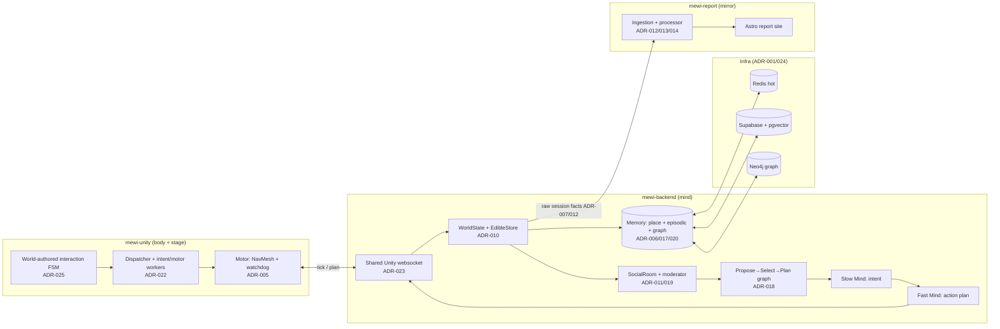
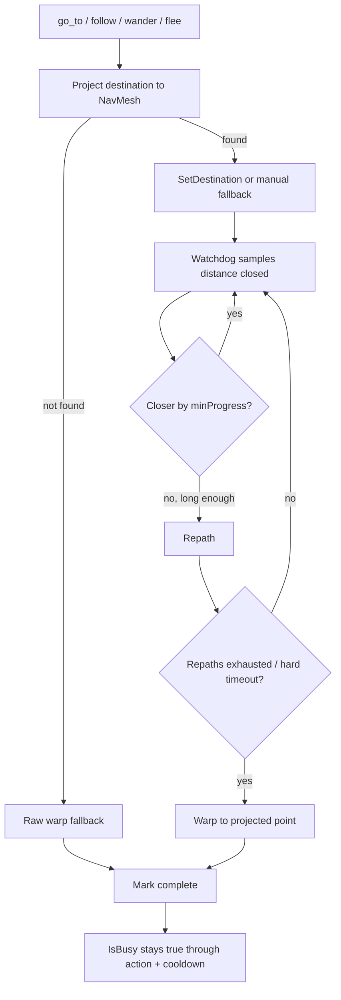

# Mewi: backend-owned cognitive architecture (mind / body / world / report)

> Draft PR description. Grounded in `docs/decisions/` (ADR-001…025) and the
> live developing notes (`docs/architecture/current_*.md` and
> `docs/architecture/memory_design.md`). View on GitHub for inline Mermaid.

## TL;DR

This is the large rework that turns Mewi from a single-cat HTTP prototype into a
**backend-owned creature platform**. The cat's *mind*, *memory*, and *world model*
move into Python; Unity keeps the *body* (NavMesh, animation, motor) and becomes a
reliable renderer. A new **slow/fast dual-process mind** with a **propose → select →
plan** tick graph replaces the old linear weather-search LangGraph, multi-cat
**social rooms** become real, and a separate **player-attachment report pipeline**
(`mewi-report`) ships alongside.

The work is organized as a monorepo of three apps:

| App | Role | "is the cat's…" |
|---|---|---|
| `mewi-backend/` | FastAPI + LangGraph agent runtime, world, social, memory | mind |
| `mewi-unity/` | Unity client: motor, NavMesh, animation, scene FSMs | body + stage |
| `mewi-report/` | Astro site + Python pipeline for player attachment reports | mirror |

It is captured across **25 ADRs** (`docs/decisions/README.md` is the index and has
the full relationship graph). This PR description summarizes the *shape* of the
change; each ADR holds the context and trade-offs.

---

## Why

The original prototype (`backend/app/agent/`, single `CreatureAgent` + a LangGraph
hardcoded to a weather-search example) had four structural problems:

1. **Split world truth.** Unity owned geometry and confirmed `eat`/`arrive`, Python
   owned memory and place stats. That worked for one cat but cannot express "two cats
   are in the same room and noticed each other" — no single party sees both cats in a
   tick (ADR-010/011).
2. **Repetitive behaviour.** Each planning turn started from nearly identical context,
   so the LLM kept choosing the same nearby places/actions. The missing feedback loop
   was *place/coverage memory*, not vector search (`docs/architecture/memory_design.md`).
3. **A body that could get stuck.** Navigation could be "accepted" yet never arrive;
   rest actions (`eat`/`sit`/`lie`/`sleep`) could loop and never emit `OnModeEnd`,
   blocking the next command forever (`docs/architecture/current_motor.md`).
4. **Blocking transport.** Unity blocked on the LLM over request/poll HTTP.

## What changed (by subsystem)

### 1. Transport & runtime — ADR-002 → 004 → 023, ADR-003

- HTTP submit+poll (ADR-002) is **superseded** by a **WebSocket nested-plan** protocol
  (ADR-004): Unity sends `tick {snapshot, report}`, backend returns `plan {actions,
  dialogue}`, and **Unity owns cadence** — it only sends a new snapshot once the prior
  request is done *and* the body is idle.
- ADR-023 collapses many per-cat sockets into **one shared Unity websocket**, routing by
  `creature_id + requestId`.
- ADR-003 decomposes the agent into **perception / memory / action / LLM-provider** with
  one graph **compiled once at startup** and reused per tick.

### 2. Mind, memory & behaviour — ADR-006, 009, 015, 016, 017, 018, 020

- **Slow/Fast dual-process mind** (ADR-006): `slow_mind` picks a durable *intent*,
  `fast_mind` turns it into an ordered, concrete action plan; `reflect` writes place
  memory from the completed queue.
- **Proposal–Arbiter tick graph** (ADR-018): the linear graph is reshaped into
  **propose → select → plan**. Need/social/exploration proposers compete on a bus; an
  arbiter selects; planning stays at the same two LLM calls.
- **Place/coverage memory** (ADR-006, `memory_design.md`): backend owns visit
  counts/recency/novelty (Redis hot, Supabase durable); Unity owns geometry. This is the
  feedback loop that breaks repetitive plans.
- **Mem0-style memory** (ADR-017): append-only writes, hybrid recall (recent + pgvector),
  property-graph edges in Postgres — no new infra. **Thin layers** (ADR-020):
  `MemoryManager` owns meaning; repositories/stores do IO only.
- **Prompt-cache discipline** (ADR-015): static/dynamic Slow-Mind prompt split for the
  Anthropic cache (~900 → ~340 + 60 tokens).
- **Behavioral-optimization toolkit** (ADR-016, *proposed*): opt-in CoT, query expansion,
  multi-intent, plan diversity, life-balance to widen behaviour.

### 3. World & social — ADR-010, 011, 019

- The **world model moves into Python** (`WorldState`, `EdibleStore`); Unity becomes
  renderer + advisory `reason` channel (ADR-010, as-built in ADR-011's 8-node graph).
- Multi-cat life is modeled as **per-tick group chat** in a `SocialRoom`: a moderator
  picks a speaker and applies relationship/mood deltas; co-located cats read a
  `social:inbox` on their next tick (cadence authority unchanged).
- **Delayed social intent effects** (ADR-019): a selected social intent updates backend
  social state without deciding the *receiver's* reaction.

### 4. Body reliability — ADR-005, 008, 021 → 022, 025

- **Movement watchdog + warp** (ADR-005): progress = distance *closed* toward the
  destination; `go_to`/`follow`/`wander`/`flee` all get **repath-then-warp** recovery;
  off-NavMesh targets raw-warp instead of refusing. Reliability > naturalism.
- **Goal Event Bus** (ADR-008): the *world* confirms `eat`/`go_to`; the worker stops
  asserting success (later demoted to advisory by ADR-010).
- Motor wiring goes from a directive FSM (ADR-021, superseded) to an explicit
  **dispatcher + intent/motor workers** split (ADR-022), and scene objects own local
  **interaction recipes** via a world-authored FSM (ADR-025).

### 5. Player report & attachment — ADR-007, 012, 013, 014

- **Attachment Signature Pipeline** (ADR-007): raw events → features → a transparent
  rule-based estimate of *player* attachment.
- **Report pipeline** (ADR-012–014, *proposed*): Unity exports raw facts; Python owns
  derived values; `POST /report/session` → immutable per-session files → processor →
  the static `mewi-report` Astro site.

### 6. Dev & ops — ADR-001, 024

- **Supabase schema-as-code** migrations + a PascalCase→snake_case Unity adapter (ADR-001).
- **Backend Makefile + graph DB workflow** (ADR-024): Make targets for the full Docker
  stack, Redis, Neo4j graph memory, and tests.

---

## Architecture at a glance



## The tick (one cat ticks → world + social step → plan)

```mermaid
sequenceDiagram
    autonumber
    participant U as Unity (cat A)
    participant W as WorldState
    participant S as SocialRoom
    participant G as Propose→Select→Plan
    participant M as Memory

    U->>W: tick {snapshot, previous plan report}
    W->>W: update presence A; record step events; reflect → place memory
    W->>S: probe co-located cats
    alt cats co-located
        S->>S: moderator picks speaker, applies relationship/mood deltas
        S-->>W: social inbox updates (ADR-019)
    end
    W->>G: world view + social inbox + place memory recall
    G->>G: proposers (need/social/exploration) → arbiter selects intent
    G-->>W: Slow Mind intent → Fast Mind ordered actions
    W->>M: write raw turn + STM (ADR-017/020)
    W-->>U: plan { actions, dialogue }
```

Invariant (`docs/architecture/current_workflow.md`): Unity sends a new snapshot **only** when the
previous backend request is done *and* the local body has finished its queued command.

## Motor reliability (why the body never gets stuck)



---

## Testing

`mewi-backend/tests/` covers the new architecture with unit + integration suites
(no running Unity or real API keys required for unit tests):

- **Mind / behaviour:** `test_intent_selector`, `test_behavior_graph_social`,
  `test_behavior_graph_workflow`, `test_life_balance`, `test_prompts`.
- **Memory:** `test_memory_manager`, `test_memory_consolidate`, `test_place_memory_*`,
  `test_memory_repo`, `test_mem0_memory_store`, `test_supabase_memory_store`.
- **World / social:** `test_world_state`, `test_social_service`.
- **Transport / runtime:** `test_agent_ws_contract`, `test_agent_ws_shared`,
  `test_agent_tick_service`, `test_agent_worker`, `test_agent_graph`,
  `test_agent_pipeline_e2e`, `test_fullstack_e2e`.
- **Report / attachment:** `test_attachment_*`, `test_storage_service`.

Real-infra tests (`test_redis_real`, `test_supabase_connection`, `test_embedding_real`)
run via the ADR-024 Makefile/Docker stack.

## Known issues & follow-ups

From `docs/architecture/current_need_to_fix.md` and the *Proposed* ADRs:

- **Unity play-mode verification pending** (this workspace can't run the editor):
  `go_to → SM_Fish_1, eat → SM_Fish_1`; blocked-route repath→warp; off-NavMesh raw-warp;
  `sleep/sit/lie/eat` finish-or-timeout; `bodyBusy` snapshot gating.
- **Tunables:** per-creature Inspector defaults (`maxActionSeconds`,
  `postActionCooldownSeconds`, `repathDelaySeconds`, `hardTimeoutSeconds`).
- **Raw warp is intentionally blunt** for prototype reliability — add a fade/scramble
  later if popping is distracting.
- **Proposed, not fully built:** behavioral toolkit (ADR-016), report pipeline
  (ADR-012–014), mem0-style memory rollout (ADR-017). Graph-memory rewrite currently
  leaves the Supabase write path needing reconciliation.

## Review guide

- Start with `docs/decisions/README.md` for the index + relationship graph.
- Foundational reads: ADR-003 (runtime), ADR-004/023 (transport), ADR-006 (mind),
  ADR-010/011 (world+social), ADR-018 (proposal-arbiter).
- For runtime behaviour today, read `docs/architecture/current_workflow.md` and
  `docs/architecture/current_motor.md`.
```
