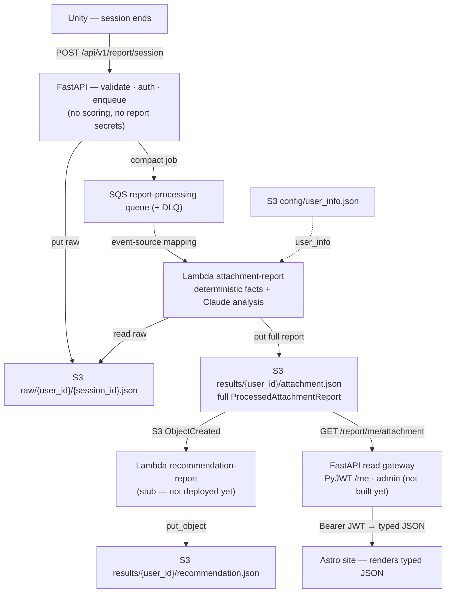

# PR: Cloud Report Pipeline (ADR-031 / 032 / 033)

**Date:** 2026-06-06
**Scope:** The post-session player report — from a finished Unity session to a
report rendered on the `mewi-report` site — moved out of the FastAPI request path
and onto an out-of-band AWS pipeline.

## Summary

This change set wires the closed-session report as a cloud pipeline with a clean
ownership split:

- **FastAPI** = thin ingest + (soon) a read gateway. It stores raw sessions and
  enqueues a job; it never scores, calls an LLM, or holds report secrets.
- **AWS Lambda** = the only report producer. It builds the full website-ready
  report from raw sessions.
- **S3** = the source of truth for raw sessions and finished reports.
- **`mewi-report` (Astro)** = render-only; it fetches one typed report through the
  backend read gateway.

It is captured in three ADRs:

| ADR | Owns | One line |
| --- | --- | --- |
| [ADR-031](../decisions/ADR-031-report-end-to-end-workflow.md) | Product topology | Two report-product Lambdas (`attachment-report` → `recommendation-report`) chained by an S3 `attachment.json` notification; Lambda-only Anthropic/RAGFlow/model secrets. |
| [ADR-032](../decisions/ADR-032-sqs-first-hop-report-ingestion.md) | First hop | FastAPI stores raw to S3 + sends a compact SQS job; an event-source mapping runs `attachment-report` (DLQ + partial-batch failures). |
| [ADR-033](../decisions/ADR-033-astro-report-frontend-data-source.md) | Frontend read | Thin `ReportSource` seam; FastAPI read gateway over private S3 with a `PyJWT` capability token (`/me` + `admin`). |

They build on [ADR-030](../decisions/ADR-030-post-session-report-processing.md) (the
computation rule + `generation_mode`) and [ADR-014](../decisions/ADR-014-report-ingestion-service-boundary.md)
(the storage/processing ports).

## How it works



Solid edges are wired in code today; the only dotted edge left is
`recommendation-report` (still a stub). The producer chain, the read gateway, and
the Astro remote fetch are all implemented — what remains is an AWS **deploy** and
the token **handoff** convenience.

## Design choices (and why)

- **One owner for report generation.** Report-building lives only in the Lambda
  (`report_processor.py` + `attachment_analysis.py`). The backend's old inline
  processor/attachment modules were **deleted**, not duplicated, so there is a
  single source of truth and no drift between "local" and "production" reports.
- **First hop = SQS, second hop = S3 notification.** FastAPI sends a *compact job
  pointer* (not raw data) to SQS; the Lambda reads raw from S3. A DLQ +
  `ReportBatchItemFailures` make failures inspectable and retryable. Report #2 is
  triggered purely by `attachment.json` landing in S3 (suffix-filtered so it can't
  retrigger itself). Cheap, decoupled, no orchestrator.
- **Lambda produces the full page shape.** `attachment-report` runs the
  deterministic transform first, then replaces only `attachment_analysis` with
  Claude output if available. S3 stores exactly what the site renders, so FastAPI
  and the frontend never compose page data. `generation_mode` records how it was
  produced (`deterministic` / `llm_only`, with an `llm+kb` hook for RAGFlow).
- **Secrets stay Lambda-only.** `ANTHROPIC_API_KEY`, `RAGFLOW_*`, `CLAUDE_*` live
  only in the Lambda env. FastAPI gets only raw-write + SQS-send (and later
  results-read) permissions.
- **Producer reference data.** `overrides = {}` permanently (demo-only);
  `user_info` from a small cached S3 `config/user_info.json` — keeps the Lambda
  stateless and the SQS message a pointer.
- **Thin frontend.** One `ReportSource` seam: local files in dev, a remote read
  gateway in prod. Pages render one typed `ProcessedAttachmentReport`; they never
  touch S3, merge files, or hold credentials.
- **Auth = capability JWT (`PyJWT`).** User-facing `GET /report/me/{product}`
  takes identity from the token `sub` (URL is only a locator); an `admin` claim
  reads/lists everyone. No accounts, no session store — the minimal per-user model.
- **Region pinned to `ap-southeast-1`** (matching the Terraform state) so the
  backend's `boto3` clients and the buckets/queue agree.

## What's implemented now

- **Backend (ingest):** `S3RawSessionStore`, `SqsQueue`,
  `MEWI_REPORT_PROCESSING_MODE=sqs` wiring (`inline` removed; unknown modes fail
  fast), `boto3` dep.
- **Backend (read gateway):** `PyJWT` capability auth (`app/core/auth.py`), bearer
  dependency, `S3ReportResultStore`, and routes `GET /report/me/{product}`,
  `GET /report/{user_id}/{product}` (admin-or-self), `GET /report/?product=`.
  `verify_api_key` stays on `POST /session` only. **22 tests green.**
- **Lambda:** `attachment-report` emits the full `ProcessedAttachmentReport`,
  reads raw + `config/user_info.json` from S3, falls back deterministically, and
  handles SQS batches.
- **Frontend (Astro):** `ReportSource` seam (`LocalFileReportSource` /
  `RemoteReportSource`), typed `reportSchema.ts`, extracted `ReportView.astro`,
  and the SSR `/report` route (`output: 'hybrid'` + `@astrojs/node`). Remote mode
  calls `GET /report/me/attachment` with the bearer token. **`npm run build`
  passes.**
- **Terraform:** raw bucket, results bucket, SQS queue + DLQ + redrive,
  event-source mapping, S3/SQS IAM, Lambda env (secrets + model + buckets),
  FastAPI sender IAM (incl. results read/list), region pinned. `deploy.sh` +
  gitignored `secrets.env`.

## What's still pending

- **AWS deploy.** Everything above is code + Terraform; nothing has been applied
  to a live AWS account yet. The cloud e2e needs `./deploy.sh` first.
- **Token handoff route.** You mint a JWT manually for testing; a thin "give the
  player their signed report link" route is a later convenience.
- **`recommendation-report` core** — still `NotImplementedError`, Lambda commented
  out of the roster (report #2).
- **RAGFlow** wired into `analyze_sessions` → `generation_mode = "llm+kb"`.

## Astro frontend + end-to-end

The visible loop is now code-complete behind two modes selected by env:

- **Local / demo** (`PUBLIC_REPORT_SOURCE` unset): `/report` reads
  `src/data/report_*.json` at request time; the old `/user/report/{userId}` static
  pages still build. No AWS needed.
- **Remote / cloud** (`PUBLIC_REPORT_SOURCE=remote`, `REPORT_API_BASE=...`):
  `/report?token=<JWT>` calls `GET /report/me/attachment` with
  `Authorization: Bearer <token>`; the URL is only a locator, the token `sub`
  decides the user.

### End-to-end check (once deployed)

1. `cd infra && ./deploy.sh` (buckets, SQS+DLQ, Lambda, IAM).
2. Run FastAPI with `MEWI_REPORT_PROCESSING_MODE=sqs`, `MEWI_REPORT_RAW_BUCKET`,
   `MEWI_REPORT_SQS_QUEUE_URL`, `MEWI_REPORT_RESULTS_BUCKET`,
   `MEWI_REPORT_READ_JWT_SECRET`, `AWS_REGION=ap-southeast-1`.
3. POST a closed session → confirm `results/{user_id}/attachment.json` in S3.
4. Mint a JWT (`sub=<user_id>`, the read secret) → `GET /report/me/attachment`
   returns the full report JSON.
5. Run the site with `PUBLIC_REPORT_SOURCE=remote` + `REPORT_API_BASE`; open
   `/report?token=<JWT>` → the report renders from FastAPI. **Loop closed.**

Until step 1 is done, the reachable milestone is the **producer chain**
(post → `attachment.json` in S3) and the read path against any S3-shaped data.
Operationally: FastAPI stays thin; LLM cost lives in the Lambda; SQS cost is
~free; failures land in the DLQ for replay.

## Deploy / config

```bash
cd infra
cp secrets.env.example secrets.env        # fill ANTHROPIC key (+ optional RAGFlow)
./deploy.sh                               # vendors Lambda deps, plan + apply
```

Then point the backend at the Terraform outputs:

```bash
# backend (FastAPI)
MEWI_REPORT_PROCESSING_MODE=sqs
MEWI_REPORT_RAW_BUCKET=<terraform output report_raw_bucket>
MEWI_REPORT_SQS_QUEUE_URL=<terraform output report_processing_queue_url>
MEWI_REPORT_RESULTS_BUCKET=mewi-report-results-v0
MEWI_REPORT_READ_JWT_SECRET=<strong shared secret>   # read-gateway auth
AWS_REGION=ap-southeast-1
```

```bash
# frontend (mewi-report) — remote mode
PUBLIC_REPORT_SOURCE=remote
REPORT_API_BASE=https://<your-fastapi-host>
```

`MEWI_REPORT_READ_JWT_SECRET` is a backend-only read secret — keep it out of git,
same as the Lambda secrets. See [`infra/README.md`](../../infra/README.md) and
[`infra/aws-lambda/README.md`](../../infra/aws-lambda/README.md) for details.
