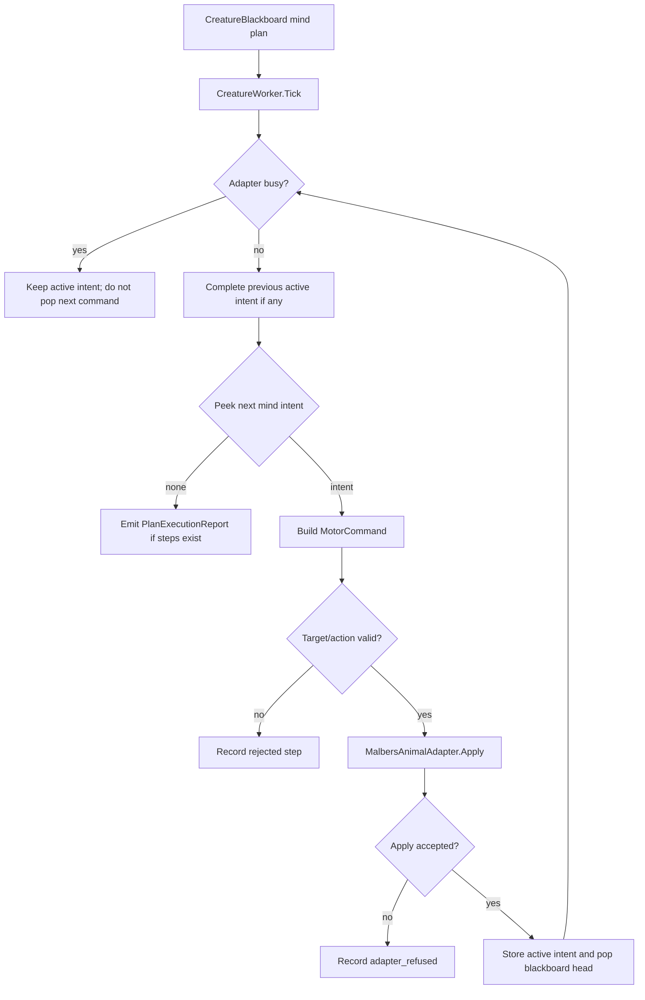
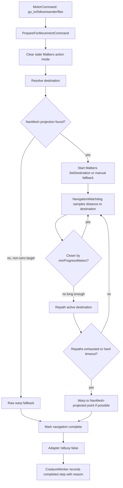
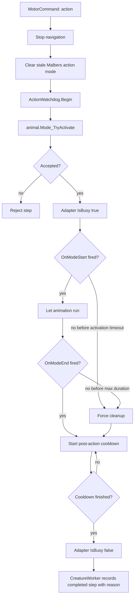
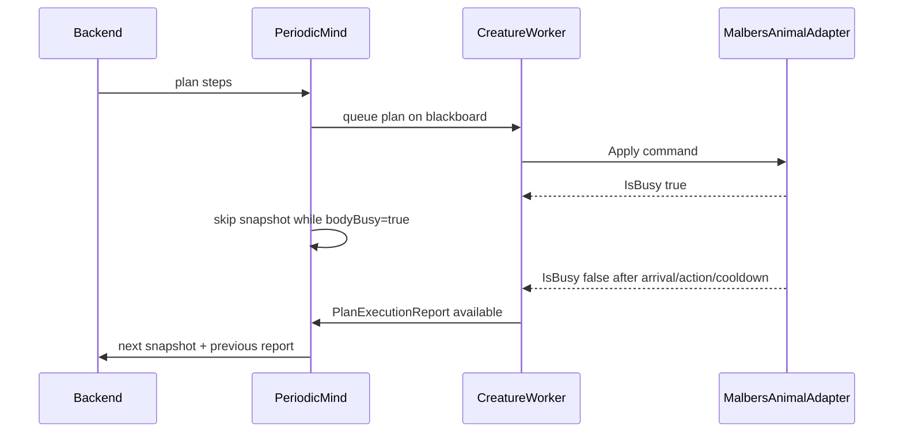

# Current Motor Reliability

This document explains the current `frontend/app/Assets/Scripts/Creature/Motor/`
workflow after the navigation and action reliability pass.

## Problem Statement

The cat's body could get stuck in two main ways:

- Navigation could be accepted by Malbers/NavMesh, but the cat would stop making
  useful progress and never fire an arrival event. `CreatureWorker` would keep
  waiting because the adapter stayed busy.
- Rest/action-style Malbers modes such as `eat`, `sit`, `lie`, or `sleep` could
  loop, fail to emit `OnModeEnd`, or leave the AI agent in a blocking state. The
  next LLM action would be queued, but the body would not execute it.

For this prototype, reliability is more important than perfect naturalism. If
the cat receives a movement command, it must eventually reach the destination
or recover strongly enough that the plan can continue.

## What Was Fixed

- Navigation progress is measured as distance closed toward the destination,
  not just any world-space movement.
- All navigation commands (`go_to`, `follow`, `wander`, `flee`) are covered by
  repath-then-warp recovery.
- Off-NavMesh destinations fall back to raw warp instead of rejecting early.
- `go_to` uses the perceived entity position from the snapshot when available,
  so the cat moves to the meaningful object point instead of an arbitrary prefab
  pivot.
- Action execution has timeout and cooldown handling through separate
  `ActionExecutionConfig` and `ActionWatchdog` files.
- `MalbersAnimalAdapter.IsBusy` now stays true during navigation, action
  execution, and post-action cooldown. This prevents `PeriodicMind` from sending
  a new snapshot before the local plan truly finishes.

## Current Motor Files

- `CreatureWorker.cs`: owns the active plan step, translates mind intents into
  `MotorCommand`, and reports completed/rejected steps.
- `MotorCommand.cs`: Malbers-free command shape shared between worker and
  adapter.
- `MalbersAnimalAdapter.cs`: the only runtime bridge to Malbers, NavMesh, warp,
  and action-mode APIs.
- `NavigationRecoveryConfig.cs`: inspector tunables for navigation recovery.
- `NavigationWatchdog.cs`: pure progress tracker that decides continue, repath,
  or warp.
- `ActionExecutionConfig.cs`: inspector tunables for action timeouts and
  cooldowns.
- `ActionWatchdog.cs`: pure timing tracker for Malbers action-mode execution.
- `CreatureOffMeshLinkTraversal.cs`: separate helper for Malbers/NavMesh
  off-mesh link traversal.

## Motor Command Flow

## Navigation Recovery Flow

## Action Execution Flow

## Snapshot Timing Guarantee

The important debugging rule: if the blackboard queue is empty but `bodyBusy` is
true, the system is not stuck by itself. It usually means the worker has already
popped the current step and the adapter is still executing navigation, animation,
or action cooldown.

## Unity Verification Checklist

- `go_to -> SM_Fish_1, eat -> SM_Fish_1` reaches the fish and then runs `eat`.
- Blocking the route logs repath attempts, then a warp if needed, and the next
  queued action still runs.
- Off-NavMesh targets complete through raw warp instead of `adapter_refused`.
- `sleep`, `sit`, `lie`, and `eat` either finish via `OnModeEnd` or release
  through watchdog timeout and cooldown.
- `PeriodicMind` logs waiting while `bodyBusy=True` and sends the next snapshot
  only after the worker has a completed plan report.
