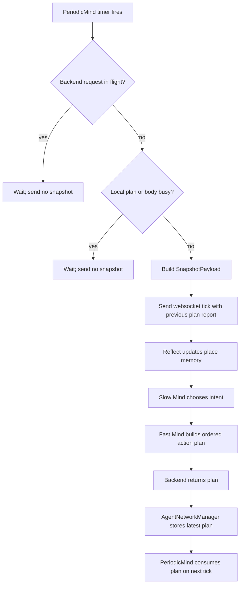
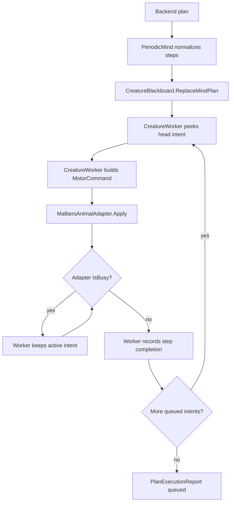
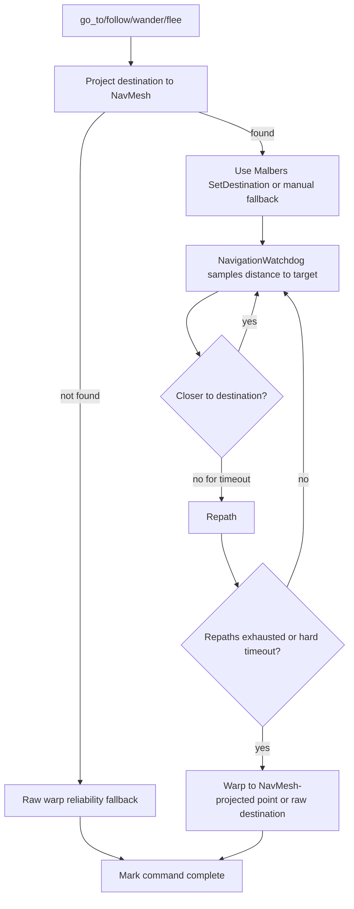
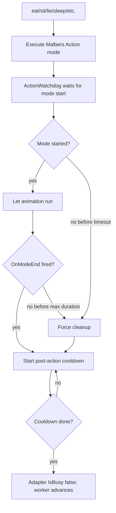

# Current Unity/Backend Workflow

This document describes the runtime flow after the movement reliability and
action queue changes. It is meant to be the fast map for debugging "why did the
cat not do the next thing yet?"

## Backend Tick Loop

Important invariant: Unity sends a new snapshot only when the previous backend
request is done and the local body is no longer executing a queued command.

Backend thinking is split intentionally: `reflect` writes memory from the
completed queue, `slow_mind` chooses a durable intent, and `fast_mind` converts
that intent into concrete Unity actions.

## Local Plan Queue

The blackboard queue can be empty while the worker still owns an active intent.
That is expected for long animations: the intent has already been popped from
the queue, but the adapter is still busy with the body.

## Navigation Recovery

Target positions now use the perceived entity position from the snapshot when
available. This avoids moving to a prefab root/pivot when the meaningful point
is a `SmartObject.perceptionCenter`.

## Action Execution

Action timeout and cooldown are configurable through
`ActionExecutionConfig`. The goal is to let real animations finish, but never
let a looping/resting Malbers state block the next LLM command forever.
