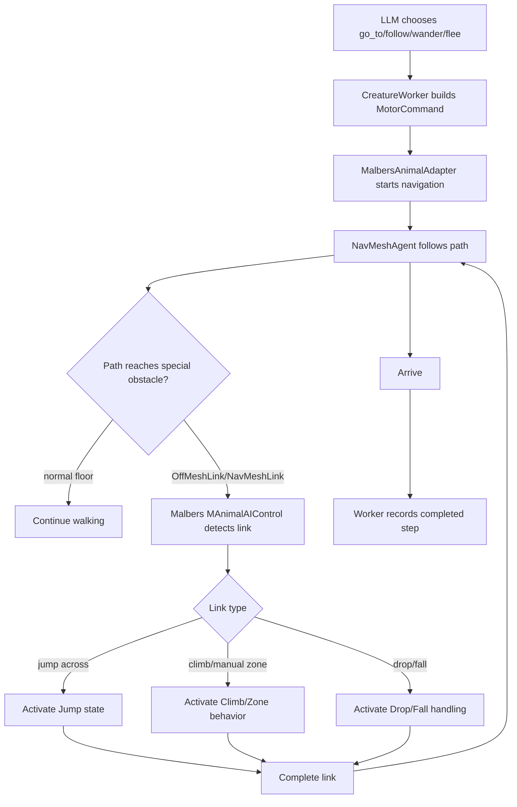
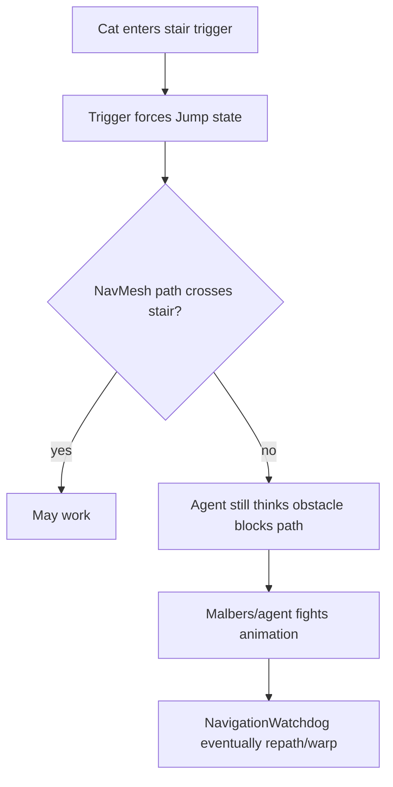
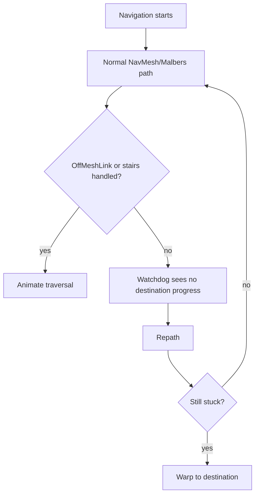

# Jump Through Obstacle Proposal

This note analyzes the proposal to handle stairs, small obstacles, and fall/jump
cases by adding colliders/triggers that change the cat's Malbers state.

## Problem Statement

The cat currently receives high-level movement commands like `go_to`,
`follow`, `wander`, and `flee`. Those commands are executed through
`MalbersAnimalAdapter`, which delegates real path movement to Malbers
`MAnimalAIControl` and Unity `NavMeshAgent`.

The current reliability layer can repath or warp when movement fails, but that
does not make stairs, ledges, and small vertical obstacles feel natural. The
goal of this proposal is to let the cat actually step, jump, climb, or drop
through authored obstacle transitions when possible, while keeping warp as the
last fallback.

## Friend Proposal

The proposed idea:

- Add collider/trigger volumes around stairs, steps, ledges, or fall zones.
- When the cat enters a trigger, change the cat's Malbers status/state.
- Example: stair trigger activates jump or climb so the cat passes the step.

This is a good intuition because Malbers movement is state-driven. However, the
cat is not being moved by our own custom controller; it is being moved by
Malbers + NavMeshAgent. That means trigger-only state changes can fight the
current NavMesh destination unless the NavMesh path also knows how to cross the
obstacle.

## Current Malbers/NavMesh Reality

Malbers already has built-in OffMeshLink handling inside `MAnimalAIControl`:

- It disables normal agent auto traversal so animation can handle links.
- When the agent reaches an OffMeshLink, Malbers detects the link.
- For jump links, Malbers activates `StateEnum.Jump`.
- For climb-style links, Malbers can activate climb behavior.
- For drop/fall links, Malbers has separate drop/fly/off-mesh handling.

So the best long-term integration is not "trigger manually changes state";
it is "author the NavMesh transition so Malbers naturally reaches and handles
the link."

## Recommendation

Use a two-layer approach:

1. Primary solution: NavMesh + OffMeshLink/NavMeshLink authoring.
2. Secondary solution: trigger volumes only as hints, diagnostics, or emergency
   state nudges.
3. Final fallback: existing navigation watchdog repath/warp.

This keeps ownership clean:

- NavMesh decides whether a route exists.
- Malbers decides how to animate special traversal.
- Our adapter supervises reliability and reports completion.
- Triggers provide local context, not the whole movement brain.

## Proposed Architecture

## Where Trigger Colliders Help

Triggers can still be useful, but they should be supporting tools:

- Detect "approaching stairs" and temporarily adjust speed/stance.
- Detect "fall hazard" and bias the cat away or prepare a fall state.
- Emit feelings/perception like "stairs ahead", "edge nearby", or "unstable
  footing".
- Diagnose whether the cat is entering the intended obstacle area.
- Force an emergency jump/climb only when the NavMesh route is already on a
  special traversal segment.

They should not be the only thing that moves the cat across stairs because the
NavMeshAgent may still think the cat is blocked, off-path, or not at its
destination.

## Trigger-Only Risk

The risky case is when animation moves the animal but the agent/path is not
coordinated. The visual body may jump forward while the NavMeshAgent still
believes it is blocked or still has the old path. That can produce snapping,
stuck movement, or repeated recovery warps.

## CreatureOffMeshLinkTraversal Status

`CreatureOffMeshLinkTraversal.cs` is currently not the right primary fix.

Reasons:

- Malbers `MAnimalAIControl` already handles OffMeshLink detection and calls
  `CompleteOffMeshLink()`.
- The helper mostly logs and forcibly completes stuck links; it does not author
  links, choose animations, or solve path validity.
- It can be confusing because it appears to own traversal, while Malbers is
  already the real owner.
- If attached incorrectly, it can configure the agent in ways that conflict with
  the Malbers prefab setup.

Recommendation: keep it disabled or treat it as a temporary diagnostic script.
If OffMeshLink support is needed, build a new small integration around
`MalbersAnimalAdapter` or replace this file with a clearer diagnostic-only
component.

## Proposed Implementation Plan

### Phase 1: Author NavMesh Traversal

- Bake stairs/steps as walkable when possible.
- For gaps, high steps, ledges, or drops, add `NavMeshLink` or `OffMeshLink`
  components.
- Use link types/settings that Malbers recognizes as jump, climb, or drop.
- Verify `MAnimalAIControl.Agent.autoTraverseOffMeshLink` stays false so Malbers
  animation handles traversal.

### Phase 2: Add Obstacle Trigger Metadata

Create a lightweight authored component such as `TraversalHintVolume`:

- `kind`: `stairs`, `jump`, `climb`, `drop`, `fall_hazard`
- `preferredState`: optional Malbers state hint
- `speedMultiplier`: optional slow-down
- `debugName`

This component should not directly own movement. It should write a hint to a
blackboard or adapter-side cache.

### Phase 3: Adapter Coordination

`MalbersAnimalAdapter` can read active traversal hints and do small, safe
adjustments:

- Slow to walk/trot near stairs.
- Avoid sprinting into stair/fall triggers.
- If the agent is on an OffMeshLink and a matching hint exists, allow Malbers to
  enter the correct state.
- If the link times out, let the existing watchdog recover.

### Phase 4: Reliability Fallback

Keep the current recovery ladder:

## Acceptance Tests

- Cat can walk up shallow stairs without warp.
- Cat can cross one authored jump link and continue to the original target.
- Cat can drop/fall through an authored drop link without the queue freezing.
- If a link is broken, the watchdog repaths/warps and the next action still
  runs.
- `go_to -> stair target -> eat/sit` completes with a plan report instead of
  leaving `bodyBusy=True` forever.

## Final Recommendation

Your friend's collider/trigger proposal is useful, but it should not be the
foundation. Because Malbers owns animation and NavMeshAgent owns route
following, the clean fix is:

1. Author stairs and vertical transitions in NavMesh.
2. Use OffMeshLink/NavMeshLink for jumps, climbs, and drops.
3. Let Malbers handle the actual Jump/Climb/Fall state.
4. Use trigger colliders only as hints and safety metadata.
5. Keep watchdog warp as the final prototype reliability guarantee.

This gives the cat a chance to move naturally while preserving the current
"the cat must keep living and not get permanently stuck" requirement.
