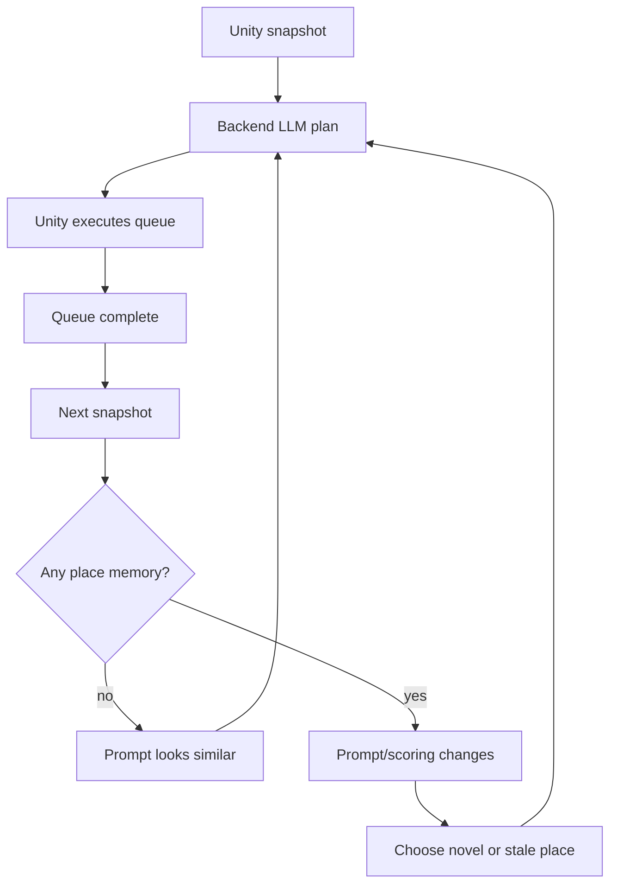
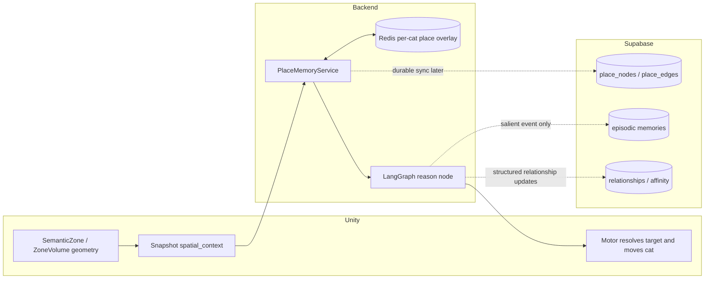
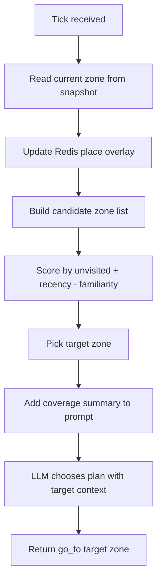
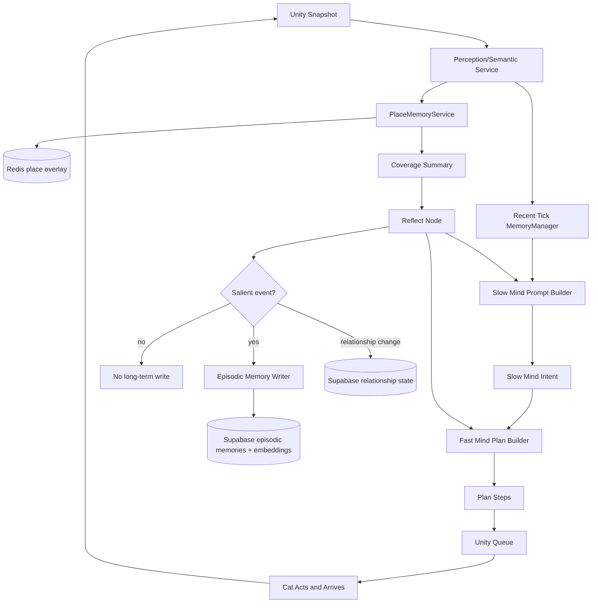
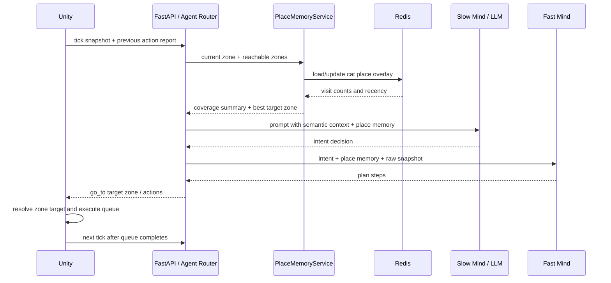
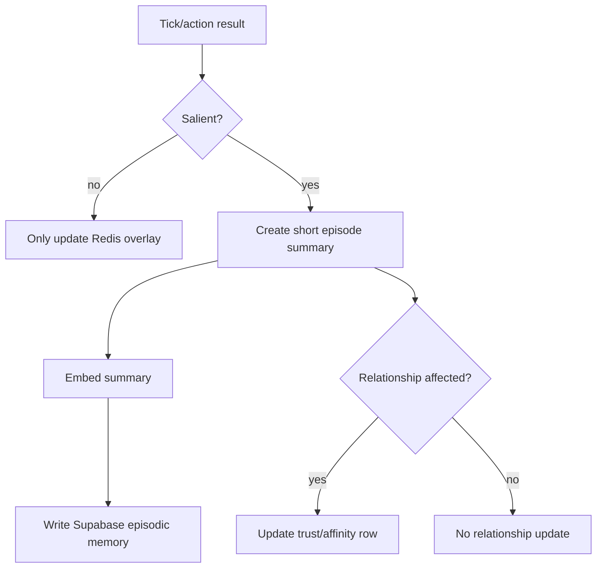

# Memory Design

This design follows the current Unity/FastAPI/LangGraph architecture.

## Core Problem

The cat can move, but it does not yet *live* in the world because each backend
planning turn starts from almost the same context.

Current loop:

1. Backend sends a plan.
2. Unity queues and executes the full plan.
3. Unity sends the next snapshot only after the local queue finishes.
4. Backend sees a similar snapshot and often returns a similar plan.

Because no memory changes the next prompt, the LLM has no strong reason to stop
choosing the same nearby places/actions. The first fix is not vector memory. The
first fix is place/coverage memory: "I have already been here; what place has
not been visited recently?"



## Design Principle

Do not build one giant memory system. Build three memory tiers with clear
ownership.

| Tier | Purpose | Owner | Storage | Hot Path? |
| --- | --- | --- | --- | --- |
| Place / coverage memory | Make the cat explore and patrol different places | Backend statistics, Unity geometry | Redis first, Supabase later | Yes, each tick |
| Episodic memory | Remember meaningful events like food, fear, discovery, bonding | Backend | Supabase + embeddings | No, salience-gated |
| Relational memory | Persistent trust/affinity toward player/cats/places | Backend | Supabase structured rows | No, small updates |

The immediate implementation should focus on **place / coverage memory**. That
is the missing feedback loop causing repeated plans.

## Ownership Boundary

The maintainable split is:

- Unity owns geometry: current zone, zone centroids, active zones, reachability,
  NavMesh, movement, and actual arrival.
- Backend owns statistics: visits, last visited time, novelty score, familiarity,
  and exploration target scoring.
- Supabase owns durable life history: episodes, relationships, long-term
  memories.
- Redis owns live per-cat place overlay: fast visit counts and recency.

This avoids two owners for the same state. Unity does not need to know how many
times the cat visited each zone. Backend does not need to know how to move to a
centroid every frame.



## MVP: Place Memory First

### What Unity Sends

Unity already sends:

```json
{
  "spatial_context": {
    "zones": [
      {"id": "Harbor", "type": "district"},
      {"id": "Bamboo_Boardwalk", "type": "path", "surface": "Wood"}
    ]
  }
}
```

For compatibility, backend can treat the deepest zone (`zones[-1]`) as the
current place. The implemented snapshot now also sends a compact
`place_context` field:

```json
{
  "place_context": {
    "current_zone_id": "Bamboo_Boardwalk",
    "active_zone_ids": ["Harbor", "Bamboo_Boardwalk"],
    "reachable_zone_ids": ["Fishmonger_Stall", "East_Roof", "House_Interior"]
  }
}
```

`reachable_zone_ids` comes from Unity because reachability is geometry. The
current implementation sends a bounded nearby candidate list checked by radius
and optional complete NavMesh path.

### What Backend Stores

Redis key per cat:

```text
agent:place_overlay:{creature_id}
```

Value shape per zone:

```json
{
  "zone_id": "Bamboo_Boardwalk",
  "visit_count": 4,
  "last_visited_at": 123.4,
  "familiarity": 0.72,
  "last_arrival_request_id": "t00000007"
}
```

MVP rule:

- On every tick, read current deepest zone.
- If it is different from the last recorded zone, increment `visit_count`.
- If it is the same zone but enough time has passed, refresh `last_visited_at`
  without over-counting.
- Build a short coverage summary for prompt/scoring.

### What Backend Returns

Backend can either:

1. Return normal action steps with a zone target:

```json
{
  "actions": [
    {"action": "go_to", "target": "East_Roof"},
    {"action": "look_around", "target": ""}
  ]
}
```

2. Or return a dedicated target field later:

```json
{
  "intent": "explore",
  "target_zone_id": "East_Roof"
}
```

For least code churn, use option 1 first. Unity then needs a registry that can
resolve `ZoneVolume.EffectiveZoneId` to a navigation point. That can be added to
`NamedTargetRegistry` or split into a `PlaceTargetRegistry`.

## Place Scoring

Use simple deterministic scoring before asking for embeddings or long-term
recall.

```python
score(zone) =
    + unvisited_bonus
    + recency_bonus
    + curiosity_bonus
    - familiarity_penalty
    - unreachable_penalty
```

Recommended MVP:

```python
def score_zone(zone_id, overlay, now):
    entry = overlay.get(zone_id)
    if entry is None:
        return 100.0

    visits = entry.visit_count
    seconds_since = now - entry.last_visited_at
    recency_bonus = min(seconds_since / 60.0, 10.0)
    return recency_bonus - visits * 2.0
```

Then choose the highest-scoring reachable candidate.



## Prompt Context

Add a compact memory section to the strategic prompt. Keep it high-level.

Example:

```text
Place memory:
- Current place: Bamboo_Boardwalk. Mewi has visited this often.
- Recently visited: Bamboo_Boardwalk, Harbor_Dock.
- Unvisited nearby: East_Roof, Fishmonger_Stall, House_Interior.
- Best exploration target: East_Roof because it is reachable and unvisited.
```

Prompt rule:

```text
When curiosity is available and urgent needs are low, prefer unvisited or
stale places over places visited repeatedly.
```

This makes the prompt non-stationary. After the cat visits `East_Roof`, the
next prompt changes and another place becomes more attractive.

## Full Memory Architecture



The implemented workflow is `perceive -> remember -> reflect -> slow_mind -> fast_mind`.
`reflect` updates the Redis place overlay from the completed Unity tick before
`slow_mind` chooses a durable intent. `fast_mind` then builds concrete
`plan_steps` from that intent and the place-memory target.

## Sequence Diagram



## Relationship To Existing Code

Current pieces:

- `backend/app/agent/memory.py` stores recent perception snapshots and a
  position log in process memory.
- `backend/app/repositories/memory_cache.py` stores recent ticks in Redis.
- `backend/app/repositories/memory_repo.py` persists tick history to Supabase.
- `backend/app/agent/behavior_graph.py` now has `reflect`, `slow_mind`, and
  `fast_mind` nodes.
- Unity already sends `spatial_context.zones`, which is enough to start
  recording the current place.

Implemented first slice:

- `PlaceMemoryService` in backend:
  - extracts current leaf zone
  - updates Redis overlay
  - scores reachable candidates
  - returns coverage summary for prompt
- `PlaceMemoryCache`:
  - Redis read/write helpers for `agent:place_overlay:{creature_id}`
- prompt `PLACE MEMORY` section
- slow mind intent prompt
- deterministic fast mind for `EXPLORE`, `SEEK_FOOD`, `SEEK_PLAYER`,
  `SOCIALIZE`, `INVESTIGATE`, `REST`, `SAFETY`, and `IDLE`
- Unity `NamedTargetRegistry` zone-id resolution

Still to add:

- optional `PlaceMemoryRepository`:
  - durable Supabase sync for long sessions or across launches
- richer Unity place graph:
  - snapshots now expose a bounded `reachable_zone_ids` candidate list
  - a future authored place graph can replace the radius/path probe when the
    world needs explicit roof/stair/interior traversal relationships

## Supabase Tables Later

Do not start with all of these if you only need exploration. This is the future
shape once the cat begins to feel alive.

```mermaid
erDiagram
    creatures ||--o{ cat_place_memory : has
    place_nodes ||--o{ cat_place_memory : tracked_by
    place_nodes ||--o{ place_edges : from
    place_nodes ||--o{ place_edges : to
    creatures ||--o{ episodic_memories : remembers
    creatures ||--o{ relationship_states : feels

    creatures {
        text id
        text display_name
    }

    place_nodes {
        text zone_id
        text label
        text zone_type
        jsonb metadata
    }

    place_edges {
        text from_zone_id
        text to_zone_id
        text traversal_kind
        float cost
    }

    cat_place_memory {
        text creature_id
        text zone_id
        int visit_count
        timestamptz last_visited_at
        float familiarity
    }

    episodic_memories {
        uuid id
        text creature_id
        text summary
        float importance
        vector embedding
        timestamptz created_at
    }

    relationship_states {
        text creature_id
        text entity_id
        float trust
        float affinity
        timestamptz updated_at
    }
```

## Salience Gate For Long-Term Memory

Most ticks should not become Supabase memories.

Write an episodic memory only when one of these is true:

- first time entering a new major zone
- player feeds, scares, follows, pets, or helps the cat
- action result contains failure/recovery that matters emotionally
- fear/trust/hunger changes significantly
- cat discovers a new route, shelter, roof, or resource

Place visits update Redis every tick. Supabase episodic memory is rare.



## Implementation Order

### Step 1: Backend Place Overlay

- Add Redis functions for per-cat zone visits.
- On each websocket tick, extract current leaf zone from
  `snapshot.spatial_context.zones`.
- Increment visit counts and build a text coverage summary.
- Add that summary to `semantic_context` / prompt.

Success criterion: prompt includes "visited often" and "unvisited nearby" and
the cat stops choosing the same place repeatedly.

### Step 2: Zone Targets

- Add Unity resolution from `zone_id` to target position.
- Let backend return `go_to` with a zone id.
- Ensure `CreatureWorker` can resolve that target id.

Success criterion: backend can say `go_to -> East_Roof` and Unity can move the
cat toward the zone center or configured target point.

### Step 3: Candidate Scoring

- Use the `reachable_zone_ids` list from Unity's `place_context`.
- Score candidates in backend using visit count and recency.
- Put best target into prompt and/or directly into the plan.

Success criterion: after a zone is visited, it becomes less attractive and the
next exploration target changes.

### Step 4: Episodic + Relational Memory

- Add salience gate.
- Save only meaningful episodes to Supabase.
- Add structured relationship state for player/cat trust.

Success criterion: cat can remember emotionally meaningful events across
sessions without writing every tick.

## Acceptance Tests

- Repeated tick from same zone increments or refreshes the same zone record.
- Visiting a new zone creates a new overlay entry.
- Coverage summary names current, recent, overvisited, and unvisited/stale
  zones.
- LLM prompt changes after each arrival.
- Backend returns different exploration targets over multiple completed queues.
- No embedding or Supabase episodic write happens for ordinary movement ticks.
- A first-time major discovery can create a long-term episode.

## Final Recommendation

Build place/coverage memory first. It is the smallest change that makes the cat
explore instead of repeating the same plan.

Use this ownership rule:

```text
Unity owns place geometry.
Backend owns place statistics.
Redis owns hot per-cat coverage.
Supabase owns durable life story.
LLM reads summaries, not raw memory tables.
```

Once place memory exists, the cat's next prompt will be different from the last
prompt, and exploration can begin to feel like a living patrol instead of a
resetting loop.
