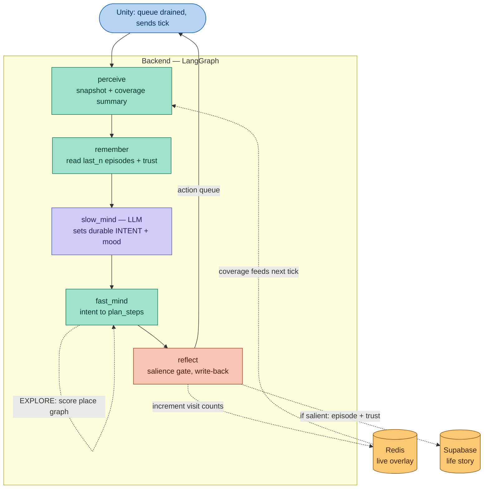
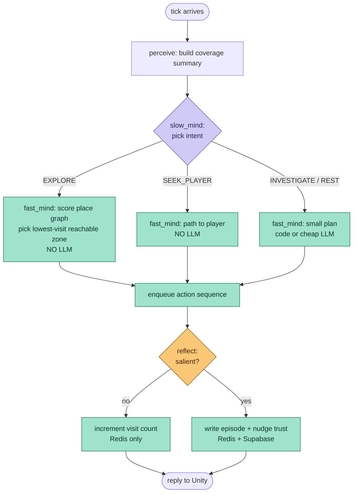

The research lines up well with what your code already gestures at. Two findings worth pulling forward before I design: the Plan-then-Execute pattern explicitly separates strategic planning from tactical execution, and LangGraph's stateful graphs enable dynamic re-planning loops — that's the named pattern for what you're hand-rolling. And there's a 2026 result arguing directly against your current shape: many LLM agents bundle world modeling, planning, and reflection inside a single language model loop, which produces capable behavior but makes it hard to tell which competence comes from the LLM versus explicit structure around it. Your reason node is exactly that single bundled loop. The recommendation across the literature is to externalize the structure. Let me search one more angle — the specific constraint you raised, that Unity guarantees intent completion. arxivarxivSearched the webSearched the webThis is the exact pattern you want, and it has a name. The Overcooked paper describes a three-tier split that maps almost perfectly onto your situation: a proficient LLM ("Slow Mind") for intention reasoning, a lightweight module ("Fast Mind") for generating macro actions, and a reactive policy ("Executor") for transforming macro actions into atomic actions. In your case Unity is the Executor, and it already gives you the guarantee the web agents lack — your intent always completes, so you don't even need the postcondition-checker-and-replan machinery that the web agent pipeline requires when pages load unexpectedly or results differ from expectations. Your environment is cooperative; theirs is adversarial. That simplifies your design considerably. arxivarxiv
The key insight from your own constraint
You said: "Unity will ensure the intent of the LLM must complete." This is the most important sentence for the design, because it tells you what your agent does not need. The entire reason the web-agent and long-horizon papers are complicated is that execution is unreliable — they need postcondition checkers, replanning loops, drift detection. You don't. Unity guarantees completion. So your loop's complexity should go into deciding well and remembering, not into defending against execution failure.
That means the right shape for you is Plan-then-Execute with a deferred reflection step, not ReAct. ReAct interleaves think-act-observe every step because each step might fail or surprise you. You don't have per-step surprise — Unity completes the whole plan and reports back once. So a tight ReAct loop would just burn tokens. Plan-then-Execute fits your turn-based, completion-gated loop exactly.
What's wrong with your current graph (gently)
Your perceive → remember → reason → END collapses three distinct cognitive jobs into the single reason node: it decides what matters (strategy/intent), what to do (the plan_steps), and there's no place where it decides what to keep (reflection/memory write). That's the "bundled loop" the 2026 paper warns against. The fix isn't to add ReAct cycling — it's to separate the tiers and add a reflect node, so each cognitive job is inspectable and tunable on its own. This matters for you specifically because your whole design philosophy (Earned Presence, withholding, trust curves) requires you to tune the relationship between events and bond — which you can only do if "what gets remembered and how it moves trust" is its own node, not buried inside reasoning.
Here's the architecture I'm proposing. Let me show it visually.Here's the architecture. The four-tier split: Slow Mind sets durable intent, Fast Mind translates intent to a plan, Unity executes with a completion guarantee, and Reflect updates memory afterward.
  ::view-transition-group(*),
  ::view-transition-old(*),
  ::view-transition-new(*) {
    animation-duration: 0.25s;
    animation-timing-function: cubic-bezier(0.19, 1, 0.22, 1);
  }
VvisualizeVvisualize show_widgetLet me explain why each tier exists and how it maps to your existing code, because the diagram only shows the shape — the reasoning is what makes it buildable.
The Perceive node you already have — keep it almost as-is, but add the coverage summary to its output (the visit-count feedback we discussed). This is the one change that makes each tick's input non-stationary and breaks the repetition you're seeing.
The Slow Mind is your reason node, but stripped down. Right now it does too much. Its only job becomes: read perception + memory + coverage, and emit a durable intent plus a mood — EXPLORE, SEEK_PLAYER, REST, INVESTIGATE — not a concrete action plan. This is the expensive LLM call and it's where personality lives. This is the "Slow Mind" doing intention reasoning in the Overcooked framework. Because your environment guarantees completion, this can run once per turn rather than re-deciding constantly. arxiv
The Fast Mind is new, and you have a real choice here. It translates intent into the concrete plan_steps your code already produces. For exploration, "translate EXPLORE into a plan" is just the place-graph scoring we designed — pure code, no LLM. For richer intents it could be a cheap small-model call, but start with code. The crucial point: your existing _normalize_plan_steps and chosen_action plumbing is exactly the output format the Fast Mind should produce, so you're not rebuilding the action contract — you're moving where plan_steps gets generated.
The Executor is Unity, unchanged. It drains the queue and guarantees the intent completes. This is the property that lets you skip the entire postcondition-checker-and-replan layer the web-agent papers need.
The Reflect node is the most important addition for your design philosophy, and it's the one your current graph completely lacks. After the queue drains and Unity reports back, Reflect decides — cheaply, mostly without the LLM — whether anything salient happened, increments visit counts in Redis, and (only when something emotionally significant occurred) writes an episode and nudges the trust number toward Supabase. This is where Earned Presence actually gets implemented: trust is a number Reflect owns and tunes, not something the LLM guesses. Externalizing reflection into inspectable runtime structure is exactly the 2026 recommendation, and it's what lets you tune the withholding curve deliberately. arxiv
One concrete graph change to highlight: your current remember → reason → END becomes perceive → remember → slow_mind → fast_mind → reflect → END, and reflect is the node that writes back (your current graph never writes memory — remember only reads). That write-back closing the loop is what turns a stateless repeater into a creature that accumulates a life.
Two things I'd confirm before you start refactoring. First: is the Fast Mind worth splitting out as its own node now, or would you rather keep intent-and-plan together in the Slow Mind for v1 and split later once exploration works? For a solo dev I'd lean keep them together initially — add Reflect and the coverage feedback first, since those two changes alone fix your stated exploration problem, then split the Fast Mind out only when you want non-exploration intents. Second: do you want me to sketch the actual reflect node code and the modified state schema next, matching your existing CreatureRuntimeState and the _parse_decision style you already use? That's the piece that closes the loop, and it's the natural thing to build first.

Here's the four-tier workflow in Mermaid. I've kept it copy-paste ready and mapped each node to your existing code so you can see where things move.

The decision flow inside the loop, if you want the branching logic explicit (this is the part that decides whether the LLM even runs versus pure-code paths):

A couple of notes so the diagram translates cleanly to code. The `slow_mind` node is your current `make_reason` factory, narrowed to output an intent enum instead of full plan_steps — most of `_parse_decision` survives, you're just parsing `{"intent": ..., "mood": ...}` rather than the action object. The `fast_mind` node is where your existing `_normalize_plan_steps` logic lands, except for `EXPLORE` it's fed by place-graph scoring rather than the LLM. And `reflect` is entirely new — it's the write-back your current graph doesn't have, and it's what closes the loop.

If you want, the natural next step is the `reflect` node code plus the `CreatureRuntimeState` additions (the `intent` and `coverage` fields), matching your existing style. Want that?