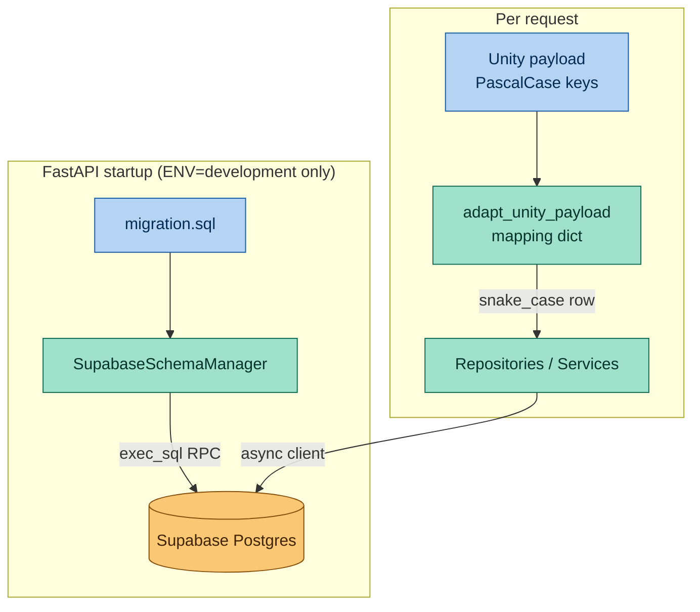

# ADR-001: Supabase Schema Management and Unity Data Adapter

- **Status:** Accepted (implemented and verified)
- **Date:** 2026-05-18
- **Scope:** `mewi-backend/app/core/supabase/**` (`schema_manager.py`, `client.py`, `migration.sql`)

## Context
During the integration with the Unity client, we identified two primary challenges:
1. **High Database Synchronization Overhead**: Manually updating schemas via the Supabase Web UI is error-prone and makes it difficult to keep development environments in sync across the team.
2. **Dynamic Data Structures**: JSON payloads from Unity often use different naming conventions (typically PascalCase) and are subject to frequent changes, which can easily break backend SQL models.

We needed an automated mechanism to manage database versions and a "Buffer Layer" to handle incoming data before it reaches the core business logic.

## Decision
We have implemented the following architecture within the `app.core.supabase` module:

### 1. Schema-as-Code (Automated Migrations)
Implemented a `SupabaseSchemaManager` that reads `migration.sql` and applies updates directly via a custom `exec_sql` RPC (Remote Procedure Call) function.
- **Benefit**: Ensures consistency across all environments (Local, Dev, CI) by enabling "Update-on-Startup."
- **Safety**: Execution is guarded and only triggered when `ENV=development` to prevent accidental data loss in production.

### 2. Adapter Pattern (Unity Data Buffer)
Introduced a static `adapt_unity_payload` method within the Schema Manager.
- **Mechanism**: Utilizes a mapping dictionary to translate Unity-specific keys to backend-standard snake_case columns.
- **Benefit**: **Decoupling**. When the Unity data structure changes, we only need to update the mapping configuration rather than refactoring multiple repositories or services.

### 3. Modular Async Client
Refactored the Supabase Client into a dedicated module providing a singleton-like entry point with full `async/await` support to align with FastAPI’s asynchronous nature.

## How it fits together

The schema manager runs once on startup; the adapter runs on every inbound
Unity payload. Both keep the rest of the backend insulated from raw schema
drift and from Unity-side key renames.

## Consequences
- **Positive Impacts**:
  - Developers can update the database schema simply by modifying `migrations.sql` and restarting the server.
  - Increased backend resilience against frontend/Unity-side data changes.
  - Automated verification of database connectivity and SQL logic through integration tests.
- **Negative Impacts**:
  - Requires maintaining a `SERVICE_ROLE_KEY` with elevated permissions to execute RPC calls.
  - Requires ensuring SQL scripts are idempotent (e.g., using `CREATE TABLE IF NOT EXISTS`).

## Verification Results
- Successfully passed integration tests (`mewi-backend/tests/integration/test_supabase_core.py`).
- Coverage includes: Async connection verification, automated schema application, and Unity field mapping logic.