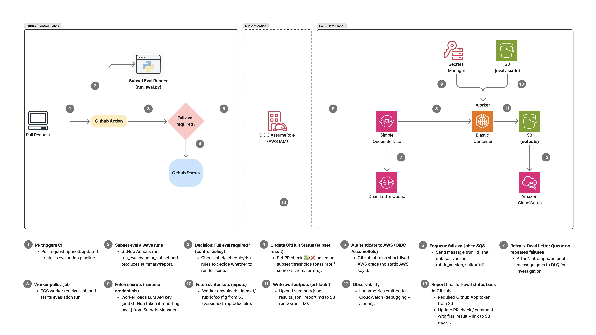

# ADR-002: Hybrid Eval CI/CD (GitHub Actions + AWS)

**Status:** Accepted
**Date:** 2026-03-11
**Deciders:** vanillasky


## Context

The system under evaluation is an agentic backend that must meet correctness and
quality thresholds before code ships.  We need an eval pipeline that:

1. **Gives fast feedback on every PR** — ideally under 2 minutes so it doesn't block the developer.
2. **Scales to large, expensive eval suites** — full suites with hundreds of LLM-judge calls can't run in a 6-minute CI job without driving up API costs and wall time.
3. **Produces persistent, comparable artifacts** — results must be stored somewhere beyond ephemeral CI logs so we can track regression over time.
4. **Doesn't require long-lived AWS credentials in GitHub** — a hard security requirement.

Running everything inside GitHub Actions alone fails requirements 2 and 3.
Running everything on AWS alone fails requirement 1 (too slow to trigger, no PR status check).
A hybrid split between the two planes solves all four.


## Decision


We adopt a **two-plane hybrid architecture**:

### Plane 1 — GitHub Actions (Control Plane, always runs)

Triggered on every PR that touches `backend/**`.

| Step | Tool | Purpose |
|------|------|---------|
| Checkout + `uv sync` | GitHub Actions + uv | Reproducible Python env |
| Run `run_eval.py --config pr_subset.yaml` | Python (local) | Fast subset eval |
| Local judge (`judge.py`) | Pure Python | Schema / structural checks, zero cost |
| LLM judge (`openai_judge.py`) | OpenAI API | Semantic quality scoring on small subset |
| Aggregate → summary.json / results.jsonl / report.md | Python | Structured artifacts |
| Upload CI artifact | `actions/upload-artifact` | Available in PR UI |
| Set PR status check | Exit code 0 / 1 | Blocks merge on failure |

The subset is intentionally small (< 20 cases) to stay fast and cheap.
If `OPENAI_API_KEY` is absent (fork PRs, cost control), the runner automatically
falls back to local structural checks only — CI never hard-fails due to missing keys.

### Plane 2 — AWS (Data Plane, triggered on demand or schedule)

Triggered when a PR is labeled `run-full-eval` or on a nightly schedule.

```
GitHub Actions (OIDC AssumeRole — no static AWS keys)
    │
    ▼
SQS Queue: eval-jobs
    │  message: { run_id, git_sha, suite, dataset_uri, rubric_uri }
    ▼
ECS Fargate Worker (polls SQS)
    ├─ Fetch secrets from Secrets Manager (LLM API key, GitHub App token)
    ├─ Download dataset / rubric / config from S3 (versioned, reproducible)
    ├─ Run full eval suite
    ├─ Upload artifacts to S3: runs/<run_id>/{summary.json, results.jsonl, report.md}
    ├─ Emit metrics to CloudWatch
    └─ Post final PR status + S3 link back to GitHub via GitHub App token
```

Dead Letter Queue (DLQ) catches messages that fail after N retries for investigation.

### Authentication strategy

GitHub Actions authenticates to AWS via **OIDC** (`AssumeRoleWithWebIdentity`).
This means:
- No long-lived AWS access keys stored as GitHub secrets.
- Credentials are short-lived (1-hour tokens scoped to the specific role).
- Role trust policy restricts to our specific repo + branch.


## File structure

```
backend/
└── evals/
    ├── run_eval.py              # CLI entry point (reads exit code in CI)
    ├── runner/
    │   ├── eval_runner.py       # Orchestration: load → judge → aggregate → write
    │   ├── judge.py             # Local structural checks (no API calls)
    │   └── openai_judge.py      # LLM-as-judge via OpenAI chat completions
    └── backend/
        ├── configs/
        │   ├── pr_subset.yaml   # PR gate: small fast subset
        │   └── smoke.yml        # Smoke: single case for wiring verification
        ├── datasets/
        │   ├── pr_subset.jsonl  # ~3–20 cases, lives in the repo
        │   └── smoke.jsonl      # 1 case
        └── rubrics/
            └── judge_rubric.md  # Scoring prompt for the LLM judge (0–5 scale)
```

Full eval datasets (hundreds of cases) live in **S3** — not the repo — to keep
clone time fast and allow versioned updates without code PRs.


## Consequences

**Positive:**
- PR feedback in < 2 minutes on every push.
- Full nightly evals scale independently of CI minutes budget.
- Artifacts are permanently stored in S3; regressions are easy to bisect.
- No static AWS credentials; OIDC is the industry-standard approach.
- Local fallback judge means fork contributors still get partial CI signal.

**Negative / trade-offs:**
- Two separate systems to maintain (GH Actions config + AWS infra).
- Full eval latency is higher because of SQS/ECS cold-start overhead vs direct invocation.
- Requires IAM role + OIDC trust policy setup (one-time infra work).
- LLM judge cost must be budgeted; uncapped full suites could be expensive.


## Alternatives Considered

### A. Run everything in GitHub Actions
**Rejected.** GitHub Actions has a 6-hour job limit and limited parallelism.
Large eval suites (100+ LLM calls) would time out or cost too much in serial.
Artifacts are not durable — they expire after 90 days.

### B. Run everything on AWS (no GitHub Actions eval step)
**Rejected.** ECS worker startup adds 30–90 seconds minimum before a single
eval case runs.  PR status feedback would be too slow for developer ergonomics.

### C. GitHub Actions with self-hosted runners on EC2
**Rejected.** Adds runner fleet management overhead.  OIDC to managed runners
achieves the same AWS access pattern without the ops burden.

### D. Use a dedicated eval platform (e.g., Braintrust, Langsmith)
**Deferred.** Third-party platforms add vendor lock-in and recurring cost.
The custom pipeline is lightweight enough to own.  We can revisit if the rubric
authoring or dataset management burden grows significantly.
