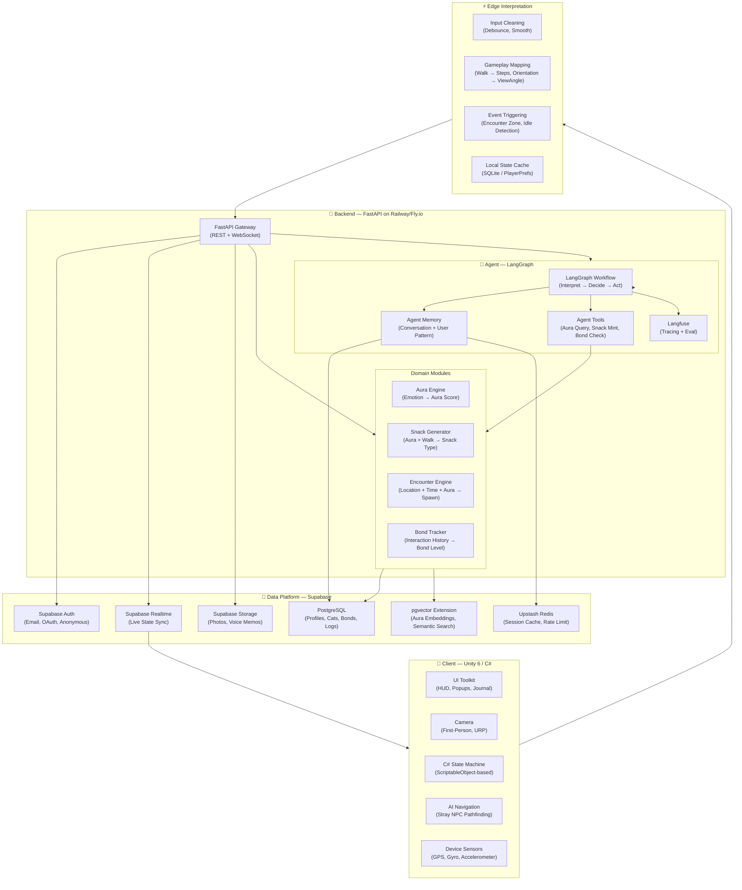
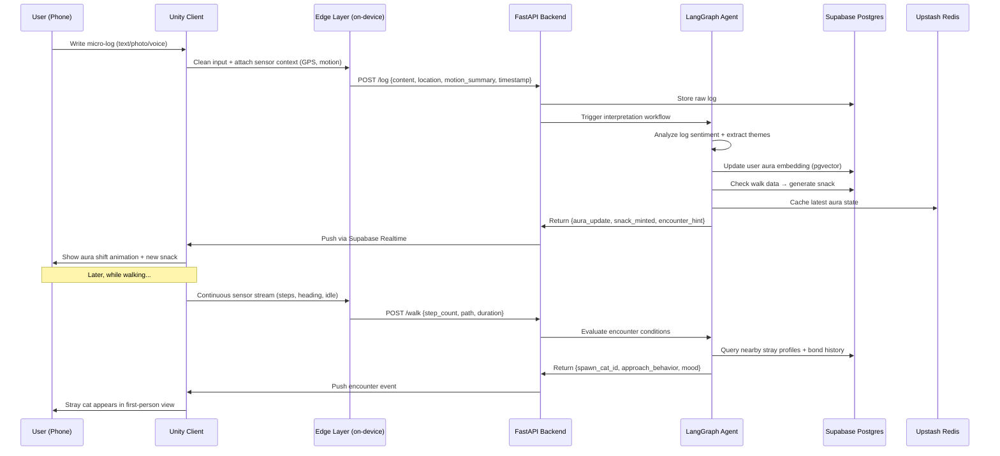

# ADR-002: MVP_v0 Architecture 

**Status:** Accepted
**Date:** 2026-03-11
**Deciders:** vanillasky

## Context

This document revise the original MVP_v0 tech stack for a mobile micro-log + virtual stray animal game. The goal: 
1. **Ship fast**
2. **Stay cheap** 
3. **Keep the agent loop flexible** 
4. **Avoid AWS lock-in hell for a small team**

## Decision

| Layer | Original Choice | Revised Choice | Why |
|---|---|---|---|
| **Client Engine** | Unity 6 / C# | **Unity 6 / C# (keep)** | Proven for mobile 3D, first-person camera, sensor access |
| **UI System** | Unity UI Toolkit | **Unity UI Toolkit (keep)** | Modern, retained-mode, good for popups/HUD |
| **Navigation** | Unity AI Navigation | **Unity AI Navigation (keep)** | Fine for NPC pathfinding on small maps |
| **State Machine** | C# custom FSM | **C# custom FSM** | Keep it lean; ScriptableObject-based FSM |
| **Device Sensors** | Unity Input System + Location Service + Native Plugins | **Unity Input System + Location Service (defer native plugins)** | Gyro/accel/GPS all covered natively; add plugins only when needed |
| **Auth** | Amazon Cognito / Amplify Auth | **Supabase Auth** | Free tier, simpler setup, no AWS overhead |
| **DB for Client Profile** | AWS DynamoDB | **Supabase (PostgreSQL)** | Relational data is better for user profiles, cat traits, bond progression |
| **DB for Realtime Data** | AWS AppSync | **Supabase Realtime** | WebSocket-based, built on Postgres CDC, no GraphQL schema ceremony |
| **DB for Agent (Vector)** | Aurora Serverless PostgreSQL + pgvector | **Supabase pgvector extension** | Same Postgres, same pgvector — but one fewer service to manage |
| **Backend API** | FastAPI | **FastAPI (keep)** | Python ecosystem is essential for the agent layer; async, typed, auto-docs |
| **Agent Framework** | LangGraph + LangSmith | **LangGraph (keep) + Langfuse (replace LangSmith)** | Langfuse is open-source, self-hostable, cheaper for indie scale |
| **Agent Memory** | Postgres Memory + Redis Cache | **Supabase Postgres + Upstash Redis** | Upstash is serverless Redis with a generous free tier |
| **Domain Services (Snack, Aura, Semantic)** | Custom packages | **FastAPI service modules** | Monorepo with clear module boundaries. Don't over-microservice at MVP |
| **Observability** | LangSmith | **Langfuse** | Open-source, self-hostable, cost-effective tracing for LLM calls |
| **File Storage** | (not specified) | **Supabase Storage** | For user photos, voice memo blobs |
| **Hosting / Deployment** | (not specified) | **Railway or Fly.io (FastAPI) + Supabase Cloud (DB/Auth/Storage)** | Simple deploy, no Kubernetes, no Terraform needed for MVP |

---

## Architecture Diagram

## Data Flow Diagram

## Why This Stack — Decision Rationale

### Unity 6 — No Change, It's the Right Call

Unity remains the strongest choice for a first-person mobile game that needs camera control, physics-based NPC movement, and sensor access. The URP (Universal Render Pipeline) is well-suited for stylized mobile graphics, and Unity 6's Addressables system handles asset loading efficiently. The alternative (Unreal) is overkill for this art style and brings a heavier mobile footprint.

**Key consideration:** Use ScriptableObject-based architecture for your game state. It decouples data from MonoBehaviours and makes it easy to serialize cat traits, aura values, and bond states.

### Supabase over AWS (Cognito + DynamoDB + AppSync + Aurora)

This is the biggest change. The original stack spread across 4–5 AWS services for what is fundamentally a single-database problem. For an MVP:

**Supabase gives you one platform** with PostgreSQL (relational + pgvector), auth, realtime subscriptions, file storage, and row-level security. The free tier supports up to 500MB database, 1GB file storage, and 50K monthly active users — more than enough for a closed beta.

The cost difference is dramatic. At ~10K users, Supabase runs about $25–27/month versus an estimated $75+ on AWS with multiple services. More importantly, the developer experience is far simpler: one dashboard, one SDK, SQL you already know.

**Why not Firebase?** Firebase's NoSQL model (Firestore) is a poor fit for the relational data in this game. Cat traits inherit from user patterns, bonds progress through defined stages, and aura is computed from historical log patterns. These are inherently relational queries. Additionally, Firebase lacks native vector search, so you'd need a separate service for the semantic/embedding layer.

**Why not keep AppSync for realtime?** Supabase Realtime is built on Postgres CDC (Change Data Capture) and pushes database changes directly to clients over WebSockets. It's simpler than AppSync's GraphQL subscription model and doesn't require schema definitions. For a game where you're pushing state updates (new snack, aura change, encounter event), this is sufficient.

### FastAPI — No Change, Essential for the Agent Layer

FastAPI stays because the entire agent and ML ecosystem lives in Python. LangGraph, embedding models, sentiment analysis — all Python-native. FastAPI's async support handles concurrent WebSocket connections well, and its auto-generated OpenAPI docs make the Unity ↔ backend contract explicit.

**Deployment:** Railway or Fly.io instead of AWS Lambda/ECS. Both offer simple Git-push deploys, built-in health checks, and auto-scaling at indie prices ($5–20/month for an MVP).

### LangGraph — Keep, but Simplify the Scope

LangGraph is the right agent framework for this use case. The game's agent needs to interpret logs, decide aura shifts, generate encounters, and track long-term patterns — this is a multi-step workflow with branching logic, exactly what LangGraph's state-graph model handles.

However, for MVP, **keep the graph simple:**
1. **Interpret Node** — Analyze the micro-log (sentiment, themes, keywords)
2. **Aura Node** — Update the user's aura embedding based on new input + historical pattern
3. **Snack Node** — Check walk data, compute snack generation (aura type × walk pattern)
4. **Encounter Node** — Evaluate spawn conditions (time, location, aura, bond history)

Don't build a complex multi-agent crew. One graph, four nodes, clear state transitions. You can add sophistication later.

### Langfuse over LangSmith

LangSmith is LangChain's hosted observability platform. It works, but it's a closed SaaS with pricing that scales with usage. Langfuse is open-source, self-hostable, and provides the same core features: trace LLM calls, measure latency, evaluate output quality, debug agent chains. For an indie MVP, this is the pragmatic choice.

### Upstash Redis over Self-Managed Redis

The original architecture had "Postgres Memory + Redis Cache" for the agent. Upstash provides serverless Redis with a free tier (10K commands/day) and pay-per-request pricing. No Docker container to manage, no memory sizing to worry about. Use it for session caching, rate limiting, and hot aura state that the encounter engine queries frequently.

### pgvector on Supabase instead of Separate Aurora

The original had a dedicated Aurora Serverless PostgreSQL with pgvector for the agent's semantic layer. Since we're already on Supabase (which is PostgreSQL), we can enable the pgvector extension on the same database. This eliminates a separate service while keeping the same vector search capability.

For the MVP's scale (thousands of aura embeddings, not millions), pgvector on a single Postgres instance performs well. If you later need to scale vector search to millions of embeddings, you can migrate to a dedicated Qdrant or Pinecone instance — but that's a post-MVP concern.

## Deferred to Post-MVP

| Feature | Why Deferred |
|---|---|
| Native Plugins (ARKit/ARCore) | GPS + gyro + accelerometer cover the MVP experience; AR overlays can come later |
| Separate Microservices | Keep domain logic in FastAPI modules; split into services only when team or scale demands it |
| Redis Cluster | Upstash serverless is sufficient; self-managed Redis only if you hit latency walls |
| Dedicated Vector DB (Qdrant/Pinecone) | pgvector handles MVP scale; migrate when embedding count exceeds ~5M |
| CI/CD Pipeline | Use Railway/Fly.io auto-deploy from Git; formal pipeline after beta |
| Analytics Platform | Start with Langfuse traces + Supabase built-in analytics; add PostHog or Mixpanel post-launch |

## Cost Estimate (MVP / Closed Beta)

| Service | Monthly Cost |
|---|---|
| Supabase Pro | $25 |
| Railway (FastAPI) | $5–20 |
| Upstash Redis | $0 (free tier) |
| Langfuse (self-hosted on Railway) | $0–5 |
| LLM API calls (OpenAI/Anthropic) | $20–50 (depends on log volume) |
| **Total** | **~$50–100/month** |

Compare this to the original AWS stack (Cognito + DynamoDB + AppSync + Aurora Serverless + Lambda), which would likely cost $150–300/month even at MVP scale, plus significantly more DevOps time.

## Mapping to Conceptual Architecture

```mermaid
graph LR
    subgraph INPUT ["Input Layer"]
        L[Location Data]
        M[Motion Data]
        O[Orientation Data]
        ML[Micro-log Input]
    end

    subgraph EDGE_INTERP ["Edge Interpretation Layer"]
        IC[Input Cleaning]
        GM[Gameplay Mapping]
        ET[Event Triggering]
        SC[State Caching]
    end

    subgraph GAME_RT ["Game Runtime Layer"]
        CR[Camera Rendering — Unity URP]
        BC[Behavior Control — C# FSM]
        FR[Feedback Rendering — UI Toolkit]
        ST[Session Tracking — Supabase Auth]
    end

    subgraph CLOUD ["Cloud Service Layer"]
        PM[Profile Mgmt — Supabase Postgres]
        MP[Memory Persistence — pgvector + Redis]
        SA[Semantic Analysis — LangGraph Agent]
        RP[Relationship Progression — Bond Tracker]
    end

    subgraph OUTPUT ["Experience Output Layer"]
        AU[Aura Update]
        EO[Encounter Outcome]
        RG[Reward Generation — Snack]
        MJ[Memory Journal]
    end

    INPUT --> EDGE_INTERP --> GAME_RT --> CLOUD --> OUTPUT
```

## Consequences

**Positive:**

* **Drastically Reduced DevOps Burden:** Consolidating Auth, Database, Storage, and Vector Search into Supabase eliminates the need to manage complex IAM roles, VPCs, and integrations across 4-5 different AWS services.
* **Cost Efficiency:** Monthly infrastructure costs drop from an estimated $150–300+ down to ~$50–100, extending the runway for MVP testing and beta iterations.
* **Appropriate Data Paradigm:** Shifting from DynamoDB (NoSQL) to PostgreSQL provides a much better fit for the relational nature of the game’s data (e.g., how cat traits inherit from user patterns, or how bond stages progress).
* **Python-Native AI Layer:** Keeping FastAPI allows the backend to remain in the same ecosystem as LangGraph and the embedding models, making iteration on the AI agent loop smooth and avoiding complex cross-language microservice communication.

**Negative / trade-offs:**

* **Community SDK Reliance:** Unlike AWS, which provides highly supported official Unity SDKs, the Supabase Unity SDK is community-maintained. This may require more manual handling or custom boilerplate for Auth and Realtime connections inside Unity.
* **Self-Hosting Maintenance:** Swapping LangSmith for Langfuse saves money, but running it on Railway means the team assumes basic maintenance responsibilities for the observability container. If the container crashes, tracing goes down until it's rebooted.
* **Realtime Scaling Limits:** Supabase Realtime (CDC-based) is excellent for discrete push events (aura shifts, snack spawns). However, if the game evolves to require high-frequency, continuous state syncing (like live multiplayer movement), a dedicated game server architecture will eventually be needed.
* **Vector Search Ceiling:** pgvector on a single Supabase instance is perfect for MVP scale. If the game scales to millions of aura embeddings, a migration to a dedicated vector database (like Pinecone or Qdrant) will be required.

## Alternatives Considered

* **Original AWS Stack (Cognito + DynamoDB + AppSync + Aurora):** Rejected. The baseline cost is too high for an indie MVP, the NoSQL data model of DynamoDB fits poorly with the game's relational requirements, and the DevOps overhead of managing multiple distinct services would severely impact deployment velocity.
* **Firebase / Google Cloud Platform:** Rejected. Firebase's NoSQL model (Firestore) presents the same relational data modeling issues as DynamoDB. Furthermore, Firebase lacks a native, integrated vector search solution comparable to Postgres + pgvector, which would force the adoption of an external vector database too early in development.
* **Unreal Engine:** Rejected. While powerful, Unreal is overkill for a stylized, first-person mobile game. It would result in a heavier mobile footprint and unnecessary complexity compared to Unity 6's Universal Render Pipeline (URP).
* **LangChain + LangSmith (Managed SaaS):** Rejected. While LangSmith offers excellent out-of-the-box observability, its closed-SaaS nature and usage-based pricing model present a risk of unpredictable costs during beta testing. Langfuse provides the necessary tracing capabilities at a manageable, fixed hosting cost.