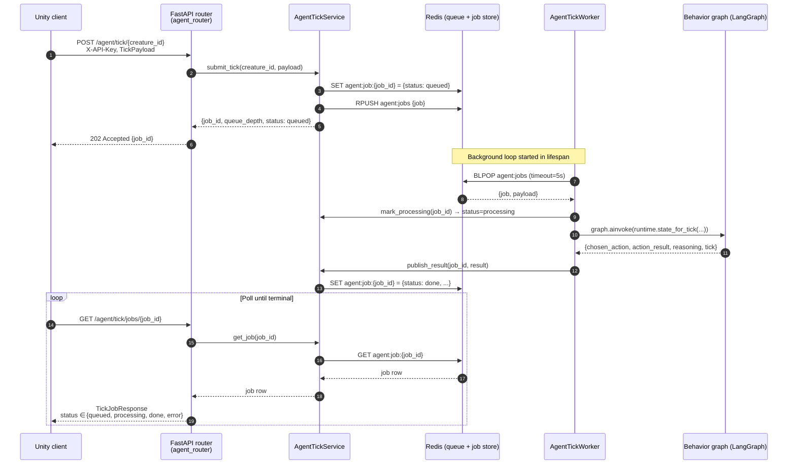

# ADR-002: Unity ↔ Backend Tick Protocol (Async Job + Poll)

- **Status:** Superseded by ADR-004 for the Unity runtime
- **Date:** 2026-05-18
- **Scope:** `backend/app/api/routes/agent_router.py`, `backend/app/services/agent_tick_service.py`, `backend/app/workers/agent_tick_worker.py`

## Context

Unity needs the cat's next action on every game tick. The decision is produced
by an LLM-backed behavior graph, so latency is variable (hundreds of ms to
several seconds depending on provider and model). Holding an HTTP connection
open for the full duration would:

- block Unity's game loop or force long synchronous waits,
- couple Unity's tick rate to the LLM's response time,
- make retries / cancellations awkward when the model stalls.

We need a transport that decouples "ask for a decision" from "read the
decision", survives slow LLM calls, and degrades gracefully when Redis or the
LLM is down.

## Decision

Use a **submit-then-poll** pattern backed by a Redis-resident job queue.

1. Unity `POST`s a tick payload to `/api/v1/agent/tick/{creature_id}`.
   The endpoint enqueues the job in Redis and returns **202 Accepted** with a
   `job_id` immediately.
2. A background `AgentTickWorker` (started in the FastAPI lifespan) `BLPOP`s
   the queue, runs the compiled LangGraph behavior graph, and writes the
   result back to Redis under the same `job_id`.
3. Unity polls `GET /api/v1/agent/tick/jobs/{job_id}` until `status` is
   `done` or `error`, then applies the returned action.

All endpoints are gated by the `X-API-Key` header (`verify_api_key` dep).

## Business logic — sequence

## Endpoint contract

| Method | Path                              | Status | Body in              | Body out                                    |
|--------|-----------------------------------|--------|----------------------|---------------------------------------------|
| POST   | `/api/v1/agent/tick/{creature_id}`| 202    | `TickPayload`        | `TickSubmitResponse {job_id, queue_depth}`  |
| GET    | `/api/v1/agent/tick/jobs/{job_id}`| 200    | —                    | `TickJobResponse {status, action, ...}`     |

Job lifecycle states: `queued → processing → done | error`. Each row is
TTL'd by `agent_status_ttl` (default 300 s) so the store self-cleans.

## Redis key layout

| Key                              | Type   | Purpose                                       |
|----------------------------------|--------|-----------------------------------------------|
| `agent:jobs`                     | LIST   | FIFO job queue consumed by the worker (BLPOP) |
| `agent:job:{job_id}`             | STRING | JSON job row (input + status + result)        |
| `agent:status:{creature_id}`     | STRING | Deprecated; no longer written by the websocket runtime |
| `agent:latest_job:{creature_id}` | STRING | Deprecated; no longer written by the websocket runtime |

## Consequences

**Positive**
- The POST endpoint is fast and constant-time — Unity never blocks on LLMs.
- The worker can be scaled or replaced without changing the Unity contract.
- Redis-backed state makes restarts safe: in-flight jobs survive a process
  bounce as long as Redis is up.
- Same pattern works for any future LLM/agent work — extend the behavior
  graph, keep the protocol.

**Negative**
- Unity must implement polling and handle the `processing` state. We accept
  the round-trips because game ticks are slower than network RTT to Redis.
- Two failure surfaces (queue write, worker run). Mitigated by typed status
  in the job row and structured error publication
  (`publish_error` → `status=error` with safe-default action).
- Requires Redis. If Redis is unreachable at startup, the worker task isn't
  spawned and POSTs return `503` via the service's `RuntimeError`.

## Alternatives considered

- **Synchronous request/response** — rejected: couples Unity to LLM latency.
- **WebSocket / SSE push** — overkill for the current tick cadence and adds
  reconnection logic on the Unity side; revisit if we move to sub-second
  ticks.
- **External task queue (Celery / RQ)** — heavier dependency for a single
  queue with one consumer; Redis lists already give us BLPOP semantics.
