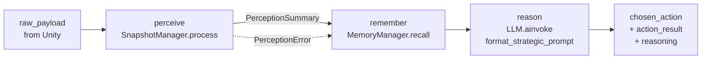
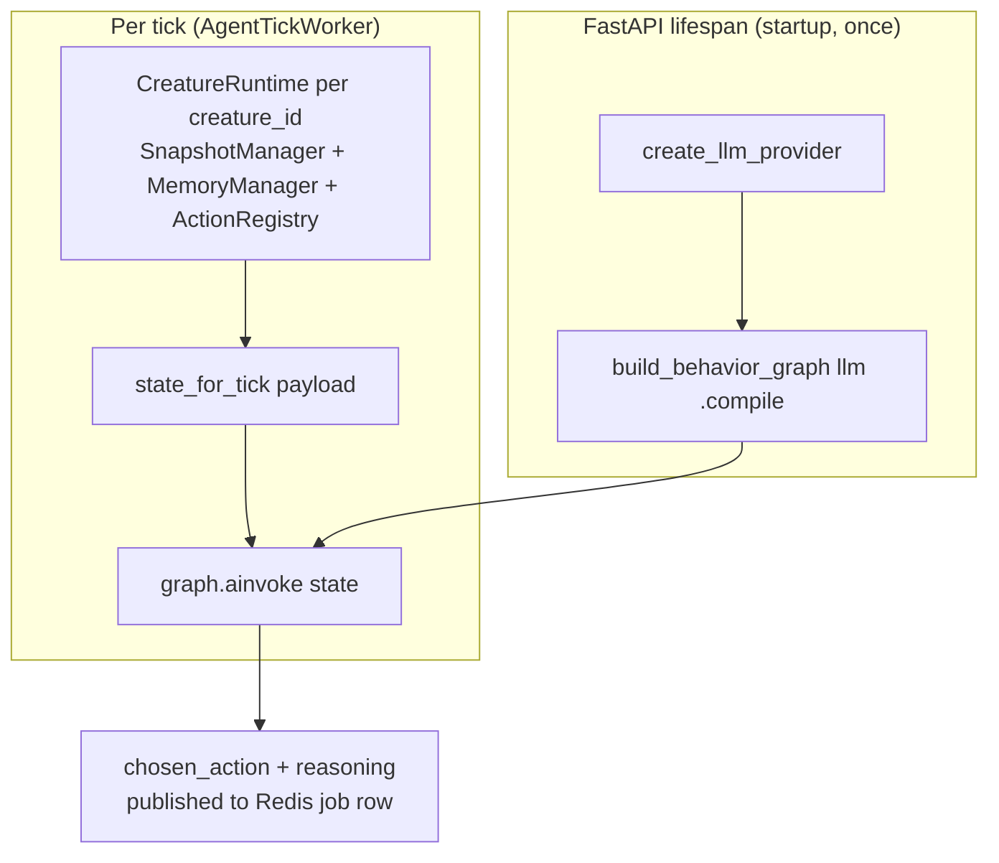

# ADR-003: Agent Runtime Architecture (`backend/app/agent/`)

- **Status:** Accepted
- **Date:** 2026-05-18
- **Scope:** `backend/app/agent/**`

## Context

Each cat needs to: ingest a Unity world snapshot, recall what just happened,
ask an LLM what to do, and emit a structured action back to Unity. This needs
to be testable in isolation (no Redis/HTTP required), swappable across LLM
providers, and shaped so memory / perception / reasoning stay independently
evolvable.

## Decision

Split the agent into four cooperating pieces, composed by a **single shared
LangGraph** and parameterised per cat by a `CreatureRuntime`:

```
backend/app/agent/
├── perception.py        # SnapshotManager — raw Unity JSON → PerceptionSummary
├── memory.py            # MemoryManager   — ring buffer + spatial log
├── action_registry.py   # ActionRegistry  — allowed actions + prompt blurbs
├── llm_provider.py      # LLMProvider     — provider-agnostic factory
├── prompts.py           # Strategic prompt template
├── creature_runtime.py  # CreatureRuntime — per-cat perception+memory+actions bundle
├── behavior_graph.py    # build_behavior_graph(llm) → StateGraph
└── schemas/             # Pydantic IO schemas
```

**Graph shape** (`perceive → remember → reason → END`):



### Roles

- **`SnapshotManager` (perception.py)** — validates the raw Unity payload,
  filters entities by relevance radius, classifies a `ThreatLevel`, returns
  a typed `PerceptionSummary` *or* a typed `PerceptionError`. Bad payloads
  are an expected condition, not an exception.
- **`MemoryManager` (memory.py)** — bounded ring buffers for perception
  history and visited positions; exposes `record()` / `recall(last_n=…)`.
  All memory is in-process for now; persistence is deliberately out of scope
  (see *Consequences*).
- **`ActionRegistry` (action_registry.py)** — single source of truth for the
  action vocabulary the LLM may choose from, plus prompt-friendly
  descriptions and a default `ActionResult` mapping.
- **`LLMProvider` (llm_provider.py)** — a `Protocol` with `invoke` /
  `ainvoke`. `create_llm_provider(settings)` returns a configured
  `ChatOpenAI` / `ChatAnthropic` / Ollama / OpenRouter / Groq client based
  on `LLMSettings.provider`. Callers depend on the protocol, not the
  concrete class.
- **`CreatureRuntime` (creature_runtime.py)** — the per-cat container that
  owns one `SnapshotManager`, one `MemoryManager`, one `ActionRegistry`.
  `state_for_tick(creature_id, payload)` builds the `CreatureRuntimeState`
  TypedDict the graph consumes.
- **`build_behavior_graph(llm)` (behavior_graph.py)** — wires the three
  node functions and is compiled **once at startup** in the FastAPI
  lifespan. The LLM is captured by closure in `make_reason(llm)`; runtime
  state (perception/memory) flows through the graph state, not via the
  graph object. This is what lets one compiled graph serve every cat.

### Tick state

`CreatureRuntimeState` is a TypedDict carrying both the per-tick data
(`raw_payload`, `perception`, `memory_context`, `chosen_action`, …) **and**
a reference to the owning `CreatureRuntime`. Nodes read `state["runtime"]`
to call into perception/memory, which keeps the graph stateless and the
per-cat state encapsulated.

### How the pieces compose at runtime



## Consequences

**Positive**
- Each concern is independently unit-testable — `SnapshotManager.process()`
  needs no LLM, `MemoryManager.recall()` needs nothing at all.
- Swapping providers is a config change (`LLM_PROVIDER`); no agent code
  moves.
- One compiled graph for all cats keeps startup cheap and tracing in
  LangSmith uniform across creatures.
- Returning typed errors (`PerceptionError`) instead of raising lets the
  graph keep flowing on malformed payloads rather than failing the tick.

**Negative / open**
- Memory is per-process and per-creature; restarts wipe history. Long-lived
  memory (Supabase / pgvector) is intentionally deferred — see
  `ENABLE_MEMORY_PIPELINE` and `ENABLE_REFLECTION_CYCLE` flags in
  `app/core/config.py` for the planned re-entry points.
- `CreatureRuntime` lives in the worker process. Horizontal scaling of
  workers will require either sticky routing per `creature_id` or
  externalising the per-cat state.
- The `reason` node parses the LLM output as JSON with a permissive
  fallback to `{"action": "idle"}`. Robust structured output (tool calls /
  pydantic schemas) is a follow-up.

## Alternatives considered

- **One graph per cat** — rejected: recompiling LangGraph per creature is
  wasteful and gives no isolation benefit over passing `runtime` through
  state.
- **Direct `langchain_*` calls from routes** — rejected: couples HTTP layer
  to provider SDKs and prevents the behavior pipeline from being reused by
  the worker.
- **Stateful agent objects with internal LLM clients** — rejected: makes
  provider swaps and testing harder; the `LLMProvider` protocol gives us
  the same ergonomics without the coupling.
