# ADR-003: FastAPI Layered Architecture with Dependency Injection

**Status:** Accepted <br>
**Date:** 2026-03-25 <br>
**Deciders:** vanillasky <br>


## Context

The cat-brain backend (FastAPI + LangGraph) started as a rapid prototype with a flat
file structure. As features grew, several problems emerged:

1. **Module-level singletons everywhere** — `supabase = SupabaseManager.get_client()`
   and `redis_service = RedisService()` were imported directly. This made unit testing
   impossible without monkeypatching globals, and meant every import of a route file
   triggered real DB connections.

2. **No separation between layers** — route handlers contained embedding logic,
   background task definitions, and direct Supabase queries. Changing the DB schema
   required touching route files.

3. **Scattered configuration** — `os.getenv()` calls appeared in 5+ files. Missing
   env vars surfaced as runtime `None` errors deep in request handlers instead of
   failing fast at startup.

4. **Synchronous Redis in async routes** — the `redis-py` synchronous client was
   blocking FastAPI's event loop on every agent status poll from Unity.

5. **No test infrastructure** — the only "tests" were standalone scripts with
   `if __name__ == "__main__"` that required a running server and real API keys.


## Decision



We adopt a **layered architecture with dependency injection**, following FastAPI
best practices. The architecture is split into five layers, each with strict rules
about what it may depend on.

### Layer 1 — Core (`app/core/`)

| File | Responsibility |
|------|----------------|
| `config.py` | Pydantic Settings — single source of truth for all env vars, validated at import time |
| `exceptions.py` | Custom exception hierarchy (`AppError` → `DatabaseError`, `EmbeddingError`, `StorageError`, `NotFoundError`) |
| `lifespan.py` | FastAPI lifespan context manager — creates Supabase client and async Redis pool on startup, tears down on shutdown |

**Rule:** Core depends on nothing inside `app/` except itself.

### Layer 2 — DB Factories (`app/db/`)

| File | Responsibility |
|------|----------------|
| `supabase.py` | `create_supabase(settings) → Client` factory function |

**Rule:** DB factories receive `Settings` as an argument. They never read env vars
directly. Called only by `lifespan.py`.

### Layer 3 — Models (`app/models/`)

Pydantic schemas split by intent:

| Schema | Purpose |
|--------|---------|
| `MicrologCreate` | Input from Unity client — excludes `id`, `embedding`, `created_at` |
| `MicrologInDB` | Enriched before DB write — adds `embedding`, `reply` |
| `MicrologRead` | API response — excludes `embedding` (internal field) |
| `MicrologUpdate` | Partial patch — only mutable fields |

**Rule:** Models are pure data classes. No imports from services, repos, or DB.

### Layer 4 — Repositories (`app/repositories/`)

Pure data-access layer. Each repository class receives the Supabase `Client` as a
constructor argument (injected, never imported).

**Rule:** No business logic. No embedding calls. No side effects. Returns raw dicts;
the caller converts to Pydantic models if needed.

### Layer 5 — Services + Workers (`app/services/`, `app/workers/`)

Business logic lives here:

| File | Responsibility |
|------|----------------|
| `embedding.py` | Wraps OpenAI embeddings API, receives `Settings` in constructor |
| `storage.py` | Wraps Supabase Storage uploads, receives `Client` in constructor |
| `agent.py` | Agent status read/write via async Redis |
| `workers/agent_tasks.py` | Background task for agent "thinking" pipeline, all deps passed explicitly |

**Rule:** Services never import singletons. All external clients are constructor args.

### Layer 6 — API Routes (`app/api/`)

Thin controllers. Each route handler:
1. Receives dependencies via `Depends()` (Supabase, Redis, Settings)
2. Constructs the needed service/repo
3. Delegates work
4. Returns the result

**Rule:** Routes contain no business logic. No direct DB calls. No `os.getenv()`.

### Dependency Injection via `app/api/deps.py`

```python
SupabaseDep = Annotated[Client, Depends(get_supabase)]  # pulls from app.state
RedisDep    = Annotated[aioredis.Redis, Depends(get_redis)]
SettingsDep = Annotated[Settings, Depends(get_settings)]
```

Route handlers declare these as parameters. FastAPI resolves them automatically.
In tests, `app.dependency_overrides[get_supabase] = lambda: mock_db` replaces any
dependency with a mock — zero monkeypatching.

### Async Redis

Replaced synchronous `redis-py` with `redis.asyncio`. Status polling from Unity
no longer blocks the event loop.

### Global Exception Handler

A single handler in `main.py` catches all `AppError` subclasses and returns
consistent JSON:

```python
@app.exception_handler(AppError)
async def app_error_handler(request, exc):
    return JSONResponse(status_code=exc.status_code, content={"detail": exc.message})
```

Routes never need `try/except` for known error types.


## Test Strategy



Tests are split into two tiers with a `@pytest.mark.paid` marker:

### Tier 1 — Unit Tests (`tests/unit/`, `make test`)

Always free, always fast, no credentials needed.

| Test file | What it covers | Mock strategy |
|-----------|---------------|---------------|
| `test_config.py` | Settings validation, defaults, missing fields | `monkeypatch.delenv` + `_env_file=None` |
| `test_models.py` | Pydantic field constraints, serialization | None (pure data) |
| `test_embedding_service.py` | Embed text, empty input, OpenAI failure | `patch.object(svc._client.embeddings, "create")` |
| `test_agent_service.py` | Redis set/get status, TTL, idle default | `AsyncMock` Redis |
| `test_storage_service.py` | Upload path, bucket name, error handling | `MagicMock` Supabase Storage |
| `test_microlog_repo.py` | CRUD operations, error mapping | Chainable `MagicMock` query builder |
| `test_agent_tasks.py` | thinking→idle cycle, error recovery | `AsyncMock` Redis + `MagicMock` Supabase |
| `test_api_routes.py` | All HTTP endpoints, status codes, validation | FastAPI `dependency_overrides` |

The `conftest.py` provides shared fixtures: `mock_supabase` (chainable query builder),
`mock_redis` (AsyncMock), and `settings` (dummy values).

### Tier 2 — Integration Tests (`tests/integration/`, `make test-integration`)

Call real external services. Marked `@pytest.mark.paid`.

| Test file | What it covers |
|-----------|---------------|
| `test_supabase_connection.py` | Factory creates valid client, can query tables |
| `test_embedding_real.py` | Real OpenAI embedding returns 1536-dim vector |
| `test_redis_real.py` | Real Redis set/get/TTL, cleanup after test |
| `test_agent_pipeline_e2e.py` | Full POST→poll→thinking→idle cycle against running server |

### CI Workflow Separation

| Workflow | Trigger | Credentials | Cost |
|----------|---------|-------------|------|
| `ci-unit.yml` | Every push (all branches) + PRs to main | None | Free |
| `ci-integration.yml` | Main push (db/services/repos paths) + manual | GitHub secrets | ~$0.001 |
| `ci-eval.yml` | Main push (agents/evals paths) | AWS OIDC + OpenAI | $$$ |


## Consequences

**Positive:**
- Any layer can be tested in isolation — no real DB needed for unit tests.
- Swapping Supabase for raw asyncpg requires changes in `db/supabase.py` and
  `lifespan.py` only — routes and services are untouched.
- New developers can read top-down: `main.py` → `lifespan.py` → `deps.py` → routes.
- Background tasks are independently testable (all deps are explicit kwargs).
- CI catches regressions in < 30 seconds (unit) without spending API credits.

**Negative / trade-offs:**
- More files than the flat prototype (16 source files vs 9).
- Constructor injection adds a small amount of boilerplate per route handler.
- Developers must understand `Annotated[X, Depends(Y)]` pattern (FastAPI-specific).
- The `mock_supabase` chainable fixture is complex — new test authors need to
  understand the builder pattern to add new repository tests.


## Alternatives Considered

### A. Keep flat structure, add tests with monkeypatching
**Rejected.** `unittest.mock.patch("app.db.client.supabase")` is fragile — it
breaks if you rename or move the module. Dependency injection eliminates the need
for path-based patching entirely.

### B. Use a full ORM (SQLAlchemy) instead of Supabase client
**Deferred.** The project uses Supabase for auth, storage, and realtime features
beyond just Postgres. Replacing the client with SQLAlchemy would lose those
integrations. If we outgrow Supabase, the repository layer isolates the migration.

### C. Use `Depends()` to inject service instances directly
**Rejected.** Injecting `EmbeddingService` via `Depends()` would require either
a global instance (back to singleton problem) or a factory function per service.
Constructor injection in the route body is simpler and equally testable via
`dependency_overrides` on the underlying clients.

### D. Use `pytest-docker` for integration tests
**Deferred.** Current integration tests hit cloud Supabase and local Redis via
Docker Compose. `pytest-docker` would add container lifecycle management to the
test suite itself. Acceptable if we add more local services later.