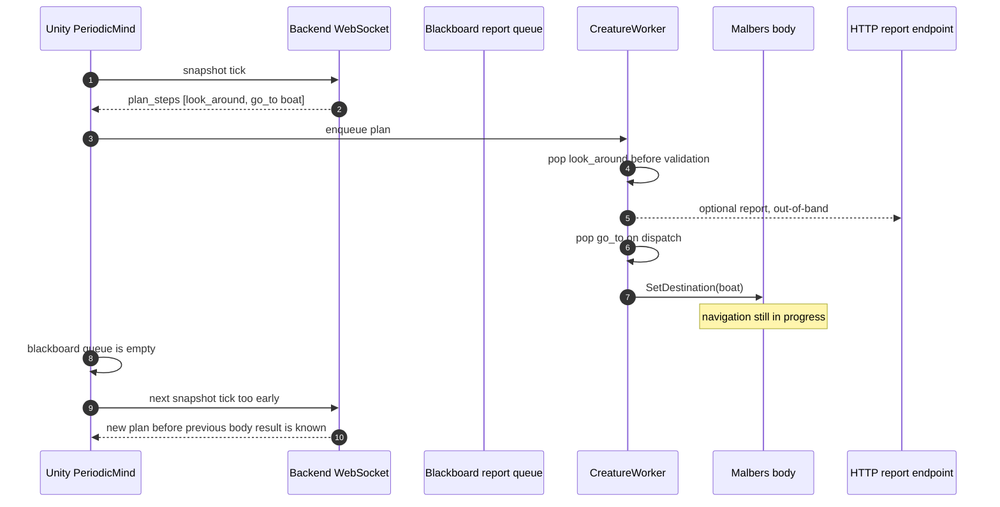
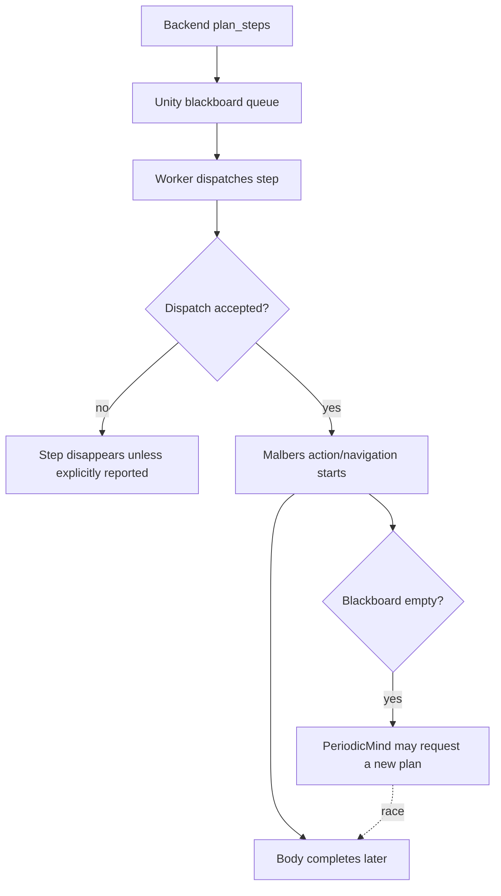
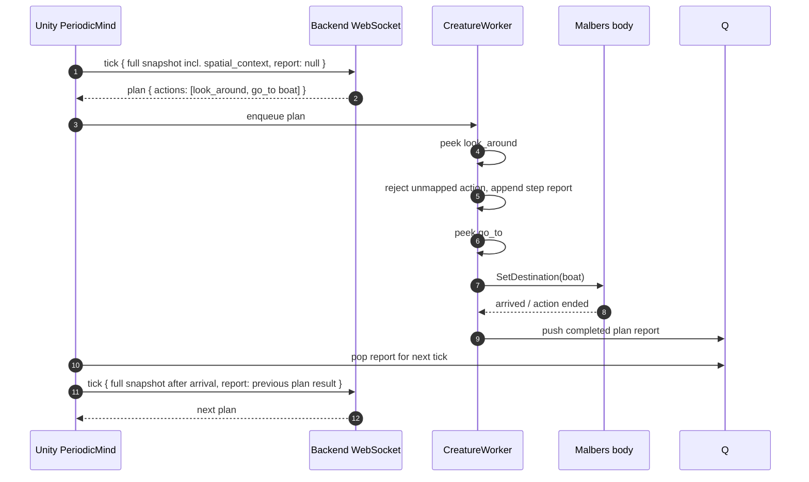
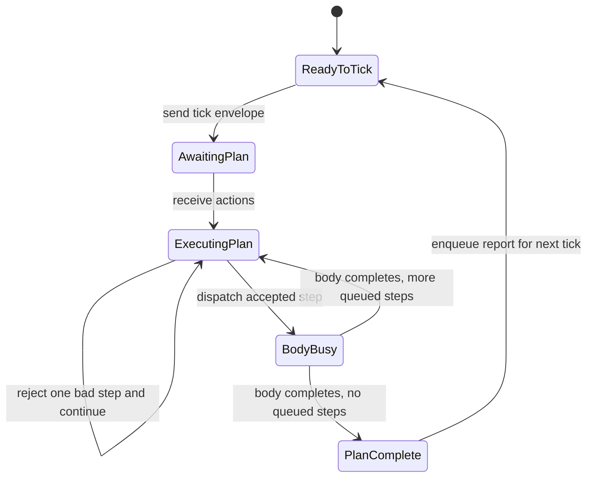

# ADR-004: WebSocket Nested Plan Execution Contract

- **Status:** Accepted
- **Date:** 2026-05-20
- **Scope:** Unity agent bridge, creature motor worker, backend `/agent/ws/{creature_id}` loop

## Context

The backend now emits a list of actions instead of a single flat action. Unity
executes those actions locally through `CreatureWorker` and
`MalbersAnimalAdapter`.

The previous runtime contract still behaved like stateless HTTP:

- the backend returned a plan;
- Unity enqueued the list;
- the worker popped each intent when dispatching it;
- `PeriodicMind` sent a new snapshot once the blackboard queue looked empty;
- action failures were meant to be reported through a separate HTTP callback.

That creates two ordering bugs:

1. **Queue-empty is not execution-complete.** A step is removed from the
   blackboard when it is handed to Malbers, but Malbers may still be animating
   or navigating for several seconds.
2. **HTTP action reports are out-of-band.** The backend cannot reliably order
   "this plan finished" against "here is the next snapshot" when they arrive
   through separate stateless requests.

## Current Problem



The state machine also has an ambiguous authority boundary:



For multiple cats, this gets worse: every cat has an ordered local body loop,
but HTTP reports and snapshot ticks are independent network calls. The backend
can observe them in an order different from the order each cat actually lived.

## Decision

Use the per-creature WebSocket as the only runtime control channel. Each cat
keeps one WebSocket connection. Unity sends a nested `tick` envelope that
contains:

- `snapshot`: the full fresh Unity snapshot payload, not a delta;
- `report`: the nested result of the previous plan, if any.

The backend only plans from that envelope. It sees "what happened" and "what
the world looks like now" as one ordered message.

`snapshot` is the same data shape Unity already builds through
`SnapshotManager`: identity/correlation fields, self state, mood, health,
visible entities, and full spatial context. The abbreviated examples below are
wire examples, not a reduced schema.

```json
{
  "type": "tick",
  "agent_id": "cat_001",
  "requestId": "t0000002A",
  "report": {
    "status": "completed_with_rejections",
    "requestId": "t00000029",
    "planId": "t00000029",
    "steps": [
      {
        "commandId": "cat_001:00000003",
        "action": "look_around",
        "target": "",
        "status": "rejected",
        "reason": "unmapped_action:look_around"
      },
      {
        "commandId": "cat_001:00000004",
        "action": "go_to",
        "target": "SM_Boat_1_2",
        "status": "completed",
        "reason": ""
      }
    ]
  },
  "snapshot": {
    "requestId": "t0000002A",
    "agent_id": "cat_001",
    "commandId": "",
    "time": 42.25,
    "self": {
      "location": "Harbor,Dock",
      "current_action": "idle"
    },
    "mood": {
      "fear": 0.1,
      "trust": 0.7,
      "curiosity": 0.8,
      "social": 0.2,
      "energy": 0.9
    },
    "health": {
      "hunger": 0.3
    },
    "entities": [
      {
        "id": "SM_Boat_1_2",
        "tags": ["boat", "landmark"],
        "distance": 4.5,
        "direction": "north_east"
      }
    ],
    "spatial_context": {
      "zones": [
        {
          "id": "Harbor",
          "type": "district",
          "confinement": "Open",
          "surface": "wood"
        },
        {
          "id": "Dock_01",
          "type": "platform",
          "confinement": "Semi",
          "surface": "planks"
        }
      ]
    }
  }
}
```

The backend WebSocket response has one canonical plan surface: `actions`.
There is no separate `action` object and no duplicate `plan_steps` field on
the WebSocket wire. `plan_steps` can remain an internal/HTTP job-row name, but
Unity should only consume `actions` from the socket.

```json
{
  "type": "plan",
  "request_id": "t0000002A",
  "status": "done",
  "actions": [
    { "action": "look_around", "target": null, "reason": "scan" },
    { "action": "go_to", "target": "SM_Boat_1_2", "reason": "approach" }
  ],
  "reasoning": "Scan first, then approach the boat."
}
```

Cadence authority is also explicit: **Unity initiates every snapshot**. The
backend never asks for a new snapshot and never plans again until Unity sends
the next `tick` envelope. Unity sends that next envelope only when:

- no backend request is in flight;
- the local action queue is empty;
- the body adapter is no longer executing an action/navigation;
- the previous plan report has been queued onto the blackboard and can be
  attached to the next tick.

## Proposed Flow





## Consequences

- Unity remains the cadence authority: it sends the next planning tick only
  after its local plan is terminal.
- Per-cat ordering is simple: one WebSocket connection gives ordered messages
  for that creature.
- The backend receives failed/rejected steps before the next plan prompt, so
  the LLM can avoid repeating impossible actions.
- HTTP action reporting is removed from the runtime loop. It can still exist
  as a debug/admin API later, but it must not be required for planning order.
- The old HTTP submit/poll agent runtime endpoints are removed from
  `agent_router.py`; Redis jobs remain an internal worker mechanism behind the
  WebSocket.
- The backend remains tolerant of legacy raw snapshot websocket messages
  during transition.
