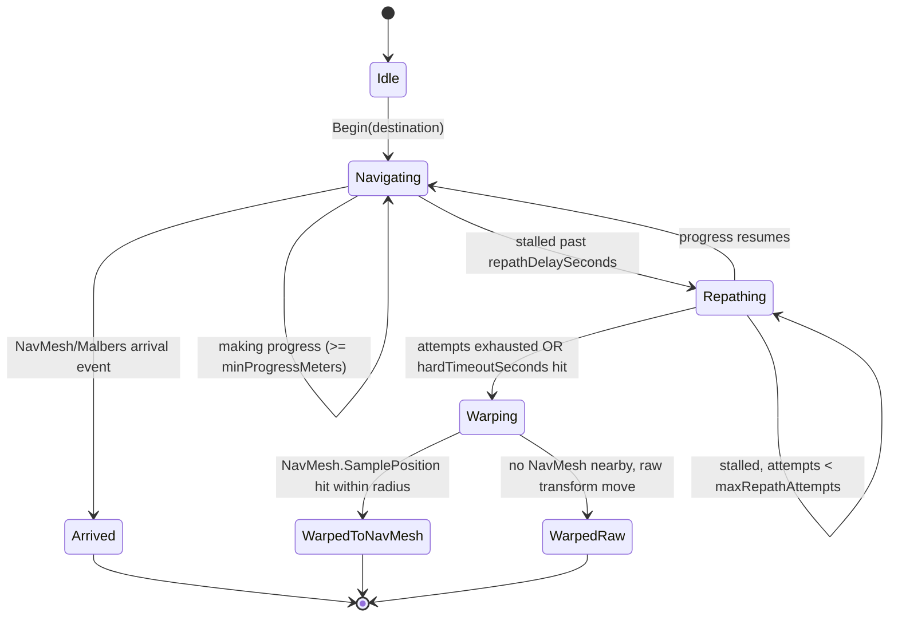
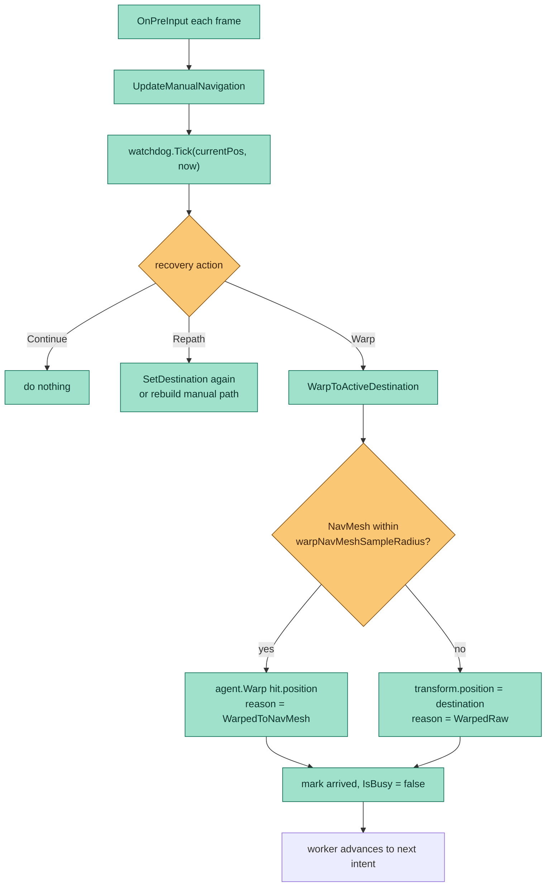

# ADR-005: Movement Reliability — Navigation Watchdog + Warp Recovery

- **Status:** Accepted
- **Date:** 2026-05-22
- **Scope:** `mewi-unity/app/Assets/Scripts/Creature/Motor/**`
  (`NavigationWatchdog.cs`, `NavigationRecoveryConfig.cs`, `ActionWatchdog.cs`,
  `ActionExecutionConfig.cs`, `MalbersAnimalAdapter.cs`, `CreatureWorker.cs`)

## Context

The cat frequently gets stuck on obstacles during NavMesh navigation.
`MalbersAnimalAdapter.IsBusy` already covers navigation, action execution, and
action cooldown, but the core risk remains: if Malbers/NavMesh never raises an
arrival event and the cat stops getting closer to the destination, the worker
waits forever and the whole plan stalls (`go_to → eat` never reaches `eat`).

For this prototype the explicit decision is **reliability beats naturalism**:
when the cat is stuck, briefly try to repath and then **warp/teleport** to the
requested destination so the rest of the plan can continue. This applies to all
navigation-style commands (`go_to`, `follow`, `wander`, `flee`).

This guarantee is load-bearing for later ADRs: because every plan terminates,
the backend can treat the plan it asked for as the authoritative outcome
([ADR-008](ADR-008-goal-event-bus-plan-step-feedback.md),
[ADR-010](ADR-010-backend-owned-world-and-social-chat.md)).

## Decision

Add a self-recovering navigation watchdog that:

1. Detects "not getting closer to the destination for N seconds" while a
   navigation command is active.
2. First tries a **repath** (re-issue destination to Malbers, or rebuild the
   manual NavMesh path).
3. If repath attempts are exhausted, **warps** the animal to the destination
   (NavMesh-projected if possible, raw transform position as the final
   fallback) and marks the command complete so the next intent runs.
4. Records *why* the command completed (`Arrived`, `ArrivedAfterRepath`,
   `WarpedToNavMesh`, `WarpedRaw`, `Failed`) into the plan step report, so the
   backend sees the honest reason rather than a blanket "completed".

The recovery logic is split into small, single-purpose files so the already
~590-line `MalbersAnimalAdapter.cs` does not bloat further:

| File | Responsibility |
| --- | --- |
| `NavigationRecoveryConfig.cs` | `[Serializable]` tunables (intervals, thresholds, sample radius), exposed once on the adapter. |
| `NavigationWatchdog.cs` | Pure C# state machine. No Malbers/NavMesh calls. Tracks start time, last-progress time, best distance, repath count, completion reason. |
| `ActionExecutionConfig.cs` | Configurable action start timeout, max duration, post-action cooldown. |
| `ActionWatchdog.cs` | Pure timing state for Malbers action modes — lets animations finish naturally but forces cleanup if they never start or never end. |
| `MalbersAnimalAdapter.cs` | Drives both watchdogs from its existing per-frame `OnPreInput` hook; owns the actual NavMesh/warp operations. |
| `CreatureWorker.cs` | Surfaces `LastNavigationCompletionReason` into the free-text `PlanStepExecutionReport.reason`. |

`NavigationWatchdog` is pure state — the adapter owns every Malbers/NavMesh
side effect — so it is unit-testable and cannot itself break navigation.

### Recovery state machine

### Per-frame decision

### Reuse / existing building blocks

- `TryEnsureMalbersAgentReady`, `TryProjectDestination`, `TryBuildManualPath`,
  `StopManualNavigation`, `AgentAreaMask`, `AnimalPosition`,
  `HorizontalDistance` — already in the adapter and reused by the recovery code.
- `OnPreInput` already fires each frame (it powers manual nav); the watchdog
  piggybacks on it instead of adding a new `Update()`.
- `PlanStepExecutionReport.reason` already plumbs free text through the report
  queue — no protocol change is needed to carry `WarpedToNavMesh` etc.

## Default tunables (designer-tunable in the Inspector)

| Field | Value | Notes |
| --- | --- | --- |
| `progressCheckInterval` | `0.25s` | Sample 4x / sec, cheap. |
| `minProgressMeters` | `0.15m` | Cat must get this much closer to the destination. |
| `destinationMoveResetMeters` | `0.75m` | Moving follow targets can reset the progress reference when they really move. |
| `repathDelaySeconds` | `2s` | Give Malbers a chance to wiggle through. |
| `maxRepathAttempts` | `2` | After two repaths without progress, warp. |
| `hardTimeoutSeconds` | `12s` | Belt-and-suspenders escape even if progress is barely happening. |
| `warpNavMeshSampleRadius` | `2m` | If no NavMesh within 2m of destination, fall back to raw transform move. |

## Verification

1. **Golden path (still works):** `go_to → SM_Fish_1, eat → SM_Fish_1`. Step
   report shows `Arrived` for `go_to`; `eat` completes normally.
2. **Stuck-then-recover:** block the route with a static obstacle outside the
   NavMesh. Expect logs `Watchdog repath (1/2)`, possibly `(2/2)`, then
   `Watchdog warped …`. Plan continues to `eat`; reason is `WarpedToNavMesh`
   (or `WarpedRaw`).
3. **Destination off-NavMesh:** aim at a point clearly off the NavMesh. Expect a
   warning + raw warp; cat ends at the requested transform position; plan
   continues.
4. **Follow / wander / flee:** force the cat against a wall while following.
   Expect repath then warp; `bodyBusy=True` never sticks.
5. **Action commands:** `eat`/`sit`/`sleep` complete via `OnAnimalModeEnded`
   when Malbers emits it. If Malbers loops or never starts the mode,
   `ActionWatchdog` times out, forces cleanup, waits through cooldown, and
   releases the queue.

## Consequences

**Benefits**
- Every navigation command terminates, so plans never stall — the guarantee
  later ADRs depend on.
- The completion *reason* is honest free text, which becomes structured
  evidence for the backend in [ADR-008](ADR-008-goal-event-bus-plan-step-feedback.md).
- Recovery is isolated in pure-state files; the adapter keeps the side effects.

**Tradeoffs**
- Warping is unnatural. Accepted for the prototype; cosmetic teleport effects
  are deferred.
- Tunables are provisional and may need per-scene tuning.

## Out of scope

- No backend schema changes — `reason` is already free-form.
- No tuning of obstacle layout or NavMesh bake settings — recovery is the fallback.
- Cosmetic teleport effects (particles, brief fade) — easy to add later if
  naturalism becomes a priority.

## Companion docs

- [docs/current_workflow.md](../current_workflow.md) — current backend/Unity/worker flow.
- [docs/current_need_to_fix.md](../current_need_to_fix.md) — play-mode verification checklist and remaining risks.
