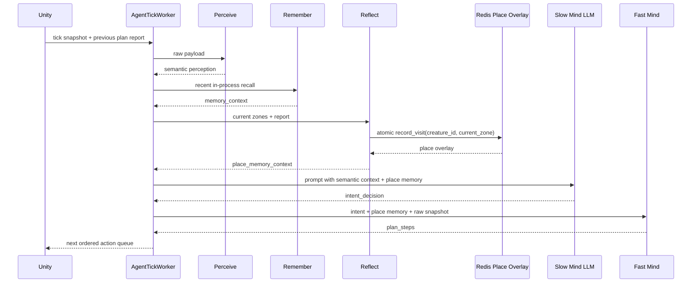
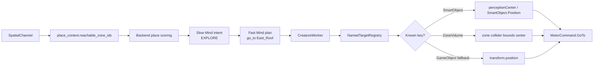
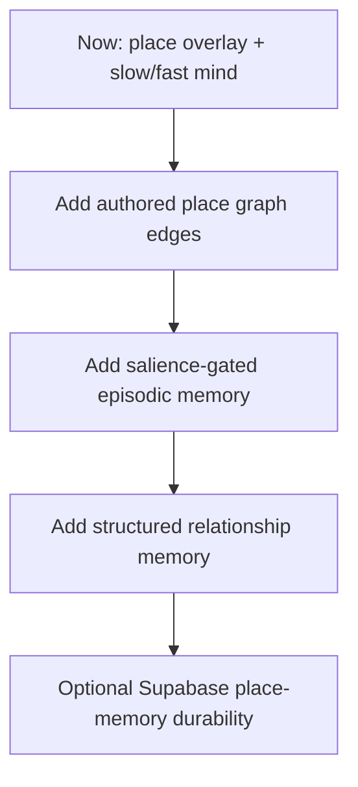

# ADR-006: Place Memory, Slow Mind, And Fast Mind Loop

- **Status:** Accepted
- **Date:** 2026-05-22
- **Scope:** `backend/app/agent/behavior_graph.py`, `backend/app/agent/fast_mind.py`, `backend/app/services/place_memory_service.py`, `backend/app/repositories/place_memory_cache.py`, `backend/app/agent/prompts/__init__.py`, `frontend/app/Assets/Scripts/AgentIntegration/Snapshot/Channels/SpatialChannel.cs`, `frontend/app/Assets/Scripts/Semantics/Markup/NamedTargetRegistry.cs`

## Context

The cat currently plans from a fresh Unity snapshot plus short in-process
memory. That lets it react to nearby objects, but it does not yet produce a
living exploration loop because the next prompt often looks like the previous
prompt.

The workflow discussion recommends this split:

```text
perceive -> remember -> slow_mind -> fast_mind -> reflect
```

At runtime, Unity's tick already arrives after the previous queue completed, so
backend reflection happens before the next plan is built:

```text
perceive -> remember -> reflect -> slow_mind -> fast_mind
```

`reflect` writes place coverage into Redis before the next LLM decision.
`slow_mind` chooses a durable intent. `fast_mind` translates that intent into
the ordered Unity action steps.

## Decision

Add a backend-owned place-memory overlay, feed a compact summary into the slow
mind prompt, and move concrete action sequence construction into code-owned
fast mind.

Unity remains authoritative for geometry:

- current active zones
- zone ids and zone hierarchy
- nearby NavMesh-reachable zone candidates
- zone target resolution
- NavMesh movement and arrival

Backend becomes authoritative for memory statistics:

- per-cat zone visit count
- last visited time
- familiarity category
- best exploration target among reachable zone ids when provided

Redis stores the live per-cat overlay. Supabase episodic and relationship
memory remains a later layer.

Slow Mind owns:

- high-level intent: `EXPLORE`, `SEEK_FOOD`, `SEEK_PLAYER`, `SOCIALIZE`,
  `INVESTIGATE`, `REST`, `SAFETY`, or `IDLE`
- optional target id when one is semantically meaningful
- short embodied reasoning

Fast Mind owns:

- converting intent to `plan_steps`
- deterministic exploration target use from place memory
- preserving legacy LLM `plan_steps` as a migration fallback

## Current Flow



## Backend Graph

```mermaid
flowchart TD
    A[Unity tick] --> B[perceive]
    B --> C[remember]
    C --> D[reflect]
    D --> E[slow_mind]
    E --> F[fast_mind]
    F --> I[plan_steps]

    D --> G[(Redis<br/>agent:place_overlay:{creature_id})]
    G --> D
    D --> H[place_memory_context]
    H --> E
    H --> F

    classDef code fill:#9FE1CB,stroke:#0F6E56,color:#04342C
    classDef llm fill:#CECBF6,stroke:#534AB7,color:#26215C
    classDef store fill:#FAC775,stroke:#854F0B,color:#412402

    class B,C,D,F code
    class E llm
    class G store
```

## Redis Shape

Key:

```text
agent:place_overlay:{creature_id}
```

Redis type: hash.

Fields:

- `__meta__`: last observed zone/request.
- `{zone_id}`: JSON `PlaceMemoryEntry`.

Example entry:

```json
{
  "zone_id": "Bamboo_Boardwalk",
  "visit_count": 4,
  "last_visited_at": 1780000000.0,
  "familiarity": 0.5,
  "last_arrival_request_id": "t00000007"
}
```

The write path uses one Redis Lua script, so the read-check-increment-write
sequence is atomic inside one creature's overlay. Different cats write different
keys, so normal multi-cat updates do not contend with each other.

## Slow Mind Prompt Contract

`PlaceMemoryService` returns prompt-safe lines rather than raw Redis data.

Example:

```text
- Current place: Bamboo Boardwalk feels well known.
- Recently visited: Harbor Dock.
- Not remembered nearby yet: East Roof, Fishmonger Stall.
- Best exploration target: East Roof; target id: East_Roof.
- When hunger and fear are not urgent, curiosity should prefer places that feel new or stale.
```

The LLM may use a place-memory target id only when the prompt explicitly says
`target id: ...`.

Slow Mind output is intent, not an action sequence:

```json
{
  "intent": "EXPLORE",
  "target_id": null,
  "mood": "curious but cautious",
  "reasoning": "A new reachable place is available and there is no urgent fear or hunger."
}
```

Fast Mind then turns that into concrete steps, for example:

```json
[
  {"action": "go_to", "target": "East_Roof", "reason": "explore a new or stale place"},
  {"action": "look_around", "target": null, "reason": "read the new place after arriving"}
]
```

## Unity Snapshot Contract

`SpatialChannel` continues to send the existing `spatial_context.zones` array
and now also sends a compact `place_context`:

```json
{
  "place_context": {
    "current_zone_id": "Bamboo_Boardwalk",
    "active_zone_ids": ["Harbor", "Bamboo_Boardwalk"],
    "reachable_zone_ids": ["East_Roof", "Fishmonger_Stall"]
  }
}
```

`reachable_zone_ids` is intentionally only ids. Unity owns the geometry and
checks candidate zones by radius plus optional complete NavMesh path. Backend
scores those ids against memory statistics.

## Unity Target Resolution

`NamedTargetRegistry` now auto-registers `ZoneVolume` ids alongside
`SmartObject` ids. `CreatureWorker` asks the registry for a target position for
`go_to` commands. For zone targets, the registry prefers the bounds center of
the zone's colliders and falls back to the transform position.



## Race And Ordering Notes

- The overlay is scoped by `creature_id`, so simultaneous cats do not share
  mutable counters.
- Each `record_visit` is atomic inside Redis.
- The current runtime still assumes Unity sends one in-flight tick per
  creature. If future deployments run multiple backend workers, keep
  per-creature tick ordering or add a per-creature sequence check before memory
  writes.
- Place memory is live memory, not durable life history. Supabase sync should
  be added later and should not run every tick.

## Consequences

Benefits:

- The cat's next prompt changes after movement completes.
- Exploration pressure is visible and tunable without asking the LLM to infer
  visit history.
- Exploration plans can now be generated by deterministic code from
  place-memory targets.
- The implementation keeps geometry in Unity and memory statistics in backend.
- Redis updates are safe for concurrent multi-cat operation.

Tradeoffs:

- The reachable list is an approximation bounded by snapshot settings. It is
  good enough for exploration pressure, but detailed path execution still
  belongs to the motor/navigation layer.
- Place-memory scoring is deliberately simple. A future authored place graph can
  improve candidate quality without changing the slow/fast mind contract.
- Same-creature out-of-order jobs remain a protocol issue, not a memory-cache
  issue.

## Follow-Up Work



Acceptance checks:

- Current leaf zone from `spatial_context.zones` is recorded.
- Prompt includes a `PLACE MEMORY` section.
- Repeated visits make the current place feel familiar/overvisited.
- If Unity sends reachable zone ids, the prompt exposes a best exploration
  target id.
- Slow Mind emits an intent instead of concrete action sequence.
- Fast Mind translates `EXPLORE` into `go_to -> look_around` when a best
  exploration target exists.
- `go_to` can resolve zone ids through `NamedTargetRegistry`.
