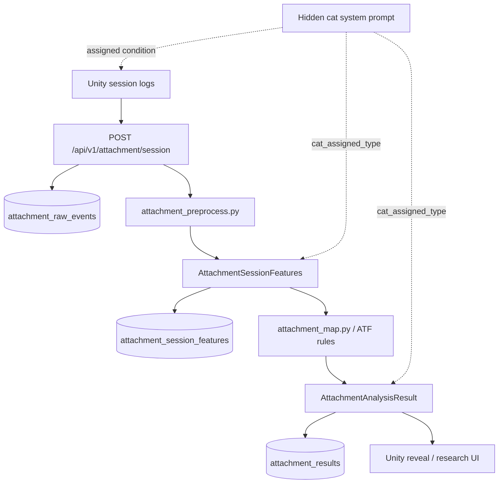
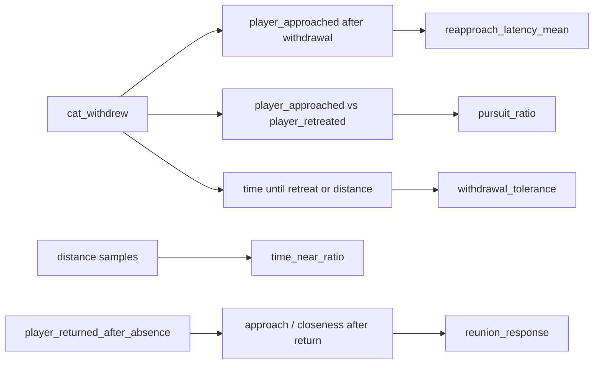
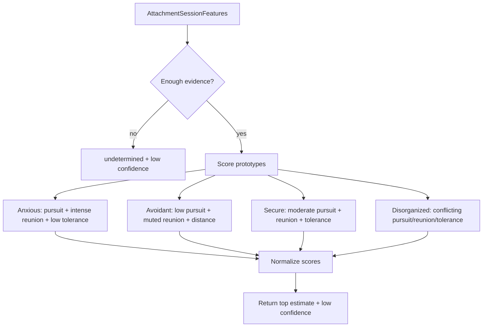
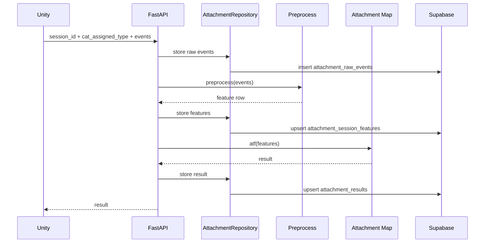
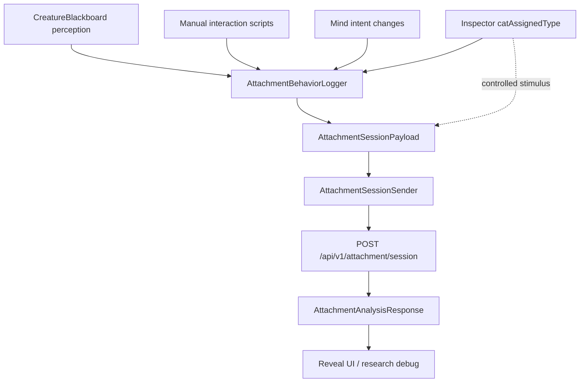
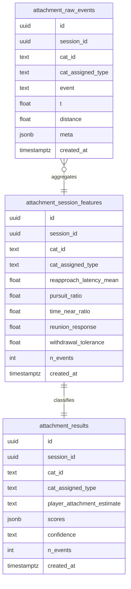

# ADR-007: Attachment Signature Pipeline

- **Status:** Accepted
- **Date:** 2026-05-22
- **Scope:** `backend/app/models/attachment.py`, `backend/app/services/attachment_preprocess.py`, `backend/app/services/attachment_map.py`, `backend/app/repositories/attachment_repo.py`, `backend/app/api/routes/attachment_router.py`, `frontend/app/Assets/Scripts/AgentIntegration/Attachment/*`, `frontend/app/Assets/Scripts/AgentIntegration/Bridge/ApiRoutes.cs`

## Context

Each cat agent can be assigned a hidden attachment profile through its system
prompt. That assigned cat profile is the controlled stimulus condition, not a
measurement of the cat.

The research hypothesis is about the player: the player's interaction pattern
with a controlled ambiguous other may reveal a relational schema. The design
draws from:

- Ainsworth's Strange Situation logic: standardized episodes create comparable
  separation, reunion, approach, and withdrawal moments.
- Projective logic: responses to a controlled ambiguous other can reflect the
  participant's own expectations about closeness, distance, and repair.

The pipeline must therefore preserve the independent variable
(`cat_assigned_type`) and infer only the dependent variable
(`player_attachment_estimate`). It must also stay honest: this prototype
produces a low-confidence rule-based estimate until validated against a
self-report instrument such as ECR-R.

## Decision

Implement the attachment pipeline as three explicit contracts and three
deterministic stages:

1. `RawAttachmentEvent`: Unity facts, no interpretation.
2. `AttachmentSessionFeatures`: theory-grounded behavioral constructs.
3. `AttachmentAnalysisResult`: transparent ATF rule output.

Persist all three layers to Supabase so the research trail is auditable and the
ATF rules can be rerun later without recollecting Unity logs.

## Dataflow



## Schema Contract

Raw event:

```json
{
  "session_id": "uuid",
  "cat_id": "milo",
  "event": "cat_withdrew",
  "t": 1234.5,
  "distance": 2.3,
  "meta": {}
}
```

Feature row:

```json
{
  "session_id": "uuid",
  "cat_id": "milo",
  "cat_assigned_type": "avoidant",
  "reapproach_latency_mean": 4.2,
  "pursuit_ratio": 0.7,
  "time_near_ratio": 0.45,
  "reunion_response": 0.8,
  "withdrawal_tolerance": 12.1,
  "n_events": 47
}
```

ATF output:

```json
{
  "session_id": "uuid",
  "cat_id": "milo",
  "cat_assigned_type": "avoidant",
  "player_attachment_estimate": "anxious",
  "scores": {
    "secure": 0.2,
    "anxious": 0.6,
    "avoidant": 0.15,
    "disorganized": 0.05
  },
  "confidence": "low"
}
```

## Feature Ownership

`attachment_preprocess.py` is pure code. It converts event timing and distance
facts into attachment-flavored response features.



Features should measure the player's response to cat-initiated or episode
events, not generic activity.

## ATF Rules

`attachment_map.py` is transparent rules, not LLM or ML.



The low confidence is intentional. The estimate is a prototype research signal,
not a diagnosis.

## Endpoint Behavior

`POST /api/v1/attachment/session` runs inline for now:



Inline processing is acceptable because the current prototype dataset is small
and externally triggered. Move this to a worker only if analysis becomes slow or
batch-based.

## Unity Client

Unity owns only fact logging and delivery. It should not infer attachment
meaning locally.



Unity files:

- `AttachmentPayloads.cs`: serializable request/response DTOs and string
  constants shared by logger and sender.
- `AttachmentBehaviorLogger.cs`: session id ownership, automatic distance and
  cat-intent event logging, plus manual hooks for explicit player interactions.
- `AttachmentSessionSender.cs`: thin HTTP transport using `BackendConfig`,
  `ApiRoutes`, API-key headers, timeout behavior, and the backend response DTO.

The logger records backend event names only. Higher-level constructs such as
`pursuit_ratio` and `reunion_response` remain backend-owned so the experiment
keeps one auditable interpretation layer.

## Supabase Tables



## Consequences

Benefits:

- The independent variable is explicit and carried end to end.
- Raw logs, features, and output are all auditable.
- ATF rules are inspectable by a professor and can be mapped to constructs.
- The system can refuse to over-claim when evidence is thin.

Tradeoffs:

- Rule thresholds are provisional and must be validated.
- Sparse Unity events approximate time-based features from event samples.
- The endpoint is synchronous for the prototype and may need a worker later.

## Acceptance Checks

- A session payload stores raw events before analysis.
- Preprocessing returns the same features for the same event list.
- Low event count returns `undetermined` and `confidence: low`.
- `cat_assigned_type` appears in raw rows, features, and results.
- The endpoint returns an auditable result with scores and feature summary.
