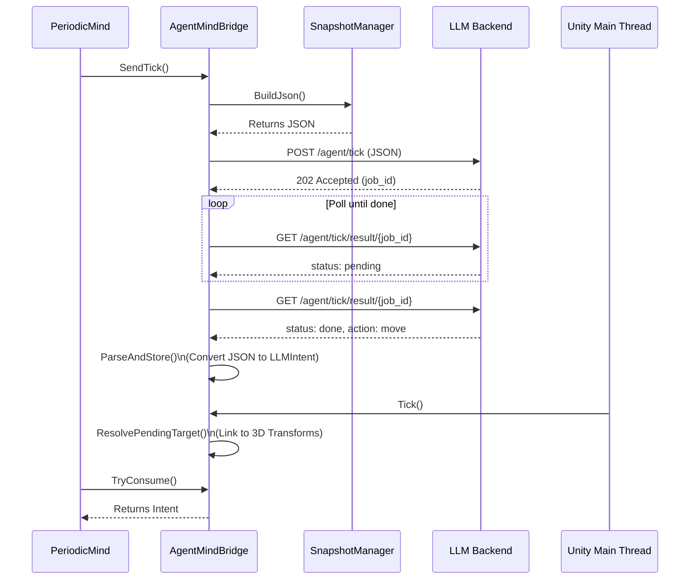
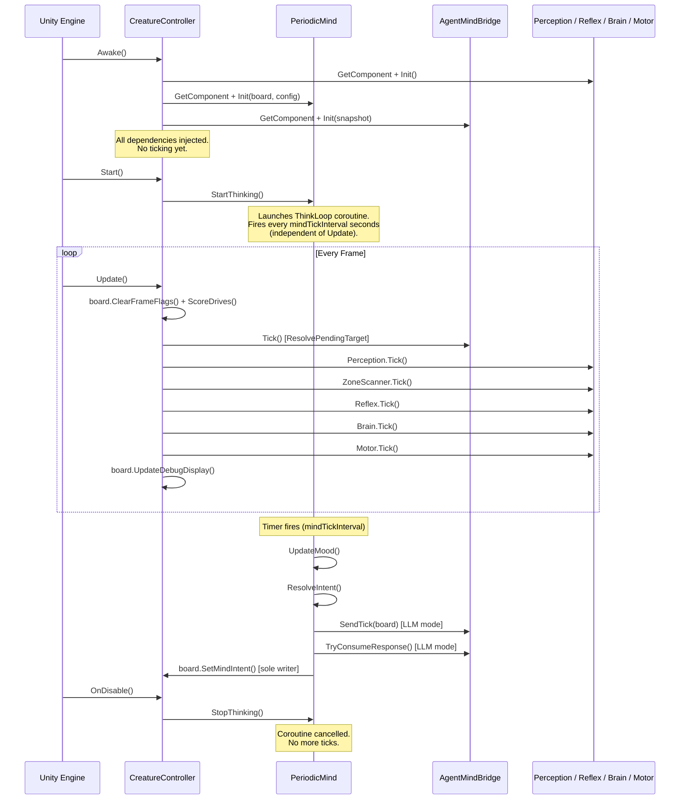

# ADR-007: Unity Periodic Tick 

**Status:** Accepted  
**Date:** 2026-05-04  
**Deciders:** vanillasky  
**Relates to:** ADR-005 (Unity client architecture), ADR-003 (FastAPI backend)

## Component Lifecycle & Tick Sequence

