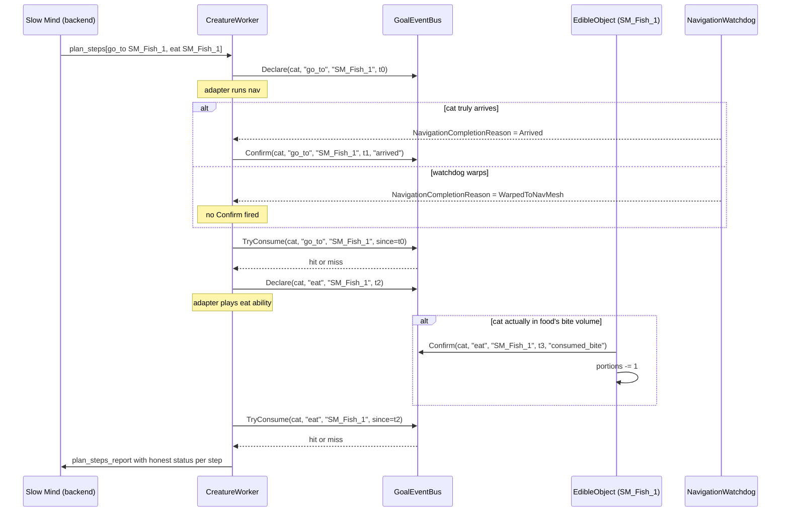
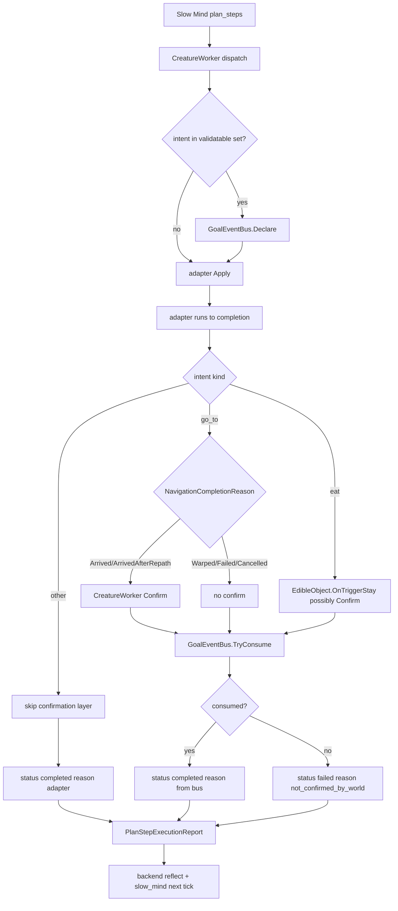

# ADR-008: Goal Event Bus For Honest Plan-Step Feedback

- **Status:** Accepted
- **Date:** 2026-05-22
- **Scope:** `mewi-unity/app/Assets/Scripts/Creature/Motor/CreatureWorker.cs`, `mewi-unity/app/Assets/Scripts/Creature/Core/CreatureBlackBoard.cs`, `mewi-unity/app/Assets/Scripts/Creature/Core/GoalEventBus.cs` (new), `mewi-unity/app/Assets/Scripts/Semantics/Markup/EdibleObject.cs` (new)

## Context

The backend slow-mind builds its next plan from the previous plan's feedback
([_format_previous_action_result](mewi-backend/app/agent/behavior_graph.py#L282-L301)).
That feedback claims things like:

```
The previous plan completed.
go_to on SM_Fish_1 worked.
eat on SM_Fish_1 worked.
```

In practice the cat is observed never reaching SM_Fish_1, yet the report says
both steps "worked". Reading the code, two failure modes are masked as success:

1. **`go_to` warp-as-arrival.** [CreatureWorker.CompleteActiveIntentIfReady](mewi-unity/app/Assets/Scripts/Creature/Motor/CreatureWorker.cs#L282-L294)
   records every step as `"completed"` once the adapter stops being busy, no
   matter why. If [NavigationWatchdog](mewi-unity/app/Assets/Scripts/Creature/Motor/NavigationWatchdog.cs#L106-L118)
   hits `hardTimeoutSeconds` or burns all repath attempts, it teleports the cat.
   The completion reason becomes `WarpedToNavMesh`/`WarpedRaw`, but the
   step status stays `"completed"`. The slow-mind has no idea the cat didn't
   walk there.
2. **`eat` with no proximity check.** [MalbersAnimalAdapter.cs:91](mewi-unity/app/Assets/Scripts/Creature/Motor/MalbersAnimalAdapter.cs#L91)
   just plays the eat ability by index — no distance check, no consumption,
   no real-world side effect. The animation completes, status becomes
   `"completed"`, even if the cat ate air in the middle of the room.

The root cause is the same: **Unity's worker asserts truth that only the
world can know.** The cat thinks it ate because Malbers played an animation;
the cat thinks it arrived because the adapter stopped being busy.

## Decision

Flip the trust model. The cat **declares** an intent at start. The cat does
not assert completion. Real-world entities (food objects, arrival checkers)
**confirm** the intent when the action actually happened. At the completion
check, the worker reads the confirmation. No confirm → step is honest failure.

This is the event-pattern the user proposed in conversation, and it is
deliberately simple: a single static bus, no auto-expiration, no async dance.

## Components



### A. `GoalEventBus` (new, static, ~40 lines)

```csharp
public static class GoalEventBus {
    public static void Declare(string creatureId, string action, string targetId, float startedAt);
    public static void Confirm(string creatureId, string action, string targetId, float at, string reason);
    public static bool TryConsume(string creatureId, string action, string targetId, float since, out string reason);
}
```

- Internal store: `Dictionary<Key, Confirmation>` where `Key = (creatureId, action, targetId)` (case-insensitive).
- `TryConsume` removes the confirmation on hit, leaving the slate clean for the
  next intent of the same shape.
- No timer-based cleanup. `since` (the intent's start time) handles staleness:
  a confirmation older than `since` is treated as a miss and discarded.
- No threading primitives. All callers run on Unity's main thread.

### B. `EdibleObject` (new, on food prefab next to `SmartObject`, ~60 lines)

```csharp
[SerializeField] int portions = 1;                  // logical count
[SerializeField] float biteIntervalSeconds = 1.5f;  // per-cat cooldown
[SerializeField] bool disableColliderWhenDepleted = true;
```

- Has its own trigger collider sized like a mouth-contact area (~0.5 m).
- `OnTriggerStay(Collider other)`:
  1. Resolve cat's `CreatureBlackboard`. Skip if not a cat or `portions <= 0`.
  2. Check per-cat bite cooldown (`Dictionary<string, float> _lastBiteAt`).
  3. Decrement `portions`, call `blackboard.RecordBite(SmartObjectId, t)`,
     fire `GoalEventBus.Confirm(creatureId, "eat", SmartObjectId, t, "consumed_bite")`.
  4. When `portions <= 0` and `disableColliderWhenDepleted`, disable the
     trigger. Object stays visible per user spec — only the eating affordance
     is removed.

### C. `CreatureBlackboard` additions (~10 lines)

```csharp
public int   totalBitesEaten;
public float lastAteAt = -1f;
public void  RecordBite(string foodId, float t) { /* ... */ }
```

Kept minimal. Per-food maps and persona memory are out of scope; the
SmartObject id is in the confirm event for any future analytics.

### D. `CreatureWorker` changes (~15 lines, in two existing methods)

- **At dispatch** (after the existing `_adapter.Apply(cmd)` succeeds): for
  validatable intents (`eat`, `go_to`) call `GoalEventBus.Declare(...)`.
- **At completion** (`CompleteActiveIntentIfReady`):
  - For `go_to`: if `NavigationCompletionReason` is `Arrived` or
    `ArrivedAfterRepath`, the worker fires `Confirm` itself (arrival is a
    geometric fact the cat owns). For warp/failed/cancelled, no Confirm.
  - For `eat`: confirms come only from `EdibleObject`. The worker does not
    self-confirm.
  - Replace the hardcoded `"completed"` with: if
    `GoalEventBus.TryConsume(...)` returns true → status `"completed"` and the
    reason from the bus; otherwise status `"failed"` reason
    `"not_confirmed_by_world"`.
- Non-validatable intents (`idle`, `wander`, `sit`, `sleep`, `groom`, …)
  continue to report `"completed"` from the adapter directly — their
  completion is the animation playing, and there is no external fact to wait
  on.

## Dataflow



## Validatable Intents

Initial set:

- `go_to` — confirmed by the worker itself from `NavigationCompletionReason`.
- `eat`   — confirmed by `EdibleObject` on actual mouth contact.

Future additions are one new confirmer each, no bus changes:

- `drink` → `DrinkableObject` on water sources.
- `groom` → cat self-confirms after the ability completes (idle-class).
- `follow` → confirm on sustained proximity to target for N seconds.

## Why Not Each Of The Alternatives

- **Fix only `eat` with proximity check on the cat side.** Less invasive,
  but `go_to` keeps lying and the slow-mind keeps compounding on fictional
  arrivals. Same pattern, same fix; better to introduce once.
- **Add a timeout to GoalEventBus.** The `since` parameter already handles
  staleness. A timer adds Update-tick noise for zero gain.
- **Promote GoalEventBus to a `ScriptableObject` event channel.** Static is
  simpler for a single-process Unity client. If multi-scene reset becomes a
  concern, swap the implementation without touching callers.
- **Have the world write status into the report directly.** Would require
  `EdibleObject` to know about `PlanStepExecutionReport` and per-cat report
  buffers. The bus is the indirection that keeps food code dumb.

## Backend Side (unchanged this ADR, but worth noting)

[_format_previous_action_result](mewi-backend/app/agent/behavior_graph.py#L282-L301)
already formats `rejected`, `failed`, and `completed_with_rejections` cleanly.
This change makes those branches actually fire. No backend code change needed.

## Acceptance Checks

- Walking the cat to SM_Fish_1 and confirming visual arrival: the next
  prompt feedback says `go_to on SM_Fish_1 worked` and reason is `arrived`.
- Forcing a warp (e.g., place SM_Fish_1 inside an obstacle so the watchdog
  must warp): the next prompt feedback says `go_to on SM_Fish_1 was rejected`
  or `did not work`, NOT `worked`.
- Cat plays the eat animation 5 m from SM_Fish_1: feedback says
  `eat on SM_Fish_1 was rejected` reason `not_confirmed_by_world`.
- Cat reaches SM_Fish_1 and the eat animation triggers the food trigger:
  feedback says `eat on SM_Fish_1 worked`, `EdibleObject.portions` decrements
  by 1, `CreatureBlackboard.totalBitesEaten` increments by 1.
- After `portions` reaches 0: further eat attempts on the same food produce
  `not_confirmed_by_world` (the trigger is disabled).

## Consequences

Benefits:

- Slow-mind sees the world as it is, not as the worker hoped.
- Adding a new validated action is one new confirmer + one new entry in the
  worker's validatable-intent set.
- Food becomes a real resource with a finite count, matching the user's
  inventory framing.
- The hardcoded-`"completed"` bug is replaced with an explicit, testable
  contract.

Tradeoffs:

- Two new file dependencies in `Creature/Motor` and `Semantics/Markup`. Both
  are small (<70 lines).
- Per-food `_lastBiteAt` dictionary on `EdibleObject` grows by one entry per
  unique cat — fine for the prototype, would need eviction at multi-hour
  scale.
- The bus is process-global static. If the project ever runs multiple
  isolated Unity worlds in one process (it does not today), the bus would
  need scoping. Easy refactor when needed.

## Follow-Up

- Wire `drink` to a `DrinkableObject` confirmer.
- Surface bite history into the backend prompt as part of the cat's recent
  inventory ("ate 1 SM_Fish_1, 1 Apples in the last minute") once the
  PlaceMemory + episodic memory plan matures.
- Add a tiny Editor diagnostic window listing active goal Declares and the
  most recent Confirms, for quick "why didn't this complete?" debugging.
