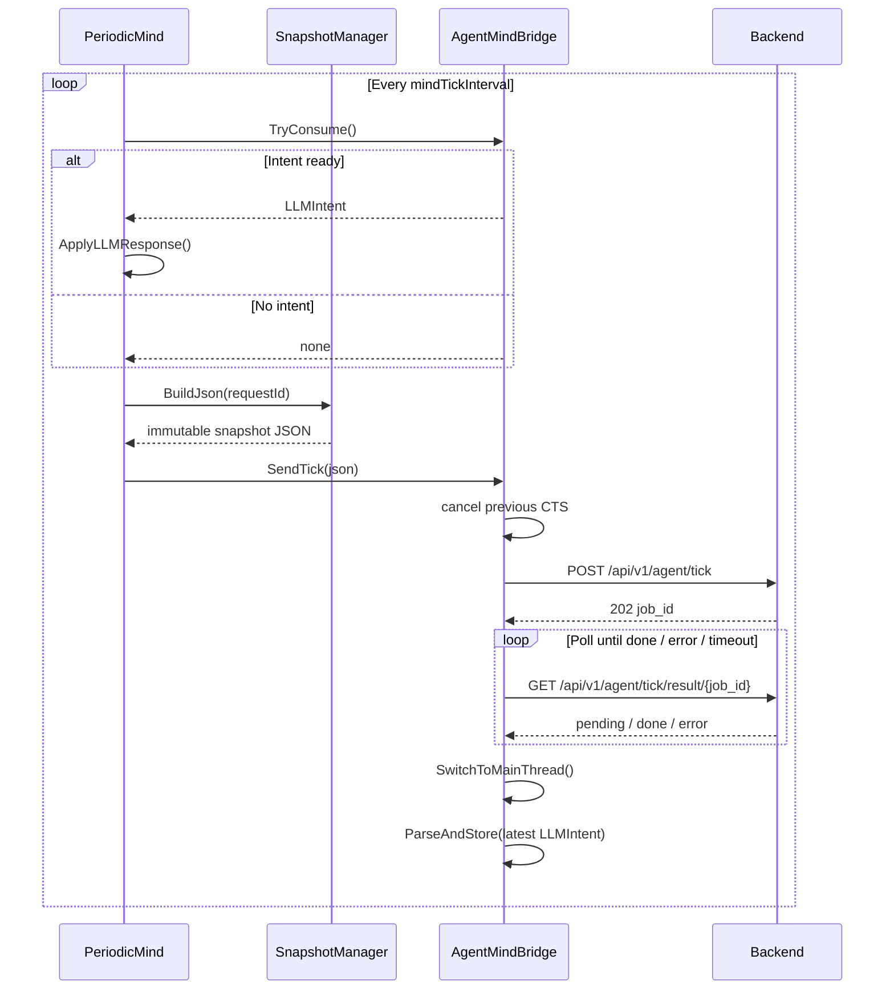
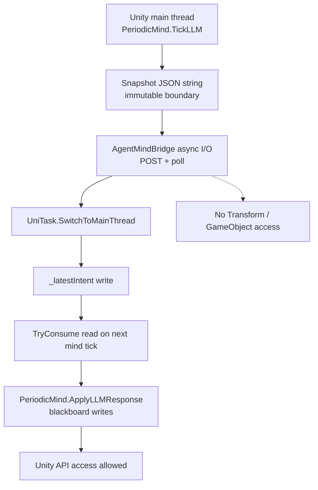
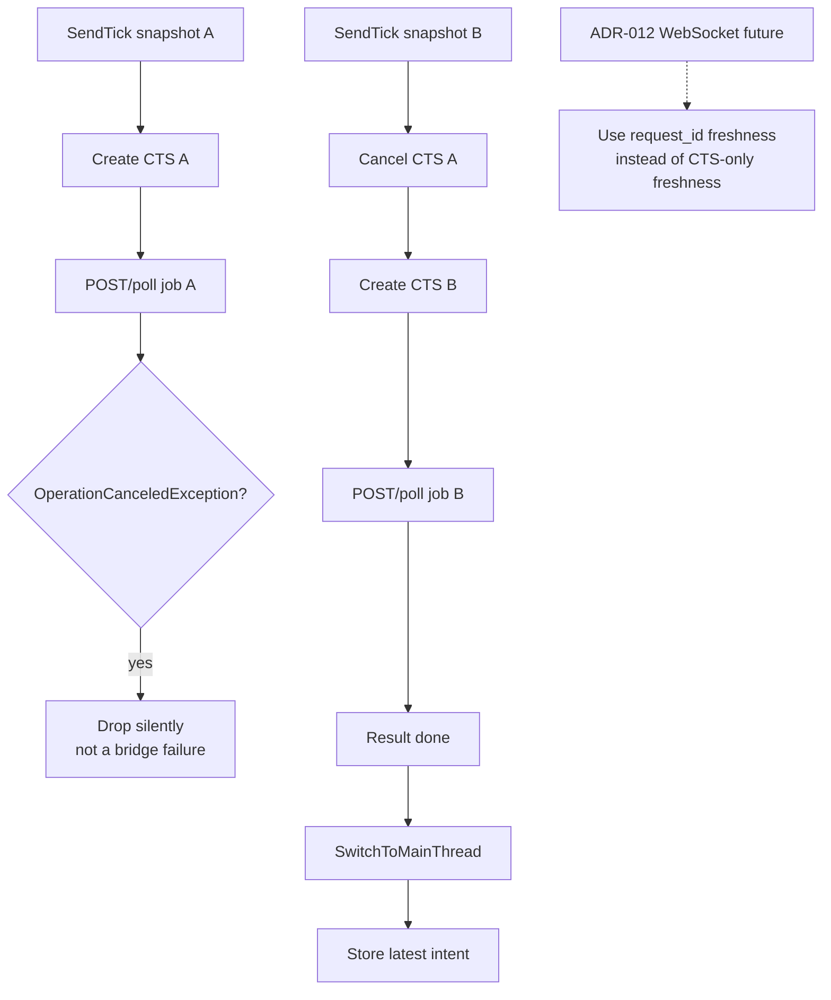
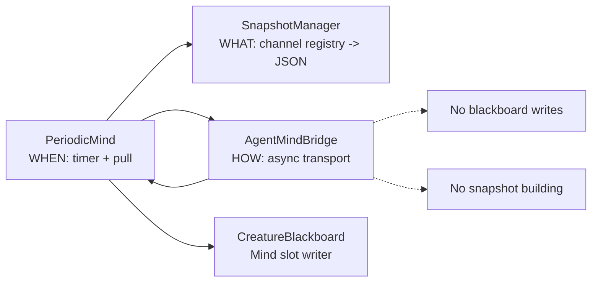

# ADR-008: Unity-to-LLM Bridge Synchronization (Async/Await + Pull Model)

**Status:** Accepted (implemented; HTTP polling synchronization current)
**Date:** 2026-05-05
**Deciders:** vanillasky
**Relates to:** ADR-007 (Unity Periodic Tick), ADR-005 (Unity client architecture), ADR-009 (LLM Intent / Multi-Agent), ADR-012 (future WebSocket transport)

> **Current-code note (2026-05-06):** The UniTask HTTP POST/poll bridge and main-thread pull model described here are implemented in `AgentMindBridge` and `PeriodicMind`. ADR-012 plans to supersede the transport freshness rule for WebSocket delivery, but this ADR remains current for the existing HTTP polling path.

## Context

`PeriodicMind` runs on the Unity main thread and needs behavioral intents from an asynchronous LLM backend (POST a tick → backend enqueues a job → poll until result). Variable response time (sub-second to multiple seconds) means we cannot block the game loop.

Requirements:
1. Never block the main thread on network I/O.
2. Never touch Unity APIs (Transforms, GameObjects) from a worker thread.
3. Mutate shared state only at deterministic points in `CreatureController`'s update loop.
4. No allocations on the hot path.

## Decision

We adopt **UniTask (async/await) inside the bridge + main-thread pull model on the game-loop side**, with an **orchestrator-knows-all** split:

| Component | Owns |
|---|---|
| `PeriodicMind` | WHEN — drives the timer, calls SnapshotManager, then hands the result to the bridge |
| `SnapshotManager` | WHAT — iterates `ISnapshotChannel`s and produces JSON |
| `AgentMindBridge` | HOW — POST + poll + parse, async; stores latest `LLMIntent` for the next pull |

The wire format (JSON string) **is** the immutable snapshot. We do not introduce a separate `BoardSnapshot` DTO — once `JsonUtility.ToJson` returns, the string is frozen and self-contained, so no live blackboard reference can leak across the async boundary.

### Bridge surface

```csharp
public class AgentMindBridge : MonoBehaviour
{
    LLMIntent _latestIntent;      // single writer (post-SwitchToMainThread), single reader
    CancellationTokenSource _cts;

    public void SendTick(string json)
    {
        _cts?.Cancel();           // latest-wins backpressure
        _cts = new CancellationTokenSource();
        RunTickAsync(json, _cts.Token).Forget();
    }

    public bool TryConsume(out LLMIntent intent)
    {
        intent = _latestIntent;
        _latestIntent = null;
        return intent != null;
    }

    async UniTaskVoid RunTickAsync(string json, CancellationToken ct)
    {
        try
        {
            var jobId = await PostTickAsync(json, ct);
            if (jobId == null) return;
            var resp = await PollResultAsync(jobId, ct);
            if (resp == null) return;
            await UniTask.SwitchToMainThread(ct);   // gate before mutating state
            ParseAndStore(resp);
        }
        catch (OperationCanceledException) { /* superseded */ }
        catch (Exception e) { Debug.LogWarning($"[AgentMindBridge] tick failed: {e.Message}"); }
    }

    void OnDisable() { _cts?.Cancel(); _cts?.Dispose(); _cts = null; }
}
```

### Orchestrator surface

```csharp
void TickLLM()
{
    if (_bridge.TryConsume(out var intent))
        ApplyLLMResponse(intent);

    string json = _snapshotManager.BuildJson(NewRequestId());
    _bridge.SendTick(json);
}
```

### Why no lock and no event

- **No lock.** `_latestIntent` is written exclusively after `await UniTask.SwitchToMainThread(ct)` and read exclusively from `TryConsume` / `Tick`, both on the main thread. With single-writer single-reader on one thread, locks are theatrical.
- **No event.** Pushing via `Action<LLMIntent>` would create a bidirectional dependency and require `OnEnable` / `OnDisable` lifecycle plumbing. The boolean check inside `PeriodicMind`'s already-running tick costs nanoseconds. Pull wins on simplicity and lifetime safety.
- **No `requestId` matching in the bridge.** The bridge stores latest-wins; a stale response is impossible because `_cts.Cancel()` aborts the previous poll loop the moment a new tick fires. The `requestId` flows through the JSON for backend log correlation only — the bridge never reads it back.

**Superseded for future WebSocket transport by ADR-012.** The current HTTP polling bridge still uses cancellation as the freshness guard. ADR-012 changes the future transport rule to explicit `request_id` freshness checks because long-lived multiplexed connections cannot rely on per-request cancellation alone.

## Mermaid Workflows

### HTTP Polling Synchronization



### Thread Ownership Boundary



### Latest-Wins Cancellation



### Responsibility Split



## Consequences

**Positive**
- Zero threading hazards: every shared write is gated by `SwitchToMainThread`.
- Zero event lifecycle bugs: no subscriptions to leak.
- Deterministic state mutation: only when `PeriodicMind` polls.
- Built-in backpressure via `CancellationTokenSource`.
- Bridge is unit-testable — its only input is a JSON string and its only output is an `LLMIntent`. No `CreatureBlackboard`, no `SnapshotManager`, no scene required.

**Negative**
- Requires the UniTask dependency (already in the project).
- Developers must understand `CancellationToken` and `UniTaskVoid.Forget()` semantics.

## Alternatives Considered

### A. C# events (`Action<LLMIntent> OnIntentReady`)
**Rejected.** Bidirectional dependency, lifecycle ceremony (`+= / -=` in `OnEnable` / `OnDisable`), and risk of firing mid-frame while `CreatureMotor` reads from the blackboard. Pull-model gives us deterministic timing for free.

### B. Unity Coroutines for web I/O
**Rejected.** `WaitForSeconds` allocates each cycle; coroutines lack first-class exceptions and cancellation. UniTask provides allocation-free awaits and `CancellationToken` end-to-end.

### C. Separate `BoardSnapshot` DTO between SnapshotManager and bridge
**Rejected.** Over-engineering. `JsonUtility.ToJson` already produces an immutable, self-contained payload. Adding a parallel typed DTO would duplicate the schema for no testing or safety win.

### D. Bridge owns SnapshotManager (Option B from design discussion)
**Rejected.** Conflates "what" and "how". Forces every bridge implementation (HTTP, mock, local-model) to know about the channel registry. Option A (orchestrator builds, bridge ships) keeps both sides independently swappable.

### E. Custom global tick scheduler
**Deferred.** AAA-scale optimization. Out of scope until profiling shows `Update()` orchestration is a bottleneck.
