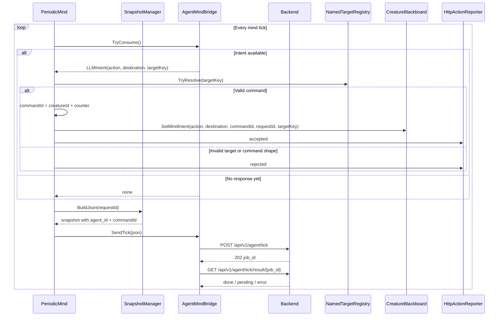
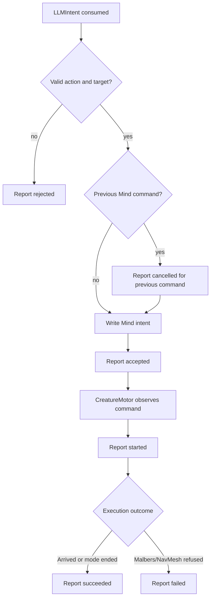
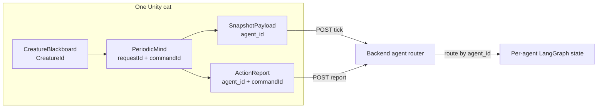
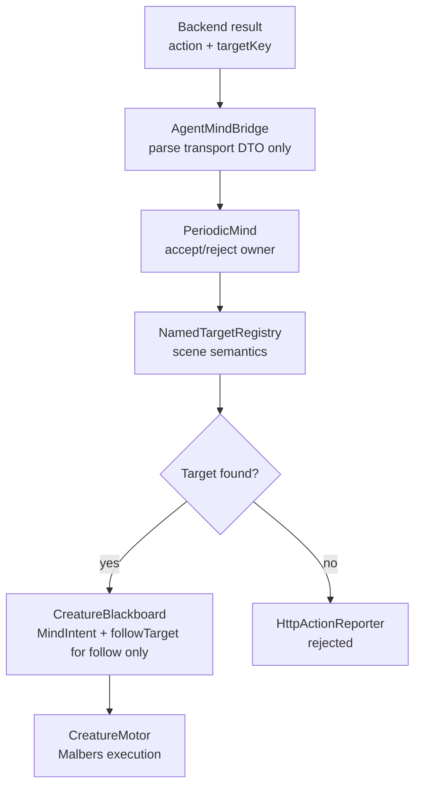

# ADR-009: LLM Intent Resolution, Lifecycle Reporting, and Multi-Agent Identity

**Status:** Accepted (implemented; Phase 4 transport superseded by ADR-012)
**Date:** 2026-05-05
**Deciders:** vanillasky
**Relates to:** ADR-005 (Unity client architecture), ADR-007 (Periodic Tick), ADR-008 (Bridge sync), ADR-010 (hardening), ADR-012 (transport)

> **Current-code note (2026-05-06):** The identity, target-resolution, command lifecycle, and LLM-only command path described here are implemented in the Unity client. Only Phase 4's generic "future transport upgrade" note has been superseded: ADR-012 now owns the WebSocket transport decision. This ADR is therefore **not** globally superseded.

## Context

The current LLM path is:

1. `PeriodicMind` builds a snapshot through `SnapshotManager`.
2. `AgentMindBridge` sends it to the backend and polls for the result.
3. `PeriodicMind` consumes an `LLMIntent`.
4. `CreatureMotor` eventually reads a Mind intent from the blackboard and calls Malbers.

That is enough for a single cat demo, but the next LLM-only milestone needs three things:

- **Stable identity.** A shared backend cannot safely route ticks from multiple cats unless every snapshot and report carries an `agent_id`.
- **Semantic target resolution outside transport.** `AgentMindBridge` currently keeps named target references and falls back to `GameObject.Find`. Transport should parse wire data only; scene lookup belongs to Semantics.
- **Explicit command outcomes.** The backend should know whether a command was accepted, completed, failed, or cancelled without inferring it from the next periodic snapshot.

This ADR intentionally does **not** solve Reflex/Tactical inhibition of Mind commands yet. Reflex and layered priority remain future work. For this phase, LLM commands are handled as the only external command source.

The Malbers API shape matters:

- Navigation commands use `MAnimalAIControl.SetDestination(...)`, `SetTarget(...)`, and `Stop()`.
- One-shot action commands use `MAnimal.Mode_TryActivate(actionMode.ID, abilityIndex)` so Malbers can reject actions that are incompatible with the current state.
- Terminal or exceptional commands may use `State_Force`, but only for explicit cases such as death.

## Decision

Keep the design small and LLM-focused:

| Surface | Where | Purpose |
|---|---|---|
| `creatureId` | `CreatureBlackboard` | Stable per-cat ID, defaulting to `gameObject.name`. |
| `agent_id` | `SnapshotPayload` | Routes every tick to the correct backend agent. |
| `NamedTargetRegistry` | `Semantics/Markup/` | Scene-authored `string -> Transform` lookup for LLM targets. |
| `CommandId` | `IntentMessage` | Correlates the accepted Mind command with reports and snapshots. |
| `ActionReport` | `AgentIntegration/Bridge/Reports/` | Serializable command lifecycle event. |
| `HttpActionReporter` | `AgentIntegration/Bridge/Reports/` | Posts reports to `/api/v1/agent/report`. |

`AgentMindBridge` remains pure transport. It parses backend responses into a small DTO:

```csharp
public class LLMIntent
{
    public string intent;
    public Vector3 destination;
    public string targetKey;
}
```

`PeriodicMind` owns command acceptance:

1. Consume the latest `LLMIntent`.
2. Generate `commandId = $"{creatureId}:{counter:X8}"`.
3. Resolve `targetKey` through `NamedTargetRegistry`.
4. Write the Mind intent with `commandId`.
5. Emit an `accepted` or `rejected` report.

`CreatureMotor` owns command execution and Malbers details:

- If it can start a command, it executes it and returns success to the caller path through normal state changes.
- If `Mode_TryActivate` returns `false`, it clears the Mind slot and reports `failed`.
- When navigation arrives or an action mode ends, it clears the Mind slot and reports `succeeded`.

For this phase, reporting may be emitted by the motor because the motor is the only component that knows whether Malbers accepted a `Mode_TryActivate` and when `OnArrived` / `OnModeEnd` fires. This is a deliberate LLM-only simplification. A later Reflex/Tactical inhibition design can move lifecycle aggregation into a separate tracker once there are multiple command sources.

## Lifecycle Semantics

Reports use lower-case strings on the wire:

| Status | Meaning |
|---|---|
| `accepted` | Unity accepted the backend command and wrote it to the Mind slot. |
| `rejected` | Unity could not resolve or validate the command before execution. |
| `started` | The motor observed the command and attempted execution. |
| `succeeded` | The command completed: navigation arrived, follow stopped, or action mode ended. |
| `failed` | Malbers or navigation refused the command. |
| `cancelled` | A newer LLM command replaced a previous in-flight LLM command. |

`started` is not the same as `accepted`. A command is accepted when it enters the Mind slot; it starts when `CreatureMotor` sees that command and calls Malbers/NavMesh.

## Command Vocabulary

Initial LLM vocabulary:

| Intent | Args | Execution |
|---|---|---|
| `go_to` | `destination` or `targetKey` | `MAnimalAIControl.SetDestination` |
| `follow` | `targetKey` | `MAnimalAIControl.SetTarget(target, true)` |
| `wander` | none | local NavMesh sample |
| `stop_moving` / `stop` | none | `MAnimalAIControl.Stop()` |
| `sit`, `eat`, `drink`, `sleep`, `groom`, `smell`, `alert`, `vocalize`, `scratch`, `look_around`, `nod_head` | none | `MAnimal.Mode_TryActivate(actionMode.ID, abilityIndex)` |
| `die` | none | `State_Force(deathState)` |

The action ability indices remain inspector-configured on `CreatureMotor`. This keeps the code flexible across different Malbers Action mode layouts without introducing a command class hierarchy.

## Multi-Agent Contract

Snapshot payload:

```json
{
  "agent_id": "cat_milo",
  "requestId": "t00000003",
  "commandId": "cat_milo:00000008",
  "time": 12.3,
  "self": { "current_action": "wander" }
}
```

Report payload:

```json
{
  "agent_id": "cat_milo",
  "commandId": "cat_milo:00000008",
  "requestId": "t00000003",
  "action": "go_to",
  "status": "succeeded",
  "reason": "",
  "time": 14.2
}
```

Every cat owns its own `PeriodicMind`, `SnapshotManager`, `AgentMindBridge`, and `CreatureMotor`. The reporter is a small component reference, not a ScriptableObject that owns scene state.

## Phasing

**Phase 1 - Identity and target resolution**

- Add `creatureId` to `CreatureBlackboard`.
- Add `agent_id` and `commandId` to `SnapshotPayload`.
- Add `NamedTargetRegistry`.
- Remove named target lookup and `GameObject.Find` from `AgentMindBridge`.

**Phase 2 - LLM command reports**

- Add `CommandId` to `IntentMessage`.
- Add `ActionReport` and `HttpActionReporter`.
- `PeriodicMind` reports `accepted`, `rejected`, and `cancelled`.
- `CreatureMotor` reports `started`, `succeeded`, and `failed`.

**Phase 3 - Future Reflex/Tactical inhibition**

- Define how Reflex/Tactical priority inhibits Mind commands.
- Decide whether inhibited Mind commands stay pending, are cancelled, or are reported as preempted.
- Revisit whether lifecycle aggregation should move out of `CreatureMotor`.

**Phase 4 - Future transport upgrade**

- Add WebSocket reporting if HTTP report volume becomes measurable at multi-cat scale.

**Superseded by ADR-012.** ADR-012 replaces this open-ended Phase 4 note with a concrete multiplexed WebSocket transport design. The command identity and lifecycle report semantics in this ADR remain current.

## Mermaid Workflows

### LLM Tick and Command Acceptance



### Command Lifecycle Reporting



### Per-Cat Identity Contract



### Target Resolution Boundary



## Alternatives Considered

### A. Add `CatBody` / `CatCommandDispatcher` now

**Deferred.** The LLM path can stay maintainable by tightening `CreatureMotor` around Malbers' actual API. A separate dispatcher may become useful later, but adding it before Reflex/Tactical inhibition would create another layer before the command contract is stable.

### B. Use ScriptableObject policies for interruption now

**Deferred.** Policy assets are useful for playtesting layered inhibition, but today they would add configuration surface without solving an immediate LLM-only problem.

### C. Infer lifecycle from snapshots only

**Rejected.** Snapshots are periodic world state. Reports are command events. Keeping them separate avoids waiting for the next tick to tell the backend that an action failed or completed.

### D. Keep target lookup in `AgentMindBridge`

**Rejected.** Bridge code should stay scene-agnostic and testable. Named targets are authored semantic scene data.

## Consequences

**Positive**

- Backend can route many cats by `agent_id`.
- Transport stays pure: no `Transform`, no `GameObject.Find`, no blackboard writes.
- Malbers action calls use `Mode_TryActivate`, giving the LLM real failure feedback.
- The implementation stays small: no command hierarchy, no policy framework, no WebSocket until profiling asks for it.

**Negative**

- `CreatureMotor` temporarily emits lifecycle reports. That is acceptable for the LLM-only phase, but should be revisited when layered inhibition is implemented.
- HTTP reports add a backend route: `POST /api/v1/agent/report`.
- Command completion is still best-effort for long-lived commands such as `follow`; it reports success only when cancelled/stopped or when its target disappears.
