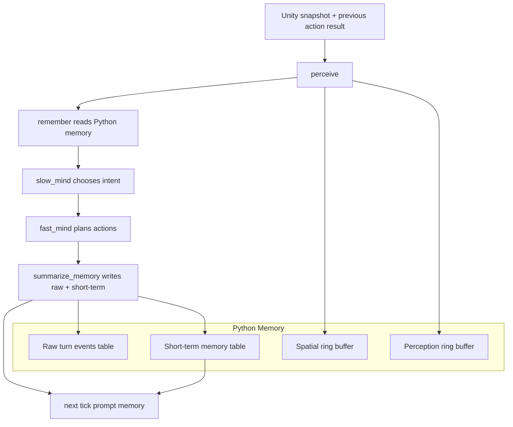

# ADR-009: Python-Owned Cat Memory

- **Status:** Accepted
- **Date:** 2026-05-22
- **Scope:** `mewi-backend/app/agent/memory/**` (`manager.py`, `summarizer.py`,
  `models.py`), `mewi-backend/app/repositories/memory_repo.py`,
  Supabase tables `agent_memory_raw_events`, `agent_short_term_memories`
- **Builds on:** [ADR-008](ADR-008-goal-event-bus-plan-step-feedback.md)
  (Unity stops asserting cognitive truth)

## Context

Unity now treats creature goals as eventually successful at the execution layer.
That means Unity should not also own cat cognition or memory. Unity reports the
world snapshot, previous action result, and player interaction logs; Python owns
the cat's interpretation, planning, and memory.

C# still owns player behavior interaction logs for attachment analysis, because
those are observed player events. Cat memory remains backend-owned.

## Decision

Cat memory lives under `mewi-backend/app/agent/memory/`.

The `summarize_memory` graph node writes:

- A raw authoritative turn event containing Unity's previous action result,
  the current snapshot, Slow Mind intent, Fast Mind plan, and chosen action.
- Short-term aspect summaries for action, place, body, sensory, and social cues.
  Action/place summaries are episodic; body/sensory/social summaries are
  working memory.

The next Slow/Fast Mind prompts receive compact `short_term_lines`, not raw
Unity JSON.

## Consequences

- Python is the single source of truth for cat memory.
- Unity does not need a cat memory contract.
- The memory write step is inspectable and testable outside LLM planning.
- Durable storage persists raw events to `agent_memory_raw_events` and
  summaries to `agent_short_term_memories` without changing Unity's snapshot
  schema.
