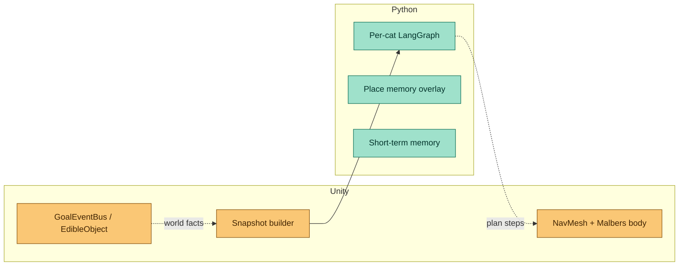
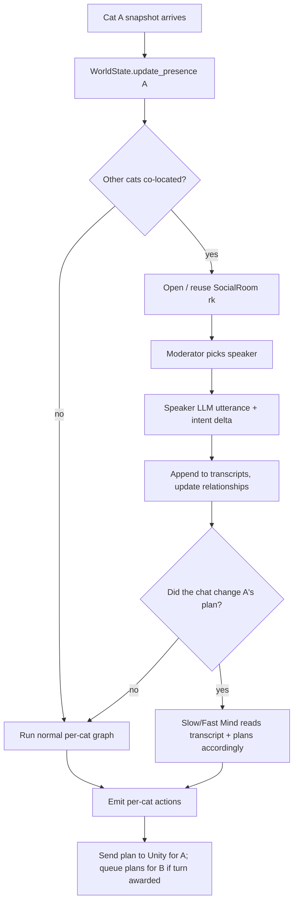
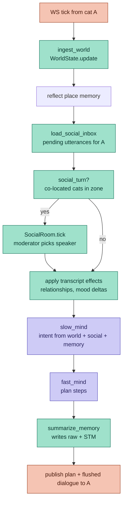

# ADR-010: Backend-Owned World And Social-Chat Multi-Cat Loop

- **Status:** Accepted — largely implemented. This ADR is the *design
  rationale*; [ADR-011](ADR-011-tick-graph-and-social-service.md) documents the
  as-built runtime. The `world/` package landed as `state.py` + `presence.py`
  (not the proposed `state/events/proximity/objects` four-file split); `social/`
  landed as `room.py`, `moderator.py`, `transcripts.py`, `inbox.py`,
  `service.py`. Object inventory (`EdibleStore`/`DrinkableStore`) is still
  Unity-side and remains a follow-up.
- **Date:** 2026-05-23
- **Scope:** `mewi-backend/app/world/` (new), `mewi-backend/app/social/` (new),
  `mewi-backend/app/agent/behavior_graph.py`, `mewi-backend/app/agent/creature_runtime.py`,
  `mewi-backend/app/services/agent_tick/tick_service.py`, `mewi-backend/app/api/routes/agent_router.py`,
  `mewi-unity/app/Assets/Scripts/AgentIntegration/**`, `mewi-unity/app/Assets/Scripts/Creature/Motor/**`

## Context

Ownership of "what is true in the world" has drifted across the last five ADRs.

- **ADR-002 / ADR-004**: Unity is the cadence authority; backend plans per cat.
- **ADR-005**: Unity body recovers itself (warp / repath) so a `go_to` always
  terminates — the prototype trades naturalism for completion guarantees.
- **ADR-008**: Because completion ≠ truth, Unity introduces `GoalEventBus` and
  `EdibleObject` so the world (food trigger, navigation arrival) becomes the
  source of truth for `eat` and `go_to`.
- **ADR-009**: Cat memory leaves Unity entirely and lives in Python.

The result is a hybrid that is hard to extend:



Two limits are now blocking the next milestone (cat-cat life):

1. **No shared world tick.** The runtime ticks one cat at a time. Two cats are
   never in the same Python turn, so "Mewi and Milo are in the dock together"
   cannot trigger anything — there is no place to write that fact.
2. **Truth is split.** ADR-008 puts food/arrival truth in Unity, but ADR-009
   puts cognitive truth in Python. Social truth ("they sniffed each other")
   has no home — Unity has the trigger, Python has the relationship row.

The user's framing makes the resolution concrete: because Unity already
guarantees completion (ADR-005), the backend can treat the act-and-outcome of
each plan as the authoritative event, record it directly, and run social
exchange between cats as a chat session inside FastAPI. Unity becomes a
visualization client.

## Decision

Move the world model into Python. Keep Unity as the renderer plus a thin
world-fact channel where physics still matters.

```text
mewi-backend/app/
├── world/                      # NEW — single source of truth for the world
│   ├── state.py                # WorldState: cats, objects, zones, time
│   ├── events.py               # WorldEvent log: ate, arrived, met, fled, ...
│   ├── proximity.py            # zone + radius co-location queries
│   └── objects.py              # EdibleStore, DrinkableStore, etc.
├── social/                     # NEW — multi-cat dialogue as group chat
│   ├── room.py                 # SocialRoom = N cats co-located, ordered transcript
│   ├── moderator.py            # chooses speaker, ends turn, fires effects
│   └── transcripts.py          # per-cat transcript view + relationship deltas
├── agent/
│   └── behavior_graph.py       # adds: ingest_world → social_turn → ... → emit_actions
└── api/routes/agent_router.py  # WS now exchanges world deltas, not bare snapshots
```

### Boundary, restated

| Concern | Owner (before) | Owner (after) |
|---|---|---|
| Cat position (approximate, zone-resolution) | Unity | Python (`WorldState`) |
| Cat exact transform, NavMesh path | Unity | Unity (unchanged) |
| Object inventory (apple portions, etc.) | Unity (`EdibleObject`) | Python (`EdibleStore`) |
| `eat` succeeded? | Unity GoalEventBus | Python (when plan completes Unity-side) |
| `go_to` arrived? | Unity GoalEventBus | Python (with Unity-reported `reason`) |
| Cat-cat encounter | not modeled | Python (`SocialRoom`) |
| Cat memory | Python | Python (unchanged from ADR-009) |
| Player attachment events | C# logger → Python | unchanged (ADR-007) |
| Animation, NavMesh, collision | Unity | Unity (unchanged) |

Unity still reports a coarse position-and-zone block per cat so the backend can
keep its world model honest. The bus and edible trigger from ADR-008 become
**advisory** — they refine the backend's already-recorded outcome rather than
gating it.

### Why this works for *this* prototype

ADR-005 says reliability beats naturalism: every plan terminates. ADR-008's
own acceptance criteria show the worker-as-truth path was the broken case;
making the *backend* declare truth from the *plan it asked for and Unity
finished* is the cleaner version of the same flip. The social tier needs a
shared tick anyway, and the cheapest shared tick is "the next snapshot from
any cat".

## Components

### A. `WorldState`

```python
@dataclass
class CatPresence:
    creature_id: str
    zone_id: str               # leaf zone from snapshot
    active_zone_ids: tuple[str, ...]
    approx_xy: tuple[float, float] | None
    last_action: str           # last completed action declared by backend
    last_action_at: float
    mood_snapshot: dict[str, float]   # mirrored from Unity's snapshot

class WorldState:
    cats: dict[str, CatPresence]
    objects: ObjectRegistry     # edibles, drinkables, landmarks
    events: deque[WorldEvent]   # last N world events (capped)
    now: float
```

The `WorldState` is process-global, async-locked per cat for writes. Reads are
free. Events are append-only inside a tick; persistence is a follow-up.

### B. `SocialRoom`



Key rules:

- **One room per co-location key.** Key = sorted creature_ids in the
  intersection of "currently in zone Z" — same set, same room.
- **No background loop.** Rooms tick only when one of their members ticks.
  The cat whose snapshot arrived is the *driver* of this room turn.
- **Other cats are not woken.** Their reply is queued as a *pending utterance*
  in their transcript and consumed on their next snapshot. This preserves
  Unity-as-cadence-authority per cat — we do not push state to Unity for cat
  B just because cat A ticked.
- **Group size > 2 is supported in shape only.** Moderator picks one speaker
  per turn; everyone else listens and accumulates pending replies.

### C. `agent_router` WebSocket contract

The WebSocket envelope stays per-cat. The payload shrinks (Unity no longer
asserts world truth) and grows in one place (pending dialogue from peers).

Unity → backend (`tick`):

```json
{
  "type": "tick",
  "agent_id": "cat_001",
  "requestId": "t0000007",
  "report": {
    "planId": "t0000006",
    "status": "completed",
    "steps": [
      { "commandId": "cat_001:00000010", "action": "go_to",
        "target": "SM_Fish_1", "status": "completed",
        "reason": "Arrived" },
      { "commandId": "cat_001:00000011", "action": "eat",
        "target": "SM_Fish_1", "status": "completed",
        "reason": "consumed_bite" }
    ]
  },
  "snapshot": {
    "self": { "zone_id": "Harbor.Dock", "approx_xy": [12.3, 4.1] },
    "spatial_context": { "zones": [...], "reachable_zone_ids": [...] },
    "mood": { ... },
    "health": { ... }
  }
}
```

Note that `entities` and prefab visibility lists shrink: the backend now
knows what objects exist via its own `ObjectRegistry`. Unity only sends what
*changed locally* (new zone entered, surface change, mood/health drift, and
the `reason` strings from completion that refine truth).

Backend → Unity (`plan`):

```json
{
  "type": "plan",
  "request_id": "t0000007",
  "actions": [
    { "action": "go_to", "target": "ZV_East_Roof", "reason": "explore" },
    { "action": "look_around", "target": null, "reason": "settle" }
  ],
  "dialogue": [
    { "from": "cat_002", "text": "*low chirp*", "tone": "friendly" }
  ],
  "reasoning": "Mewi is alone now; head to a stale zone and read the room."
}
```

`dialogue` is the pending utterances flushed for this cat. Unity renders them
(speech bubble / audio cue) but their effect on cognition has already been
applied in the backend before the plan was built — Unity does not interpret.

### D. Per-tick flow (new graph)



The shape is small: two new nodes (`ingest_world`, `load_social_inbox`),
one conditional node (`social_turn`), and a Redis-backed pub-sub between
cats — no other graph nodes change.

### E. Storage shape (Redis first, Supabase later)

| Key | Type | Purpose |
|---|---|---|
| `world:cats:{creature_id}` | HASH | last presence snapshot |
| `world:objects:{object_id}` | HASH | portions, depleted flag, last interactor |
| `world:events` | STREAM | append-only world events, capped |
| `social:room:{room_key}` | LIST | ordered transcript |
| `social:inbox:{creature_id}` | LIST | pending dialogue flushed on next tick |
| `social:rel:{a}:{b}` | HASH | trust/affinity (a ≤ b lexicographically) |

`room_key` is `sorted-csv-of-creature-ids-in-room`. When cats leave the zone
the room key changes; the old room's transcript stays under its prior key
for memory writers.

## Effect on existing ADRs

| ADR | Status under ADR-010 |
|---|---|
| ADR-002 (HTTP submit/poll) | Already superseded by ADR-004 — unchanged. |
| ADR-004 (WebSocket nested) | **Refined.** The envelope shape survives. `snapshot.entities` shrinks; `dialogue` is added to the plan response. |
| ADR-005 (movement recovery) | **Unchanged.** Still the guarantee that makes backend-as-truth honest. |
| ADR-006 (place memory) | **Unchanged.** `place_context` is exactly the spatial signal the new world model needs; the overlay stays in Redis. |
| ADR-007 (attachment pipeline) | **Unchanged.** Player attachment is its own pipeline; not part of cat-cat social. |
| ADR-008 (GoalEventBus / EdibleObject) | **Demoted from gating to advisory.** Backend declares step truth from the `reason` Unity already reports (`Arrived`, `consumed_bite`, `WarpedToNavMesh`, …). `EdibleObject.portions` can stay as a Unity-side cosmetic gate; the backend's `EdibleStore` is the inventory of record. If we ever ship a non-cooperative variant, this can be re-promoted. |
| ADR-009 (Python-owned cat memory) | **Extended.** Memory now also reads from `WorldState` and `social:inbox`. `summarize_memory` writes the same raw + STM tables it does today, plus a `social_turn` event when one occurred. |

## Migration plan

Order is "build the new spine; keep the cat working at every step":

1. **`WorldState` shell, no behavior change.** Mirror snapshots into Redis
   on every tick. Backend keeps planning from the snapshot exactly as today.
   Verify the hash entries look right against Unity ground truth.
2. **Move `EdibleStore` and `DrinkableStore` into Python.** Backend records
   `eat` outcomes when Unity returns `reason=consumed_bite` *or* when the
   plan completes and `EdibleStore.has_portions(target)` is true. Keep
   `EdibleObject` Unity-side as a cosmetic gate.
3. **Add `social_turn` skeleton — single speaker, deterministic moderator.**
   When two cats are in the same zone, the moderator just appends a logged
   "co-located" event; no LLM dialogue yet. Confirms the room key and
   inbox plumbing work.
4. **Turn on LLM moderator + speaker.** One LLM call per social turn,
   small prompt, scoped to the room transcript and the relationship row.
   Effects: relationship delta, mood nudge, optional intent override.
5. **Render dialogue in Unity.** Speech bubble / chirp cue. No cognitive
   feedback path from Unity for dialogue — it is render-only.
6. **Retire ADR-008's gating behavior.** Keep the components; flip the
   default so backend-declared truth wins and the bus is advisory.

Each step is independently shippable and reversible.

## Trade-offs

**Benefits**

- One conceptual model: backend is the world; Unity is the body and stage.
- Multi-cat life becomes a tractable group-chat problem instead of a
  cross-process synchronization problem.
- `WorldState` makes "show me what every cat is doing right now" a single
  Redis read instead of N parallel queries.
- The `reason` strings ADR-005/008 already produce become structured
  evidence, not gating logic. Less Unity code on the truth path.

**Costs**

- Backend now has to carry an approximate world. The model is small (zone +
  approx XY + last action), but it must stay consistent under multi-cat
  load. Per-cat write locks should be enough; if not, add a single
  `world:lock` for cross-cat events.
- The social loop is per-cat-triggered, not real-time. Two cats meeting "at
  the same instant" actually means whichever cat ticks first opens the
  room and the other reads the pending inbox next tick. For chirps this is
  fine; for tightly-coupled actions (synchronized pounce) it would not be.
  Out of scope for v1.
- `EdibleObject` exists in two places (Unity cosmetic + Python inventory).
  Tolerable while both sides are small; revisit if portions diverge.
- We give up the option of running Unity standalone without a backend. The
  prototype already requires the backend, so this only formalizes that.

## Why not adopt an existing multi-agent social framework

The natural question is whether `SocialRoom` should be a thin adapter on top
of an off-the-shelf framework (OASIS, Concordia, AutoGen, CrewAI,
AgentVerse). The short answer: **no for v1, maybe for v3**, and the reason
is the loop, not the agent code.

| Framework | Built for | Owns the loop? | Verdict for this prototype |
|---|---|---|---|
| OASIS (NeurIPS 2024) | million-agent social-media simulation | yes, async scheduler | Wrong domain (post/reply/follow), wrong scale (N≈5), and incompatible with Unity-driven cadence. |
| Concordia (DeepMind) | embodied generative-agent social sims with a Game Master | yes, episodic | Closest in spirit — moderator ≈ Game Master — but expects to advance episodes itself. Re-evaluate when we need richer scene resolution. |
| Generative Agents (Park et al. 2023) | 25-agent Smallville | reference impl, not a library | **Borrow the patterns** (memory importance score, reflection, planning) into our own nodes. Already half-aligned with [ADR-009](ADR-009-python-owned-cat-memory.md). |
| AutoGen / CrewAI / AgentVerse | task-oriented multi-agent collaboration | yes, task-trigger | Wrong domain. Cats meeting is not a task to converge on. |
| CAMEL | 1:1 role-play | turn-taking | Too small a piece to import. |

### The blocker: Unity is the cadence authority

Every framework above wants to drive the simulation tick — Concordia
advances episodes; OASIS schedules its own steps; AutoGen iterates a
conversation until a stop condition. [ADR-004](ADR-004-websocket-nested-plan-execution.md)
pinned cadence authority to Unity, and ADR-010 *deepens* that contract —
the social tick is what happens when a cat snapshot arrives, not on a
free-running schedule.

Adopting any of these frameworks means inverting their loop:

- Wake the framework on every Unity tick (most frameworks don't expose a
  step-on-event API and you end up patching internals), or
- Let the framework run free and reconcile with Unity ticks out-of-band
  (you lose per-cat ordering and the room-key invariant in this ADR).

The tool/snapshot adapter — which is the part that feels easy — is in fact
the easy part. The loop bridge is where weeks go.

### Recommendation

For v1, write `SocialRoom`, `moderator`, and `transcripts` as ~150 lines
each in `mewi-backend/app/social/`. Borrow two patterns from outside:

- **Memory importance score** from Generative Agents — apply it inside
  `summarize_memory` to gate social events into STM.
- **Game Master abstraction** from Concordia — model the moderator as a
  function `(transcript, world_state) → (next_speaker, scene_effect)`.
  Same shape; one cheap LLM call.

Keep the abstraction crisp enough that the moderator could be swapped for
a Concordia Game Master later without touching Unity or the WebSocket
contract. That is the "maybe for v3" path.

## Open questions

- Where does **player** sit in `WorldState`? Probably the same `CatPresence`
  shape with `species=player`. The attachment pipeline (ADR-007) keeps its
  own event store; the world model only needs presence and proximity.
- Do we persist `world:events` to Supabase? Useful for after-the-fact
  research replays; deferred until the social loop is stable.
- LLM cost of a moderator call per social turn. The moderator can be a
  small cheap model (Haiku 4.5) gated by "did anything actually change in
  the room since last turn".

## Acceptance checks

- A snapshot from cat A updates `world:cats:cat_001` and appends one
  presence event without mutating cat B's keys.
- Two cats co-located in the same `zone_id` produce a single `SocialRoom`
  whose room key is the sorted pair, and each cat's first post-encounter
  prompt contains a `RECENT SOCIAL` section drawn from that room.
- A `consumed_bite` reason from Unity decrements `world:objects:SM_Fish_1`
  in Python; an `EdibleStore.portions == 0` makes the next `eat` plan
  step record `failed` reason `world_says_depleted` even if Unity's
  trigger were still alive.
- Killing the `EdibleObject` collider in Unity for one session does not
  break the backend; portions are tracked in Python.
- A backend restart restores `WorldState` from Redis without Unity sending
  a fresh "world init" snapshot.

## Follow-up

- Phase 2: persist `world:events` to Supabase with the same salience gate
  ADR-006 already uses for episodic memory.
- Phase 3: relationships graduate from a Redis hash to a Supabase row with
  a soft decay job.
- Phase 4: social can drive plans (e.g., `INTENT_SOCIALIZE` resolved to a
  joint plan: cat A approaches cat B; cat B sits and waits) — at that point
  the moderator owns *both* cats' next intent for that turn.
