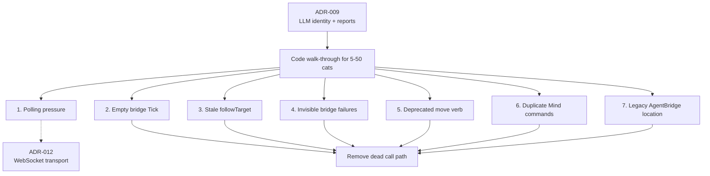
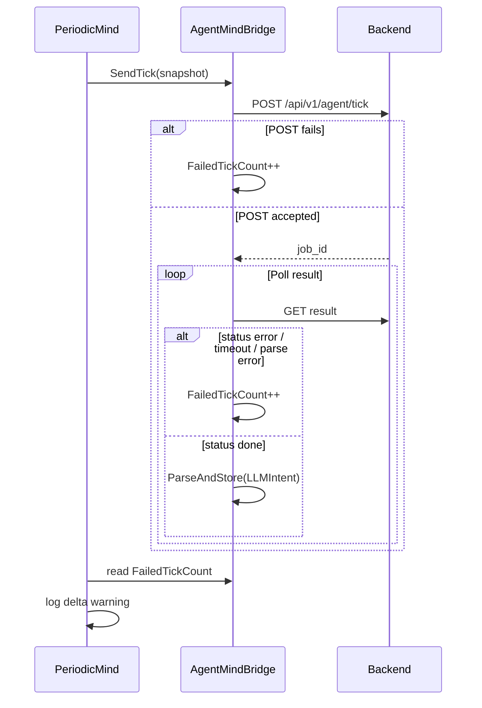
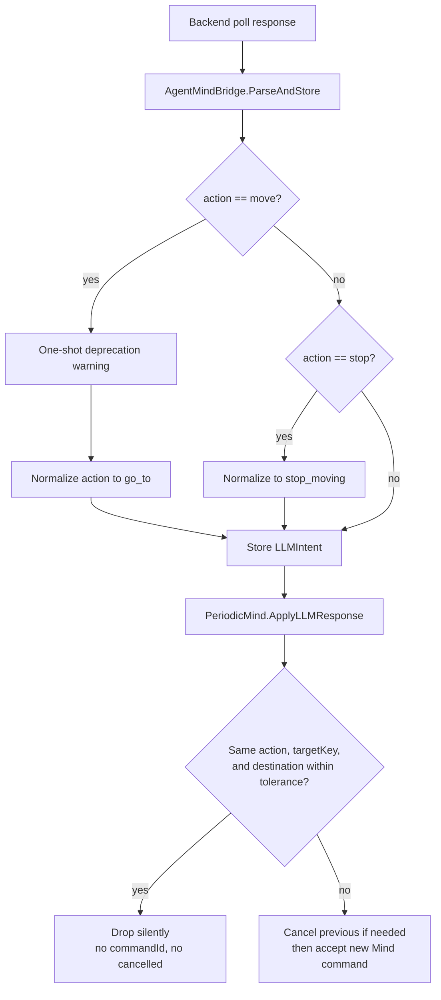
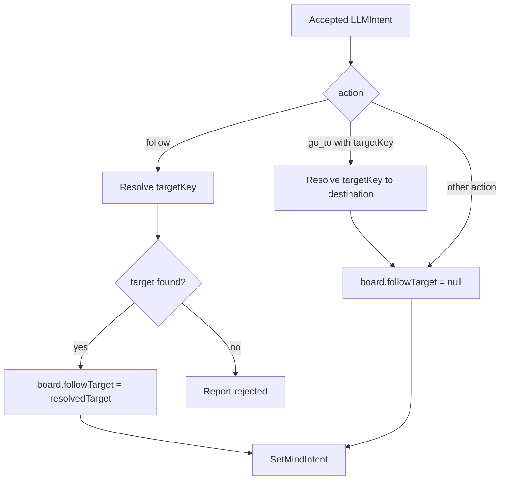
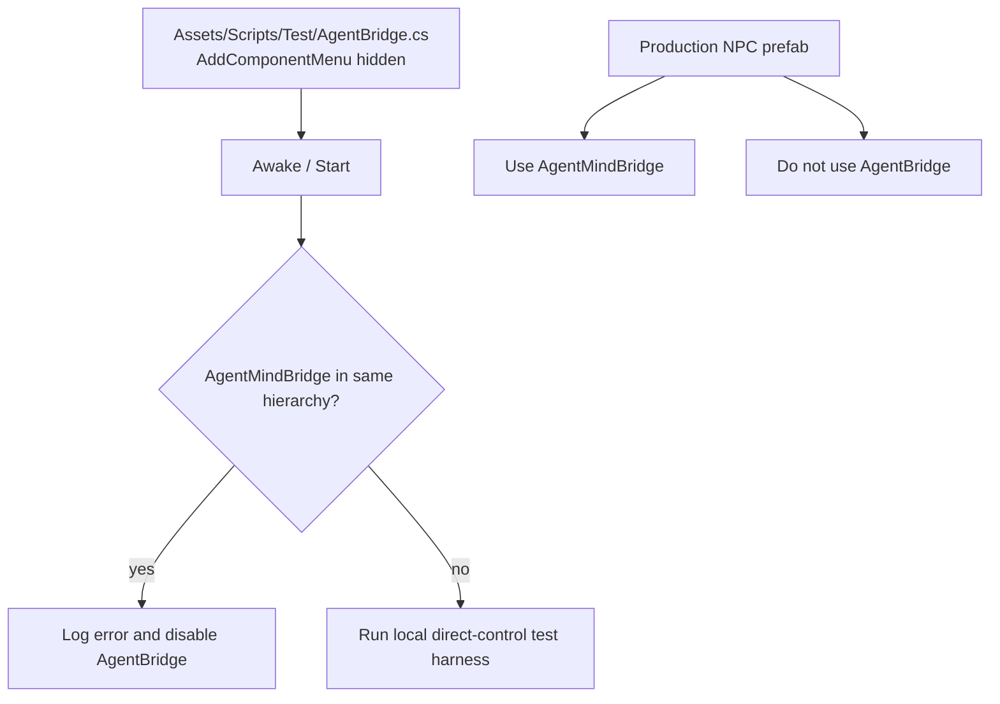

# ADR-010: Multi-Agent Hardening and Bridge/Mind Cleanup

**Status:** Accepted (implemented; backend-pressure deferral superseded by ADR-012)
**Date:** 2026-05-05
**Deciders:** vanillasky
**Relates to:** ADR-007 (Periodic Tick), ADR-008 (Bridge sync), ADR-009 (LLM Intent / Multi-Agent), ADR-012 (transport)

> **Current-code note (2026-05-06):** Items 2-7 are implemented in the Unity client: the empty bridge tick is gone, `followTarget` is bound only to `follow`, bridge failures are counted, `move` is normalized to `go_to`, duplicate Mind commands are dropped, and the legacy `AgentBridge` lives under `Assets/Scripts/Test/` with a test-only guard. Item 1 is now superseded by ADR-012, which owns the concrete transport/backpressure upgrade.

## Context

ADR-009 wired stable `agent_id`, `commandId`, named-target resolution, and a lifecycle reporter. A walk-through of the Unity code against the 5–50 NPC target surfaced seven small issues that are not architectural but will bite at scale or once Phase 3 (Reflex/Tactical inhibition) lands.

| # | Issue | Impact |
|---|---|---|
| 1 | Backend load at 50 cats: `pollIntervalSeconds=1.5` × N produces sustained polling pressure. | Scaling, backend story. |
| 2 | `AgentMindBridge.Tick()` is an empty stub still called from `CreatureController.Update`. | Dead code / confusion. |
| 3 | `_board.followTarget` is overwritten with `resolvedTarget` for every accepted Mind command, including `go_to`. A `go_to` carrying a `targetKey` therefore leaves `followTarget` non-null even though the command is not `follow`. | Latent bug today; worse in Phase 3 once Tactical/Reflex resume. |
| 4 | Bridge swallows network errors. Failed ticks produce no `rejected` report and no observable signal. | At 50 cats, individual failures vanish in logs. |
| 5 | LLM emits `move(x,y,z)` — too low-level for the agent contract. `ParseAndStore` also remaps it to `wander` when `Vector3.zero`, silently dropping any `targetKey`. | Wire contract drift; semantic targets lost. |
| 6 | `ApplyLLMResponse` always bumps `_commandCounter` and emits `cancelled` for the previous Mind, even when the new command is identical. | Wire noise, false `cancelled` events. |
| 7 | `AgentBridge.cs` (the legacy direct-Malbers test harness) still lives in `AgentIntegration/Bridge/`. ADR-005 calls it test-only, but it is not labelled or guarded against use on NPC prefabs. | "Only LLM bridge path" story is blurry; risk of accidental dual-control. |

This ADR keeps the surface in line with ADR-009 (`AgentMindBridge` stays pure transport, `PeriodicMind` owns acceptance) and patches each issue with the smallest change that holds up under multi-agent load.

## Decision

### 1. Backend pressure — defer to Phase 4

Out of scope for this ADR. Telemetry first: log per-cat tick latency in `HttpActionReporter` aggregate counters before promoting WebSocket from ADR-009 Phase 4 to a real change. Documenting here only so the issue is not lost.

**Superseded by ADR-012.** ADR-012 replaces this deferral with the multiplexed WebSocket transport decision. The cleanup and guardrail decisions below remain current.

### 2. Remove the empty `AgentMindBridge.Tick()`

Delete the stub and stop calling it from `CreatureController.Update`. The bridge has no per-frame work; the comment "kept for compatibility" is the only reason it exists.

### 3. Bind `followTarget` to `follow` intents only

`PeriodicMind.ApplyLLMResponse` must set `_board.followTarget = resolvedTarget` **only** when the accepted intent is `follow`. For every other accepted Mind command (including `go_to` with a resolved target), set `_board.followTarget = null`. Today's code overwrites unconditionally, which leaves a stale Transform attached to the cat after a `go_to(targetKey)`. This survives Phase 3 when Tactical/Reflex commands replace Mind without going through `ApplyLLMResponse`.

### 4. Surface bridge failures (excluding cancellations)

`AgentMindBridge.RunTickAsync` currently logs and swallows. Add a single `int FailedTickCount` counter that increments only on:
- POST failure (`UnityWebRequest.Result != Success`)
- Backend `status: "error"` from poll
- Poll timeout (`maxPollAttempts` exhausted)
- JSON parse failure
- Unhandled exception

It must **not** count `OperationCanceledException` from `_cts.Cancel()` — those are latest-wins backpressure and counting them as failures would make multi-cat health look worse than reality. `PeriodicMind` reads the counter once per tick and emits a periodic warning. No new wire format, no new component — just visibility. A real `tick.failed` report path is deferred until the backend has a reason to consume it.

### 5. Deprecate `move`; normalize to `go_to`

The agent contract uses `go_to`, `wander`, `follow`, `stop_moving`, plus the action vocabulary in ADR-009. `move(x,y,z)` is too low-level — pathfinding belongs on the motor side, not in LLM output.

`ParseAndStore` change:
- `move` is deprecated and logs a one-shot warning.
- If received, normalize to `go_to` **unconditionally** and preserve `targetKey`. Do not branch on `Vector3.zero`.
- Drop the `move → wander` branch entirely. Empty destination + no targetKey is the LLM's bug; let `PeriodicMind`/motor reject it (`go_to` with neither key nor non-zero destination → `rejected`).
- The `stop → stop_moving` alias stays — both forms are in the ADR-009 vocabulary table.

Unknown actions stay un-mapped; rejection happens downstream where the lifecycle reporter is wired.

### 6. Dedupe identical Mind commands

Before bumping `_commandCounter`, compare the new `(action, targetKey, destination)` to the current `_board.MindIntent`. Match rule:
- `action` and `targetKey` exact-equal (case-insensitive trim already applied).
- `destination` close: `Vector3.SqrMagnitude(new - existing) < 0.01f` (≈10 cm tolerance) — guards against float serialization noise and tiny transform jitter from named-target resolution.

If the slot is still active and matches, drop the new acceptance silently (no `cancelled`, no new `commandId`). This keeps wire reports tied to *real* command transitions.

### 7. Mark `AgentBridge.cs` as test-only

`AgentBridge` is the legacy raw-HTTP → direct-motor harness. ADR-005 already calls it a test harness, but the class itself carries no label.

- Move `AgentBridge.cs` and `CreatureAgent.cs` to `Assets/Scripts/Test/` (peer of `AgentIntegration/`) to match ADR-005's script layout.
- Add a `[AddComponentMenu("")]` attribute so it does not appear in the Inspector's component menu.
- Add a runtime guard: if `AgentBridge` and `AgentMindBridge` exist on the same GameObject hierarchy, log an error and disable `AgentBridge`. NPC prefabs must use `AgentMindBridge` only.

This makes "the LLM bridge is the only bridge on production NPCs" structurally enforced rather than convention.

## Wire format

No changes. ADR-009 payloads remain authoritative.

## Mermaid Workflows

### Hardening Scope

### Bridge Failure Visibility

### Move Deprecation and Command Dedupe

### Follow Target Ownership

### Legacy Test Harness Guard

## Phasing

Items 2-7 land as small, localized edits across `AgentMindBridge`, `PeriodicMind`, `CreatureController`, and the legacy `AgentBridge`. Item 1 no longer stays open here; ADR-012 owns the follow-up transport/backpressure work.

## Consequences

**Positive**
- Bridge stays the smallest possible transport adapter — empty `Tick` removed.
- `cancelled` reports correspond to real command transitions; backend lifecycle traces become trustworthy.
- Phase 3 Reflex/Tactical work cannot inherit a stale `followTarget`.
- Network failures stop being invisible at multi-cat scale (without conflating with cancellations).
- LLM contract is firmly mid-level: semantic intents, not raw vectors.
- "One bridge per NPC" is enforced at runtime, not by convention.

**Negative**
- `FailedTickCount` is a coarse signal. A proper structured `tick.failed` event is still future work.
- Deprecating `move` is a contract tightening — any backend code still emitting `move` keeps working (now as `go_to`), but emits a warning. Verify the backend node before shipping.
- Moving `AgentBridge.cs` will dirty any scenes/prefabs that still reference it; touch `.unity` and `.prefab` only after confirming no production scene depends on the old path.

## Alternatives Considered

### A. Push tick failures through `ActionReport` as a `failed` event with empty `commandId`
**Deferred.** ADR-009 ties `ActionReport` to *commands*, not transport. Mixing transport errors into the same channel would muddy the lifecycle semantics. A dedicated `/api/v1/agent/tick-failed` route is cheap to add later.

### B. Make `NamedTargetRegistry` per-cat instead of scene-singleton
**Rejected for now.** One scene-level registry is correct for 5–50 cats sharing the same world markup. Per-cat registries would duplicate scene state. Revisit if zones become cat-specific.

### C. Move `followTarget` ownership entirely to `IntentMessage`
**Deferred.** Carrying the Transform on the intent struct would fix issue 3 by construction, but `IntentMessage` is currently a value type with only string/Vector3 fields and is JSON-friendly. Adding a `Transform` reference changes its shape. Revisit when Phase 3 forces a richer intent record.

### D. Keep `move` as a first-class verb
**Rejected.** `move(x,y,z)` is engine-level. The LLM should reason in terms of *where it wants to be* (named target) or *what it wants to do* (sit/eat/wander); pathfinding is the motor's job. Allowing `move` perpetuates the leak.
