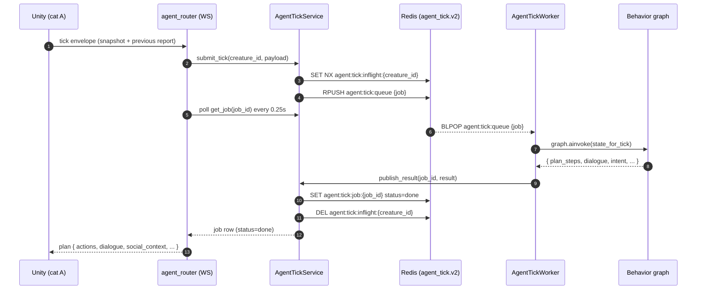
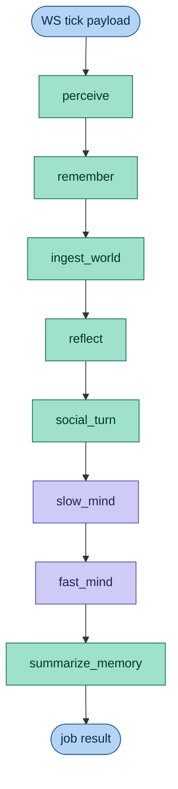
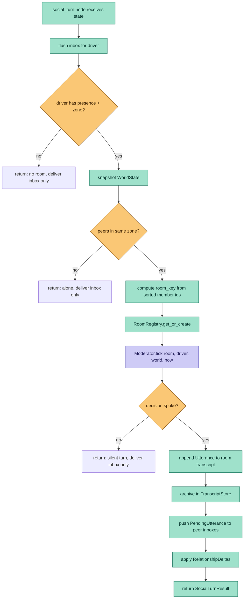
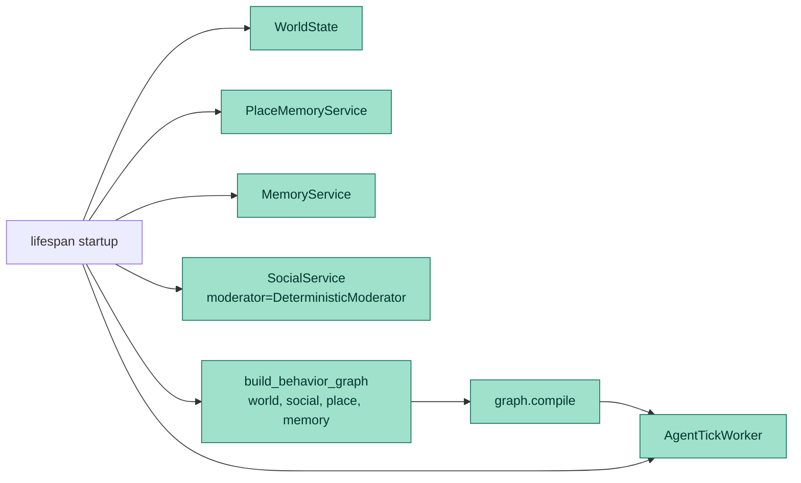
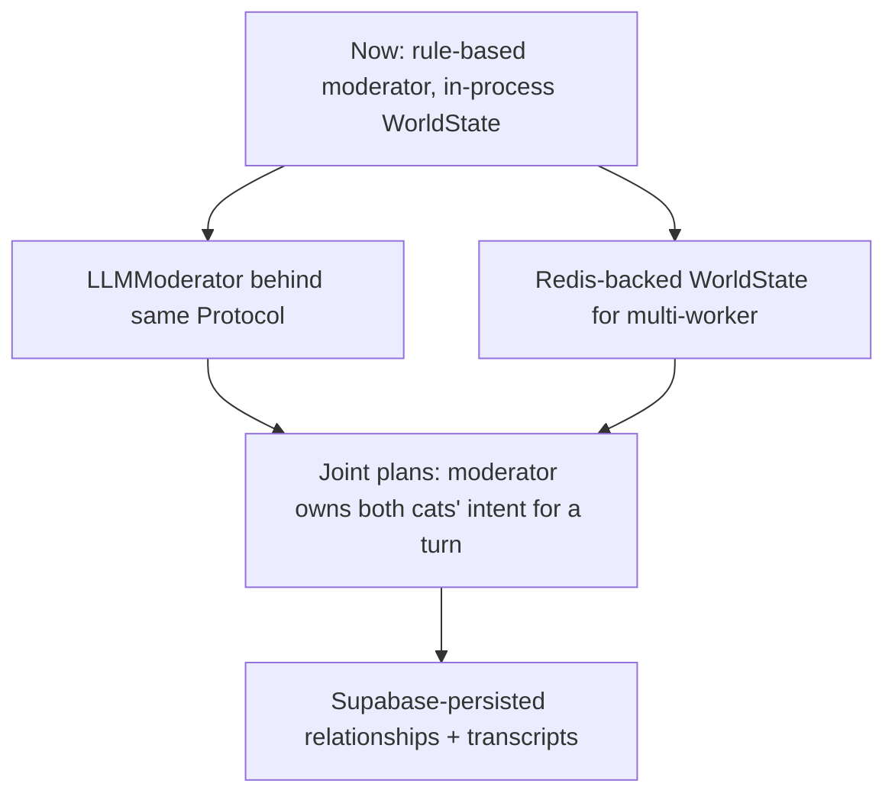

# ADR-011: Tick Graph And Social Service — How A Turn Actually Runs

- **Status:** Accepted
- **Date:** 2026-05-23
- **Updated:** 2026-06-01 to align Redis key names with
  [ADR-023](ADR-023-shared-unity-agent-websocket.md)
- **Scope:** `mewi-backend/app/agent/behavior_graph.py`, `mewi-backend/app/agent/creature_runtime.py`,
  `mewi-backend/app/services/agent_tick/tick_service.py`, `mewi-backend/app/workers/agent_tick_worker.py`,
  `mewi-backend/app/api/routes/agent_router.py`, `mewi-backend/app/world/**`, `mewi-backend/app/social/**`

## Context

After [ADR-010](ADR-010-backend-owned-world-and-social-chat.md), the backend
owns the world model and routes social interaction through `SocialService`.
The implementation has landed but the per-tick path now touches eight nodes
across three modules. New contributors need a map showing *where the LLM
actually fires* and *where pure code is in charge*, because the prompt-cost
budget and the swap points for upgrades live exactly at those boundaries.

This ADR is descriptive. It records the runtime as it currently is, names
each node, and tags it with `LLM` or `code`. There is no behavior change.

## Per-tick graph

Unity sends one WebSocket envelope per cat tick. The router hands it to
`AgentTickService` which enqueues a Redis job; `AgentTickWorker` blocks on
that queue and runs the compiled LangGraph for the cat.



Per-cat ordering is preserved by Unity-as-cadence-authority
([ADR-004](ADR-004-websocket-nested-plan-execution.md)): Unity does not
send the next envelope until the previous job comes back.

## The compiled graph



Edges are linear: `perceive → remember → ingest_world → reflect →
social_turn → slow_mind → fast_mind → summarize_memory → END`. The graph
is compiled once in `lifespan` and shared across cats; per-cat state
flows through `CreatureRuntimeState`.

## Where the LLM fires

Only two nodes invoke an LLM today. Everything else is deterministic
Python.

| Node | Module | LLM? | What it owns |
|---|---|---|---|
| `perceive` | `agent/perception.py` | code | Validate Unity payload → `PerceptionSummary` / `PerceptionError`; bound entities by relevance radius. |
| `remember` | `agent/memory/manager.py` | code | Return last-N raw events + short-term memory lines. |
| `ingest_world` | `agent/behavior_graph.py` + `world/state.py` | code | Mirror cat presence (zone, approx XY, last action, mood) into `WorldState`; compute peers-in-zone. |
| `reflect` | `services/memory/place_memory_service.py` | code | Atomic Redis update of `agent:place_overlay:{creature_id}`; build place-memory prompt lines. |
| `social_turn` | `social/service.py` | code today, LLM-pluggable | Flush peer inbox, open/reuse `SocialRoom`, ask the **Moderator** what happens. v1 moderator is rule-based; the `Moderator` Protocol is the swap point for an LLM moderator. |
| `slow_mind` | `agent/mind/slow.py` | **LLM** | One LLM call. Inputs: persona + perception + memory + place-memory + social context. Output: `{intent, target_id, mood, style, reasoning}`. |
| `fast_mind` | `agent/mind/fast.py` | **LLM** | One LLM call. Translates intent into `plan_steps` Unity can execute. |
| `summarize_memory` | `agent/memory/summarizer.py` | code | Append raw turn event + aspect memories (action, social) to per-cat memory. |

So a single cat tick = **exactly two LLM calls** under the current shape:
one for intent, one for plan. The social moderator is intentionally
non-LLM in v1 (see "Why the moderator is rule-based" below).

## Inside `social_turn`

The graph node itself is a thin shim; the real flow is `SocialService.run_turn`.



Note that the `Moderator.tick` step is the only one tagged LLM-capable.
The default `DeterministicModerator` is rule-based — but the interface is
the LLM swap point.

## Inter-cat message flow

The cat whose tick is in flight is the only cat planning this turn.
Peers receive their pending utterances on *their* next tick. This keeps
Unity's per-cat cadence authority untouched.

```mermaid
sequenceDiagram
    autonumber
    participant Unity_A as Unity (cat A)
    participant Graph_A as Graph turn for A
    participant Inbox as InboxStore
    participant Room as SocialRoom
    participant Rels as RelationshipStore
    participant Unity_B as Unity (cat B)

    Unity_A->>Graph_A: tick envelope
    Graph_A->>Inbox: flush(A)            (returns [] on first meeting)
    Graph_A->>Room: get_or_create({A,B})
    Graph_A->>Graph_A: Moderator.tick → A "notices B"
    Graph_A->>Room: append utterance
    Graph_A->>Inbox: push(B, utterance)
    Graph_A->>Rels: apply trust+affinity delta
    Graph_A-->>Unity_A: plan { actions, dialogue=[A's line] }

    Note over Unity_A,Unity_B: time passes; Unity B is still finishing its plan locally
    Unity_B->>Graph_A: tick envelope (cat B)
    Graph_A->>Inbox: flush(B)            (returns [A's line])
    Graph_A->>Room: get_or_create({A,B}) (same room reused)
    Graph_A->>Graph_A: Moderator.tick → B replies once
    Graph_A->>Inbox: push(A, B's reply)
    Graph_A-->>Unity_B: plan { actions, dialogue=[A's line, B's line] }
```

Two key invariants:

- **Room identity = sorted member ids.** Same set → same room → same
  transcript. Membership change mints a new room key.
- **Each cat speaks once per room.** The current
  `DeterministicModerator` checks `room.transcript` for any prior line
  by the driver and stays silent if found. So a `{A, B}` meeting
  produces a two-line transcript total (one A line, one B line), then
  the room is quiet unless the membership changes.

## Plan response Unity sees

`AgentTickWorker.publish_result` writes these fields; `agent_router`
forwards them. Bold fields are new under ADR-010.

```json
{
  "type": "plan",
  "request_id": "t0000007",
  "status": "done",
  "tick": 42,
  "intent": { "intent": "SOCIALIZE", "target_id": "cat_milo", "mood": "warm", "...": "..." },
  "place_memory": { "current_zone_id": "Harbor.Dock", "lines": [...] },
  "social_context": {
    "room": { "room_key": "cat_mewi,cat_milo", "members": ["cat_mewi","cat_milo"], "recent_transcript": [...] },
    "decision": { "spoke": true, "utterance": {...}, "relationship_deltas": [...] },
    "delivered_inbox": [...],
    "relationships": [...]
  },
  "actions": [ { "action": "look_around", "target": null, "reason": "settle" } ],
  "dialogue": [ { "from": "cat_mewi", "text": "...", "tone": "friendly", "target": "cat_milo" } ],
  "reasoning": "..."
}
```

`dialogue` is the flat list Unity should render this tick. It is
already the union of "what peers said to me since my last tick" plus
"what I said this turn", in order.

## Why the moderator is rule-based today

Three reasons, in priority order:

1. **Cost control.** Each cat tick is already two LLM calls. Adding a
   third per social turn doubles the per-tick prompt budget when two
   cats happen to be in the same zone — which is the case we *want* to
   make common. Deferring the moderator LLM until the rest of the loop
   is stable keeps the bill predictable while we tune.
2. **Determinism for tests.** The graph test suite (and the smoke
   harness used to verify ADR-010) needs the social turn to produce
   identical output for identical input. A rule-based moderator gives
   that for free.
3. **Single swap point preserved.** The `Moderator` Protocol signature
   `(room, driver_id, world, now) → ModeratorDecision` matches
   Concordia's Game Master shape on purpose. When the time comes, an
   `LLMModerator` slots in without touching the graph, the worker, the
   router, or Unity.

When the moderator is upgraded to LLM, the per-tick LLM count will be
two **or three** depending on whether the room ticked, not "always
three". The graph already gates that call behind the room-existence
check.

## State carried through the graph

`CreatureRuntimeState` is the per-tick TypedDict the graph mutates. The
fields the new nodes added/consume:

| Field | Producer | Consumer |
|---|---|---|
| `world_view` | `ingest_world` | `slow_mind` prompt context (peer presence) |
| `social_context` | `social_turn` | `slow_mind` prompt context (room transcript) |
| `dialogue` | `social_turn` | `AgentTickWorker.publish_result` → Unity |
| `place_memory_context` | `reflect` | `slow_mind`, `fast_mind` |
| `memory_write` | `summarize_memory` | persistence + next-tick `remember` |

Everything else was already in place from ADR-006 / ADR-009.

## Lifespan wiring



`WorldState` and `SocialService` are process-singletons inside the
worker. Multi-worker scaling will move them to Redis-backed stores; the
service-level API does not change.

## Failure modes worth knowing

- **`SocialService` only sees what `WorldState` recorded.** If cat B
  never ticked, B has no presence, so even if Unity-side B is standing
  next to A in the same scene, `cats_in_zone` returns empty. This is
  intentional: backend can only know what Unity has reported.
- **A silent moderator is not a bug.** `decision.spoke = False` is the
  normal state once each member has said their one line in the room.
  The graph still flushes the peer inbox and still produces a plan.
- **`fast_mind` always emits at least one action.** If the LLM returns
  an empty plan, the fallback step keeps Unity's worker fed so the
  cadence loop never stalls.

## Acceptance checks (already passing in smoke runs)

- A solo cat tick produces `social_context.room = None`, `dialogue = []`,
  and the same plan it would have produced under ADR-006.
- Two cats co-located: A's first tick produces one `dialogue` line from
  A; B's next tick delivers A's line + B's own line.
- After both cats have spoken once, further ticks in the same room
  stay silent (`decision.note = "recently spoke"`).
- Cat B leaving the zone mints a new room key on A's next tick.

## Follow-ups



The graph shape does not change for any of these. Only the
implementations behind the `Moderator` interface and the storage layer
behind `WorldState` / `RelationshipStore` swap out.
