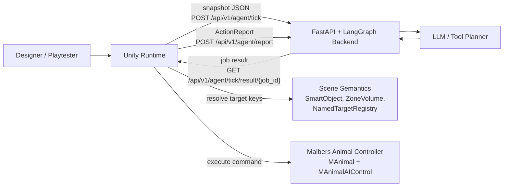
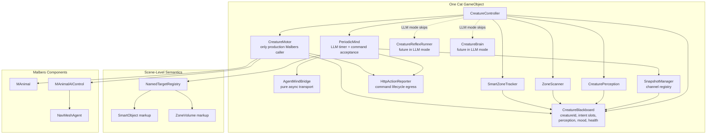
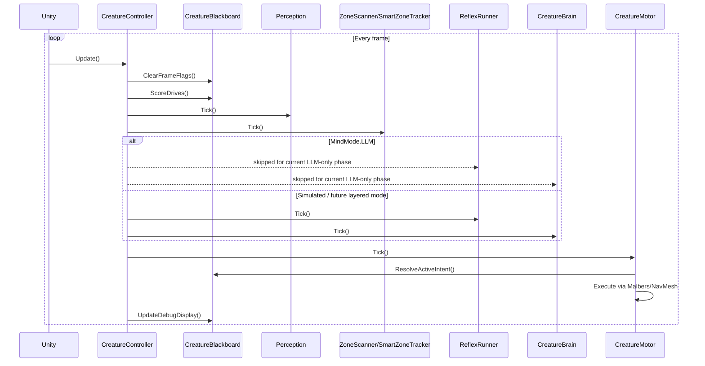
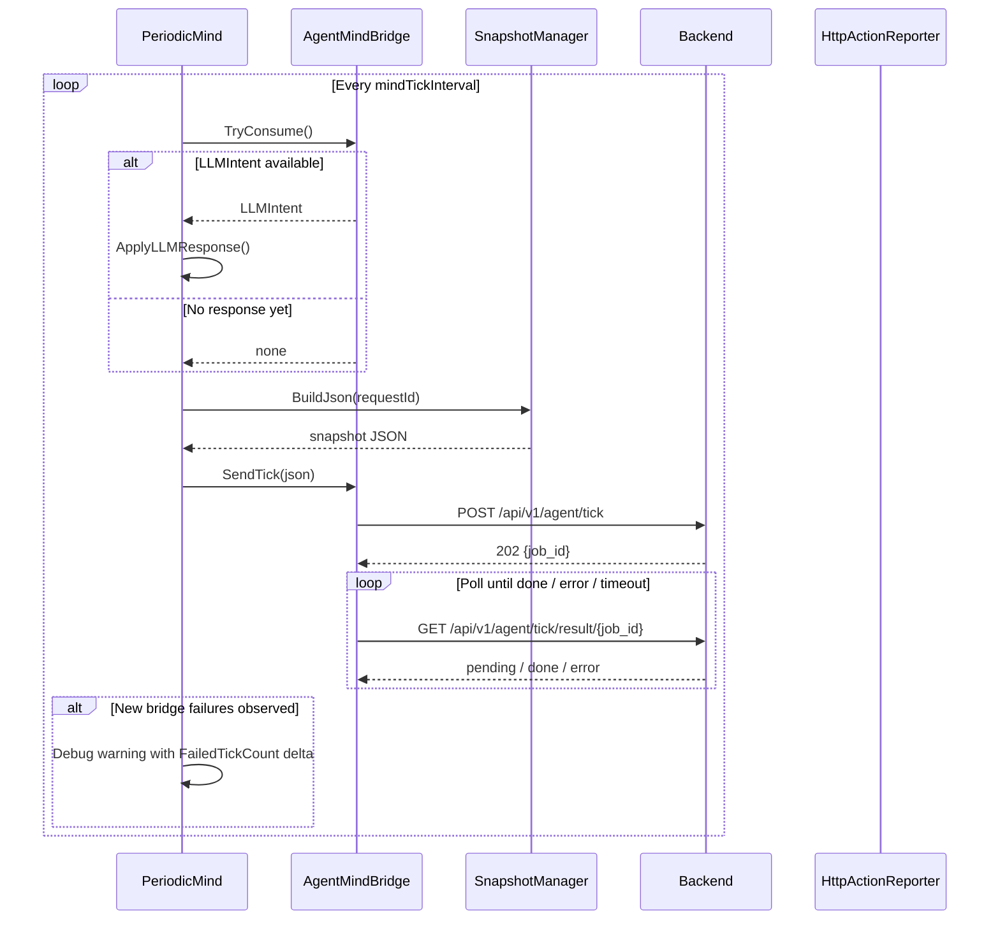
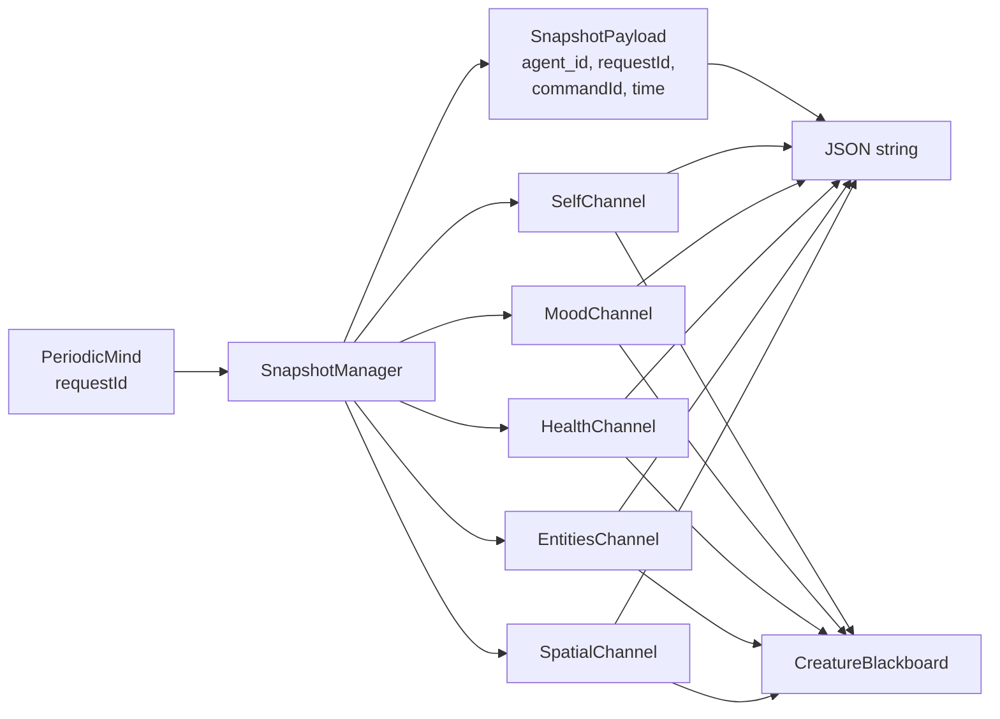
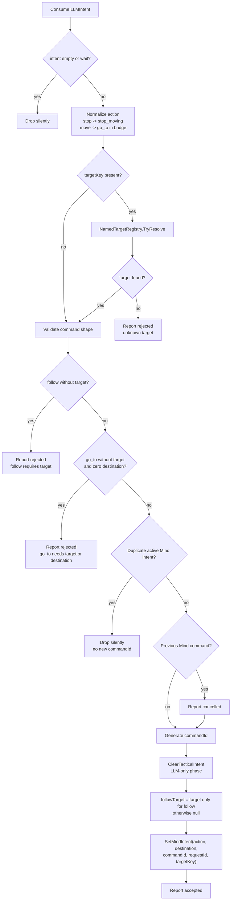
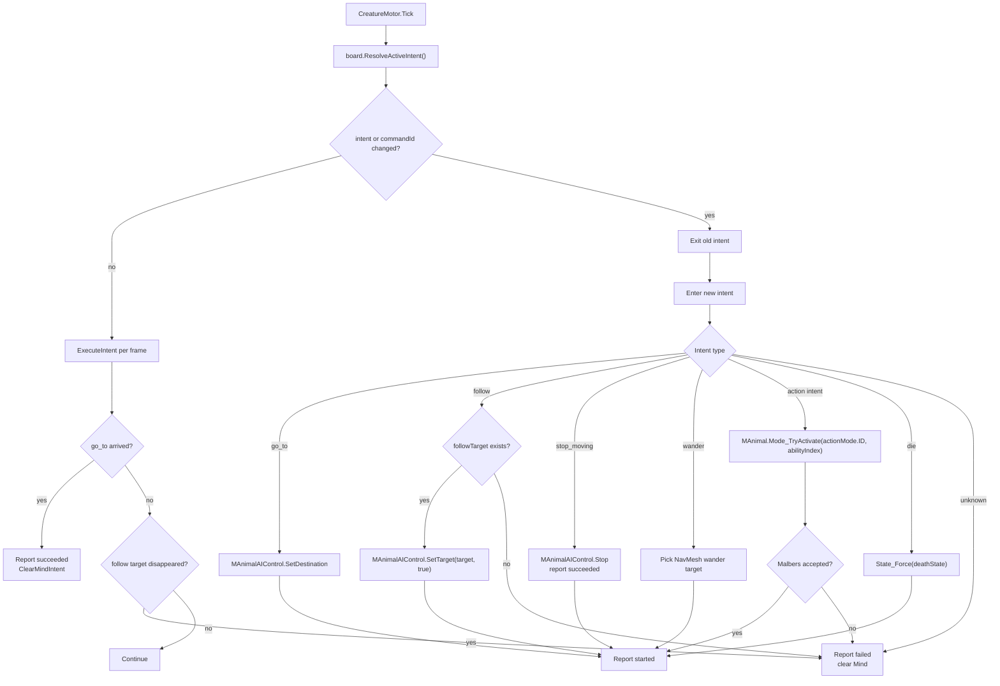
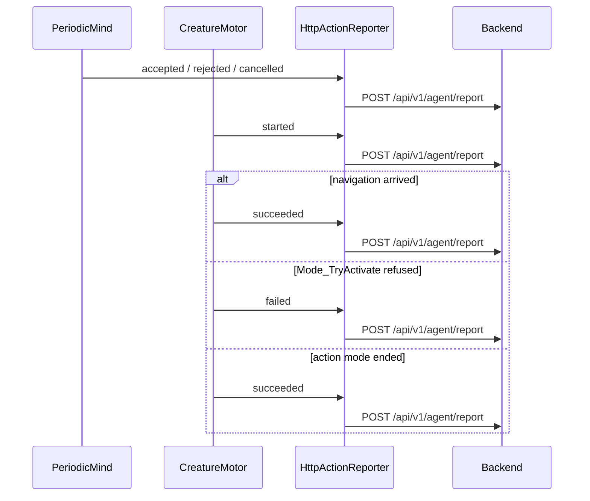
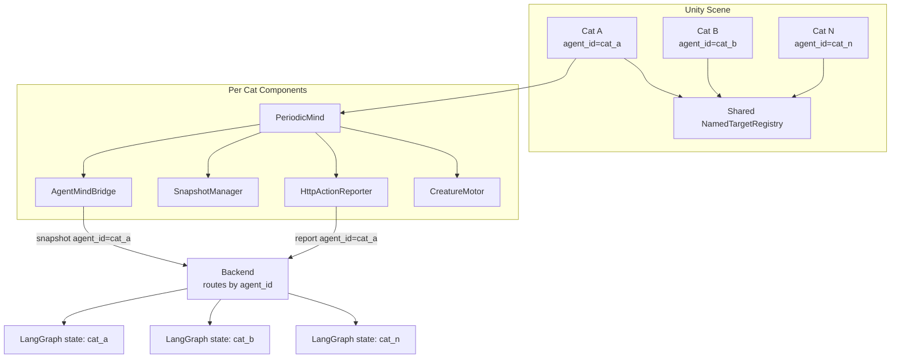
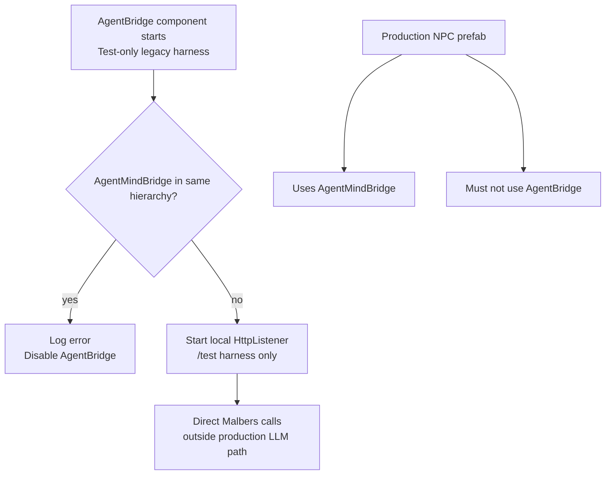

# ADR-011: Unity LLM Creature Architecture Diagrams

**Status:** Proposed
**Date:** 2026-05-05
**Deciders:** vanillasky
**Relates to:** ADR-005 (Unity creature AI), ADR-007 (Periodic Tick), ADR-008 (Bridge sync), ADR-009 (LLM Intent / Multi-Agent), ADR-010 (Hardening)

## Context

ADR-009 and ADR-010 define the current LLM-only creature path:

- Unity sends periodic snapshots to the backend.
- The backend returns one semantic command.
- Unity resolves scene targets, writes a Mind intent, executes it through `CreatureMotor`, and reports lifecycle events.
- Reflex/Tactical inhibition is explicitly future work.

The system now has enough moving pieces that one large diagram is hard to read. This ADR records the same architecture as several smaller Mermaid diagrams, each from one viewpoint.

## Diagram 1: System Context

## Diagram 2: Per-Cat Unity Components

## Diagram 3: Unity Frame Loop

## Diagram 4: Periodic LLM Tick

## Diagram 5: Snapshot Build

## Diagram 6: Command Acceptance in `PeriodicMind`

## Diagram 7: Motor Execution

## Diagram 8: Action Report Flow

## Diagram 9: Multi-Agent Scaling

## Diagram 10: Legacy Test Harness Guard

## Decision

Use this ADR as the canonical visual map of the Unity LLM creature architecture. Implementation decisions still live in the related ADRs:

- ADR-007 for tick cadence.
- ADR-008 for async bridge synchronization.
- ADR-009 for LLM intent identity, target resolution, reports, and Malbers command semantics.
- ADR-010 for multi-agent cleanup and guardrails.

## Consequences

**Positive**

- New contributors can understand the architecture without reading every script first.
- Diagrams stay small enough to perceive one concern at a time.
- Future Reflex/Tactical inhibition work has a clear place to add new diagrams without rewriting the LLM-only ones.

**Negative**

- Diagrams can drift from code. Any change to tick order, command lifecycle, reports, or component ownership should update this ADR in the same PR.
