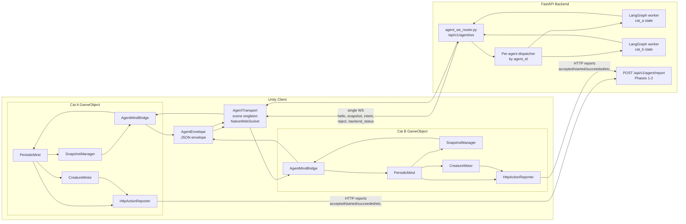
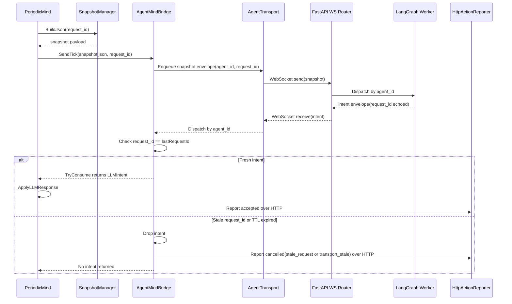
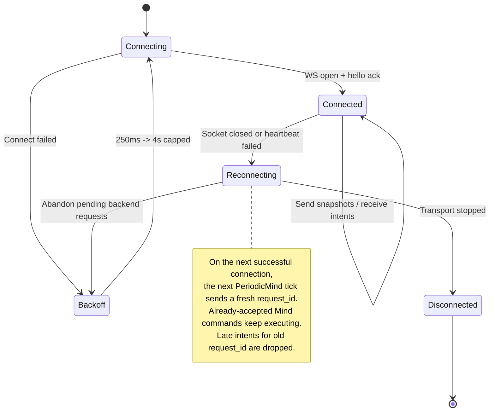

# ADR-012: Multiplexed WebSocket Transport for Multi-Agent Mind Loop

**Status:** Proposed (planning — not yet implemented)
**Date:** 2026-05-06
**Deciders:** vanillasky
**Relates to:** ADR-007 (Periodic Tick), ADR-008 (Bridge sync), ADR-009 §Phase 4 (Future transport upgrade), ADR-010 §1 (Backend pressure deferred)

## Context

Today's transport is per-cat HTTP:

- `AgentMindBridge.SendTick` — POST `/api/v1/agent/tick` then poll `GET /api/v1/agent/tick/result/{job_id}` at `pollIntervalSeconds` (default 1.5s) until `done` / `error` / `maxPollAttempts`. See [AgentMindBridge.cs](frontend/app/Assets/Scripts/AgentIntegration/Bridge/AgentMindBridge.cs).
- `HttpActionReporter.Report` — POST `/api/v1/agent/report` per lifecycle event (`accepted`, `rejected`, `started`, `succeeded`, `failed`, `cancelled`). See [HttpActionReporter.cs](frontend/app/Assets/Scripts/AgentIntegration/Bridge/Reports/HttpActionReporter.cs).

For a single demo cat this is fine. ADR-009 / ADR-010 target **5–50 NPCs**, and at that scale the design has three concrete problems:

1. **Polling pressure.** 50 cats × `1.5s` poll cadence × multiple polls per job = sustained "not yet" traffic that scales linearly with population and provides zero useful work most of the time. ADR-010 §1 already flagged this and deferred it; this ADR is the deferred work.
2. **Per-event HTTP for reports.** Each accepted command emits ~3–6 lifecycle reports. At 50 cats with a 2s mind tick, the report channel alone is hundreds of POSTs per minute. Each one carries TLS handshake / connection setup overhead unless keep-alive is healthy across UnityWebRequest, which is not guaranteed.
3. **Stale intent risk grows when latest-wins is removed.** The current bridge cancels the previous in-flight request via `_cts.Cancel()` ([AgentMindBridge.cs:70](frontend/app/Assets/Scripts/AgentIntegration/Bridge/AgentMindBridge.cs#L70)) so a stale response is structurally impossible per cat. Once we share one transport across cats, that mechanism does not generalize — we cannot cancel "the previous request" for the bridge as a whole. Staleness has to be enforced explicitly. **One primary correlation key (`request_id`)** is enough for semantics; sequence numbers and TTL are useful as ordering / safety guardrails, not as parallel sources of truth.

The transport choice (WebSocket vs SSE vs gRPC vs keep-alive HTTP) is a smaller question than the freshness rule around it. This ADR addresses both, but treats `request_id`-based freshness as the load-bearing decision.

## Decision

Adopt a **single Unity-side WebSocket connection, multiplexed by `agent_id`, carrying typed JSON envelopes — snapshots and intents first; reports later if approved (see Phase 3 / Open Question §5).** `AgentMindBridge` becomes a thin per-cat producer that submits envelopes to one shared `AgentTransport` service. `HttpActionReporter` stays on HTTP through Phases 1–2 and migrates only after report durability semantics are decided. The backend hosts one WebSocket session per Unity client and dispatches inbound envelopes to per-`agent_id` LangGraph workers, pushing intents back over the same connection.

JSON stays the wire format. Binary serialization (MessagePack, generated byte writers) is **not** in scope for this ADR — it is a profile-driven optimization, not an architectural one.

Rationale, briefly:
- WebSocket eliminates the GET-poll loop and reduces 50 connections to 1.
- Multiplexing-by-`agent_id` matches the backend model (one LangGraph state per cat) without forcing N sockets.
- JSON keeps debuggability (Unity-side logging, Wireshark, manual replay) which is high-value during the LLM-only phase.
- gRPC is rejected for the Unity client side: HTTP/2 + IL2CPP + cross-platform deployment is more friction than this game needs today, and the backend gains nothing over WebSocket+JSON at 50 NPCs.
- SSE is rejected because the channel is naturally bidirectional: snapshots and cancels go up; intents and backend status come down; reports may join later.

## Wire Format

### Envelope (every message in either direction)

```json
{
  "type": "snapshot | intent | reject | backend_status | hello",
  "agent_id": "cat_milo",
  "request_id": "cat_milo:t000004A3",
  "snapshot_seq": 1187,
  "sent_at": 12.45,
  "ttl_ms": 3000,
  "payload": { ... type-specific body ... }
}
```

- Valid `type` values in Phases 1–2: `snapshot`, `intent`, `reject`, `backend_status`, `hello`. `report` is reserved for Phase 3 — implementations should not encode it as part of the enum until the report channel is approved (see Open Question §5).
- `agent_id` — required on every multiplexed message; `hello` and `backend_status` may omit it for client-level events.
- `request_id` — **primary correlation key.** Already used in ADR-009. Format stays `{creatureId}:{tickCounter:X8}`. Must round-trip on any `intent` / `reject`. `AgentMindBridge` records the latest sent `request_id` for its agent and drops any inbound intent whose `request_id` does not match. This single rule replaces today's `_cts.Cancel()`.
- `snapshot_seq` — **ordering guardrail only.** Monotonic per `agent_id`. Used by the backend to discard out-of-order snapshot deliveries and by both sides for debug/replay. **Not** used as a freshness gate for intents — `request_id` already covers that.
- `ttl_ms` — **safety guardrail only.** Backstop against pathological backend latency: an intent older than its TTL is dropped even if `request_id` somehow matched. In normal operation `request_id` mismatch fires first. Optional field; default 5s if omitted.
- `sent_at` — Unity-side `Time.time` at send. Backend echoes it on the response so Unity can compute round-trip and apply `ttl_ms` without a synced clock.

### Payload bodies

`snapshot.payload` — current `SnapshotPayload` ([SnapshotPayload.cs](frontend/app/Assets/Scripts/AgentIntegration/Snapshot/SnapshotPayload.cs)): perception/body shape unchanged; routing fields (`agent_id`, `requestId`) move to the envelope.

`intent.payload` — same shape as `LLMIntent` in `AgentMindBridge`, unchanged.

`report.payload` — current `ActionReport` JSON unchanged.

`reject.payload` — `{ "reason": "stale | unknown_agent | malformed | rate_limited | server_error", "detail": "..." }`. Sent by backend when it refuses an inbound envelope. Unity-side TTL / `request_id` drops generate a local lifecycle report via the existing reporter — that report flows over **HTTP in Phases 1–2** (whatever channel `HttpActionReporter` currently uses) and only migrates to the WS `report` envelope in Phase 3. The WS code path must not require WS-side report support before then.

`backend_status.payload` — `{ "queued_ticks": int, "active_jobs": int }` for backpressure visibility. Sent at most every 5s, not per request.

`hello.payload` — initial handshake from Unity: `{ "client_id", "schema_version", "agent_ids": [...] }`. Backend acks with the same envelope type and a `server_schema_version`.

## What to Build / What to Change

This is the planning surface for codex to review.

### New components

| Component | Where | Responsibility |
|---|---|---|
| `AgentTransport` | `AgentIntegration/Bridge/Transport/` | Scene-singleton MonoBehaviour. **Transport + routing only.** Owns the single WebSocket, connect / reconnect / heartbeat, and per-`agent_id` send queue. Dispatches inbound envelopes to subscribers keyed by `agent_id`. **Does not** police freshness, queue inbound intents, or emit lifecycle reports. Freshness filtering lives in `AgentMindBridge`; command acceptance stays in `PeriodicMind`; report delivery stays behind `HttpActionReporter`. |
| `AgentEnvelope` | `AgentIntegration/Bridge/Transport/` | Serializable envelope type + helpers for `JsonUtility`-friendly framing. |
| Backend `agent_ws_router.py` | `backend/app/api/routes/` | FastAPI WebSocket endpoint. One session per Unity client. Routes envelopes by `agent_id` to `agent_tasks`. Pushes results back as `intent` envelopes. |
| Backend `Envelope` model | `backend/app/models/` | Pydantic mirror of the wire envelope: schema validation and TTL helper/metadata validation. `snapshot_seq` carried as ordering metadata, not a freshness gate. |

**Deferred to follow-up ADRs (intentionally not in this one):**

- `MindTickScheduler` and priority tiers — tick staggering is a low-risk win that should land before or alongside WS, on its own merits. Priority tiers (`Near` / `Visible` / `Background`) are premature until proximity/visibility rules exist. Split into ADR-013.
- Report durability (acks / retry / replay store) — see Open Questions §5. Decide product intent before implementing.

### Files to modify

| File | Change |
|---|---|
| [AgentMindBridge.cs](frontend/app/Assets/Scripts/AgentIntegration/Bridge/AgentMindBridge.cs) | Dual-stack in Phase 1 (HTTP path stays; WS path opt-in via `BackendConfig.useWebSocketTransport`); stops owning HTTP once Phase 2 flips the default. Becomes a thin per-cat adapter: `SendTick(json)` builds an envelope and submits to `AgentTransport`; on inbound dispatch, **freshness is checked against `_lastRequestId` here**, then `_latestIntent` is set as today. `_cts.Cancel()` latest-wins is replaced by `request_id` mismatch dropping the stale response. Stale / expired intents emit one lifecycle report from this class via the existing reporter path. `FailedTickCount` survives but is fed by the transport instead of UnityWebRequest. |
| [HttpActionReporter.cs](frontend/app/Assets/Scripts/AgentIntegration/Bridge/Reports/HttpActionReporter.cs) | **No rename.** Stays as a per-cat HTTP component through Phase 2. In Phase 3, gains an internal switch to route through `AgentTransport` while keeping the same class name and prefab references. Optional `IActionReporter` interface introduced first if a second implementation is needed. |
| [PeriodicMind.cs](frontend/app/Assets/Scripts/AgentIntegration/Bridge/PeriodicMind.cs) | Consumes only fresh intents from `AgentMindBridge` and continues to own command acceptance / rejection. It may keep a defensive `request_id` assertion or warning, but it does **not** emit stale-request reports; that would duplicate `AgentMindBridge`'s freshness report. Tick-staggering registration is **not** in this ADR — see ADR-013. |
| [SnapshotPayload.cs](frontend/app/Assets/Scripts/AgentIntegration/Snapshot/SnapshotPayload.cs) | Remove top-level `agent_id` / `requestId` fields. They move to the envelope. The body becomes purely the perception/world payload. |
| [BackendConfig.cs](frontend/app/Assets/Scripts/AgentIntegration/Bridge/BackendConfig.cs) | Add `wsUrl`, `reconnectBackoffMs`, `heartbeatSec`. Keep `pollIntervalSeconds` for legacy/fallback during migration. |
| [ApiRoutes.cs](frontend/app/Assets/Scripts/AgentIntegration/Bridge/ApiRoutes.cs) | Add `AgentWebSocket` route constant. Remove `AgentTickResult` once the HTTP fallback is dropped (Phase 3). |
| [agent_router.py](backend/app/api/routes/agent_router.py) | Keep HTTP `POST /agent/tick` for Phase 1 dual-stack compatibility. Mark deprecated when the WS path is the only path used by the Unity client. |

### Validation rules (load-bearing)

These rules replace `_cts.Cancel()`. Kept deliberately minimal — one freshness rule, one safety guardrail, scoped reconnect semantics.

1. **Primary freshness — `request_id` match.** `AgentMindBridge` compares `envelope.request_id` to its `_lastRequestId` for that agent before writing `_latestIntent`. Mismatch → drop the intent and emit exactly one lifecycle report through the existing reporter path: `report{status: cancelled, reason: stale_request}`. This is the only semantic freshness check.
2. **Safety guardrail — TTL backstop.** `AgentMindBridge` also applies TTL before writing `_latestIntent`. If `Time.time - envelope.sent_at > envelope.ttl_ms / 1000`, drop with `reason: transport_stale`. In normal operation rule 1 fires first; this catches pathological cases (e.g., backend processed a tick from minutes ago after a long stall).
3. **Outbound coalescing.** Transport's per-agent send queue is depth 1: if a snapshot for `agent_id` is still queued when a newer one arrives, drop the older one. Pure send-side optimization, no semantic role — `request_id` already handles correctness.
4. **Connection loss — scoped to in-flight requests.** When the WebSocket disconnects:
   - Pending backend requests (snapshots that have been sent but whose intent has not yet returned) are abandoned. On reconnect, the next tick produces a fresh `request_id` and any late-arriving intent for an old `request_id` will be dropped by rule 1 anyway.
   - **Already-accepted Mind commands continue to execute.** A cat walking to a valid target is not cancelled because the socket dropped — the motor command is independent of transport state once accepted.
   - Reconnect uses exponential backoff (250ms → 4s, capped). `hello` is re-sent.
   - If the design later requires LLM-originated behavior to be connection-bound, add an explicit policy rather than coupling it to transport here.

`snapshot_seq` is **not** a freshness rule. The backend may use it to discard out-of-order inbound snapshots; both sides log it for debugging. That is its entire role in this ADR.

### Out of scope for this ADR

- **Tick staggering / priority tiers — split into ADR-013.** Lower-risk and orthogonal; should land before or alongside this work on its own merits.
- **Report durability** — see Open Questions §5. Decide telemetry-vs-audit intent before designing acks/retry.
- **Renaming `HttpActionReporter`** — keep the class name and prefab references stable through migration. Introduce `IActionReporter` only if a second implementation is actually needed.
- Binary framing (MessagePack / FlatBuffers).
- LLM-side concurrency limits and queueing on the backend (separate ADR — though `backend_status.payload` gives Unity the visibility hook to throttle when needed).
- Reflex / Tactical inhibition over the wire (still ADR-009 Phase 3).
- Authentication / TLS termination strategy (deployment concern, not architecture).
- Cat-to-cat awareness messages. The envelope leaves room for it but no feature uses it in this ADR.

## Phasing

**Phase 1 — Narrow proof: one cat, snapshots over WS, reports stay on HTTP.**

- Add `AgentTransport`, `AgentEnvelope`, backend WebSocket router.
- Wire `AgentMindBridge.SendTick` through `AgentTransport` behind a `BackendConfig.useWebSocketTransport` flag — one cat, opt-in.
- Backend returns intents with the original `request_id` echoed.
- `AgentMindBridge` enforces **rule 1 only** (drop on `request_id` mismatch before `_latestIntent` is set).
- `HttpActionReporter` is **untouched** — reports continue over HTTP.
- Soak-test with one cat and a deliberately slow backend response to confirm staleness is handled correctly.

**Phase 2 — Roll out to all NPCs.**

- Flip the default flag. All cats use WS for snapshots/intents.
- Add rule 2 (TTL backstop) and rule 4 (scoped reconnect).
- Keep HTTP `POST /agent/tick` as a fallback if WS handshake fails N times.
- Reports still on HTTP.

**Phase 3 — Reports onto WS (gated on §5 product decision).**

- Once durability semantics are decided, add `report` envelope handling.
- Internal switch in `HttpActionReporter` to route via `AgentTransport`. Class name stays.
- HTTP `/agent/report` remains as fallback / out-of-band debug surface.

**Phase 4 — Remove HTTP fallbacks.**

- Drop `AgentTickResult` polling code and the WS-handshake-failure HTTP fallback once the WS path has stable production telemetry.
- `POST /agent/tick` may survive as a curl-friendly debug surface.

**Phase 5 (deferred) — Binary framing.**

Only if Unity-side JSON serialization or backend parse cost shows up in profiling.

## Mermaid Workflows

These diagrams are intentionally Phase 1–2 focused: snapshots and intents use WebSocket, while lifecycle reports still use HTTP. Phase 3 may move reports onto the same envelope path after the report durability decision.

### Component Topology



### Snapshot / Intent Sequence



### Reconnect Semantics



## Review Notes / Remaining Questions

Decisions recorded for traceability, plus the questions that are still genuinely open.

1. **WebSocket library choice — decided.** Unity has no built-in WebSocket client for `UnityWebRequest`, and Unity's WebGL networking docs confirm raw `System.Net.Sockets` is non-functional in WebGL — browser-compatible paths (WebSockets / WebRTC) are required. Do **not** roll our own.
   - **Primary: NativeWebSocket** ([endel/NativeWebSocket](https://github.com/endel/NativeWebSocket), Apache 2.0). Small, fits raw FastAPI WebSocket cleanly, uses `System.Net.WebSockets` on desktop/mobile/UWP and browser WebSocket APIs on WebGL. Install via UPM; prefer the `#upm-2` branch for the 2.x package (`#upm` is the legacy 1.x branch). Latest release at time of writing: 2.0.4.
   - **Fallback (paid): Best WebSockets** on the Unity Asset Store (current version 3.0.9, March 2026) if NativeWebSocket causes platform pain. Note it depends on the Best HTTP stack, so it is heavier.
   - **Avoid:** WebSocketSharp (no WebGL support), Socket.IO packages (backend is plain FastAPI WebSocket, not Socket.IO), and any custom implementation.
2. **One Unity client = one socket, or one per scene?** I assumed one per Unity process. If split-screen / multi-client testing matters, this needs revisiting.
3. **`snapshot_seq` per agent vs per client — decided per-agent.** One cat's reordering should not affect another. Implementation note for Phase 1: keep this minimal — a per-`agent_id` integer on both sides, logged for debugging, no validation pipeline, no metrics. Don't spend ceremony on it until a real ordering bug shows up.
4. **Backend send-side fairness.** If one cat's LangGraph is slow, can it block intents to other cats on the same socket? My assumption: backend uses one async task per `agent_id` and writes to the socket through an `asyncio.Queue` with no per-agent head-of-line blocking. Worth confirming the FastAPI WS implementation supports this without a custom dispatcher.
5. **Reports: telemetry, or audit/training data?** This is the biggest unresolved product decision and it gates Phase 3. If reports are telemetry-only (best-effort observability), WS-with-HTTP-fallback is fine and dropped reports during reconnect are acceptable. If reports are audit / replay / training data, they need real durability: per-report sequence numbers, ack/retry, and probably a server-side write-ahead store before WS is even an option. **No implementation work on the report channel until this is decided.**

## Consequences

**Positive**

- N socket connections collapse to 1 — no per-cat TLS handshakes, no polling pressure on the snapshot/intent path.
- `request_id` replaces ad-hoc `_cts.Cancel()` as a single, observable freshness rule that generalizes across cats. TTL and `snapshot_seq` are explicit safety/ordering guardrails, not parallel sources of truth.
- `AgentMindBridge` shrinks to a pure per-cat adapter over a typed envelope. `HttpActionReporter` is intentionally untouched in Phases 1–2 to avoid prefab churn during migration.
- Backend gains a single integration point for any future client (web tool, debug UI), not just Unity.

**Negative**

- Reconnect logic is non-trivial. Connection loss is now a global event affecting all cats, not isolated per request — though the rule-4 scoping (only abandon pending requests, not accepted commands) keeps the blast radius small.
- Adds a third-party dependency (NativeWebSocket or equivalent).
- Unity-side scene-singleton lifecycle (domain reload, scene transitions, play-mode toggling in editor) needs explicit handling. The current per-cat `OnDisable` model does not generalize — `AgentTransport` must survive scene loads or be re-created cleanly.
- Migration is not free. Phases 1–3 each carry a window where two code paths must be correct simultaneously.

## Alternatives Considered

### A. Keep HTTP, add long-poll on the result endpoint
**Rejected.** Long-poll (server holds the GET until `done`) would remove the "not yet" loop without any wire-format work and is the cheapest possible win. But it doesn't solve the per-event report POST volume, doesn't reduce socket count, and doesn't give us a backend-push channel for backpressure or future cat-to-cat events. Half-fixes the problem and locks us out of the bidirectional future.

### B. gRPC bidirectional streaming
**Rejected for now.** Powerful, but in Unity it brings HTTP/2, generated code, IL2CPP / mobile / WebGL friction, and a heavier deployment story. Backend gains nothing at 50 NPCs that WebSocket+JSON does not also give. Reconsider if the protocol grows complex (rich types, server-streamed deltas) and the team is paying the gRPC cost elsewhere already.

### C. SSE (Server-Sent Events) + HTTP POST for upstream
**Rejected.** Half-bidirectional. Snapshots and reports going upstream are exactly the high-volume direction we want on a single socket. SSE solves only the polling problem.

### D. One WebSocket per cat
**Rejected.** Trades the polling problem for a 50-socket-handshake problem, and gives the backend N session lifecycles to manage. The only thing it buys — true per-cat isolation on transport failure — is not worth the cost when reconnect logic is the same complexity at any cardinality.

### E. MessagePack envelopes from day one
**Deferred.** No evidence that JSON serialization is the bottleneck. Picking a binary format costs debuggability now to defend against a profile we have not yet seen. Wait for numbers.

### F. Defer transport work entirely; cap NPC count instead
**Rejected.** ADR-009 / ADR-010 commit to 5–50. Capping at 5 to dodge the transport problem unblocks nothing — the polling pressure is already visible at 10.
