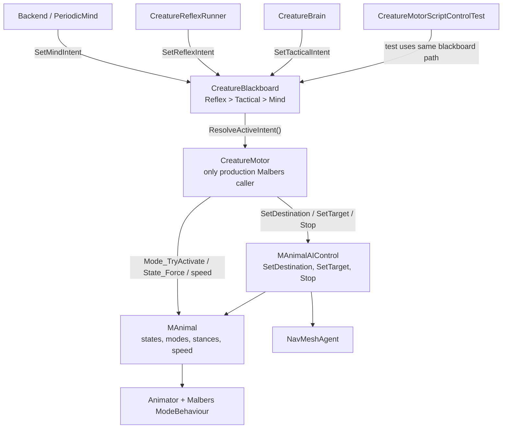
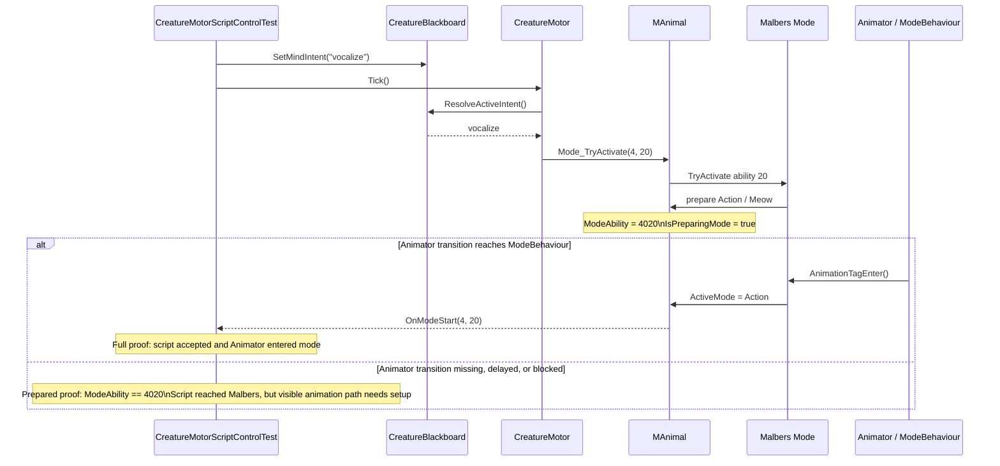

# ADR-013: CreatureMotor Malbers Script Control and Runtime Proof

**Status:** Accepted
**Date:** 2026-05-11
**Deciders:** vanillasky
**Relates to:** ADR-005 (Unity creature AI), ADR-011 (Unity LLM creature diagrams)

## Context

ADR-005 defines `CreatureMotor` as the motor boundary for the Unity creature stack: Reflex, Tactical, and Mind layers write intents to `CreatureBlackboard`, and the motor translates the resolved intent into game movement and animation.

The current cat implementation uses Malbers Animal Controller. That means runtime control has two separate surfaces:

- `MAnimalAIControl` and `NavMeshAgent` for destination / target movement.
- `MAnimal` modes, states, stances, and speed APIs for animation and scripted actions.

During testing, movement and actions failed for different reasons:

- Navigation proof failed because the `NavMeshAgent` was inactive or not placed on a NavMesh. The visible animal transform did not move even though the script issued a `go_to` intent.
- Action proof initially failed because the test expected `OnModeStart` immediately after calling the Malbers mode API. Malbers can accept a mode and enter a preparing phase before the Animator reaches a state with `ModeBehaviour`.
- The Action `ModeID` asset was not always assigned in the Inspector, even though Malbers' default Action mode ID is `4`.

We need a clear decision for how `CreatureMotor` owns Malbers calls, and a runtime proof harness that distinguishes script-control failures from Malbers Animator / NavMesh setup failures.

## Decision

`CreatureMotor` remains the only production component that calls Malbers APIs. Higher layers do not call `MAnimal`, `MAnimalAIControl`, `NavMeshAgent`, Animator parameters, Malbers states, or Malbers modes directly.

`CreatureMotor` reads `CreatureBlackboard.ResolveActiveIntent()` every tick and translates the active intent into the correct Malbers call:

| Intent group | Motor behavior |
|---|---|
| `go_to`, `wander`, `flee` | Compute a destination and call `MAnimalAIControl.SetDestination(...)`. |
| `follow`, `investigate` | Resolve a target and call `MAnimalAIControl.SetTarget(...)`. |
| `idle`, `stop`, `stop_moving` | Stop scripted movement through `MAnimalAIControl.Stop()` / local stop handling. |
| `eat`, `drink`, `sit`, `lie`, `sleep`, `groom`, `smell`, `alert`, `vocalize`, `flinch`, and related one-shots | Stop AI movement, then call `MAnimal.Mode_TryActivate(ActionModeId, abilityIndex)`. |
| Speed changes | Use Malbers speed APIs such as `MAnimal.Speed_CurrentIndex_Set(...)` and sprint toggles. |
| Terminal state changes | Use `MAnimal.State_Force(...)` only for terminal commands such as death. |

The Action mode ID is resolved by `CreatureMotor.ActionModeId`:

```csharp
public int ActionModeId => actionMode != null ? actionMode.ID : actionModeId;
```

`actionModeId` defaults to `4`, matching the Malbers default Action mode. A `ModeID` asset may still be assigned, but it is no longer required for the default Malbers setup.

`CreatureMotorScriptControlTest` is the runtime proof harness. It sends intents through the same blackboard path used by production code and verifies that Malbers receives the command.

## Runtime Ownership



The motor also performs Malbers integration hardening during initialization:

- Auto-resolves `MAnimal` and `MAnimalAIControl` from the object hierarchy when possible.
- Wires `aiControl.animal` if the Inspector reference is missing.
- Warns if the `NavMeshAgent` is on the same transform as `MAnimal`, because that setup can freeze/reset the visible animal.
- Removes `MAnimalBrain` at runtime so Malbers' built-in brain does not fight `CreatureMotor` for control.
- Subscribes to Malbers `OnArrived` and `OnModeEnd`.

## Action Timing

Malbers action activation has two observable stages. The script can successfully reach Malbers before the Animator visibly enters the action animation.



This timing matters because another action sent while `IsPreparingMode` or `IsPlayingMode` is still active may be refused by Malbers even though the ability itself is valid.

`CreatureMotorScriptControlTest` handles this by:

- Waiting before each action until Malbers is no longer preparing or playing a mode.
- Watching both `OnModeStart` and the prepared `ModeAbility` value.
- Supporting configurable timing fields: `actionReadyTimeout`, `actionStartTimeout`, `actionEndTimeout`, and `delayBetweenActions`.
- Using `Mode_Interrupt_Forced()` during cleanup when Malbers gets stuck preparing or playing.
- Treating prepared `ModeAbility` as script-control proof when `acceptPreparedModeWithoutModeStart` is enabled.

## Test Policy

`CreatureMotorScriptControlTest` currently runs navigation proof by default and keeps action proof optional. This lets the `go_to` path be tested in isolation after the action-mode proof is already known to work.

Navigation proof is intentionally separate because it depends on scene setup:

- The `NavMeshAgent` must be active.
- The agent must be placed on a baked NavMesh.
- The controlled visible animal transform must actually follow the agent / Malbers AI control setup.
- If the Malbers agent is inactive or off NavMesh, `CreatureMotor` may use its manual NavMesh fallback: calculate a `NavMeshPath`, then feed world directions into `MAnimal.Move(...)`, matching the pattern Malbers uses after reading `NavMeshAgent.desiredVelocity`.

Action proof is the current acceptance path for script control:

- The test auto-resolves ability indexes from `MAnimal.Mode_Get(ActionModeId).Abilities` by ability name when `autoResolveAbilityIndexesByName` is enabled.
- It temporarily applies resolved ability indexes to the `CreatureMotor` fields during Play Mode.
- It sends each action through `CreatureBlackboard.SetMindIntent(...)`.
- It records a full pass when Malbers fires `OnModeStart(ActionModeId, abilityIndex)`.
- It records an accepted/prepared pass when `ModeAbility == ActionModeId * 1000 + abilityIndex` but `OnModeStart` does not fire.

Prepared-only passes are useful, but they are not proof that the visible animation played. They prove that our script reached Malbers and Malbers accepted/prepared the ability. Missing visible animation after that is an Animator transition, `ModeBehaviour`, state, or stance setup issue.

## Unity Setup

On the cat GameObject or parent object that owns the creature stack:

- Add / keep `CreatureMotor`.
- Assign `animal` to the scene `MAnimal` component.
- Assign `aiControl` to the scene `MAnimalAIControl` component.
- Leave `actionMode` empty if using the default Malbers Action mode ID.
- Keep `actionModeId = 4` unless the Malbers Action mode has been customized.
- Verify the `MAnimal` Action mode includes the expected active abilities.

For the runtime proof:

- Add `CreatureMotorScriptControlTest` to the same GameObject as `CreatureController`, `CreatureBlackboard`, and `CreatureMotor`.
- Enter Play Mode.
- Keep `Run Navigation Proof` enabled for the current `go_to` navigation pass.
- Enable `Run Action Proof` only when rechecking the Malbers Action mode behaviors.
- Use the component context menu `Run CreatureMotor Script Control Test`, or let `runOnStart` run it automatically.

Expected successful console result:

```text
[CreatureMotorScriptControlTest] RESULT PASS - passed=... failed=0 skipped=...
```

## Files

| File | Role |
|---|---|
| [CreatureMotor.cs](frontend/app/Assets/Scripts/Creature/Motor/CreatureMotor.cs) | Production adapter from blackboard intents to Malbers control APIs. |
| [CreatureMotorScriptControlTest.cs](frontend/app/Assets/Scripts/Test/CreatureMotorScriptControlTest.cs) | Play Mode runtime proof harness for script-driven Malbers control. |
| [MAnimalAIControl.cs](frontend/app/Assets/Malbers%20Animations/Common/Scripts/Animal%20Controller/MAnimalAIControl.cs) | Malbers AI movement component used by the motor. |

## Consequences

Positive:

- The creature architecture keeps one auditable boundary for all Malbers calls.
- LLM, Reflex, Tactical, and test code all drive the animal through the same blackboard intent path.
- The Action mode `ModeID` asset is optional for the default Malbers setup.
- The test can separate "script reached Malbers" from "Animator visibly played the action".
- Timing delays between actions are explicit and configurable.

Trade-offs:

- Prepared-only action passes are not visual animation passes.
- Navigation proof can now pass through either Malbers `MAnimalAIControl` or the `CreatureMotor` manual NavMesh fallback. A fallback pass proves script navigation, but the prefab's Malbers `NavMeshAgent` setup should still be repaired.
- The test mutates ability index fields during Play Mode when auto-resolving names. This is acceptable for runtime proof, but prefab values should still be reviewed once the final Malbers ability list is known.
- `MAnimalBrain` is destroyed by `CreatureMotor` at runtime to avoid control conflicts, so Malbers built-in AI behavior is intentionally not part of this creature path.

## Alternatives Considered

### A. Let higher AI layers call Malbers directly

Rejected. It would couple LLM, Reflex, Tactical, and tests to Malbers details and make command arbitration harder to reason about.

### B. Require the Action `ModeID` asset in every prefab

Rejected. It is still supported, but the default Malbers Action mode is conventionally ID `4`. A numeric fallback makes setup less fragile while preserving Inspector configurability.

### C. Treat missing `OnModeStart` as a hard test failure

Rejected for script-control proof. Missing `OnModeStart` can mean the script reached Malbers successfully but the Animator transition or `ModeBehaviour` path is missing. The test should report that distinction clearly.
