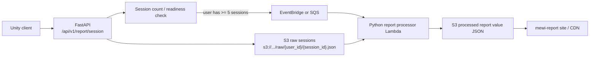

# ADR-013: Mewi Report Ingestion And Processing Pipeline

- **Status:** Proposed
- **Date:** 2026-05-29
- **Scope:** `mewi-unity/app/Assets/Scripts/AgentIntegration/Report/**`, `mewi-backend/app/api/routes/report_router.py`, `mewi-backend/app/models/report.py`, `mewi-report/pipeline/scripts/process.py`, `mewi-report/pipeline/raw_data/sessions/**`

## Context

Mewi report generation has two different responsibilities:

1. Unity observes factual play-session behavior.
2. Python turns those facts into report value data for the website.

Those layers should stay separate. Unity should not know how attachment,
attention, trust radar, timeline copy, or report summaries are calculated.
The report processor should be able to change its scoring rules and rerun over
the same immutable raw sessions.

The current implementation supports a simple local workflow:

```text
Play in Unity
  -> Unity records one raw session payload
  -> FastAPI stores the raw JSON session
  -> developer runs Python processor manually
  -> mewi-report website renders processed value data
```

This is intentionally close to the future production shape, where FastAPI can
write raw sessions to S3 and trigger processing after enough sessions exist for
a user.

## Decision

FastAPI is the only service that touches storage or future cloud infra.
Unity posts completed raw sessions to:

```http
POST /api/v1/report/session
```

The backend validates the DTO and stores it as one immutable JSON file:

```text
mewi-report/pipeline/raw_data/sessions/{user_id}/{session_id}.json
```

The local Python processor groups those session files by `user_id`, applies
optional local demo overrides, and writes processed value data to:

```text
mewi-report/pipeline/processed_data/report_{user_id}.json
mewi-report/src/data/report_{user_id}.json
```

The website reads only processed value data. It does not read Unity raw logs.

## Pipeline

```mermaid
flowchart LR
    subgraph Unity["Unity game client"]
        Play["Player completes session"]
        Logger["ReportSessionLogger"]
        DTO["ReportSessionPayload<br/>schema_version: mewi.report.raw.v1"]
        Sender["ReportSessionSender"]

        Play --> Logger
        Logger --> DTO
        DTO --> Sender
    end

    subgraph Backend["FastAPI backend"]
        Route["POST /api/v1/report/session"]
        Validate["Pydantic validation<br/>ReportSessionPayload"]
        Store["Raw session storage<br/>local file today"]

        Route --> Validate
        Validate --> Store
    end

    subgraph Report["mewi-report pipeline"]
        RawDir["raw_data/sessions/{user_id}/{session_id}.json"]
        Process["pipeline/scripts/process.py"]
        Overrides["report_overrides/{user_id}.json<br/>demo-only"]
        Processed["processed_data/report_{user_id}.json"]
        SiteCopy["src/data/report_{user_id}.json"]
        Astro["Astro report page"]

        RawDir --> Process
        Overrides -. optional .-> Process
        Process --> Processed
        Process --> SiteCopy
        SiteCopy --> Astro
    end

    Sender -- "HTTP + X-API-Key" --> Route
    Store --> RawDir
```



## Future AWS Shape

The current local file boundary maps cleanly to S3. The backend route should
remain the public contract, while storage and processing internals change
behind it.



The first production trigger should be conservative:

- Store every accepted raw session immediately.
- Trigger processing only after the user has at least five stored sessions.
- Allow manual reprocessing by `user_id` so scoring changes can regenerate old
  reports.
- Keep the processed output shape stable for the website.

## Ownership Boundaries

Unity owns:

- Session start/end timing.
- Actor and event facts.
- Human/cat action labels such as `approach`, `retreat`, `wait`, `sit`,
  `follow`, `settle`, and `ignore`.
- Optional factual telemetry under event `params` or `meta`.

FastAPI owns:

- Auth for report uploads.
- DTO validation.
- Storage path/key generation.
- Local disk today, S3/event trigger later.

Python owns:

- Grouping raw session files by user.
- Deriving attachment, radar, timeline, trust, attention, and report copy.
- Applying local demo-only overrides.
- Writing website-ready value JSON.

The website owns:

- Rendering processed report data.
- No raw telemetry interpretation.

## Implemented Files

Unity:

- `ReportSessionPayload.cs` defines the raw DTO sent to the backend.
- `ReportSessionLogger.cs` records one immutable session payload and can save
  locally or send to the backend.
- `ReportActionClassifier.cs` normalizes factual action labels, including
  `approach` when the human moves toward configured report cats.
- `ReportSessionSender.cs` posts the DTO using the existing backend config and
  auth header.

Backend:

- `app/models/report.py` defines the Pydantic request/response models.
- `app/api/routes/report_router.py` validates and stores one raw session file.
- `app/main.py` registers the report router under `/api/v1`.

Report pipeline:

- `pipeline/scripts/process.py` now reads one-session JSON files from
  `pipeline/raw_data/sessions/**`.
- Legacy aggregate files under `pipeline/raw_data/*.json` are still supported
  as migration input.
- `pipeline/report_overrides/{user_id}.json` is a local demo-only escape hatch.

Demo data:

- `vanillasky_01` was migrated from one aggregate demo raw file into five
  per-session raw JSON files.
- The processed report value output remains unchanged after migration.

## Consequences

This design keeps the current workflow small:

```bash
cd mewi-report
python3 pipeline/scripts/process.py
```

It also keeps the future migration path simple. Unity does not need to change
when local storage becomes S3 or when manual processing becomes Lambda-based.
Only the backend storage adapter and processor trigger need to evolve.

The tradeoff is that report generation is not fully automatic yet. For now, the
developer manually runs the Python processor after sessions are stored. That is
intentional until the five-session trigger and S3 processed-output location are
ready.
