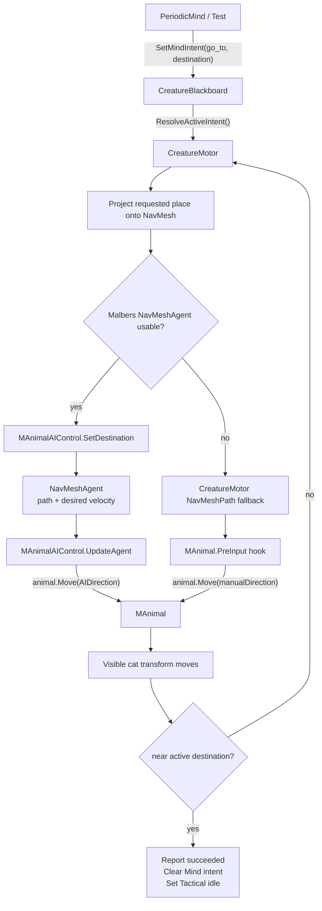
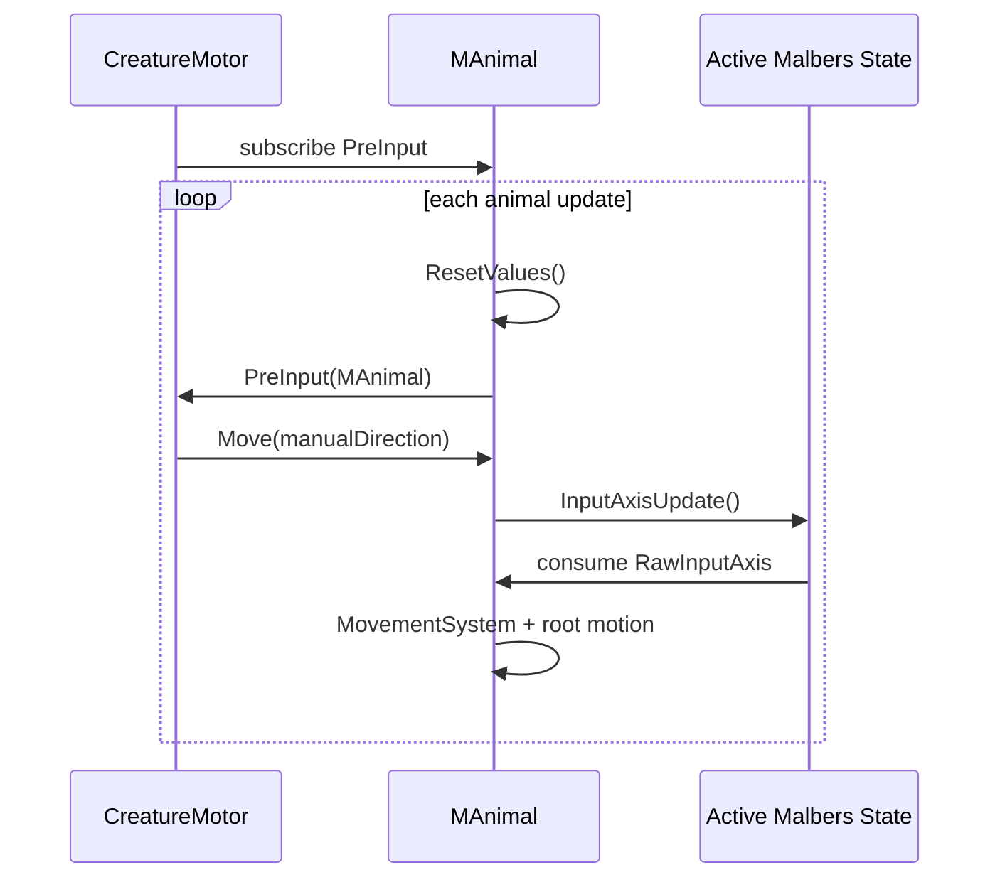

# ADR-014: CreatureMotor `go_to` Navigation as a Long-Running Intent

**Status:** Accepted
**Date:** 2026-05-11
**Deciders:** vanillasky
**Relates to:** ADR-005 (Unity creature AI), ADR-013 (CreatureMotor Malbers script control)

## Context

The cat now accepts scripted actions through Malbers Action mode and can also move when a script issues a `go_to` intent. Navigation is more special than one-shot actions:

- Actions such as `eat`, `drink`, and `vocalize` are short Malbers mode activations.
- `go_to(place)` is a long-running journey that should own the motor until the cat reaches the requested place or the command fails.
- Later behaviors should not interrupt `go_to` while the cat is still travelling.

Malbers `MAnimalAIControl` uses `NavMeshAgent` as a path/direction source, not as the visible mover. It sets `NavMeshAgent.updatePosition = false` and `updateRotation = false`, reads the agent direction / desired velocity, then drives the visible animal through `MAnimal.Move(...)`.

In the current scene the Malbers agent can be inactive or off NavMesh, so a plain `MAnimalAIControl.SetDestination(...)` can accept the command but produce no visible movement. The runtime proof also showed that Malbers can emit internal arrival/reset events while the cat is not near the requested destination.

## Decision

Treat `go_to` as a **long-running navigation intent** owned by `CreatureMotor`.

Once `CreatureMotor` enters `go_to`, it keeps the active navigation destination until the animal is actually close to that destination. The motor ignores stale Malbers arrival/reset events that do not correspond to the active `go_to` target.

The navigation pipeline is:

1. `PeriodicMind` or a runtime test writes `CreatureBlackboard.SetMindIntent("go_to", destination, commandId, requestId, targetKey)`.
2. `CreatureMotor` receives the resolved intent and projects the requested destination onto the NavMesh.
3. `CreatureMotor` first attempts the normal Malbers route via `MAnimalAIControl.SetDestination(...)`.
4. If the Malbers `NavMeshAgent` is inactive or off NavMesh, `CreatureMotor` may use a manual fallback:
   - calculate a `NavMeshPath`,
   - follow path corners,
   - inject movement through `MAnimal.PreInput`,
   - call `MAnimal.Move(direction)` at the point where Malbers is about to consume movement input.
5. `go_to` completes only when the animal transform is within arrival distance of the active destination.
6. Only after `go_to` completes should the runtime proof continue to `stop_moving` or later action tests.

The manual fallback is not meant to replace a healthy Malbers setup. It proves that our script can own navigation while the prefab's `NavMeshAgent` setup is being repaired.

## Runtime Flow

## Malbers Timing

The manual fallback must not call `MAnimal.Move(...)` only from `CreatureMotor.Tick()`. Malbers resets and consumes movement during its own animal update cycle:

This is why the fallback movement is injected through `animal.PreInput`. Calling `Move(...)` too early can leave `MovementAxis`, `MovementAxisRaw`, and `MovementAxisSmoothed` as zero by the time Malbers evaluates locomotion.

## Test Policy

`CreatureMotorScriptControlTest` treats navigation as the first proof stage:

- Assign `Go To Target` when testing a known place.
- Keep `Run Navigation Proof` enabled.
- Keep `Run Action Proof` disabled until `go_to` succeeds.
- The test waits up to `navigationArrivalTimeout` for the cat to reach the target.
- Once `go_to` arrives, the test issues `stop_moving`.
- After navigation is stable, action proof may be enabled so actions run after the journey.

Relevant debug fields:

| Field | Meaning |
|---|---|
| `motorNavActive` | `CreatureMotor` still owns an active navigation destination. |
| `motorNavDestination` | Current projected destination. |
| `manualNav` | The manual `NavMeshPath` fallback is active. |
| `manualCorner` | Current path corner being followed by the fallback. |
| `manualDirection` | Direction injected into `MAnimal.Move(...)`. |
| `distanceToRequested` | Test distance from the visible cat transform to requested target. |

## Files

| File | Role |
|---|---|
| [CreatureMotor.cs](frontend/app/Assets/Scripts/Creature/Motor/CreatureMotor.cs) | Owns `go_to`, projects destinations, chooses Malbers pathing or manual fallback, and completes only on real arrival. |
| [CreatureMotorScriptControlTest.cs](frontend/app/Assets/Scripts/Test/CreatureMotorScriptControlTest.cs) | Runtime proof that `go_to` reaches a target before later actions run. |
| [MAnimalAIControl.cs](frontend/app/Assets/Malbers%20Animations/Common/Scripts/Animal%20Controller/MAnimalAIControl.cs) | Malbers AI component whose normal path reads `NavMeshAgent` direction and calls `MAnimal.Move(...)`. |

## Consequences

Positive:

- `go_to(place)` has a clear long-running lifecycle.
- Later actions do not accidentally interrupt travel in the runtime proof.
- Script navigation works even while the Malbers agent is inactive or off NavMesh.
- Stale Malbers arrival/reset events no longer complete `go_to` early.
- The test can prove full target arrival, not only small movement.

Trade-offs:

- The manual fallback proves script control, but it is not a replacement for a healthy Malbers `NavMeshAgent` prefab setup.
- The fallback only follows walkable NavMesh path corners. It does not solve jump, climb, vault, or off-mesh traversal; see ADR-015.
- `go_to` now behaves differently from one-shot action intents: it must be allowed to run until arrival or timeout.

## Alternatives Considered

### A. Treat `go_to` like a one-frame command

Rejected. A single `SetDestination(...)` call is not enough proof that the visible animal will move, especially when the Malbers `NavMeshAgent` is off NavMesh.

### B. Accept any Malbers arrival event as completion

Rejected. Malbers may emit position-arrival events during internal stop/reset behavior. `go_to` completion must be tied to the active destination and visible animal position.

### C. Use only the manual fallback

Rejected. The intended production path is still Malbers AI control. The fallback exists to keep script-owned navigation testable and debuggable while prefab/agent setup is corrected.
