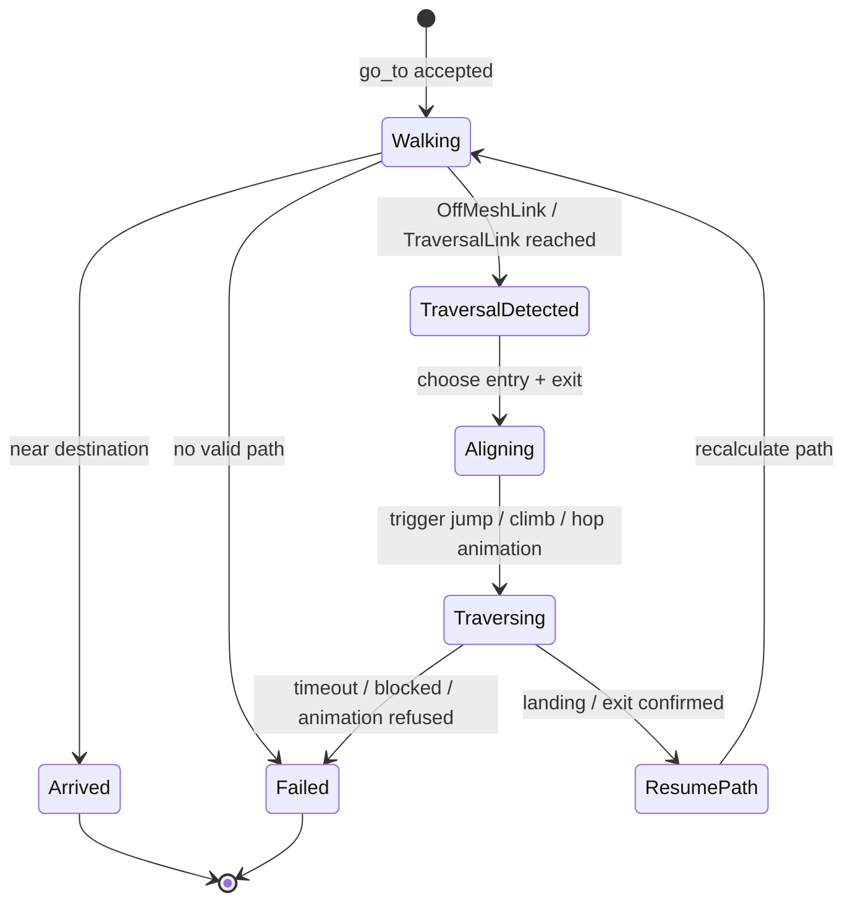
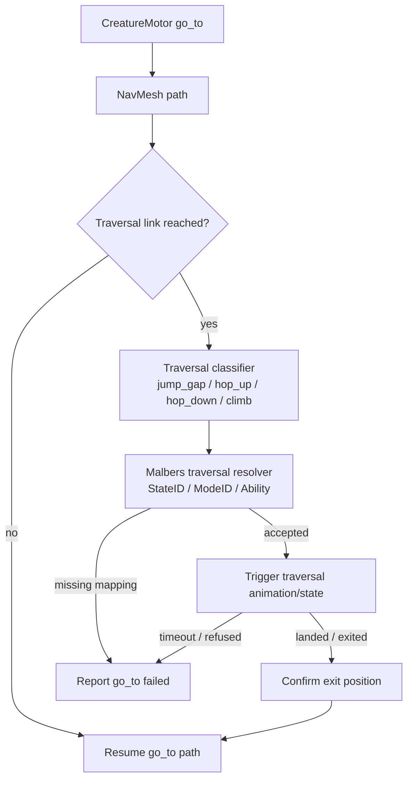
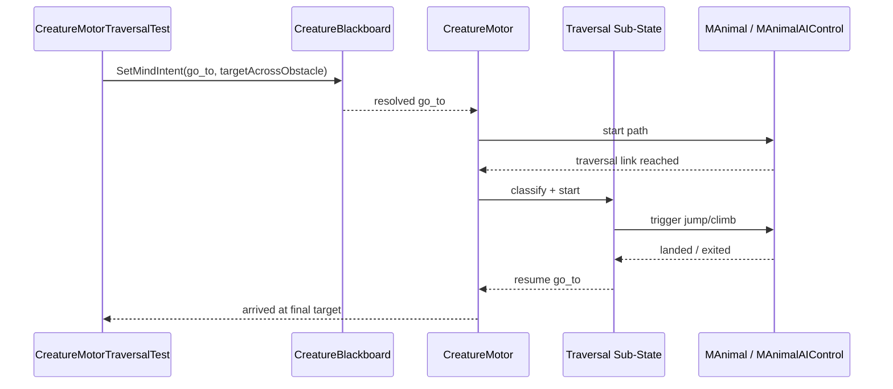

# ADR-015: Planning Obstacle Traversal for Cat Navigation

**Status:** Proposed (planning — not yet implemented)
**Date:** 2026-05-11
**Deciders:** vanillasky
**Relates to:** ADR-014 (`go_to` navigation), ADR-013 (CreatureMotor Malbers script control), ADR-005 (Unity creature AI)

## Context

ADR-014 makes `go_to(place)` a long-running navigation intent. The cat can now move toward a target on the NavMesh.

The next problem is 3D traversal. A normal NavMesh path handles walkable floor surfaces, but a cat also needs to handle obstacles:

- jump over a low object,
- hop up or down between surfaces,
- climb onto furniture or ledges,
- avoid an obstacle when traversal is not possible.

This should not be implemented as arbitrary physics impulses from the LLM. The LLM should still say "go_to sofa" or "go_to window"; Unity should decide whether the journey requires walking, jumping, climbing, or failing safely.

Malbers already has concepts that may help:

- `MAnimalAIControl` detects `NavMeshAgent.isOnOffMeshLink`.
- Its OffMeshLink handling can drive animal movement through animation.
- `MAnimal` exposes state and mode APIs such as `State_Activate`, `State_Force`, and `Mode_TryActivate`.
- The cat prefab may already include Jump / Climb / Fall states or action abilities, but those mappings need verification.

## Planning Decision

Obstacle traversal should be planned as a **sub-state of `go_to`**, not as a separate LLM command.

The first implementation should prefer authored traversal data over dynamic guessing:

1. Designers mark traversable gaps / ledges / furniture transitions with `NavMeshLink` or `OffMeshLink`.
2. `CreatureMotor` keeps owning the parent `go_to` command.
3. When the path reaches a traversal link, the motor or Malbers AI control enters a traversal sub-state.
4. The sub-state aligns the cat, triggers the correct Malbers jump/climb animation/state, waits for landing/exit, then resumes `go_to`.
5. If traversal fails or no valid traversal exists, the command reports failure instead of improvising unsafe movement.

The manual `NavMeshPath` fallback from ADR-014 should remain a walking fallback only. It should not attempt jump/climb traversal by itself until traversal markers and animation mappings are explicit.

## Proposed Traversal Model

The traversal decision should be data-driven:

| Traversal type | Example | Likely Unity marker | Likely Malbers control |
|---|---|---|---|
| `jump_gap` | gap between surfaces | `NavMeshLink` / `OffMeshLink` | Jump state or jump mode |
| `hop_up` | floor to chair / sofa | authored link with height delta | Jump / climb / custom action |
| `hop_down` | chair to floor | authored link with negative height delta | Fall / land / jump-down action |
| `climb` | ledge or tall furniture | authored traversal marker | Climb state if present |
| `blocked` | wall / too high obstacle | no traversal marker | fail `go_to` or replan around |

## Proposed Component Shape

Possible new code surface:

| Component | Responsibility |
|---|---|
| `CreatureTraversalConfig` | ScriptableObject mapping traversal types to Malbers `StateID`, `ModeID`, ability index, timing, and distance thresholds. |
| `TraversalLink` | Optional scene marker for semantic traversal type, entry/exit points, and allowed creature sizes. |
| `CreatureTraversalMotor` or `CreatureMotor` section | Runtime traversal sub-state inside `go_to`. Starts traversal, waits for completion, resumes path. |
| `CreatureMotorTraversalTest` | Play Mode proof scene: target is across a marked jump/climb link. |

This can live inside `CreatureMotor` at first. Split it only if the traversal state machine grows large.

## Phasing

### Phase 1 — Authored OffMeshLink proof

- Create a small test scene or fixture with:
  - cat start position,
  - obstacle / gap,
  - target on the other side,
  - authored `OffMeshLink` or `NavMeshLink`.
- Disable the manual navigation fallback for this proof if it bypasses link events.
- Verify that Malbers `MAnimalAIControl` detects the link and uses its existing OffMeshLink behavior.
- Add debug logs around link entry, link exit, and resume.

Success criteria:

- `go_to` remains active during traversal.
- Cat crosses the authored link.
- Cat resumes path after the link.
- `go_to` reports success only near the final target.

### Phase 2 — Explicit traversal mapping

- Add `CreatureTraversalConfig`.
- Map traversal type to Malbers state/mode:
  - `jump_gap` -> Jump state or jump mode,
  - `hop_up` -> Jump or climb action,
  - `climb` -> Climb state if the cat prefab supports it.
- Add timeouts and failure reasons.
- Keep LLM out of the low-level choice. The LLM still issues destination intent only.

### Phase 3 — Semantic scene markers

- Add `TraversalLink` or extend semantic markup for furniture / ledges.
- Store traversal type, entry point, exit point, max height, and allowed animals.
- Let target resolution prefer reachable traversal routes when resolving a named place.

### Phase 4 — Dynamic obstacle sensing

Only after authored links work:

- Use short forward raycasts / capsule casts while walking.
- Classify small obstacles as candidate `hop_up` / `jump_gap`.
- Use conservative thresholds.
- If uncertain, stop or replan instead of forcing a jump.

Dynamic traversal should be limited. A bad jump/climb guess is more visibly broken than choosing another path.

## Rules and Constraints

- `go_to` owns the full journey.
- Jump/climb is a child state of `go_to`, not a separate Mind intent.
- Action proof should not run while `go_to` or traversal is active.
- Manual walking fallback must not silently bypass authored traversal links when testing jump/climb.
- Traversal must have a timeout and a clear failure report.
- The first shipped traversal should use authored links/markers, not purely procedural obstacle climbing.

## Open Questions

1. Which Malbers states/modes are available on the current cat prefab for jump, climb, hop-up, hop-down, and landing?
2. Does the project use Unity `OffMeshLink`, AI Navigation `NavMeshLink`, or both?
3. Should furniture surfaces be baked into the NavMesh, represented as separate links, or both?
4. Do we want traversal to be animation-root-motion driven, or should code move the animal during traversal?
5. How should failed traversal be reported back to the backend: `failed: traversal_unavailable`, `failed: blocked`, or a richer reason enum?

## Validation Plan

Build a dedicated Play Mode proof before changing production behavior broadly:

The proof should assert:

- visible cat moves before traversal,
- cat enters traversal,
- cat exits on the far side,
- final target is reached,
- no unrelated action interrupts the journey.

## Consequences

Positive:

- Keeps LLM commands high-level and game-like.
- Makes jump/climb an owned navigation behavior instead of a random action.
- Starts with designer-authored routes, which is safer and easier to debug.
- Gives room to reuse Malbers OffMeshLink and state/mode systems.

Trade-offs:

- Requires scene authoring for the first version.
- Requires mapping current cat prefab animations/states before implementation.
- The ADR intentionally delays procedural obstacle traversal until authored traversal is reliable.
