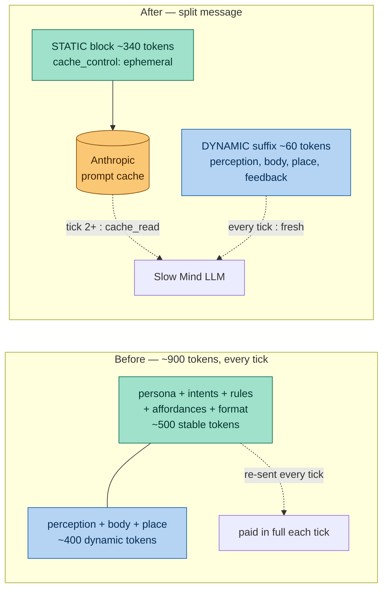

# ADR-015: Place Memory And Slow-Mind Prompt Cleanup

- **Status:** Accepted
- **Date:** 2026-05-22
- **Renumbered:** 2026-05-29 — originally filed as a second `ADR-007`,
  colliding with [ADR-007 (attachment pipeline)](ADR-007-attachment-signature-pipeline.md).
  Renumbered to 015 to keep ADR ids unique. Content and date are unchanged; the
  decision still chronologically follows [ADR-006](ADR-006-place-memory-reflect-loop.md).
- **Builds on:** [ADR-006](ADR-006-place-memory-reflect-loop.md) (place-memory reflect loop, slow/fast-mind split)
- **Scope:** `mewi-backend/app/agent/behavior_graph.py`, `mewi-backend/app/agent/mind/fast.py`, `mewi-backend/app/agent/creature_runtime.py`, `mewi-backend/app/agent/prompts/__init__.py`, `mewi-backend/app/agent/prompts/persona/cat.md`, `mewi-backend/app/agent/schemas/place_memory_schema.py`, `mewi-backend/app/repositories/place_memory_cache.py`, `mewi-backend/app/services/perception/semantic_service.py`, `mewi-backend/tests/unit/repositories/test_place_memory_cache.py`, `mewi-backend/pyproject.toml`

## Context

ADR-006 landed the place-memory reflect loop and the slow-mind / fast-mind
split. End-to-end the pipeline ran, but a review of the implementation surfaced
a small set of quality issues that were cheap to fix immediately, plus one real
perf concern in the slow-mind prompt: each tick was sending ~900 tokens, most
of which were stable per creature (persona, intent catalog, rules,
affordances, output format).

This ADR records the problems, the fixes, and the parts that were intentionally
deferred.

## Problems

### 1. Dead duplicate JSON parser in `behavior_graph.py`

`_parse_decision` (and its helpers `_format_position`, `_format_location`) were
a near-copy of `_parse_intent_decision`, left behind from the pre-intent
graph. Only `_parse_intent_decision` was reachable, so the rest was dead
weight that future readers would have to disprove.

### 2. `__meta__` field name duplicated in Python and Lua

`PlaceMemoryCache` declared `_META_FIELD = "__meta__"` in Python but the Lua
`record_visit` script hard-coded the literal string `"__meta__"` in two
places. Renaming one side would silently desync the other.

### 3. No test for the atomic visit path

The whole reason the Lua script existed was to keep the
"did-the-zone-change? + increment + write" sequence atomic. The existing
service tests used a `FakePlaceStore` shim that did not exercise the script
at all, so a regression in the Lua would have slipped through.

### 4. `place_memory_context` contract was implicit

`prompts/__init__.py` read `place_memory_context["lines"]`, `fast_mind.py`
read `place_memory_context["best_exploration_target"]`, but no shared type
described the shape. Any rename in `PlaceMemoryService.to_prompt_context()`
would have silently produced empty bullet lists or missing exploration
targets.

### 5. Slow-mind prompt was ~900 tokens per tick, mostly cacheable

Roughly 500 of those 900 tokens never changed between ticks for the same
creature: persona, intent catalog, slow-mind rules, available affordances,
output format. Without prompt caching this was paid in full on every tick.

The persona also restated the slow-mind rules ("When calm…", "When uncertain…",
etc.), which both bloated the static block and risked rule drift.

### 6. `SENSORY MEANING` repeated the same entity 3-4 times

The semantic service emitted one line per modality (smell / sound / signal)
plus an unknown-key overflow loop. In practice the same entity appeared as a
"Taste:" line, a "Smell:" line, and one or two "Body signal:" lines, often
carrying near-identical descriptive text. The "Body signal:" label was also
being used for object-affordance text ("cold, wet, slimy film on raw scales")
that is not actually an interoceptive signal.

## Decision

### Cleanup

- Delete `_parse_decision`, `_format_position`, and `_format_location` from
  `behavior_graph.py`.
- Pass the `__meta__` field name into the Lua script via `ARGV[6]` so Python
  is the single source of truth, and expand the `PlaceMemoryCache` docstring
  to record *why* the script exists (cross-process safety net) given that
  Unity currently serializes ticks per creature.
- Add `PlaceMemoryContextDict` as a `TypedDict` in
  `app/agent/schemas/place_memory_schema.py`. Type `format_slow_mind_prompt`,
  `format_strategic_prompt`, `build_plan_steps`, `_explore_steps`,
  `_build_from_intent`, and `CreatureRuntimeState.place_memory_context` with
  it. Keep the runtime shape as a dict so the existing graph state and tests
  do not have to change.

### Prompt redesign (cache split + small trims)

- Split `SLOW_MIND_PROMPT` into `SLOW_MIND_PROMPT_STATIC` (role, persona,
  intent catalog, slow-mind rules, affordances, output format) and
  `SLOW_MIND_PROMPT_DYNAMIC` (current perception, body, sensory, place memory,
  relevant targets, recent feedback, decision focus). Expose
  `format_slow_mind_prompt_parts()` returning `(static, dynamic)`; keep the
  legacy `format_slow_mind_prompt()` as a concatenated wrapper.
- In `make_slow_mind`, when the LLM is `ChatAnthropic`, build the
  `HumanMessage` as two content blocks and mark the static block with
  `cache_control={"type": "ephemeral"}`. For any other provider, fall back to
  a single concatenated string. Detection is a lazy `isinstance(llm,
  ChatAnthropic)` so non-Anthropic deployments are unaffected.
- Trim `cat.md` (Mewi persona) to identity + voice. Drop the "Behavior style:"
  bullets, which restated slow-mind rules.
- In `semantic_service.py::_semantic_sensory_lines`, tighten the per-channel
  cap from 4 to 3 and drop the unknown-feeling-keys overflow loop (the source
  of the "Taste:" lines that duplicated the body-signal content).

### Tests

- Add `tests/unit/repositories/test_place_memory_cache.py` covering the
  actual Lua script through `fakeredis[lua]`:
  - same-zone repeat within the refresh window does not increment
  - zone switches each count
  - same zone past the refresh window refreshes timestamps without counting
  - `__meta__` is excluded from the overlay load
- Add `fakeredis[lua]>=2.20` to `[dependency-groups].dev` in `pyproject.toml`.

## Out Of Scope (Deferred)

These were considered and intentionally left for later, to keep the change
small and the behavior stable:

- **Replacing the Lua script with a plain `HGET/HSET/EXPIRE` sequence.** The
  script is overkill given today's single-worker, one-in-flight-tick-per-
  creature protocol, but it is the safety net for a future multi-worker
  deployment. Keep the script; pay zero extra Python tokens to retain that
  guarantee.
- **Dropping affordance descriptions** from `AVAILABLE AFFORDANCES`. The
  descriptions live in the cached static block now, so they cost almost
  nothing per tick.
- **Dropping `DECISION FOCUS`.** This section partly tells the LLM the answer
  ("Hunger is urgent and there is an edible cue, so smelling or eating is
  well motivated"). Whether that is good steering or unwanted hand-holding is
  not obvious without a behavioral A/B. Revisit if slow-mind output looks too
  steered.
- **Schema-version field on `PlaceMemoryEntry`.** The tolerant `from_dict`
  parser handles added fields. Add a `schema_version` field the first time
  *semantic* meaning changes for an existing field, not preemptively.
- **`NamedTargetRegistry.ResolveTargetPosition` type-dispatch refactor.**
  Hard-codes SmartObject + ZoneVolume today. Refactor when the third target
  type lands (NPC / scent / landmark), not before.
- **`SpatialChannel.ReachableZoneIds()` NavMesh path query per zone per
  tick.** Fine for the current scene size; revisit if zone counts grow past
  ~30.

## The cache split, visually

Only `ChatAnthropic` gets the two-block message with `cache_control`; every
other provider falls back to a single concatenated string (detected by a lazy
`isinstance(llm, ChatAnthropic)` in `make_slow_mind`).

## Token Budget After

Measured on a representative prompt (rendered via
`format_slow_mind_prompt_parts`):

- Static block: ~340 tokens — sent once per cache window, then read from cache.
- Dynamic suffix: ~60 tokens per tick — what the model actually re-processes.

Compared with the pre-fix ~900 tokens per tick, the uncached cost per tick
drops by roughly an order of magnitude when the Anthropic cache is warm.

## Verification

- 17 affected unit tests pass:
  `pytest tests/unit/test_prompts.py tests/unit/services/test_place_memory_service.py tests/unit/agent/ tests/unit/repositories/test_place_memory_cache.py --confcutdir=tests/unit`
- `rg -n "_parse_decision|_format_position|_format_location" mewi-backend/app/ mewi-backend/tests/` returns nothing.
- For Anthropic deployments, inspect the API response usage on the second
  consecutive tick for the same creature: `cache_read_input_tokens` should be
  approximately the size of the static block, and `input_tokens` should only
  count the dynamic suffix. If `cache_read_input_tokens` is `0`, the
  `cache_control` flag or the message-block boundary is wrong.
- For non-Anthropic providers, behavior is unchanged: the message goes through
  as a single concatenated string.

## Consequences

Benefits:

- Per-tick token cost on Anthropic drops dramatically once the cache warms.
- `PlaceMemoryContextDict` makes the cross-node contract explicit; future
  renames will surface as type errors instead of empty prompt sections.
- The Lua atomic-visit path is now actually tested.
- Persona no longer competes with slow-mind rules for behavioral authority.
- Dead helpers are gone; future readers do not need to prove they were unused.

Tradeoffs:

- `fakeredis[lua]>=2.20` is a new dev dependency. It is unit-test-only and not
  shipped in any production build.
- The `cache_control` plumbing depends on `langchain-anthropic` continuing to
  accept content-block messages. If the API surface changes,
  `_build_slow_mind_message` is the one place to update.
- Prompt caching effectiveness assumes the static block stays byte-stable.
  Editing persona / intent catalog / rules invalidates the cache for that
  creature until the next tick rewarms it; this is expected.
