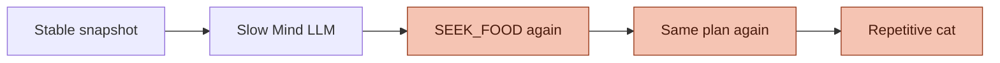
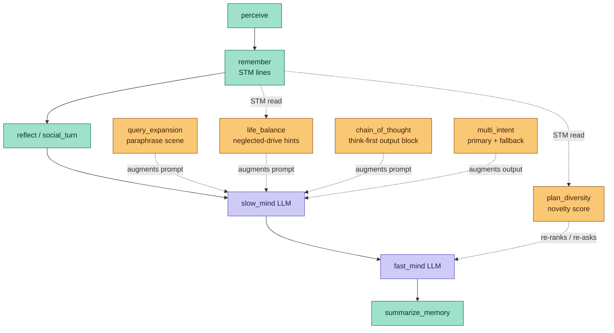
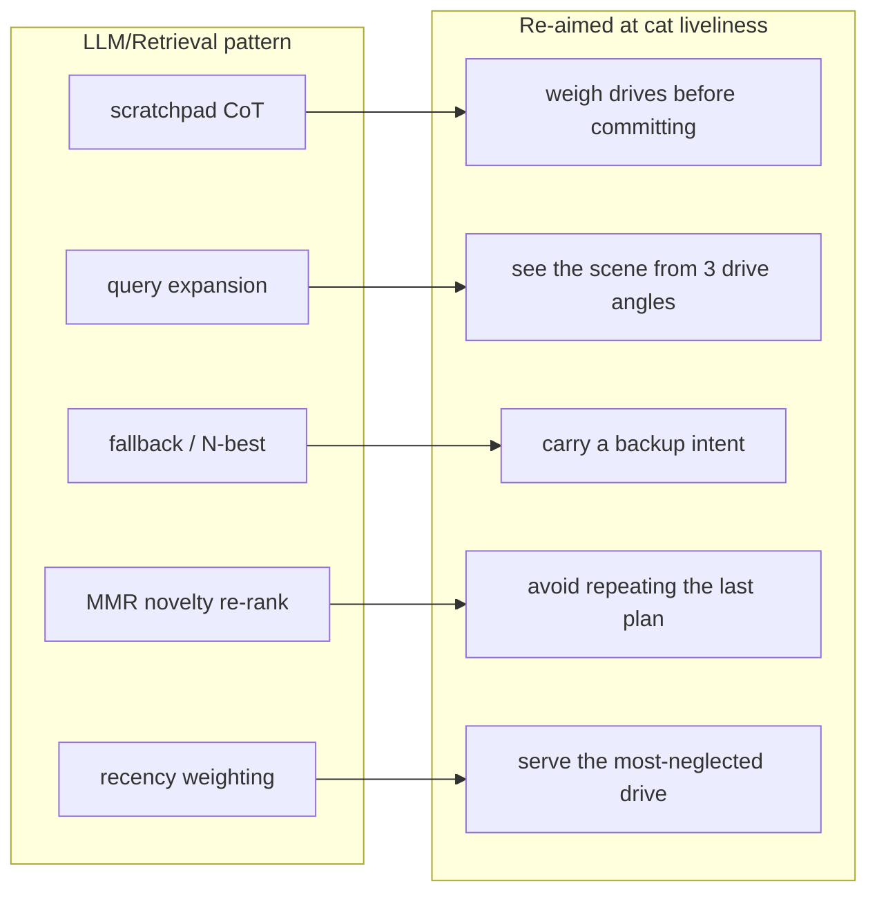
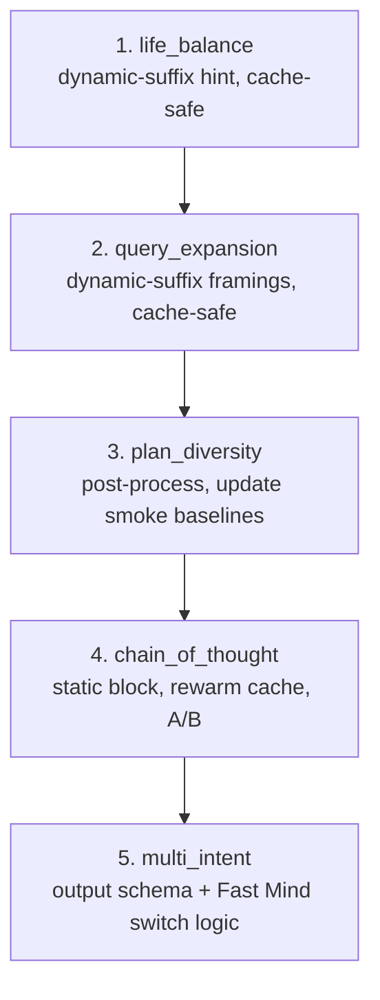

# ADR-016: Agent Behavioral-Optimization Toolkit (`agent/optimize/`)

- **Status:** Proposed — the toolkit is implemented under
  `mewi-backend/app/agent/optimize/` but is **not yet wired** into the live
  slow/fast-mind graph. It is an opt-in library; callers compose it where they
  want richer behaviour.
- **Date:** 2026-05-23
- **Scope:** `mewi-backend/app/agent/optimize/**`
  (`chain_of_thought.py`, `query_expansion.py`, `multi_intent.py`,
  `plan_diversity.py`, `life_balance.py`)
- **Builds on:** [ADR-006](ADR-006-place-memory-reflect-loop.md) (slow/fast mind
  split), [ADR-009](ADR-009-python-owned-cat-memory.md) (Python-owned STM the
  toolkit reads), [ADR-015](ADR-015-place-memory-and-prompt-cache-cleanup.md)
  (static/dynamic prompt split these helpers must respect)

## Context

After the slow/fast-mind split ([ADR-006](ADR-006-place-memory-reflect-loop.md)),
the cat plans correctly but **lives repetitively**. Two failure shapes show up
in playtests:

1. **Drive lock-in.** Slow Mind default-picks `SEEK_FOOD` whenever fullness is
   low, which silently starves curiosity, social, and rest. The cat stops
   feeling alive.
2. **Plan echo.** The same snapshot produces the same intent produces the same
   plan (`smell → go_to fish → eat`) tick after tick, because the LLM is
   (near-)deterministic on stable input.

The crucial enabling fact is [ADR-005](ADR-005-movement-reliability-watchdog.md):
**any action the backend chooses will physically execute** (Unity warps if it
must). So the backend is free to *widen the space of plausible behaviours*
without worrying about whether the body can carry them out. The lever we have is
the prompt and the post-processing around the two LLM calls — not new motor
code.

## Decision

Add a small, **pure-Python, side-effect-free** toolkit under
`agent/optimize/`. Each module is one independent technique borrowed from the
LLM/retrieval playbook and re-aimed at *behavioural variety*. They are **opt-in
helpers**: the existing slow/fast pipeline keeps working untouched, and a caller
composes a technique only where it wants the extra behaviour.

Keeping them out-of-band (rather than editing `mind/slow.py` directly) is
deliberate — see "Why opt-in, why not wired yet" below.

| Module | Borrowed pattern | What it does | Plugs into |
|---|---|---|---|
| `chain_of_thought.py` | scratchpad / think-before-answer | Adds a `thought` field the model fills *before* the intent, weighing typed need-blocks against BODY state. | Slow Mind **prompt** (output-format block) |
| `query_expansion.py` | retrieval query expansion | Derives 1–3 paraphrased framings of the same scene (food / explore / social angle) from data already in context — no hallucination. | Slow Mind **prompt** (perception section) |
| `multi_intent.py` | primary + fallback planning | Slow Mind emits a primary *and* a fallback intent serving a different need, so a blocked primary doesn't loop. Includes a legacy-shape parser. | Slow Mind **output schema** + Fast Mind switch logic |
| `plan_diversity.py` | novelty / MMR re-ranking | Scores a Fast Mind plan's novelty (0–1) against the last N plan signatures in STM, so the executor can prefer non-repetitive sequences or re-ask. | Fast Mind **post-processing** |
| `life_balance.py` | recency / staleness weighting | Counts "ticks since each drive was last served" from STM and emits DECISION-FOCUS hints nudging the most-neglected drive. | Slow Mind **prompt** (decision-focus section) |

### Where each technique would attach

Three of the five touch only the **prompt** (no schema change downstream); one
changes the Slow Mind **output schema** (`multi_intent`); one is pure
**post-processing** on the Fast Mind plan (`plan_diversity`). None of them call
an LLM themselves or touch Redis/Supabase — they are cheap enough to run every
tick.

### Why these are LLM-pattern borrowings, not ad-hoc hacks

## Why opt-in, why not wired yet

This is the part that matters for a reader deciding whether to turn these on.

1. **Behavioural change needs A/B, not a merge.** Each technique trades tokens
   or a schema change for *hoped-for* variety. Whether `chain_of_thought`
   actually de-locks `SEEK_FOOD`, or just inflates the prompt, is an empirical
   question. Landing them as a library lets us flip one on, watch the cat, and
   keep or drop it — without destabilising the pipeline every other ADR depends
   on.
2. **Prompt-cache discipline ([ADR-015](ADR-015-place-memory-and-prompt-cache-cleanup.md)).**
   The Slow Mind prompt is split into a byte-stable static block (cached on
   Anthropic) and a small dynamic suffix. `chain_of_thought` rewrites the
   OUTPUT-FORMAT block (static) and `multi_intent` changes the output schema —
   both **invalidate the cache** until it rewarms. `query_expansion` and
   `life_balance` inject into the dynamic suffix, which is cache-safe. Wiring
   must respect that boundary, so it is a deliberate step, not a default-on.
3. **Determinism for tests.** The graph test-suite asserts identical output for
   identical input. `plan_diversity` (novelty) and `multi_intent` (extra field)
   change observable output; turning them on means updating the smoke
   baselines. Keeping them opt-in keeps the current suite green.
4. **One concern per file, composable.** A caller can adopt `life_balance`
   alone (pure prompt hint, cache-safe, no schema change) and leave the rest.
   Bundling them would force all-or-nothing.

## Consequences

**Benefits**
- The stable slow/fast pipeline is untouched; zero regression risk today.
- Each technique is independently unit-testable as a pure function and can be
  enabled one at a time behind a flag.
- The techniques are documented and discoverable instead of living as informal
  prompt tweaks scattered in `mind/`.

**Tradeoffs / risks**
- **Dead-code risk.** Until something imports them, these modules can rot
  against the prompt/STM shapes they parse (e.g. the `"Next intent X"` /
  `"became plan: ..."` STM line formats `life_balance` and `plan_diversity`
  regex against). Mitigation: add parser unit tests when the first technique is
  wired, and treat the STM line format as a contract.
- **Cache and test costs** as noted above must be paid at wiring time.
- Two of the five (CoT, multi-intent) increase per-tick token cost; they should
  be measured against the [ADR-015](ADR-015-place-memory-and-prompt-cache-cleanup.md)
  budget before staying on.

## Adoption plan (when we turn these on)

Order chosen so the cache-safe, schema-stable, deterministic-friendly wins land
first:

1. **`life_balance`** — append `life_balance_focus_lines(memory_context)` to the
   DECISION FOCUS block. Dynamic suffix, cache-safe, no schema change.
2. **`query_expansion`** — feed `inject_paraphrased_perceptions(context)` into
   the perception section. Dynamic suffix, cache-safe.
3. **`plan_diversity`** — score Fast Mind output with
   `score_plan_novelty(plan, memory_context)`; below a threshold, re-ask once.
   Post-processing only; update smoke baselines.
4. **`chain_of_thought`** — `augment_slow_mind_with_cot(static_text)`. Touches
   the cached static block; A/B for behaviour gain vs. token cost before
   keeping.
5. **`multi_intent`** — adopt the primary+fallback output schema and the Fast
   Mind switch-to-fallback logic. The largest change; do last.

Each step is independently revertible: drop the call, the pipeline returns to
its ADR-006 behaviour.

## Acceptance checks (per technique, at wiring time)

- `life_balance`: after N ticks of `SEEK_FOOD`, the prompt gains an EXPLORE/
  SOCIALIZE/REST opportunity hint and the cat measurably rotates drives.
- `query_expansion`: the perception section gains ≤3 framings, all traceable to
  existing context fields (no invented entities/targets).
- `multi_intent`: a blocked primary makes the next tick use the fallback's
  *different* need instead of re-picking the primary.
- `plan_diversity`: an identical-to-last plan scores `0.0`; a fully new plan
  scores `1.0`.
- `chain_of_thought`: the Slow Mind JSON carries a non-empty `thought` that
  names the strongest competing need; cache rewarms on the second tick.
