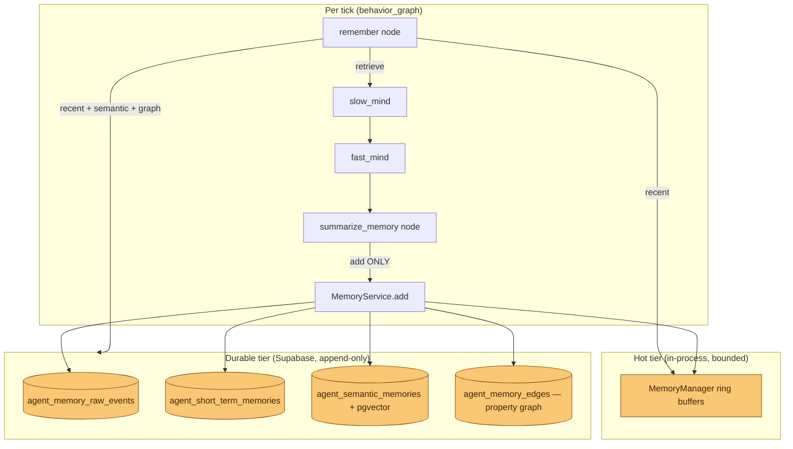

# ADR-017: Mem0-Style Cat Memory — ADD-Only Writes, Hybrid Retrieve, Property-Graph Edges

- **Status:** Proposed
- **Date:** 2026-05-30
- **Scope:** `mewi-backend/app/services/memory/memory_service.py`,
  `mewi-backend/app/agent/memory/**`,
  `mewi-backend/app/repositories/memory_repo.py`,
  `mewi-backend/app/core/supabase/migration.sql`
  (new tables `agent_semantic_memories`, `agent_memory_edges`),
  `mewi-backend/app/services/perception/embedding_service.py` (reused)
- **Builds on:** [ADR-009](ADR-009-python-owned-cat-memory.md) (Python owns cat
  memory), [ADR-003](ADR-003-agent-runtime-architecture.md) (perception/memory
  split), [ADR-006](ADR-006-place-memory-reflect-loop.md) (slow/fast mind loop)
- **Relates to:** [ADR-016](ADR-016-agent-behavioral-optimization-toolkit.md)
  (query-expansion can feed the retrieve step)

## Context

Cat memory today (ADR-009) is **write-only at the durable layer**. The tick
loop:

1. `remember` reads only the hot in-process ring buffer
   ([`MemoryManager.recall`](../../mewi-backend/app/agent/memory/manager.py)),
   `last_n=5` recent ticks.
2. Slow/Fast Mind decide.
3. `summarize_memory` writes a raw event + short-term aspect rows to Supabase
   via [`MemoryService.record_turn_memory`](../../mewi-backend/app/services/memory/memory_service.py).

The durable rows in `agent_memory_raw_events` / `agent_short_term_memories` are
never read back. When a cat's process restarts, or when we want memory older
than the ring buffer, it is gone from the cat's point of view. There is no
semantic recall ("have I smelled fish near the dock before?") and no relational
memory ("Haru is the cat I groomed twice"). `EmbeddingService` and
`SemanticService.generate_embedding()` already exist but are not connected to
storage. The `vector` (pgvector) extension was used by earlier tables and
dropped (see `migration.sql` teardown notes).

We want to adopt the **mem0** mental model the user sketched:

```python
def process_interaction(query, user_id, agent_id):
    memories = hybrid_search(query, user_id, agent_id)   # 1. retrieve
    context  = format_context(memories)
    response = llm_generate(query, context)              # 2. generate
    facts    = extract_facts(query, response)
    add_memories(facts, user_id, agent_id)               # 3. ADD-only store
    return response
```

Three properties matter to us:

1. **ADD-only.** Memory is append-only. We never UPDATE or DELETE a memory row
   in the hot path; supersession/decay is a separate, auditable concern. This
   keeps writes idempotent-friendly, race-free across cats, and replayable.
2. **Retrieve recent (and relevant) memory.** The retrieve step must reach
   *durable* memory, not just the ring buffer, and rank by recency + semantic
   similarity.
3. **Graph memory with property edges.** Some memory is relational — entities
   (cats, players, places, food) connected by typed, attributed edges.

### On the graph-database question

Supabase is **plain Postgres**; it does **not** offer a managed graph database.
Options considered:

| Option | Verdict |
|---|---|
| **Apache AGE** (openCypher in Postgres) | Rejected for now. Not enabled on Supabase's hosted tier; self-hosting adds an extension + a query language the rest of the codebase doesn't use. |
| **Neo4j / external graph store** | Rejected. New infra, new ops, a second source of truth to keep consistent with Supabase. Over-scoped for a per-cat agent. |
| **Relational edge table** (property graph as rows) | **Chosen.** A property graph *is* `(subject)-[predicate {props}]->(object)`. One `agent_memory_edges` table models that with no new infra, normal indexes, and joins we already use. |
| **pgvector** for semantic recall | **Chosen** (re-enable the extension). Reuses `EmbeddingService`. |

A property graph does not require a graph engine — it requires typed edges with
properties. Postgres rows give us exactly that, and we can graduate to AGE later
behind the same service API if traversal depth ever demands it.

## Decision

Keep `MemoryService` as the **single facade** the graph node talks to, but make
it express the three mem0 verbs explicitly and delegate to small, testable
collaborators. No business logic moves into the repository (it stays a row
mapper, per ADR-009).

### 1. Three memory tiers, one ADD-only contract



- **Hot tier** — unchanged `MemoryManager` ring buffers (recency, fast).
- **Durable tier** — append-only rows. Existing raw + short-term tables stay.
  **Two new tables**:
  - `agent_semantic_memories` — extracted facts as text + `vector` embedding,
    for similarity recall.
  - `agent_memory_edges` — the property graph (typed, attributed edges).

**ADD-only is a contract, not just current behavior:** the write API only ever
`INSERT`s. There is no `update_memory` / `delete_memory` in the hot path.
Forgetting is handled out-of-band (retention job / salience decay at read time),
so it can never corrupt a live tick.

### 2. `MemoryService` API — the three verbs

`MemoryService` gains explicit `add` and `retrieve` methods alongside the
existing `record_turn_memory` (kept as a thin alias so the graph node and tests
don't break):

```python
class MemoryService:
    def add(self, memory, write, *, facts=None) -> AddResult:
        """ADD-only. Hot ring buffer + raw/short-term rows + (new) semantic
        rows + (new) graph edges. Never updates or deletes."""

    def retrieve(self, runtime, query, *, last_n=5, k=8) -> MemoryRecall:
        """Hybrid recall: recent (hot + durable) ∪ semantic (pgvector) ∪
        graph-adjacent facts, merged and ranked for the prompt."""

    # Back-compat facade over add()
    def record_turn_memory(self, memory, write): ...
```

New collaborators (small, single-purpose, easy to maintain):

- **`FactExtractor`** (`app/agent/memory/extractor.py`) — turns a completed turn
  (`TurnMemoryWrite` + slow/fast mind output) into atomic, embeddable
  `SemanticFact`s and `MemoryEdge`s. Deterministic/code-first to start (reuse
  `SemanticService` phrasing); an LLM extractor can slot in behind the same
  interface later.
- **`MemoryRetriever`** (`app/agent/memory/retriever.py`) — runs the hybrid
  search: recent rows by `(creature_id, tick DESC)`, semantic neighbors by
  cosine distance, and one-hop edge expansion; dedupes and ranks.

The graph node change is minimal:

- `remember` → `MemoryService.retrieve(runtime, query=…)` instead of
  hot-only `runtime.remember(last_n=5)`.
- `summarize_memory` → `MemoryService.add(...)` (extraction happens inside).

### 3. New durable tables (append-only)

```sql
-- Re-enable for semantic recall (dropped earlier; see migration teardown notes)
CREATE EXTENSION IF NOT EXISTS vector;

-- Extracted, embeddable facts — ADD-only
CREATE TABLE IF NOT EXISTS agent_semantic_memories (
  id           uuid DEFAULT gen_random_uuid() PRIMARY KEY,
  creature_id  text NOT NULL,
  tick         integer NOT NULL,
  request_id   text DEFAULT '',
  raw_event_id uuid REFERENCES agent_memory_raw_events(id) ON DELETE SET NULL,
  aspect       text NOT NULL DEFAULT 'general',
  text         text NOT NULL,
  embedding    vector(1536),               -- text-embedding-3-small
  salience     float DEFAULT 0.0,
  evidence     jsonb NOT NULL DEFAULT '{}',
  created_at   timestamptz DEFAULT now() NOT NULL
);
CREATE INDEX IF NOT EXISTS idx_agent_semantic_creature_tick
  ON agent_semantic_memories(creature_id, tick DESC);
CREATE INDEX IF NOT EXISTS idx_agent_semantic_embedding
  ON agent_semantic_memories USING ivfflat (embedding vector_cosine_ops);

-- Property graph: (subject) -[predicate {properties}]-> (object) — ADD-only
CREATE TABLE IF NOT EXISTS agent_memory_edges (
  id             uuid DEFAULT gen_random_uuid() PRIMARY KEY,
  creature_id    text NOT NULL,            -- whose memory this edge belongs to
  tick           integer NOT NULL,
  subject_type   text NOT NULL,            -- 'cat' | 'player' | 'place' | 'food' | 'self'
  subject_id     text NOT NULL,
  predicate      text NOT NULL,            -- 'groomed' | 'fled_from' | 'ate_at' | 'near' ...
  object_type    text NOT NULL,
  object_id      text NOT NULL,
  properties     jsonb NOT NULL DEFAULT '{}',  -- edge attributes (count, mood, distance...)
  created_at     timestamptz DEFAULT now() NOT NULL
);
CREATE INDEX IF NOT EXISTS idx_agent_edges_subject
  ON agent_memory_edges(creature_id, subject_type, subject_id, tick DESC);
CREATE INDEX IF NOT EXISTS idx_agent_edges_object
  ON agent_memory_edges(creature_id, object_type, object_id, tick DESC);
CREATE INDEX IF NOT EXISTS idx_agent_edges_predicate
  ON agent_memory_edges(creature_id, predicate, tick DESC);
```

Because edges are ADD-only, a "relationship" is the *aggregate* of its rows
(e.g. `count(*) WHERE predicate='groomed' AND object_id='haru'`), computed at
read time. No row is ever mutated, so concurrent cats never contend.

### 4. mem0 `process_interaction` ↔ our tick loop

| mem0 step | Mewi tick equivalent |
|---|---|
| `hybrid_search(query, user_id, agent_id)` | `MemoryService.retrieve(runtime, query)` — hot + semantic + graph, scoped by `creature_id` |
| `format_context(memories)` | existing `MemoryRecall.to_prompt_context()` / `short_term_lines()` |
| `llm_generate(query, context)` | Slow Mind + Fast Mind nodes |
| `extract_facts(query, response)` | `FactExtractor` inside `summarize_memory` |
| `add_memories(...)` (ADD-only) | `MemoryService.add(...)` — INSERT across the four tables |

`user_id`/`agent_id` map to our `creature_id` (and, where relevant, the
observed player/cat id on an edge).

## Phased delivery

1. **Retrieve from durable recent** — wire `MemoryRetriever` to read existing
   raw/short-term rows so memory survives restart. No schema change. (Smallest,
   highest value.)
2. **Semantic tier** — re-enable `vector`, add `agent_semantic_memories`, embed
   on `add`, add cosine recall to `retrieve`.
3. **Graph tier** — add `agent_memory_edges`, deterministic `FactExtractor`
   edges, one-hop expansion in `retrieve`.
4. **(Optional later)** LLM-based fact extraction; salience decay / retention
   job; AGE if traversal depth demands it.

## Consequences

**Positive**

- Memory becomes **durable and recall-able**, not just write-and-forget; cats
  remember across restarts and beyond the ring-buffer window.
- **ADD-only** keeps the hot path race-free and replayable; forgetting is an
  isolated, auditable concern.
- **No new infrastructure** — property graph and semantic search both live in
  the existing Supabase Postgres; reuses `EmbeddingService`.
- `MemoryService` stays the single facade; new logic is in small collaborators
  (`FactExtractor`, `MemoryRetriever`) that are unit-testable without a DB.
- Backward compatible: `record_turn_memory` and `MemoryRecall` are preserved.

**Negative / accepted trade-offs**

- Re-enabling `pgvector` and embedding on write adds an OpenAI/embedding call per
  fact (batch + cache; skip when `EmbeddingService` is absent — degrade to
  recency-only, matching today's graceful `no_store` behavior).
- Append-only edges grow unbounded; needs a retention/decay job before
  long-running production (deferred to phase 4).
- Aggregating relationships at read time costs a query per hop; acceptable at
  one hop with the indexes above, and the reason we cap traversal depth.
- `ivfflat` needs an index build / `lists` tuning as row counts grow; trivial at
  per-cat scale, noted for later.
