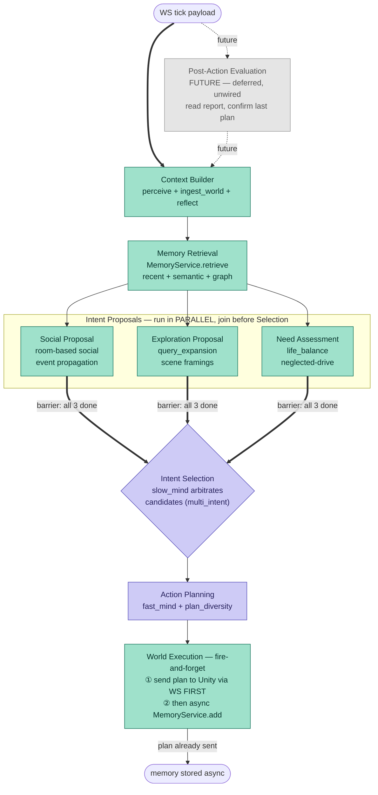
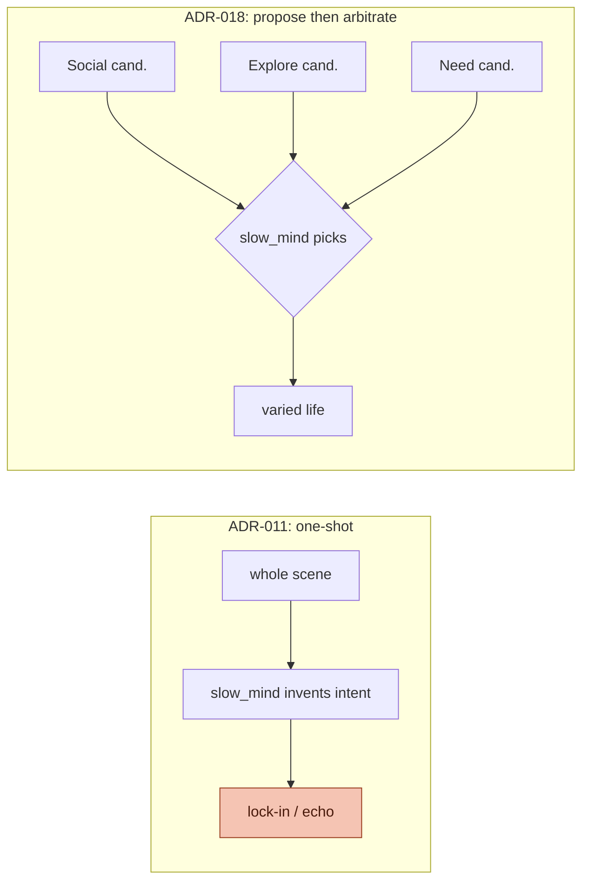
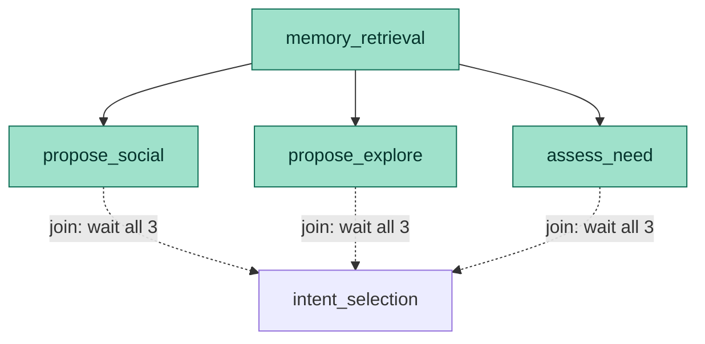

# ADR-018: Proposal–Arbiter Tick Graph — Wiring the Optimization Toolkit and Hybrid Memory

- **Status:** Proposed
- **Date:** 2026-05-30
- **Scope:** `mewi-backend/app/agent/behavior_graph.py`,
  `mewi-backend/app/agent/creature_runtime.py`,
  `mewi-backend/app/agent/mind/slow.py`, `mewi-backend/app/agent/mind/fast.py`,
  `mewi-backend/app/agent/optimize/**` (promoted from opt-in to wired),
  `mewi-backend/app/agent/propose/**` (new — proposal nodes),
  `mewi-backend/app/services/memory/memory_service.py` (retrieve/add, ADR-017),
  `mewi-backend/app/workers/agent_tick_worker.py` (post-action report)
- **Builds on:** [ADR-011](ADR-011-tick-graph-and-social-service.md) (the as-built
  linear 8-node graph this reshapes), [ADR-016](ADR-016-agent-behavioral-optimization-toolkit.md)
  (the opt-in toolkit this finally wires in), [ADR-017](ADR-017-mem0-style-memory-add-retrieve-graph.md)
  (hybrid retrieve / ADD-only store)
- **Relates to:** [ADR-006](ADR-006-place-memory-reflect-loop.md) (slow/fast split
  the arbiter inherits), [ADR-008](ADR-008-goal-event-bus-plan-step-feedback.md)
  (the world-confirmed report Post-Action Evaluation reads),
  [ADR-015](ADR-015-place-memory-and-prompt-cache-cleanup.md) (prompt-cache
  discipline the arbiter prompt must keep), [ADR-005](ADR-005-movement-reliability-watchdog.md)
  (every chosen action physically executes, so we may widen the intent space freely)

## Context

The as-built tick graph ([ADR-011](ADR-011-tick-graph-and-social-service.md)) is a
straight line:

```
perceive → remember → ingest_world → reflect → social_turn → slow_mind → fast_mind → summarize_memory
```

It works, but three things it *should* do, it doesn't:

1. **One mind does all the deciding.** `slow_mind` is handed the whole scene and
   asked to pick an intent in a single shot. That is exactly the **drive lock-in**
   and **plan echo** failure ADR-016 named: a stable snapshot yields the same
   `SEEK_FOOD`, the same plan, tick after tick. The recent commit log says it out
   loud — *"they are not socializing as much"* (commit `0c04f55`).
2. **The optimization toolkit is dead code.** [ADR-016](ADR-016-agent-behavioral-optimization-toolkit.md)
   built `query_expansion`, `life_balance`, `multi_intent`, `plan_diversity` as
   pure, tested functions — and then *nothing imports them*. They were filed
   opt-in precisely because there was no clean seam to attach them to a linear
   graph without rewriting `slow_mind`'s prompt in place.
3. **Memory is write-only.** `remember` reads only the hot ring buffer; the
   durable rows [ADR-017](ADR-017-mem0-style-memory-add-retrieve-graph.md) defines
   are never read back. Memory should feed the proposers, not just accumulate.

The user sketched a different shape: build context, retrieve memory, let **several
specialised proposers** each argue for an intent in **parallel**, **arbitrate**
between them, plan, then fire the plan to Unity and store memory. That is a
**blackboard / proposal–arbiter** loop, and it is the natural home for the work
already filed: each ADR-016 module *is* a proposer and ADR-017 retrieve *is* the
memory step.

The enabling constraint is unchanged from ADR-016: by
[ADR-005](ADR-005-movement-reliability-watchdog.md) **any intent we pick will
physically execute** — Unity's watchdog repaths-then-warps so the action *always*
lands. Two consequences shape this ADR:

- We may widen the candidate set freely; it costs nothing in the body, only in
  the prompt and the cheap Python around it.
- Because execution is guaranteed, the backend can **fire-and-forget**: send the
  plan and assume success. Reading the previous report back to *confirm* success
  is therefore a **future** refinement (Post-Action Evaluation), not something the
  loop needs today — it is drawn in the graph but deliberately left unwired.

## Decision

Reshape the linear graph into a **propose → select → plan** loop. The two LLM
calls stay exactly where they were (one to *select* an intent, one to *plan*
steps) — everything new is deterministic Python, so the per-tick LLM budget from
[ADR-011](ADR-011-tick-graph-and-social-service.md) / [ADR-015](ADR-015-place-memory-and-prompt-cache-cleanup.md)
**does not change**.



Today's live path is the bold edge `Context Builder → … → World Execution`.
Post-Action Evaluation is greyed because it is **deferred** (see below), and World
Execution does **not** block the tick — it pushes the plan to Unity, then stores
memory asynchronously.

### How the new nodes map to existing code

Nothing here is built from scratch — every node is an existing collaborator,
re-seated. The point of the ADR is the **wiring**, not new machinery.

| New node | LLM? | What it is, in terms of code we already have |
|---|---|---|
| **Post-Action Evaluation** | code | **Future — deferred, not wired today.** Would read `raw_payload.report` (the world-confirmed outcome from [ADR-008](ADR-008-goal-event-bus-plan-step-feedback.md)) and mark the last intent succeeded/blocked. Not needed yet because Unity's watchdog ([ADR-005](ADR-005-movement-reliability-watchdog.md)) guarantees the action executes — the backend fires-and-forgets and assumes success. Drawn so the seam is reserved; wiring it is a later refinement. |
| **Context Builder** | code | The old `perceive` + `ingest_world` + `reflect` nodes, fused. Same outputs (`perception`, `world_view`, `place_memory_context`); one node instead of three because they have no ordering choice between them. |
| **Memory Retrieval** | code | `remember` upgraded to `MemoryService.retrieve(runtime, query)` ([ADR-017](ADR-017-mem0-style-memory-add-retrieve-graph.md)) — hot ring buffer ∪ durable recent ∪ pgvector ∪ one-hop graph, instead of hot-only `last_n=5`. |
| **Social Proposal** | code | `social_turn` ([ADR-011](ADR-011-tick-graph-and-social-service.md)) reframed: still runs the `SocialService` room turn, but its output is now a *candidate* `SOCIALIZE` intent (with target + room transcript), not a side-channel the arbiter may ignore. |
| **Exploration Proposal** | code | `optimize/query_expansion.py` — `expand_situation_framings(context)` produces ≤3 traceable framings → a candidate `EXPLORE`/`INVESTIGATE` intent toward the frontier hint. |
| **Need Assessment** | code | `optimize/life_balance.py` — `compute_life_balance(memory_context)` counts ticks-since-each-drive-served → a candidate intent for the most-neglected drive (`REST`, `SEEK_FOOD`, `SEEK_PLAYER`, …). |
| **Intent Selection** | **LLM** | `slow_mind` ([ADR-006](ADR-006-place-memory-reflect-loop.md)), re-prompted as an **arbiter**: instead of inventing an intent from raw scene, it is handed the 3 structured candidates (and, *once Post-Action Evaluation is wired*, the success/blocked verdict) and chooses — possibly emitting a fallback via `optimize/multi_intent.py`. One LLM call, as today. |
| **Action Planning** | **LLM** | `fast_mind`, plus `optimize/plan_diversity.py` post-processing: `score_plan_novelty(plan, memory_context)`; below threshold, re-ask once so the cat stops echoing its last plan. One LLM call. |
| **World Execution** | code | **Fire-and-forget terminal node**, not a blocking step. ① emits the plan as the graph's final result so the worker sends it to Unity over WebSocket **first**; ② **then** stores this tick's facts/edges via `MemoryService.add(...)` ([ADR-017](ADR-017-mem0-style-memory-add-retrieve-graph.md), ADD-only) **asynchronously**, off the tick's critical path. Unity never waits on the DB write. |

### Why "propose then arbitrate" instead of "one mind decides"

The linear graph asks `slow_mind` to do two jobs at once: *enumerate what's worth
doing* and *choose*. The LLM is mediocre at the first (it forgets the neglected
drive, doesn't re-frame the scene) and fine at the second. So we split them:

- **Enumeration is cheap, deterministic, and exhaustive in code.** Each proposer
  is a pure function over context+memory that *always* fires its angle — Need
  Assessment will *always* surface the most-starved drive even when fullness is
  low and the LLM would tunnel on food. This is the structural fix for drive
  lock-in that ADR-016 could only hint at from the prompt margin.
- **Selection stays the LLM's job**, but now over a *small, labelled candidate
  set* (later joined by the evaluation verdict) — a far easier, more steerable
  call than free-forming an intent from the whole scene.



### Cost and cache discipline stay intact

- **Still two LLM calls per tick** (Selection, Planning). The three proposers and
  both new code nodes call no LLM and touch no network — they are the same pure
  ADR-016 functions, cheap enough to run every tick. Social Proposal's optional
  LLM moderator remains gated behind the room-existence check exactly as in
  [ADR-011](ADR-011-tick-graph-and-social-service.md).
- **Prompt cache ([ADR-015](ADR-015-place-memory-and-prompt-cache-cleanup.md)).**
  The candidate list is injected into the Slow Mind **dynamic suffix**, not the
  cached static block — cache-safe. Adopting the `multi_intent` output schema
  *does* touch the schema, so it rewarms once and smoke baselines update; this is
  the same cost ADR-016 already booked for that technique, paid here intentionally.

### The proposers run in parallel and join before Selection

The three proposers fan out from Memory Retrieval and fan back into Intent
Selection. They write **disjoint** keys of `CreatureRuntimeState`
(`social_candidate`, `explore_candidate`, `need_candidate`), so LangGraph runs
them **concurrently** with no merge conflict. Intent Selection is a **join
(barrier)**: LangGraph holds it until *all three* proposers have completed, then
the arbiter reads the full candidate set in one pass. The arbiter never sees a
partial set — it either has all three candidates or the tick has not reached it.



Because the proposers are pure and independent, parallelism is free correctness —
the join is the only synchronisation point, and disjoint keys mean there is no
reducer to reason about.

### World Execution is fire-and-forget, not a confirmation gate

The terminal node does two things, **in this order**, and blocks the tick on
neither:

1. **Send the plan to Unity first.** The compiled plan is the graph's result;
   `AgentTickWorker.publish_result` pushes it over the WebSocket immediately. By
   [ADR-005](ADR-005-movement-reliability-watchdog.md) Unity *will* execute it, so
   the backend does not wait for, or read back, an acknowledgement.
2. **Then store memory asynchronously.** `MemoryService.add(...)` (ADD-only,
   [ADR-017](ADR-017-mem0-style-memory-add-retrieve-graph.md)) runs off the
   critical path. A slow or failed DB write delays the *next* tick's richer
   recall, never *this* tick's plan delivery — matching today's graceful
   degrade-to-recency behaviour when storage is unavailable.

This is why **Post-Action Evaluation is deferred**: confirming the previous plan
only matters once the backend stops assuming success. As long as Unity guarantees
execution, fire-and-forget is correct and the report-reading node is dead weight.
We reserve its place at the head of the graph so wiring it later is an edge swap,
not a reshape.

## Phased delivery

Each phase leaves the graph runnable and is independently revertible, so we never
hold a broken pipeline. Ordered cache-safe / deterministic-friendly first, exactly
as ADR-016's adoption plan prescribed.

1. **Fuse + retrieve, no new behaviour.** Collapse `perceive`/`ingest_world`/
   `reflect` into Context Builder; swap `remember` for `MemoryService.retrieve`
   (ADR-017 phase 1 — durable recent only). Output identical intents; smoke suite
   stays green. *Memory now survives restart.*
2. **Proposers as parallel nodes (read-only candidates).** Wire `life_balance`
   (Need Assessment) and `query_expansion` (Exploration), plus Social Proposal
   from the existing `social_turn`, as a concurrent fan-out joining at Intent
   Selection. Arbiter prompt gains the candidate block in the dynamic suffix.
   *Drive rotation should appear here* — this is the socialisation/variety fix.
3. **Arbiter schema + plan diversity.** Adopt `multi_intent` primary+fallback
   output and `plan_diversity` re-ask. Schema change → rewarm cache, update smoke
   baselines. (ADR-016 steps 3 & 5, paid once.)
4. **Fire-and-forget ADD-only write.** World Execution sends the plan to Unity,
   then calls `MemoryService.add(...)` (ADR-017 phases 2–3: semantic + graph)
   asynchronously, so today's facts feed tomorrow's retrieval without delaying the
   plan.
5. **(Future) Post-Action Evaluation.** Only once we want the backend to stop
   assuming success: add the report-reading node at the head of the graph and
   thread a succeeded/blocked verdict into the arbiter's dynamic suffix.
   Cache-safe, but unneeded while Unity's watchdog guarantees execution — so it
   stays deferred.

## Consequences

**Positive**

- **The toolkit stops being dead code.** ADR-016's four modules become live graph
  nodes with a real seam, retiring the "dead-code rot" risk that ADR named.
- **Structural fix for drive lock-in / plan echo**, not a prompt nudge: a starved
  drive is *always* a candidate (Need Assessment) and a repeated plan is *always*
  re-asked (plan diversity). This is the concrete answer to "not socializing as
  much."
- **Memory feeds behaviour.** ADD-only write (fire-and-forget) feeds next tick's
  retrieve, which feeds the proposers — the cat learns within a session and across
  restarts, without ever delaying plan delivery.
- **Fire-and-forget keeps Unity unblocked.** The plan ships before the DB write;
  a slow store costs richer recall next tick, never this tick's responsiveness.
  Closing the loop with Post-Action Evaluation is reserved for when the backend
  stops trusting Unity's execution guarantee — drawn, not yet needed.
- **No new infra, no extra LLM calls.** Same two calls, same Supabase, same cache
  budget. The cost was already paid by ADR-016/017; this ADR is the wiring.
- **Easier, more steerable Selection** — the LLM arbitrates a small labelled set
  instead of free-forming from raw scene.

**Negative / accepted trade-offs**

- **Smoke baselines change** at phases 2–3 (candidate block, multi_intent schema,
  novelty re-ask alter observable output). This is the deferred cost ADR-016
  flagged for those techniques; it lands here.
- **More nodes, more state keys.** The graph is wider; the new `propose/` package
  and the disjoint-key fan-out need their own unit tests (each proposer is a pure
  function, so this is cheap — the value ADR-016 designed for).
- **Arbiter quality depends on candidate quality.** A weak proposer biases the
  choice. Mitigation: proposers are independently testable and individually
  flag-gated, so a bad one can be silenced without touching the graph.
- **Concurrent proposer execution** assumes truly disjoint state writes; if a
  future proposer needs another's output, it must move downstream rather than
  share a key. Documented as an invariant, asserted in tests.

## Acceptance checks

- **Phase 1:** a solo cat tick produces the same intent/plan as under ADR-011, and
  memory retrieved after a worker restart is non-empty (durable recall).
- **Phase 2:** the three proposers run concurrently and Intent Selection fires only
  after all three candidates are present; after N `SEEK_FOOD` ticks, Need
  Assessment emits a non-food candidate and the cat measurably rotates drives; two
  co-located cats produce a `SOCIALIZE` candidate the arbiter can pick.
- **Phase 3:** a blocked primary makes the next tick use the fallback's *different*
  need; an identical-to-last plan scores `0.0` novelty and triggers exactly one
  re-ask.
- **Phase 4:** the plan reaches Unity before `MemoryService.add` completes (the
  write is off the critical path); facts/edges written this tick are returned by
  `MemoryService.retrieve` on the next tick.
- **(Future) Phase 5:** when wired, a tick whose previous report says `go_to`
  failed carries a `last_intent_blocked` verdict into the arbiter's dynamic suffix.
