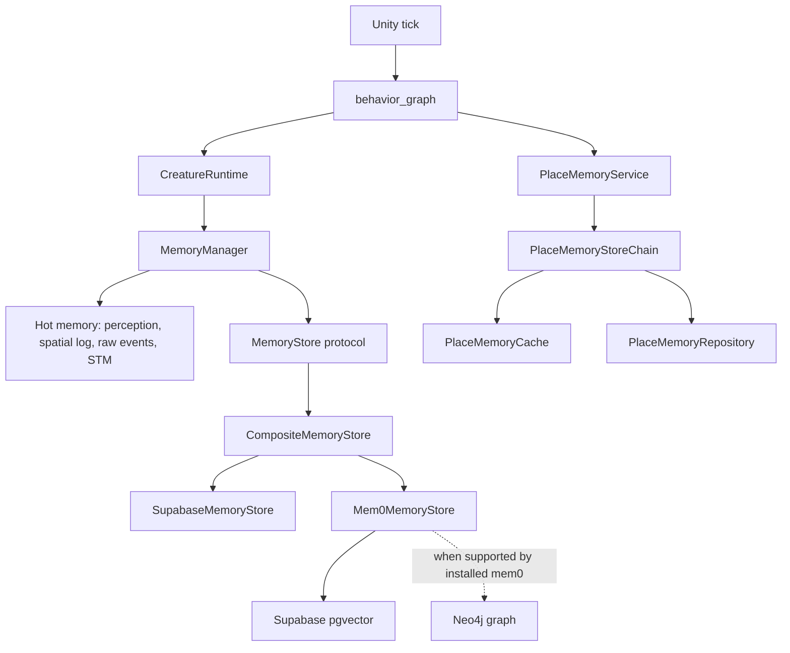
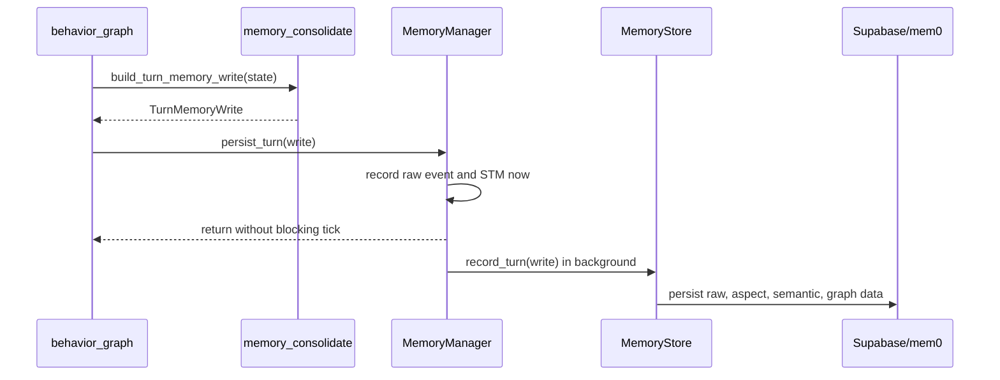

# ADR-020: Thin Agent Memory Layers

Status: Accepted

Date: 2026-06-01

## Context

The memory code had started to split across three similar-looking places:

- `app/agent/memory/`: hot per-creature memory, short-term memory, turn memory
  records, and prompt retrieval.
- `app/services/memory/`: service classes that coordinated memory policy.
- `app/repositories/`: Supabase, Redis, mem0, Neo4j, and other IO adapters.

That shape made it unclear which layer owned meaning. In particular, the old
generic `MemoryService` did very little: it called
`MemoryManager.record_turn_memory(write)` and then called a repository save. It
was a service layer in name, but its behavior was thin enough that it added a
second place to look without adding a real boundary.

The desired model is simpler:

- `MemoryManager` is the per-creature runtime memory ticker. It owns hot memory,
  bounded buffers, short-term memory, raw turn events, consolidation scheduling,
  and the single persistence/recall seam for durable memory.
- Helper modules under `app/agent/memory/` build deterministic turn-memory
  writes and compact short-term memory. They do not own state.
- Repository/store classes do only IO: Supabase rows, Redis cache, mem0 graph
  extraction, Neo4j graph storage, and pgvector storage.
- Place memory is memory policy for the agent prompt, so it belongs with agent
  memory, not in a generic services package.

There are also setup concerns for graph memory:

- `pyproject.toml` defines a `graph-memory` optional extra for `mem0ai`,
  `neo4j`, and `psycopg[pool]` for mem0 pgvector.
- `uv.lock` already contains `mem0ai 2.0.4` and `neo4j 6.2.0`.
- The current `.venv` may still not have that extra installed until
  `uv sync --extra graph-memory` is run.
- `.env.example` documents `MEMORY_GRAPH_ENABLED`, `MEMORY_NEO4J_*`, and
  `MEMORY_PGVECTOR_DSN`, but the active `.env` must set them before graph memory
  can start.
- `lifespan.py` expects `settings.memory`, so `MemorySettings` must exist in
  `app/core/config.py`.
- Local graph-memory development needs either Neo4j Aura or a local Docker
  service listening on `bolt://localhost:7687`.
- Supabase must have pgvector enabled before mem0 can use a pgvector vector
  store through `MEMORY_PGVECTOR_DSN`.
- mem0 config keys can drift between releases, so the adapter should keep the
  config assembly isolated in `mem0_memory_store._build_config` and be tested
  against the installed mem0 version after the extra is installed.

## Decision

Use two memory layers:

1. Agent memory policy under `app/agent/memory/`.
2. Infrastructure stores under `app/repositories/`.

Remove the old generic memory service layer. Do not recreate
`app/services/memory/memory_service.py`.

Move `PlaceMemoryService` to `app/agent/memory/place_memory_service.py`, because
it builds prompt-safe place memory and exploration guidance. It is not a generic
backend service.

Keep concrete durable stores in `app/repositories/`:

- `SupabaseMemoryStore` for raw turn rows and keyword/recent recall.
- `Mem0MemoryStore` for semantic recall via mem0 and pgvector. Neo4j settings
  are accepted, but only passed through when the installed mem0 version exposes
  a `graph_store` config field.
- `CompositeMemoryStore` for fan-out writes and merged reads.
- `PlaceMemoryCache`, `PlaceMemoryRepository`, and `PlaceMemoryStoreChain` for
  place-memory IO.

Keep `MemoryStore` as the only durable-memory protocol visible to
`MemoryManager`.

## Target Structure

```text
app/agent/memory/
  __init__.py
  memory_manager.py
  memory_models.py
  memory_consolidate.py
  memory_store.py
  place_memory_service.py
  retrieval.py

app/repositories/
  composite_memory_store.py
  mem0_memory_store.py
  supabase_memory_store.py
  place_memory_cache.py
  place_memory_repo.py
  place_memory_store.py
```

## Runtime Graph



## Turn Write Flow



## Setup Contract

For Supabase-only durable memory:

1. Run the normal dependency sync.
2. Apply the Supabase migration.
3. Leave `MEMORY_GRAPH_ENABLED=false`.

For graph/vector memory:

1. Run `uv sync --extra graph-memory`.
2. Create Neo4j with either Aura or the local Docker compose service.
3. Enable pgvector in Supabase:

   ```sql
   create extension if not exists vector;
   ```

4. Set:

   ```env
   MEMORY_GRAPH_ENABLED=true
   MEMORY_NEO4J_URL=bolt://localhost:7687
   MEMORY_NEO4J_USERNAME=neo4j
   MEMORY_NEO4J_PASSWORD=...
   MEMORY_PGVECTOR_DSN=postgresql://...
   ```

5. Verify `Mem0MemoryStore.from_settings(...)` against the installed mem0
   version. The adapter isolates `_build_config(...)` specifically because mem0
   config keys have changed across versions.

As of the locally installed `mem0ai 2.0.4`, `MemoryConfig` supports `llm`,
`embedder`, `vector_store`, `history_db_path`, `reranker`, `version`, and
`custom_instructions`; it does not expose `graph_store`. The adapter therefore
uses pgvector semantic recall immediately and logs a warning if Neo4j settings
are present but the installed mem0 cannot consume them.

## Consequences

- There is one place to understand hot per-creature memory:
  `MemoryManager`.
- There is one durable-memory interface:
  `MemoryStore`.
- The old generic service layer is gone.
- Place-memory prompt policy sits beside other agent-memory policy.
- Repositories remain boring IO adapters.
- Startup can build graph memory only when settings, dependencies, Neo4j, and
  pgvector are present.
- mem0 setup risk is contained in one adapter file.

## Implementation Checklist

- Add `MemorySettings` to `app/core/config.py`.
- Move `PlaceMemoryService` from `app/services/memory/` to
  `app/agent/memory/`.
- Update imports and comments.
- Remove `memory_service` compatibility parameters and old service package
  remnants.
- Update migration comments from the deleted `memory_repo.py` to the current
  store files.
- Add local Neo4j compose wiring for developers who do not use Aura.
- Run focused unit tests for memory, place memory, graph workflow, and
  repository adapters.
