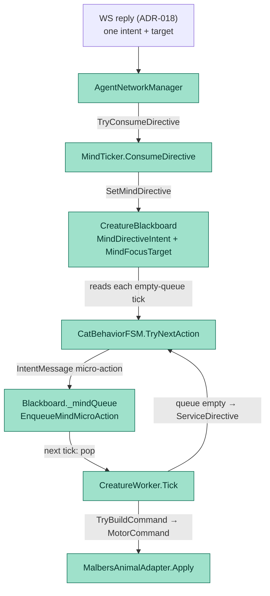

# ADR-021: Directive-Driven Motor FSM — Consuming the Backend Intent on the Unity Side

- **Status:** Superseded by [ADR-022](ADR-022-dispatcher-intent-motor-workers.md)
- **Date:** 2026-06-01
- **Scope:** `mewi-unity/app/Assets/Scripts/AgentIntegration/Bridge/AgentNetworkManager.cs`
  (reply → directive), `mewi-unity/app/Assets/Scripts/AgentIntegration/Bridge/MindTicker.cs`
  (directive intake), `mewi-unity/app/Assets/Scripts/Creature/Core/CreatureBlackBoard.cs`
  (`MindDirectiveIntent` + `SetMindDirective`), `mewi-unity/app/Assets/Scripts/Creature/Motor/ActionFSM/CatBehaviorFSM.cs`
  (intent → state mapping), `mewi-unity/app/Assets/Scripts/Creature/Motor/fsm.md`,
  and the arbitration prompt templates under `mewi-backend/app/agent/arbitration/**`
  (target-id placeholder fix)
- **Builds on:** [ADR-018](ADR-018-proposal-arbiter-tick-graph.md) (the backend now
  returns exactly **one** arbitrated high-level intent + target per tick — the input
  this ADR consumes), [ADR-002](ADR-002-unity-backend-tick-protocol.md) (the tick
  request/reply envelope), [ADR-004](ADR-004-websocket-nested-plan-execution.md)
  (the `plan_steps` path this **retires** on the Unity consume side)
- **Relates to:** [ADR-005](ADR-005-movement-reliability-watchdog.md) (the adapter
  the worker still dispatches to), [ADR-008](ADR-008-goal-event-bus-plan-step-feedback.md)
  (the per-step report the worker keeps emitting on the heartbeat)

## Context

[ADR-018](ADR-018-proposal-arbiter-tick-graph.md) reshaped the backend so a tick no
longer returns a multi-step plan. It returns **one arbitrated high-level intent**:

```json
{ "intent": "SOCIALIZE", "target_id": "mewi_cat", "mood": "...", "style": "...",
  "social_act": { ... }, "reasoning": "..." }
```

The Unity side never caught up to that change. Three things were wrong:

1. **The reply was parsed but never consumed.** `AgentNetworkManager` decoded the
   reply into `_latestPlan` (including `directiveIntent` / `directiveTarget`), but
   the only reader, `TryConsumePlan`, had **zero callers**. `SetMindWeights` /
   `SetMindIntent` were never invoked at runtime either. Net effect: the entire
   backend brain — context build → 3-domain proposal → arbitration — was computed
   every tick and then **discarded**. The snapshot→reply loop was write-only.
2. **The blackboard modeled the wrong contract.** Its directive API was
   `SetMindWeights(weights, focusTarget)` — built for an LLM that *edits a weight
   vector*. The backend does not send weights; it sends one chosen intent. There
   was no field to hold the intent, so `MindFocusTarget` was always `""` and the
   FSM always ran on `defaultWeights`.
3. **The FSM ignored the intent even if it had it.** `CatBehaviorFSM` picked its
   state purely from `weights × live needs`. `MindFocusTarget` was only read inside
   `ActionFor` as a "go here" hint — never to *select* a state. A `SOCIALIZE`
   directive could not force the Socialize state.

The body stack below the intent was already correct and worth preserving:
`CreatureWorker.Tick` drains a single `_mindQueue`, translates each `IntentMessage`
to a `MotorCommand` via `TryBuildCommand`, and dispatches to the one
`MalbersAnimalAdapter` ([ADR-005](ADR-005-movement-reliability-watchdog.md)). When
the queue is empty it calls `ServiceDirective`, which asks the FSM for one
micro-action and enqueues it. That fan-in point is the seam this ADR fills.

## Decision

Wire the backend intent through to the FSM as a **directive**, and let the FSM map
it to a behavior state. Keep exactly **one worker draining one queue** — the FSM is
a policy the worker consults, not a second execution track.



### 1. The reply carries a directive, not a body action

`AgentNetworkManager` keeps `directiveIntent` / `directiveTarget` on `_latestPlan`
and exposes a directive-shaped reader, replacing the dead `TryConsumePlan`:

```csharp
public bool TryConsumeDirective(out string intent, out string target)
```

The high-level intent (`SOCIALIZE`, `EXPLORE`, …) is **never** synthesized into a
literal `_mindQueue` step. (It used to be: the bridge turned `SOCIALIZE` into an
action `"socialize"`, which `TryBuildCommand` then rejected as `unknown_intent`.)
The `plan_steps` / `action` decoding from [ADR-004](ADR-004-websocket-nested-plan-execution.md)
is left in place but inert — the backend no longer emits those fields, so the path
is dead weight kept only for envelope back-compat.

### 2. The blackboard holds the directive

`CreatureBlackboard` gains `MindDirectiveIntent` and one setter that is the **sole
runtime write path** from the LLM reply to the FSM:

```csharp
public string MindDirectiveIntent { get; private set; }      // e.g. "SOCIALIZE"
public void   SetMindDirective(string intent, string focusTarget = "");
```

`SetMindWeights` survives but is demoted to designer-tuned **fallback** scoring; it
no longer carries `focusTarget`.

### 3. MindTicker applies the directive (the reply half of the loop)

`MindTicker` already owns the bridge and sends snapshots. It now also pulls the
directive each frame and writes it to the blackboard — symmetric with `SendSnapshot`,
cheap to poll, self-clearing once consumed:

```csharp
void ConsumeDirective() {
    if (_bridge.TryConsumeDirective(out var intent, out var target))
        _board.SetMindDirective(intent, target);
}
```

The directive **persists until the next reply overwrites it**, so the cat keeps
pursuing the last chosen intent between ticks rather than reverting to defaults.

### 4. The FSM maps intent → state, scoring is the fallback

`CatBehaviorFSM.TryNextAction` now resolves its state from the directive first:

| Backend intent | FSM state |
|---|---|
| `SOCIALIZE`, `SEEK_PLAYER` | Socialize |
| `INVESTIGATE` | Investigate |
| `EXPLORE` | Explore |
| `SEEK_FOOD` | SeekFood |
| `REST` | Rest |
| `SAFETY` | Safety |
| `IDLE` | Idle |

An empty or unknown intent falls back to the existing `weight × need` weighted pick
(the bootstrap case before the first reply lands). `MindFocusTarget` continues to
aim the chosen state's actions (`go_to` / `eat` / `look_at` the target).

### 5. One worker, one queue (the explicit non-decision)

We considered a second worker for the FSM output. **Rejected.** The FSM emits the
same `IntentMessage` type the backend used to, so routing it back through
`_mindQueue` means the existing pop → `TryBuildCommand` → adapter path executes it
unchanged — it cannot tell, and need not care, whether a micro-action came from the
backend or the local FSM:

```
Tick: queue empty  → ServiceDirective → FSM.TryNextAction → EnqueueMindMicroAction
Tick: queue filled → pop → TryBuildCommand → MalbersAnimalAdapter.Apply
```

A second worker would only be justified if the backend sent **multiple concurrent
intents** needing independent execution tracks. It sends exactly one per tick, so a
single worker draining a single queue is the correct, thin shape. There is a
deliberate one-tick latency — the tick that finds the queue empty *enqueues* and
returns; the *next* tick *dispatches* — accepted as one decision per tick.

### 6. Backend prompt fix (related)

All three arbitration `OUTPUT FORMAT` templates literally showed
`"target_id": null`, biasing the model to omit a target even when a valid
affordance existed. Changed to a descriptive placeholder so the model fills the
exact id (the `mewi_cat` / `Boat_2` cases). Pure prompt-string change; no schema or
cache-static change.

## Consequences

**Positive**

- **The backend brain now reaches the body.** The arbitrated intent from
  [ADR-018](ADR-018-proposal-arbiter-tick-graph.md) actually steers the cat; the
  reply path is no longer write-only.
- **Contract matches reality.** The blackboard stores what the backend sends (one
  intent + target), not a weight vector it never sends.
- **No new machinery, minimal surface.** One blackboard field + setter, one bridge
  method, one ticker call, one FSM state-resolution branch. The worker, queue,
  adapter, and report path ([ADR-008](ADR-008-goal-event-bus-plan-step-feedback.md))
  are untouched.
- **Graceful fallback.** Before the first reply, or on an unknown intent, the cat
  still behaves via weighted scoring instead of freezing.

**Negative / accepted trade-offs**

- **One-tick dispatch latency** between FSM enqueue and execution. Acceptable for a
  cat; documented so it is not mistaken for a bug.
- **Dead envelope fields.** `plan_steps` / `action` decoding from
  [ADR-004](ADR-004-websocket-nested-plan-execution.md) remains but is never
  populated; a later cleanup can delete it once the wire format is frozen.
- **Chat is not yet surfaced in Unity.** The reply's `social_act.say` ("mew?") and
  `dialogue[]` are still dropped by `AgentPlanResponse`; social exchange lives
  server-side for now. Surfacing it in-game is a follow-up, not part of this ADR.
- **Social target resolvability.** A directive target like `mewi_cat` must resolve
  to a Transform (recent-target cache / `NamedTargetRegistry`) for `go_to`; object
  targets like `Boat_2` already do. Peers must be registered or the action is
  rejected — an existing concern this ADR surfaces but does not solve.

## Acceptance checks

- A backend reply of `{intent: SOCIALIZE, target_id: mewi_cat}` puts
  `MindDirectiveIntent == "SOCIALIZE"` on the blackboard within a frame, and the FSM
  enters the Socialize state on its next `TryNextAction`.
- With no reply yet received, the FSM still produces actions via weighted scoring
  (fallback path), and the cat is never idle-locked waiting on the backend.
- A directive of `EXPLORE` with a reachable `target_id` produces a `go_to` toward
  that target; the same intent with no resolvable target degrades to `wander` (per
  `CreatureWorker.TryBuildCommand`) rather than erroring.
- Exactly one `CreatureWorker` drains exactly one `_mindQueue`; FSM micro-actions
  and (legacy) backend steps flow through the identical pop → adapter path.
- An arbitration proposal with a valid nearby peer/object now returns a non-null
  `target_id` (prompt placeholder fix), validated against the affordance list.
