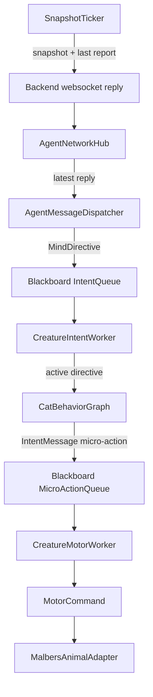

# ADR-022: Dispatcher + Intent/Motor Workers for Unity Intent Consumption

- **Status:** Accepted; transport refined by [ADR-023](ADR-023-shared-unity-agent-websocket.md)
- **Date:** 2026-06-01
- **Supersedes:** [ADR-021](ADR-021-directive-driven-motor-fsm.md)
- **Scope:** `mewi-unity/app/Assets/Scripts/AgentIntegration/Bridge/AgentNetworkHub.cs`,
  `AgentMessageDispatcher.cs`, `SnapshotTicker.cs`,
  `CreatureBlackboard.cs`, `CreatureIntentWorker.cs`,
  `CatBehaviorGraph.cs`, `CreatureMotorWorker.cs`,
  and `mewi-unity/app/Assets/Scripts/Creature/Motor/behavior_graph.md`
- **Builds on:** [ADR-018](ADR-018-proposal-arbiter-tick-graph.md)
  (backend emits one arbitrated high-level intent + target),
  [ADR-004](ADR-004-websocket-nested-plan-execution.md)
  (websocket envelope), and
  [ADR-005](ADR-005-movement-reliability-watchdog.md)
  (the body executor still terminates movement honestly)

## Context

[ADR-021](ADR-021-directive-driven-motor-fsm.md) correctly changed the Unity
consume side from "backend plan steps" to "backend directive drives local
behavior." Its ownership split was still muddy:

1. `MindTicker` both sent snapshots and polled the websocket reply. That made the
   ticker a hidden dispatcher.
2. `CreatureMotorWorker` both executed body actions and asked the FSM to invent the
   next one when the queue was empty. That made the body worker a hidden intent
   orchestrator.
3. `_mindQueue` was doing two jobs in the vocabulary: sometimes "LLM intent,"
   sometimes "body action." Those are not the same level.
4. `CatBehaviorFSM` was really a behavior graph: it maps a high-level directive
   plus live needs into the next micro-action. It should not own worker concerns.

The desired shape is thin and explicit: network hub handles websocket I/O;
dispatcher routes completed websocket messages; snapshot ticker sends snapshots;
intent worker consumes high-level intents; motor worker consumes body-level
micro-actions.

## Decision

Split Unity intent consumption into two queues and three small runtime roles:



### 1. `AgentNetworkHub` remains transport-only

`AgentNetworkHub` owns connection lifetime, request-in-flight gating, timeouts,
response parsing, per-creature routing, and one consume method:

```csharp
public bool TryConsumeDirective(string creatureId, out string intent, out string target)
```

It does not write the blackboard and does not decide what the body should do.

### 2. Add a thin websocket message dispatcher

`AgentMessageDispatcher` polls the network hub on the Unity main thread and
routes reply types. Today it handles the only completed message type we consume:

```csharp
_hub.TryConsumeDirective(_board.CreatureId, out intent, out target)
_board.EnqueueMindDirective(intent, target)
```

This is intentionally thin. Future websocket payloads, such as dialogue display,
debug overlays, or memory annotations, should add branches here instead of making
`SnapshotTicker` or `AgentNetworkHub` grow application behavior.

### 3. Rename `MindTicker` to `SnapshotTicker`

The ticker's job is now only periodic Unity-to-backend heartbeat work:

- flush the latest `CreatureMotorWorker` execution report,
- build a fresh `SnapshotPayload`,
- send the tick through `AgentNetworkHub`,
- keep request-in-flight gating out of intent/body logic.

It no longer consumes directives.

### 4. Split high-level intent from micro-action execution

`CreatureBlackboard` owns two separate queues:

| Queue | Producer | Consumer | Payload |
| --- | --- | --- | --- |
| `IntentQueue` | `AgentMessageDispatcher` | `CreatureIntentWorker` | `MindDirective` |
| `MicroActionQueue` | `CreatureIntentWorker`, legacy tests/plans | `CreatureMotorWorker` | `IntentMessage` |

`MindDirective` is high-level policy: `SOCIALIZE`, `EXPLORE`, `SEEK_FOOD`, plus
an optional target id. It is not executable by the body.

`IntentMessage` is body vocabulary: `go_to`, `wander`, `eat`, `look_at`, and the
other actions `CreatureMotorWorker.TryBuildCommand` already handles.

Compatibility aliases remain on the blackboard for older tests and call sites,
but new code should use the intent/micro-action names.

### 5. Rename `CatBehaviorFSM` to `CatBehaviorGraph`

The cat behavior object is a graph/policy, not a worker. It maps:

```text
active MindDirective + target + live blackboard state -> bounded micro-action sequence
```

It retains the same directive-to-node mapping from ADR-021. A directive is a
Unity-local goal, not an infinite mode: `EXPLORE target` may expand to
`go_to(target) -> look_around -> smell(target)`, while `SEEK_FOOD target`
expands to `go_to(target) -> eat(target)`. Weighted scoring remains only as a
fallback for unknown directives.

### 6. Add `CreatureIntentWorker`

`CreatureIntentWorker` is the orchestration layer between high-level intent and
body micro-actions:

1. Drain the high-level `IntentQueue`; the latest directive wins.
2. Store that latest directive on the blackboard as `MindDirectiveIntent` /
   `MindFocusTarget`.
3. Wait until `MicroActionQueue` is empty and `CreatureMotorWorker` is no longer
   executing the previous micro-action.
4. Ask `CatBehaviorGraph.TryNextAction(...)` for the next micro-action in the
   bounded goal sequence.
5. Enqueue that micro-action for `CreatureMotorWorker`.
6. When the graph returns no next action, clear the active directive. That is the
   Unity-side meaning of high-level goal complete.
7. If the previous micro-action was `failed` or `rejected`, abort the active
   directive and wait for the backend to choose again from the next snapshot.

`CreatureMotorWorker` no longer calls the graph. It only consumes micro-actions and
translates them to `MotorCommand`s.

### 7. Keep affordance validation layered

Unity affordances are the contract offered to the backend: the LLM should choose
targets from the current snapshot, and place/zone targets should already be
filtered by NavMesh reachability. That does not make runtime movement blind. The
motor worker remains the final authority because the snapshot can be stale by the
time a response returns, blockers can move, and the cat's actual agent settings
can reject a route.

Movement-capable target affordances should carry `path_status` and `path_length`
beside the target id. `safe` means a complete route existed when the snapshot was
built; `risky` is lower-confidence but still selectable; `blocked` should not be
presented as a selectable target.

The intended failure flow is:

1. Backend chooses a high-level directive and target from afforded ids.
2. `CatBehaviorGraph` expands that into `go_to(target)` and follow-up actions.
3. `CreatureMotorWorker` resolves and executes the real target.
4. If `go_to` fails or is rejected, the active directive is aborted.
5. The next snapshot/report lets the backend choose again.

For world-confirmed actions such as `eat`, the motor keeps the
`GoalEventBus.Declare` entry alive for a short confirmation window before
declaring failure. This prevents frame-order races where the worker dispatches
`eat(food)` before the food trigger has had a physics tick to confirm it.

## Consequences

**Positive**

- Runtime ownership is legible: transport, dispatch, snapshot heartbeat, graph
  policy, and body execution are separate.
- High-level intents cannot accidentally be executed as body actions.
- The graph can evolve independently of `CreatureMotorWorker`.
- Future websocket message types have a natural home in `AgentMessageDispatcher`.
- `CreatureMotorWorker` remains the single path into `MalbersAnimalAdapter`.

**Negative / accepted trade-offs**

- More MonoBehaviours exist on the creature root. `CreatureController` adds the
  dispatcher and intent/motor worker at runtime if they are absent.
- Compatibility aliases keep old blackboard names alive for now, so the naming is
  not perfectly strict until older tests/docs are cleaned up.
- Existing Unity scenes may need a script reload after the class renames
  (`MindTicker` -> `SnapshotTicker`, `CatBehaviorFSM` -> `CatBehaviorGraph`).
  The `.meta` GUIDs were moved with the renamed files to preserve references.

## Acceptance Checks

- `SnapshotTicker` sends snapshots and reports but has no directive-consume path.
- `AgentMessageDispatcher` is the only Unity component that consumes websocket
  directives from `AgentNetworkHub`.
- A backend `{intent: SOCIALIZE, target_id: mewi_cat}` enters
  `CreatureBlackboard` via `IntentQueue`.
- `CreatureIntentWorker` consumes that high-level intent, activates the directive,
  and asks `CatBehaviorGraph` for a micro-action.
- `CreatureMotorWorker` consumes only `MicroActionQueue` entries and never calls
  `CatBehaviorGraph` directly.
- `go_to(target)` and `eat(target)` fail only after the motor has given the world
  confirmation path a short chance to confirm the action.
