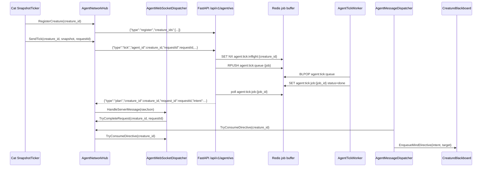

# ADR-023: Shared Unity Agent WebSocket

- **Status:** Accepted
- **Date:** 2026-06-01
- **Supersedes:** the per-creature websocket part of
  [ADR-004](ADR-004-websocket-nested-plan-execution.md)
- **Refines:** [ADR-022](ADR-022-dispatcher-intent-motor-workers.md)
- **Scope:** Unity `AgentNetworkHub`, `AgentWebSocketDispatcher`,
  `AgentMessageDispatcher`, `SnapshotTicker`, `CreatureBlackboard`; backend
  `agent_router.py` shared `/api/v1/agent/ws`, `AgentTickWebSocketSession`,
  `AgentTickService` Redis job buffer; websocket transfer models in
  `app/models/tick.py`; tests for shared websocket message contracts, Redis
  in-flight routing, and stale response protection.

## Context

ADR-004 chose one websocket per cat: `/api/v1/agent/ws/{creature_id}`. That made
ordering simple, but it does not scale cleanly once Unity owns 10-20 cats. Every
cat would carry its own socket, timeout state, connect/reconnect path, and
message pump.

ADR-022 cleaned up the local cat boundary: backend replies become high-level
intents, `CreatureIntentWorker` converts them through `CatBehaviorGraph`, and
`CreatureMotorWorker` executes micro-actions. The remaining transport question is
above the cats: the Unity app should own one connection and route replies into
per-cat buffers.

## Decision

Use **one Unity app websocket** for all cats. The scene owns a single network
object; cats register themselves through that object.

```mermaid
flowchart TD
    subgraph Scene["Unity Scene"]
        NetworkObject["GameObject: AgentNetwork"]
        Hub["AgentNetworkHub<br/>transport + in-flight table"]
        WsDispatcher["AgentWebSocketDispatcher<br/>message type routing + directive buffers"]
        NetworkObject --> Hub
        NetworkObject --> WsDispatcher

        subgraph CatA["Cat: cat_a"]
            BoardA["CreatureBlackboard<br/>creatureId=cat_a"]
            TickerA["SnapshotTicker"]
            LocalDispatcherA["AgentMessageDispatcher"]
        end

        subgraph CatB["Cat: cat_b"]
            BoardB["CreatureBlackboard<br/>creatureId=cat_b"]
            TickerB["SnapshotTicker"]
            LocalDispatcherB["AgentMessageDispatcher"]
        end
    end

    TickerA -->|RegisterCreature + SendTick(cat_a, requestId)| Hub
    TickerB -->|RegisterCreature + SendTick(cat_b, requestId)| Hub
    Hub <-->|one websocket| BackendWS["FastAPI /api/v1/agent/ws<br/>AgentTickWebSocketSession"]
    BackendWS --> TickService["AgentTickService"]
    TickService --> Redis["Redis<br/>agent:tick:queue<br/>agent:tick:job:{job_id}<br/>agent:tick:inflight:{creature_id}"]
    Worker["AgentTickWorker<br/>behavior graph"] --> Redis
    Redis --> Worker
    Hub -->|raw JSON message| WsDispatcher
    LocalDispatcherA -->|TryConsumeDirective(cat_a)| Hub
    LocalDispatcherB -->|TryConsumeDirective(cat_b)| Hub
    Hub -->|delegates consume| WsDispatcher
    LocalDispatcherA -->|EnqueueMindDirective| BoardA
    LocalDispatcherB -->|EnqueueMindDirective| BoardB
```



### Message Contract

Unity registers cats on connect or first tick:

```json
{ "type": "register", "creature_ids": ["cat_a", "cat_b"] }
```

Unity sends one tick per cat request:

```json
{
  "type": "tick",
  "agent_id": "cat_a",
  "requestId": "cat_a-t0001",
  "snapshot": { "agent_id": "cat_a", "...": "..." },
  "report": { "...": "previous execution report" }
}
```

Backend replies echo routing keys:

```json
{
  "type": "plan",
  "creature_id": "cat_a",
  "request_id": "cat_a-t0001",
  "status": "done",
  "intent": { "intent": "SOCIALIZE", "target_id": "cat_b" }
}
```

The route key is `(creature_id, request_id)`. `creature_id` selects the cat
buffer; `request_id` protects against stale or late replies.

### In-Flight Rule

The shared socket may carry many concurrent cat requests, but only **one
in-flight request per cat**:

- `cat_a:req-1` and `cat_b:req-1` may run concurrently.
- `cat_a:req-2` is rejected while `cat_a:req-1` is still pending.

This keeps each cat's cognition ordered while avoiding head-of-line blocking
across different cats.

Redis owns this gate, not the websocket route's process memory. That means an
accepted tick is protected even if the FastAPI receive loop keeps handling other
cats or the worker completes on a different coroutine. The reservation is
released only when the matching request reaches `done` or `error`.

### Redis Job Buffer

Every accepted tick is written to Redis before the worker sees it:

| Key | Type | Purpose |
|---|---|---|
| `agent:tick:queue` | LIST | FIFO queue consumed by `AgentTickWorker` with `BLPOP`. |
| `agent:tick:job:{job_id}` | STRING JSON | Job row using schema `agent_tick.v2`; stores payload, status, result, and routing ids. |
| `agent:tick:inflight:{creature_id}` | STRING JSON | Same-cat overlap reservation containing `creature_id`, `request_id`, `job_id`, and `reserved_at`. |

`submit_tick` uses `SET ... NX` on the in-flight key before queueing the job.
If that reservation already exists, the backend returns a websocket `error`
message for the new `(creature_id, request_id)` and does not enqueue another
job. `publish_result` and `publish_error` release the reservation with an atomic
compare-and-delete only when the stored `request_id` still matches, so a stale
completion cannot unlock a newer cat request.

### Backend Shape

The backend exposes only `/api/v1/agent/ws` for Unity agent ticks. There is no
per-creature websocket route.

The shared route:

- stays thin: it constructs `AgentTickWebSocketSession` and delegates all
  websocket work,
- logs explicit and implicit cat registration,
- validates `register` and `tick` messages through Pydantic transfer models,
- writes accepted tick jobs through `AgentTickService`,
- starts one async task per accepted tick so the receive loop keeps reading,
- serializes websocket sends with a lock,
- rejects same-cat overlap using Redis in-flight reservations,
- emits observability logs for registration, accepted jobs, rejected overlaps,
  sent responses, disconnects, and crashes.

`AgentTickService` owns the Redis contract: `agent_tick.v2` job rows,
`agent:tick:queue`, `agent:tick:job:{job_id}`, and
`agent:tick:inflight:{creature_id}`. `AgentTickWorker` remains the only behavior
graph consumer; websocket code only submits jobs and forwards terminal rows.

### Unity Shape

`AgentNetworkHub` is a scene/app-level component, not a per-cat component. Its
job is transport: websocket lifetime, registration sends, per-creature
in-flight gating, timeouts, and request completion.

`AgentWebSocketDispatcher` is attached to the same network object. Its job is
message dispatch: parse backend websocket messages, branch on message `type` and
`status`, and store completed high-level directives by `creature_id`.

`AgentMessageDispatcher` remains per-cat. Its job is local delivery: ask the hub
for this cat's directive and enqueue it on that cat's `CreatureBlackboard`.

Per cat:

- `SnapshotTicker` builds snapshots and asks the hub to send a tick.
- `AgentMessageDispatcher` asks the hub for that cat's latest directive; the hub
  delegates that read to `AgentWebSocketDispatcher`.
- `CreatureBlackboard` remains the per-cat buffer.

The hub owns:

- one `NativeWebSocket`,
- registered creature ids,
- per-creature in-flight request ids.

The websocket dispatcher owns:

- latest directive buffers keyed by `creature_id`,
- response parsing and stale response filtering handoff.

### Scene Wiring

Create one empty GameObject in the scene:

```text
AgentNetwork
  AgentNetworkHub
    config = BackendConfig_Dev
  AgentWebSocketDispatcher
```

Do not attach `AgentNetworkHub` to any cat. Each cat root should have:

```text
CreatureBlackboard
CreatureController
SnapshotManager
SnapshotTicker
AgentMessageDispatcher
CreatureIntentWorker
CatBehaviorGraph
CreatureMotorWorker
```

`CreatureController` initializes the per-cat pieces. `SnapshotTicker` and
`AgentMessageDispatcher` both call `AgentNetworkHub.Resolve()` and
`RegisterCreature(_board.CreatureId)`, so adding more cats does not require more
network objects or sockets.

The current `Fishing_Village` scene has this object wired as a root object named
`AgentNetwork`. Cat prefabs should not serialize their own network hub.

## Consequences

**Positive**

- Unity carries one backend connection for the whole app.
- Different cats can think concurrently without opening many sockets.
- Per-cat ordering remains local and explicit.
- Late/stale replies are easier to detect because `request_id` is part of the
  route key.
- Dispatch stays thin at both levels: websocket message dispatch is app-level;
  per-cat delivery only moves a routed directive into one `CreatureBlackboard`.

**Trade-offs**

- A broken shared socket affects every cat until reconnect.
- The backend route is more complex because it must receive and send concurrently.
- Unity scenes need one configured `AgentNetwork` object with a `BackendConfig`.
- Existing per-cat transport components must be removed or replaced.

## Acceptance Checks

- Unity has one `AgentNetworkHub` websocket for all cats.
- The scene has one `AgentNetwork` object with `AgentNetworkHub` and
  `AgentWebSocketDispatcher`.
- A cat tick cannot be sent if that cat already has an in-flight request.
- Two different cats can have in-flight requests at the same time.
- Backend `/api/v1/agent/ws` accepts `register` and `tick` messages; there is no
  `/api/v1/agent/ws/{creature_id}` route.
- Backend logs explicit/implicit registered cats and in-flight rejects.
- Redis uses the `agent_tick.v2` keys above; no runtime code writes legacy
  `agent:jobs` or `agent:job:{job_id}` keys.
- Tests cover the transfer schema, the route shape, and Redis in-flight
  reservation/release rules.
