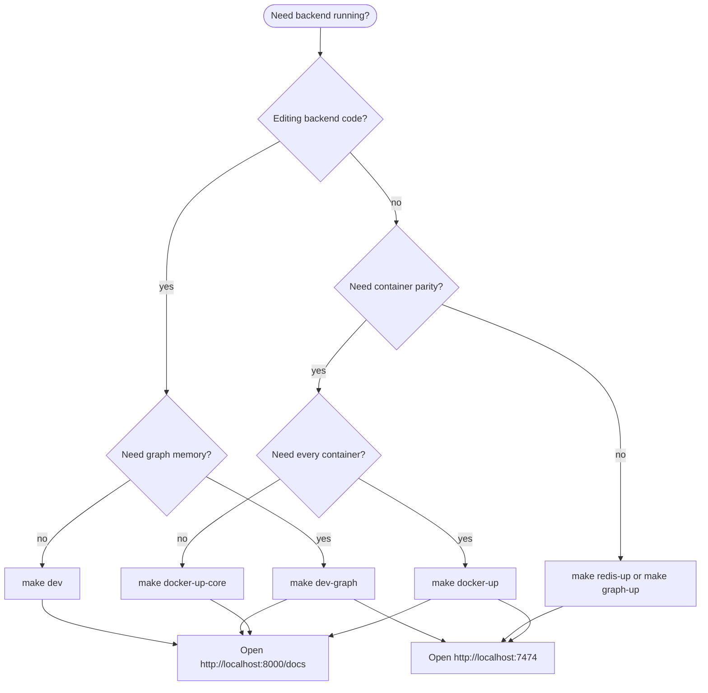

# ADR-024: Backend Makefile And Graph DB Workflow

- **Status:** Accepted
- **Date:** 2026-06-01
- **Builds on:** [ADR-017](ADR-017-mem0-style-memory-add-retrieve-graph.md),
  [ADR-023](ADR-023-shared-unity-agent-websocket.md)
- **Scope:** `mewi-backend/Makefile`, `mewi-backend/docker-compose.yml`,
  `mewi-backend/Dockerfile`, local FastAPI app startup, Redis job buffer,
  optional Neo4j graph-memory service.

## Context

The backend now has two different local operating modes:

- the normal agent runtime, which needs Redis for websocket tick jobs;
- optional graph memory, which adds Neo4j and the `graph-memory` Python extra.

The old Makefile only started Redis and still referenced stale Docker service
names. That made the day-to-day question unclear: should a developer use native
`uvicorn`, Docker, Redis only, Neo4j too, or a shell inside the graph database?

We want one small command surface that answers:

- how to start the backend app;
- when to include the graph database;
- which URLs to open after startup;
- how to run tests with or without graph-memory dependencies.

## Decision

Keep the backend Makefile as the primary local operator surface. All commands in
this ADR are run from:

```sh
cd mewi-backend
```

### Command Map

| Goal | Command | What It Starts | Open Afterward |
|---|---|---|---|
| Daily backend development | `make dev` | Redis in Docker, FastAPI natively with reload | `http://localhost:8000/docs` |
| Daily backend development with graph memory | `make dev-graph` | Redis + Neo4j in Docker, FastAPI natively with reload and graph env vars | FastAPI: `http://localhost:8000/docs`; Neo4j Browser: `http://localhost:7474` |
| Start only infrastructure for native app work | `make redis-up` | Redis only | none |
| Start graph DB services without the app | `make graph-up` | Redis + Neo4j | Neo4j Browser: `http://localhost:7474` |
| Inspect graph database | `make graph-shell` | Opens `cypher-shell` inside Neo4j | terminal shell |
| Full Docker runtime | `make docker-up` | Redis + Neo4j + backend container | FastAPI: `http://localhost:8000/docs`; Neo4j Browser: `http://localhost:7474` |
| Core Docker runtime without graph DB | `make docker-up-core` | Redis + backend container | `http://localhost:8000/docs` |
| Explicit graph Docker alias | `make docker-up-graph` | Alias for `make docker-up` | FastAPI: `http://localhost:8000/docs`; Neo4j Browser: `http://localhost:7474` |
| Stop Docker stack | `make docker-down` | Stops app, Redis, and Neo4j profile services | none |
| Install normal dev dependencies | `make sync` | no services | none |
| Install graph-memory dependencies too | `make sync-graph` | no services | none |
| Run normal unit tests | `make test` | no services; mocked tests | none |
| Run unit tests with graph-memory extra | `make test-graph` | no services; mocked tests | none |

### Startup Choice



### Opening The App

The backend app is the FastAPI service. After `make dev`, `make dev-graph`,
`make docker-up-core`, `make docker-up`, or `make docker-up-graph`, open:

```text
http://localhost:8000/docs
```

That page is the interactive FastAPI API UI. The Unity websocket endpoint used by
the cat runtime is:

```text
ws://localhost:8000/api/v1/agent/ws
```

Unity should still be opened from the Unity Editor. The Makefile only starts the
backend and its local infrastructure. In the current dev scene, Unity's backend
config should point at the same localhost backend.

When graph memory is enabled, open Neo4j Browser at:

```text
http://localhost:7474
```

Default local credentials:

```text
username: neo4j
password: mewi-neo4j-dev
```

Override the password for a command with:

```sh
make dev-graph NEO4J_PASSWORD=secret
```

### Graph Memory Requirements

`make dev-graph`, `make docker-up`, and `make docker-up-graph` start Neo4j and
export:

```text
MEMORY_GRAPH_ENABLED=true
MEMORY_NEO4J_URL=bolt://localhost:7687      # native app mode
MEMORY_NEO4J_URL=bolt://neo4j:7687          # Docker app mode
MEMORY_NEO4J_USERNAME=neo4j
MEMORY_NEO4J_PASSWORD=mewi-neo4j-dev
```

Full mem0 graph memory still needs `MEMORY_PGVECTOR_DSN` in `.env` or the shell.
If graph memory is enabled but Neo4j or pgvector settings are missing, startup
degrades to Supabase-only durable memory and logs a warning.

### Docker Image

The backend Docker image installs both optional extras:

```sh
uv sync --frozen --extra report-agent --extra graph-memory --no-install-project --no-dev
```

This keeps the full Docker stack from starting Neo4j with an app image that
cannot import the graph-memory dependencies.

## Consequences

**Positive**

- `make dev` remains the fast daily loop: code reloads, Redis is available, and
  the API is at `http://localhost:8000/docs`.
- `make docker-up` means the full Docker stack: app, Redis, and Neo4j.
- The reduced Docker stack remains available as `make docker-up-core`.
- Graph DB work is explicit through `dev-graph`, `graph-up`, `graph-shell`, and
  the full Docker target.
- Docker migration targets now use the actual Compose service name,
  `mewi_agent_runtime`.
- The Docker app can receive graph-memory environment variables from Compose.

**Trade-offs**

- The Docker image is larger because it includes graph-memory dependencies.
- `make dev-graph` can start Neo4j even when full graph memory is not active;
  pgvector is still required for the complete mem0 configuration.
- Developers must run Make targets from `mewi-backend/`, not repo root.

## Acceptance Checks

- `make help` lists normal, graph, Docker, test, and migration workflows.
- `make dev-graph` dry-runs to Redis + Neo4j plus native `uvicorn` with graph env
  vars.
- `make docker-up` dry-runs to Redis + Neo4j + `mewi_agent_runtime`.
- `make docker-up-core` dry-runs to Redis + `mewi_agent_runtime`.
- `docker compose --profile graph-memory config --services` includes `redis`,
  `neo4j`, and `mewi_agent_runtime`.
- After app startup, `http://localhost:8000/docs` opens the backend API UI.
- After graph startup, `http://localhost:7474` opens Neo4j Browser.
