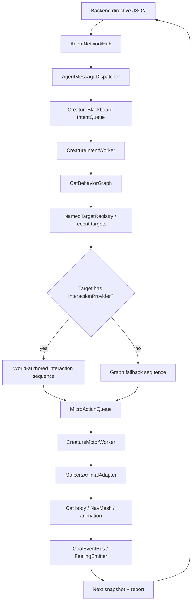
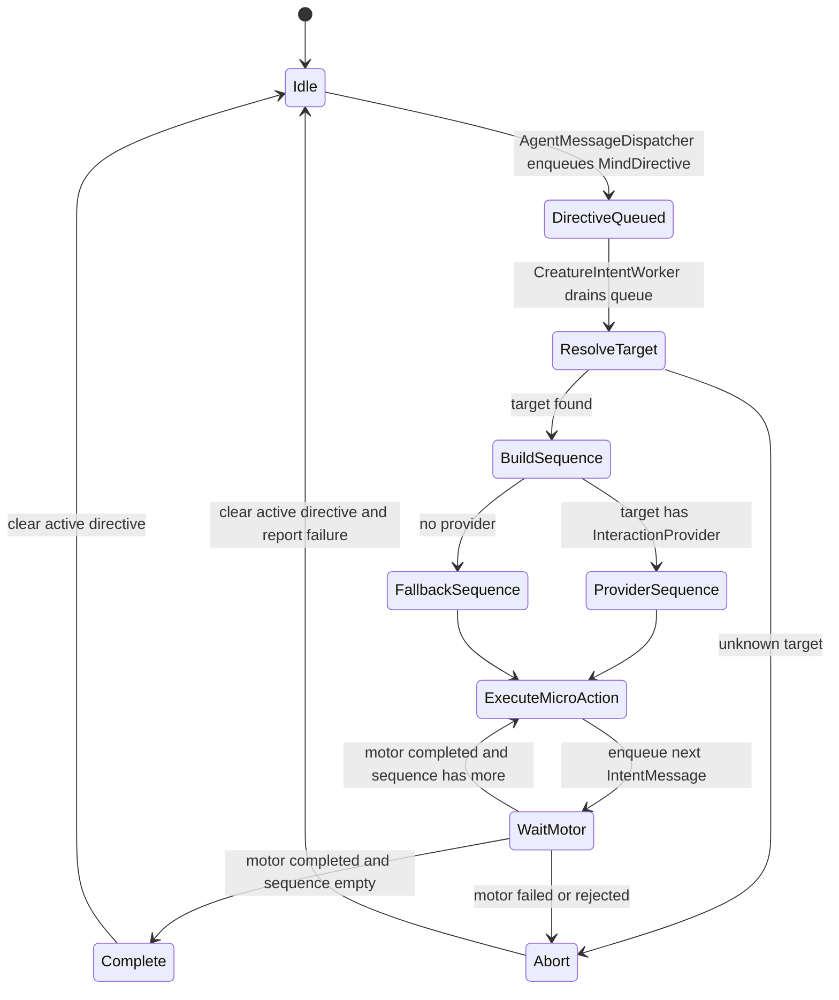
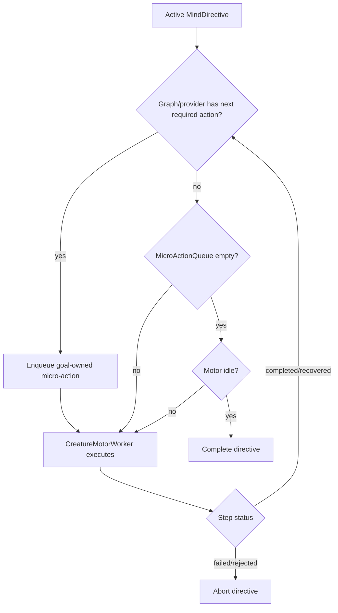
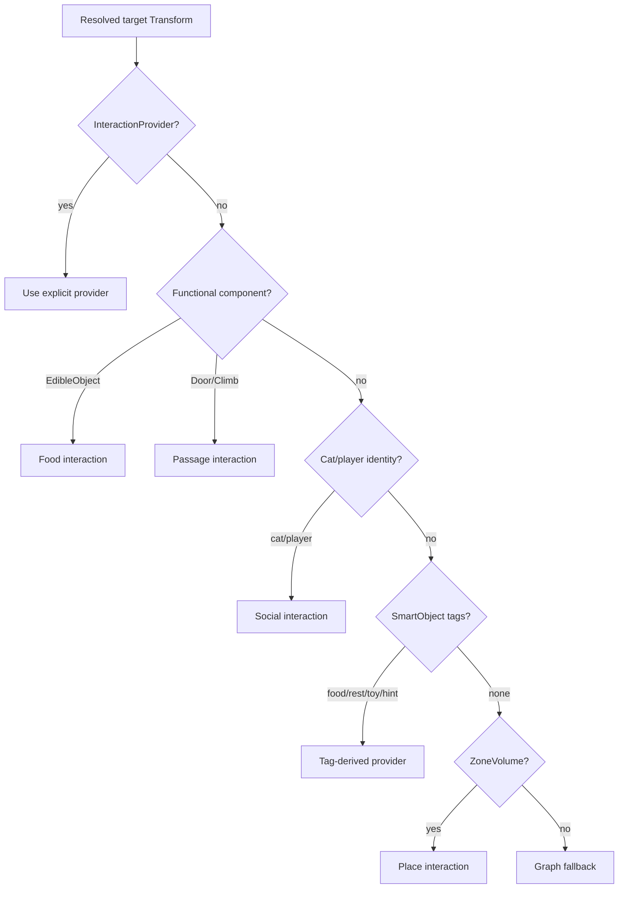
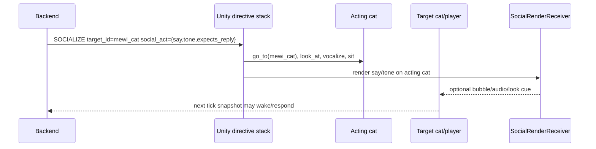

# ADR-025: World-Authored Interaction FSM

- **Status:** Proposed
- **Date:** 2026-06-01
- **Scope:** Unity-side game design and future interaction components under
  `mewi-unity/app/Assets/Scripts/Semantics/Markup/`,
  `mewi-unity/app/Assets/Scripts/Creature/Motor/ActionFSM/`,
  `mewi-unity/app/Assets/Scripts/Creature/Core/`, and
  `mewi-unity/app/Assets/Scripts/AgentIntegration/Bridge/`
- **Builds on:** [ADR-008](ADR-008-goal-event-bus-plan-step-feedback.md)
  (world-confirmed actions), [ADR-022](ADR-022-dispatcher-intent-motor-workers.md)
  (intent worker + graph + motor worker), and
  [ADR-023](ADR-023-shared-unity-agent-websocket.md)
  (one shared websocket carrying per-creature directives)

## Context

The backend now sends one high-level directive at a time. Example replies:

```json
{
  "intent": "EXPLORE",
  "target_id": "House_3",
  "mood": "playfully curious",
  "style": "quick darting movements",
  "reasoning": "The Harbor feels newly visited, and House 3 is a nearby target waiting to be disturbed."
}
```

```json
{
  "intent": "SOCIALIZE",
  "target_id": "mewi_cat",
  "mood": "gentle and inviting",
  "style": "slow, settled posture",
  "social_act": {
    "kind": "check_in",
    "say": "Mew?",
    "tone": "soft and curious",
    "expects_reply": true
  },
  "reasoning": "Miso feels a gentle pull to connect with the nearby mewi cat."
}
```

Those are not body plans. Unity must translate them into a finite sequence of
body-level micro-actions. ADR-022 gives that job to `CreatureIntentWorker` and
`CatBehaviorGraph`, but a centralized graph will not scale if every prop type,
rest spot, scent trail, toy, food bowl, player, and peer cat is hard-coded there.

The game needs a designer-authored interaction layer where objects can describe
how a cat should interact with them.

## Decision

Use **world-authored interaction providers**:

- `CatBehaviorGraph` remains the coordinator for the active high-level goal.
- Scene targets own their local interaction recipe through an interaction
  provider component.
- `CreatureMotorWorker` remains the only body executor and the only path into
  `MalbersAnimalAdapter`.
- Backend social logic remains backend-owned. Unity renders the selected
  `social_act` but does not decide the social relationship outcome.



### Directive Payload

Unity should preserve the full selected directive, not only `intent` and
`target_id`:

| Field | Unity use |
| --- | --- |
| `intent` | Selects the broad goal node: `EXPLORE`, `SEEK_FOOD`, `SOCIALIZE`, `REST`, etc. |
| `target_id` | Resolves to a Unity `SmartObject`, `ZoneVolume`, cat, player, or authored empty object. |
| `mood` | Optional animation flavor and pacing hint. |
| `style` | Optional locomotion/posture flavor, such as slow, playful, darting, cautious. |
| `social_act` | Optional render instruction: bark text, tone, expects-reply flag, gesture. |
| `reasoning` | Debug and observability only. Not required for motor execution. |

`MindDirective` should eventually store these fields. The interaction provider
receives them in an `InteractionContext`.

### Proposed Unity API

The provider should be small and object-local:

```csharp
public readonly struct InteractionContext
{
    public CreatureBlackboard Board { get; }
    public string Intent { get; }
    public string TargetId { get; }
    public string Mood { get; }
    public string Style { get; }
    public SocialAct SocialAct { get; }
}

public interface IInteractionProvider
{
    bool TryBuildInteraction(
        InteractionContext context,
        List<IntentMessage> actions);
}
```

Implementation can be a base MonoBehaviour such as `InteractionProvider` plus
small concrete components:

- `FoodInteractionProvider`
- `RestSpotInteractionProvider`
- `ScentTrailInteractionProvider`
- `ToyInteractionProvider`
- `CatSocialInteractionProvider`
- `PlayerCatInteractionProvider`
- `DefaultPlaceInteractionProvider`

The graph calls the provider once when the directive starts, then emits the
resulting list one micro-action at a time. Providers do not call
`MalbersAnimalAdapter`, do not mutate backend state, and do not complete goals.

## Unity Goal FSM



Goal completion is **not** defined by queue emptiness alone.

For the current implementation, where there is only one `MicroActionQueue`, a
high-level goal completes when all of these are true:

1. The cat has an active `MindDirective`.
2. `CatBehaviorGraph` or the target interaction provider reaches its terminal
   state and returns no next required micro-action.
3. The current goal-owned `MicroActionQueue` is empty.
4. `CreatureMotorWorker` is not executing a goal-owned micro-action.
5. The last goal-owned micro-action did not report `failed` or `rejected`.

A failed `go_to`, rejected target, or missing world confirmation aborts the
whole directive so the next backend tick can choose again.

Warning: this ADR intentionally says **goal-owned** queue and motor work. Future
neutral behavior or interrupt behavior must not redefine goal completion by
sharing this condition blindly. If later we add `InterruptQueue` or
`NeutralActionQueue`, those lanes should feed an arbiter before the motor; their
actions must not count as active high-level goal work. Until those lanes exist,
do not enqueue ambient neutral actions into `MicroActionQueue` while an active
directive is running.



## Interaction Recipes

The table below is the intended game design vocabulary. Recipes are finite; they
should not keep a cat busy forever.

| Target type | Example target ids | Supported intents | Typical micro-action recipe | World/event notes |
| --- | --- | --- | --- | --- |
| Place / zone | `House_3`, `Boat_2`, `Harbor` | `EXPLORE`, `INVESTIGATE`, `REST` if tagged | `go_to(target)` -> `look_around` -> `smell(target)` | Route affordance must include `path_status`; repeated movement failure means scanner or target setup is wrong. |
| Food prop | `SM_Fish_1`, `food_bowl_1` | `SEEK_FOOD`, `INVESTIGATE` | `go_to(food)` -> `smell(food)` -> `eat(food)` | `EdibleObject` confirms `eat` through `GoalEventBus` and decrements portions. |
| Fish barrel / smell source | `fish_barrel_2` | `INVESTIGATE`, `SEEK_FOOD` | `go_to(barrel)` -> `smell(barrel)` -> `look_at(barrel)` | Usually smell/curiosity, not guaranteed food unless marked edible. |
| Resting spot | `sun_patch_1`, `mat_3`, `roof_rest_2` | `REST`, `EXPLORE` | `go_to(spot)` -> `smell(spot)` -> `lie` or `sleep` | Use `CatNavigationPointKind.Rest` and comfort `FeelingEmitter` aspects. |
| Scent trail / hint | `scent_tuna_path`, `scratch_marks_1` | `EXPLORE`, `INVESTIGATE` | `go_to(hint)` -> `smell(hint)` -> `look_around` or `wander` | Use `FeelingEmitter` timed/contact events. No world confirmation unless it changes state. |
| Toy | `toy_ball_1`, `rope_mouse_1` | `INVESTIGATE`, `SOCIALIZE`, future `PLAY` | `go_to(toy)` -> `smell(toy)` -> `scratch` or `vocalize` | Today use existing motor verbs; add `play` only after `CreatureMotorWorker` maps it. |
| Other cat | `mewi_cat`, `miso` | `SOCIALIZE`, `INVESTIGATE`, `SEEK_PLAYER` if applicable | `go_to(cat)` -> `look_at(cat)` -> `vocalize(cat)` -> `sit` | Backend owns social consequences. Unity renders body language and optional speech bubble/audio. |
| Player cat | `player_cat` | Same as other cat plus player-driven reactions | `go_to(player_cat)` -> `look_at(player_cat)` -> `vocalize(player_cat)` or `follow` | Treat player as cat-like target with a player tag. Do not special-case social policy in the graph. |
| Door / climb / passage | `dock_ladder_1`, `door_market_1` | `EXPLORE`, `INVESTIGATE` | `go_to(entry)` -> `climb` or door-specific follow-up -> `go_to(exit)` | Existing `CatAutoClimbPoint` and `CatDoorController` already provide local world behavior. |

## Target Types And Existing Markup

Do not replace the existing markup system. The interaction-provider layer should
integrate with it. Current markup already answers different questions:

| Existing markup | Keep or revise? | Role in interaction design |
| --- | --- | --- |
| `SmartObject` | Keep. Revise labels/tags only when ids are unstable or unclear. | Stable `target_id`, semantic tags, perception position. |
| `ZoneVolume` | Keep. Add tags/ids where needed. | Place/area target such as `House_3`, `Boat_2`, `Harbor`. |
| `FeelingEmitter` | Keep. Extend authored aspects as design needs grow. | Smell, sound, touch, warmth, danger, hint signals for the next snapshot. |
| `FeelingContactRelay` / `FeelingCollisionRelay` | Keep. Attach where physical contact or collision should become perception. | Turns Unity trigger/collision events into sensory events. |
| `CatNavigationAnchors` / `CatNavigationPoint` | Keep. Add more authored points. | Designer-authored approach, rest, watch, entry, exit, and fallback positions. |
| `EdibleObject` | Keep for food. | World confirmation and portions for `eat`. |
| `CatDoorController` / `CatAutoClimbPoint` | Keep for passages. | Local door/climb behavior and follow-up movement. |
| Future `InteractionProvider` components | Add on top. | Converts a high-level directive + target into a finite micro-action recipe. |

Target type should be inferred from components and tags, not from a new
centralized enum that duplicates the scene markup. A resolver can build a
`TargetInteractionProfile` by checking the resolved target in this order:

1. Explicit `InteractionProvider` on the target, parent, or child.
2. Existing functional component, such as `EdibleObject`, `CatDoorController`,
   or `CatAutoClimbPoint`.
3. Existing identity component, such as `CreatureBlackboard` for another cat or
   a player marker/tag for the player cat.
4. `SmartObject` tags, such as `prop.food`, `prop.rest`, `prop.toy`, `place`,
   `entity.cat`, or `player`.
5. `ZoneVolume` type/surface/confinement for place behavior.
6. Fallback provider for ordinary `EXPLORE` / `INVESTIGATE`.



This keeps current scene authoring valuable. Designers should modify existing
markup when the world data is wrong: mismatched `SmartObject.Label`, missing
food tags, missing rest navigation point, no scent `FeelingEmitter`, or no
NavMesh-valid approach point. Designers should add an `InteractionProvider`
when the object needs a custom recipe beyond what its tags/components imply.

## Social Rendering

`social_act` is not a second policy layer. It is a render packet.



The target cat's actual reaction is selected on its own future tick. Unity may
show a speech bubble, chirp, head turn, posture, or debug overlay, but it should
not force the receiver's next intent.

## Scene Authoring Guide

### Scene-Level Empty Objects

Create one scene-level empty object:

| Object | Components | Notes |
| --- | --- | --- |
| `AgentNetwork` | `AgentNetworkHub`, `AgentWebSocketDispatcher` | One websocket for the whole Unity app. Do not put one network component per cat. |
| `NamedTargetRegistry` or `WorldTargets` | `NamedTargetRegistry` | Auto-registers `SmartObject` and `ZoneVolume` ids so `target_id` can resolve. |

### Cat Object

Each autonomous cat root should have:

| Component | Job |
| --- | --- |
| `CreatureController` | Initializes the per-cat stack. |
| `CreatureBlackboard` | Per-cat queues, perception, and directive state. |
| `SnapshotTicker` | Sends this cat's snapshots through the shared hub. |
| `AgentMessageDispatcher` | Pulls this cat's routed backend directive from the hub. |
| `CreatureIntentWorker` | Consumes high-level intent and asks the graph for micro-actions. |
| `CatBehaviorGraph` | Coordinates fallback and provider-authored interaction sequences. |
| `CreatureMotorWorker` | Executes micro-actions. |
| `MalbersAnimalAdapter` | Talks to Malbers/NavMesh/animation. |
| `SnapshotManager`, `CreaturePerception`, `ZoneScanner` | Builds what the backend sees. |

For the player, use the same target authoring idea. If the player is controlled
manually, it may not need `SnapshotTicker` or `CreatureIntentWorker`, but it
should still be represented as a stable target with `SmartObject` or equivalent
registration so other cats can `SOCIALIZE` with `player_cat`.

### Prop / Place Authoring Pattern

For a world object the LLM can target:

1. Create or select a stable semantic root object.
   - For imported meshes, prefer an empty child like `SM_Fish_1` or
     `SO_House_3` under the visible mesh.
   - Keep the object name or `SmartObject.Label` stable. This must match
     backend `target_id`.
2. Add `SmartObject`.
   - Set `Label` to the exact target id, such as `SM_Fish_1`.
   - Add tags such as `prop.food`, `food`, `place`, `prop.rest`, `prop.toy`,
     `entity.cat`, or `player`.
3. Add perception geometry.
   - Add a trigger collider or semantic proxy collider on the layer scanned by
     `CreaturePerception`.
   - The collider is for perception/contact, not necessarily physical blocking.
4. Add `FeelingEmitter` if the object should smell, sound, feel warm, feel
   dangerous, or create a hint.
   - Use `AlwaysOn` aspects for passive smells.
   - Use `ContactOnly` with `FeelingContactRelay` for touch/taste/comfort.
   - Use `TimedEvent`, `Collision`, `Kick`, or `Fall` with
     `FeelingCollisionRelay` or scripts that call `EmitTrigger(...)`.
5. Add `CatNavigationAnchors` to the semantic root.
   - Add empty child transforms with `CatNavigationPoint`.
   - Use `Approach` for normal interaction, `Rest` for rest spots, `Watch` for
     observation points, `Entry`/`Exit` for passages, and `TeleportFallback` only
     as a reliability escape.
   - Place points on or near the NavMesh and rotate them toward the interaction.
6. Add a type-specific world component.
   - Food: add `EdibleObject` and a trigger collider sized for mouth/contact.
     Set `foodIdOverride` when the visual object name differs from
     `SmartObject.Label`.
   - Door/climb: use existing `CatDoorController`, `CatAutoClimbPoint`, and
     related navigation points.
   - Future interaction recipes: add `FoodInteractionProvider`,
     `RestSpotInteractionProvider`, `ToyInteractionProvider`, etc.

### Event Authoring

There are two event families:

| Event type | Component/path | Use |
| --- | --- | --- |
| World confirmation | `GoalEventBus.Declare` from `CreatureMotorWorker`, `GoalEventBus.Confirm` from world objects | Proves an action truly happened. Existing examples: `go_to` self-confirm, `EdibleObject` confirms `eat`. |
| Sensory/event feeling | `FeelingEmitter.EmitTrigger`, `FeelingContactRelay`, `FeelingCollisionRelay` | Feeds next snapshot with smells, impacts, contact, danger, taste, or hint signals. |

Rule of thumb: if the event affects whether a micro-action succeeded, use
`GoalEventBus`. If it affects what the cat perceives or may choose next, use
`FeelingEmitter`.

## Example Authoring Recipes

### `SM_Fish_1`

- Root: `SM_Fish_1`
- Components:
  - `SmartObject` with `Label = "SM_Fish_1"` and tags `prop.food`, `food`,
    `food.fish`
  - `FeelingEmitter` with smell/taste aspects
  - `EdibleObject` with `foodIdOverride = "SM_Fish_1"` if needed
  - Trigger collider for bite/contact
  - `CatNavigationAnchors`
- Children:
  - `Nav_Approach` with `CatNavigationPoint(kind=Approach)`
- Provider recipe:
  - `SEEK_FOOD`: `go_to(SM_Fish_1)` -> `smell(SM_Fish_1)` -> `eat(SM_Fish_1)`

### `SunPatch_Rest_1`

- Root: `SunPatch_Rest_1`
- Components:
  - `SmartObject` with tags `prop.rest`, `comfort`, `warm`
  - `FeelingEmitter` with comfort/warmth aspect
  - `CatNavigationAnchors`
- Children:
  - `Nav_Rest` with `CatNavigationPoint(kind=Rest)`
- Provider recipe:
  - `REST`: `go_to(SunPatch_Rest_1)` -> `smell(SunPatch_Rest_1)` -> `lie`
    or `sleep`

### `toy_ball_1`

- Root: `toy_ball_1`
- Components:
  - `SmartObject` with tags `prop.toy`, `play`
  - `FeelingEmitter` with motion/sound aspects
  - `FeelingCollisionRelay` if it can be bumped or kicked
  - `CatNavigationAnchors`
- Provider recipe:
  - `INVESTIGATE`: `go_to(toy_ball_1)` -> `smell(toy_ball_1)` -> `scratch`
    or `look_at(toy_ball_1)`

### `mewi_cat` / `player_cat`

- Root:
  - Autonomous cat: normal cat prefab root.
  - Player cat: player root or a semantic target child.
- Components:
  - Stable target id through `CreatureBlackboard.CreatureId`, `SmartObject`, or
    `NamedTargetRegistry`
  - Optional `FeelingEmitter` for familiar scent, stress, invitation, etc.
  - Future `SocialRenderReceiver` for bubbles/audio/posture cues
- Provider recipe:
  - `SOCIALIZE`: `go_to(target)` -> `look_at(target)` -> `vocalize(target)` ->
    render `social_act` -> `sit`

## Consequences

**Positive**

- Designers add new props by adding components, not by editing a central graph.
- The graph stays thin and testable.
- The motor remains the only executor, so movement and animation reliability stay
  centralized.
- The backend can stay expressive with `mood`, `style`, and `social_act` while
  Unity keeps body execution grounded in authored affordances.

**Negative / accepted trade-offs**

- More scene authoring discipline is required: stable ids, navigation points,
  and provider components must agree.
- Missing providers need good fallback behavior and clear warnings.
- Some desired actions such as `play`, `paw`, or `rub` should not appear in
  recipes until `CreatureMotorWorker` maps them to real Malbers abilities.
- Social rendering must resist becoming hidden social policy.

## Acceptance Checks

- A directive such as `EXPLORE House_3` resolves `House_3` through the target
  registry, then uses a provider if present or graph fallback if absent.
- Goal completion requires a terminal graph/provider state plus no goal-owned
  queue or motor work; queue emptiness alone is not enough.
- A food target produces `go_to -> smell -> eat`, and only `EdibleObject`
  confirms the bite.
- Existing markup remains the source of truth for target identity, perception,
  navigation, and world confirmation; providers are added on top only when the
  target needs custom interaction sequencing.
- A rest spot can be created by adding a `SmartObject`, `FeelingEmitter`,
  `CatNavigationAnchors`, and a `Rest` navigation point.
- A toy or hint can produce perception events through `FeelingEmitter` without
  pretending the interaction completed a world-confirmed action.
- A player cat is represented as a target the same way as another cat; backend
  social logic decides future responses, while Unity renders the selected
  `social_act`.
