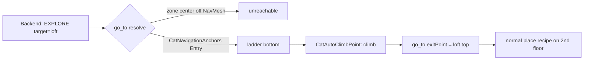

# ADR-026: Fishing Village Prop Catalog & Interaction Naming

- **Status:** Accepted
- **Date:** 2026-06-02
- **Scope:** Scene authoring of the `Asian_Fishing_Village` set under
  `mewi-unity/app/Assets/LeartesStudios/Asian_Fishing_Village/`, the markup
  components under `mewi-unity/app/Assets/Scripts/Semantics/Markup/`
  (`SmartObject`, `EdibleObject`, `FeelingEmitter`/`FeelingAspect`,
  `CatNavigationPoint`, `ZoneVolume`), and the interaction recipes defined in
  [ADR-025](ADR-025-world-authored-interaction-fsm.md).
- **Builds on:** [ADR-025](ADR-025-world-authored-interaction-fsm.md)
  (world-authored interaction FSM), [ADR-008](ADR-008-goal-event-bus-plan-step-feedback.md)
  (world-confirmed actions), [ADR-010](ADR-010-backend-owned-world-and-social-chat.md)
  (backend owns the world model).

## Context

The `Asian_Fishing_Village` art set ships ~200 meshes, but the cat is doing
**exploration**, not architecture appreciation. Walls, beams, columns, floors,
constructions, bases, and backdrops are scenery — the cat walks on them, never
*toward* them. Only a small, curated slice of props should resolve to a
`target_id` the backend can name in an `EXPLORE` / `INVESTIGATE` / `SEEK_FOOD` /
`REST` directive.

Two problems this ADR solves:

1. **Which meshes become interactable targets**, and **what each one means** to a
   curious cat (smell, climb, rest, eat, bat-at, hide-in).
2. **Naming.** A village has *many* barrels, *many* crates, *many* nets. They
   share a mesh but must not share a `target_id`. Each instance gets a stable
   id, a human label, and its own flavor so the backend's `reasoning` can be
   specific ("the tipped barrel by the slipway smells of yesterday's catch")
   instead of generic ("a barrel").

This document is the **game-design vocabulary**: the canonical id → label →
tags → feelings → recipe mapping. It does not change any runtime code. It tells a
scene author exactly what to stamp with `SmartObjectBaker` or by hand.

### Design principle: one mesh, many characters

The same `.fbx` can be dressed into very different targets. A `SM_Barrel_2` can
be a sealed brine barrel (smell only), a tipped-over barrel (climb + hide), or a
fish barrel with three salted mackerel inside (`EdibleObject`, 3 portions). The
mesh is a costume; the `SmartObject` + companions are the character.

> **Pots and cauldrons hold whatever the village cooked.** A `SM_Pot_01` or
> `SM_Cualdron_2` is authored as a *container*: it carries an internal food
> identity (fish stew, rice, an octopus someone is brining) via a child
> `EdibleObject`. The cat smells the lid, not the mesh. This is creative
> license — be specific about what's simmering.

## Decision

### Tag namespace (extends `SmartObject` convention)

`SmartObject` already documents dot-delimited tags. This catalog uses:

```
prop.food.fish          prop.food.bread        prop.food.cooked      (eat targets)
prop.smell.catch        prop.smell.brine       prop.smell.smoke      (curiosity, not always edible)
prop.climbable.crate    prop.climbable.barrel  prop.climbable.roof   (perch / get-high)
prop.rest.sunpatch      prop.rest.mat          prop.rest.boat        (lie / sleep)
prop.toy.rope           prop.toy.net           prop.toy.float        (bat / scratch / pounce)
prop.hide.basket        prop.hide.pot          prop.hide.net         (squeeze-in / ambush)
prop.passage.ladder     prop.passage.door      prop.passage.plank    (climb / cross)
prop.warmth.brazier     prop.warmth.lantern                          (warmth + mild danger)
```

A single instance may carry several tags — a fish crate is both
`prop.climbable.crate` and `prop.food.fish`; the resolver in ADR-025 picks the
functional component (`EdibleObject`) first, then falls back to tags.

### Naming scheme for instances

`target_id` is `<Type>_<Zone>_<n>`, lowercase-friendly and stable:

- `fish_dock_1`, `fish_dock_2` — two fish on the dock, instance-numbered.
- `barrel_slipway_3` — the third barrel in the slipway cluster.
- `crate_market_1` — a crate in the market row.

The `label` is the cat-facing prose name the backend sees and quotes. Keep it
short, concrete, and sensory. The `FeelingAspect.description` is the smell/sound
phrase; the `FeelingAspect.meaning` is the one-line behavioral hint.

---

## The Catalog

Legend: **id** = `SmartObject.label`/`target_id` seed · **mesh** = source `.fbx`
· **tags** = `SmartObject.tags` · **edible** = `EdibleObject` (portions ·
fullness/bite) · **recipe** = ADR-025 micro-action sequence.

### 1. Food the cat can actually eat

| id | label | mesh | tags | edible | feelings | recipe |
| --- | --- | --- | --- | --- | --- | --- |
| `fish_dock_1` | "a fat silver mackerel" | `SM_Fish` | `prop.food.fish` | 2 · 0.5 | Smell "fresh fish oil, sea-bright" / Taste "oily, salt-clean" | `go_to → smell → eat` |
| `fish_dock_2` | "a half-dried sardine" | `SM_Fish` | `prop.food.fish`, `prop.smell.brine` | 1 · 0.4 | Smell "salt and sun, going leathery" | `go_to → smell → eat` |
| `fish_plate_1` | "a fish laid out on a plate" | `SM_Plate` + `SM_Fish` | `prop.food.fish` | 1 · 0.6 | Smell "someone's lunch, unguarded" | `go_to → smell → eat` |
| `bread_table_1` | "a torn heel of bread" | `SM_Bread` | `prop.food.bread` | 1 · 0.2 | Smell "warm crust, faintly yeasty" / meaning "filling but boring to a cat" | `go_to → smell → eat` |
| `applebox_market_1` | "a crate of bruised apples" | `SM_B_AppleBox` | `prop.food`, `prop.climbable.crate` | 3 · 0.15 | Smell "sweet rot, sticky" | `go_to → smell → eat` (snack) |

### 2. Pots & cauldrons — containers with food *inside*

These are the creative ones. The mesh is a lid; the `EdibleObject` child carries
the real meal. Author the smell to advertise the contents.

| id | label | mesh | internal food (EdibleObject) | feelings | notes |
| --- | --- | --- | --- | --- | --- |
| `pot_kitchen_1` | "a clay pot of fish stew" | `SM_Pot_01` | `fish_stew` · 4 · 0.5 | Smell "ginger, scallion, simmered fish" / Temperature "still warm" | Lid ajar; cat must `smell` then `eat` from the rim. |
| `pot_kitchen_2` | "a pot of cold rice" | `SM_Pot_01` | `rice` · 2 · 0.2 | Smell "plain, starchy, day-old" / meaning "edible, unexciting" | A duller twin of `pot_kitchen_1`. |
| `cauldron_dock_1` | "a cauldron of octopus brine" | `SM_Cualdron_2` | `brined_octopus` · 3 · 0.6 | Smell "deep brine, rubbery and rich" / Danger "rim is high, watch the climb" | Tall — pair with a `CatNavigationPoint.Watch` so she circles before committing. |
| `cauldron_dock_2` | "a cauldron gone cold" | `SM_Cualdron_2` | *(no EdibleObject)* | Smell "old smoke, ash and grease" | Pure smell source — investigate, don't eat. |
| `bucket_slip_1` | "a bucket of fresh-caught fry" | `SM_Bucket_01` | `small_fish` · 5 · 0.25 | Smell "wriggling, brackish, alive" / Sound "faint splashing" | Many tiny portions = repeat-eat loop; let her keep coming back. |
| `basket_market_1` | "a covered basket — something fishy" | `SM_Basket_1_01` | `dried_squid` · 2 · 0.4 | Smell "smoke-dried, chewy" | Also `prop.hide.basket`: if not hungry she may climb *in* instead. |

> **Authoring note.** The container's `FoodId` (`EdibleObject.foodIdOverride`)
> should be the *contents* (`fish_stew`), while the `target_id` the backend
> names is the *vessel* (`pot_kitchen_1`). The resolver maps the directive's
> `target_id` to the pot; the pot's own `EdibleObject` confirms the bite. This
> keeps "go to the pot" and "eat the stew" cleanly separated.

### 3. Smell sources — curiosity, not guaranteed food

The cat goes, sniffs, looks, and leaves a little richer in memory. No
`EdibleObject` unless noted.

| id | label | mesh | tags | feelings | recipe |
| --- | --- | --- | --- | --- | --- |
| `barrel_slip_1` | "a brine barrel, sealed" | `SM_Barrel_1_01` | `prop.smell.brine` | Smell "salt and oak, sealed tight" / meaning "tempting but shut" | `go_to → smell → look_at` |
| `barrel_slip_2` | "a tipped barrel, half-empty" | `SM_Barrel_2_01` | `prop.smell.catch`, `prop.climbable.barrel`, `prop.hide.pot` | Smell "yesterday's catch, going sour" | `go_to → smell → climb` (or hide) |
| `barrel_dock_3` | "a fish barrel, lid loose" | `SM_Barrel_3_01` | `prop.smell.catch`, `prop.food.fish` (edible 2·0.4) | Smell "raw fish, irresistible" | `go_to → smell → eat` |
| `fishnet_dock_1` | "a drying net, heavy with scales" | `SM_Fish_net_1_01` | `prop.smell.catch`, `prop.toy.net` | Smell "scales and seaweed" / Texture "rough, knotted" | `go_to → smell → scratch` |
| `fishnet_dock_2` | "a tangled heap of net" | `SM_Fish_net_3_01` | `prop.toy.net`, `prop.hide.net` | Texture "snagging, ticklish" / meaning "pounce-bait" | `go_to → smell → scratch` |
| `brazier_market_1` | "a glowing brazier" | `SM_Brazier` | `prop.warmth.brazier` | Temperature "radiant, inviting" / Danger "too close burns" | `go_to → look_at → sit` (keeps distance) |
| `lantern_dock_1` | "a paper lantern, swaying" | `SM_Lantern` | `prop.warmth.lantern` | Sound "creaking cord" / Temperature "faint warm glow" | `go_to → look_at → look_around` |
| `fishingrod_dock_1` | "a propped fishing rod" | `SM_FishingRod_01` | `prop.smell.catch`, `prop.toy.float` | Smell "bait and line" / Vibration "line twitches" | `go_to → smell → scratch` |

### 4. Rest spots

Pair each with a `CatNavigationPoint` of kind `Rest` and a comfort
`FeelingEmitter` aspect.

| id | label | mesh | tags | feelings | recipe |
| --- | --- | --- | --- | --- | --- |
| `boat_harbor_1` | "a beached fishing boat" | `SM_Boat_1_01` | `prop.rest.boat`, `prop.climbable` | Comfort "dry wood, gentle rock" / Smell "tar and old rope" | `go_to → smell → lie` |
| `boatnet_harbor_1` | "a boat with a net pillow" | `SM_Boat_1_net_01` | `prop.rest.boat`, `prop.hide.net` | Comfort "soft, tangled, hidden" | `go_to → smell → sleep` |
| `rock_shore_1` | "a sun-warmed rock" | `SM_Rock_01` | `prop.rest.sunpatch` | Temperature "stored afternoon sun" / Comfort "flat and warm" | `go_to → smell → lie` |
| `rock_shore_2` | "a tall lookout rock" | `SM_rocks_SM_Rock_2` | `prop.rest.sunpatch`, `prop.climbable` | Comfort "high, breezy, commanding" | `go_to → climb → sit` |
| `mat_market_1` | "a woven floor mat" | `SM_Fabric_floor_01` | `prop.rest.mat` | Comfort "scratchy but warm" | `go_to → smell → lie` |
| `roof_house_1` | "a low hay roof" | `SM_Roof_hay_12_01` | `prop.rest.roof`, `prop.climbable.roof` | Comfort "high perch, whole harbor in view" / Temperature "sun-baked thatch" | `go_to → climb → sit` |
| `shelf_house_1` | "a high shelf" | `SM_Shelf_01` | `prop.rest`, `prop.climbable` | Comfort "narrow, secret, above it all" | `go_to → climb → lie` |

### 5. Climb / perch / get-high

| id | label | mesh | tags | recipe |
| --- | --- | --- | --- | --- |
| `crate_market_1` | "a stack of crates" | `SM_Box_1_01` | `prop.climbable.crate` | `go_to → smell → climb` |
| `crate_market_2` | "a fabric-wrapped crate" | `SM_Box_fabric_1_01` | `prop.climbable.crate`, `prop.toy` | `go_to → climb → scratch` |
| `sack_dock_1` | "a slumped rice sack" | `SM_Bag_03` | `prop.climbable`, `prop.rest.mat` | `go_to → smell → lie` |
| `table_house_1` | "a kitchen table" | `SM_Table_01` | `prop.climbable` | `go_to → climb → look_around` |
| `chair_house_1` | "a wooden chair" | `SM_Chair_01` | `prop.climbable`, `prop.rest` | `go_to → climb → sit` |
| `tree_shore_1` | "a lone birch" | `SM_Birch_Summer` | `prop.climbable`, `prop.toy` | `go_to → scratch → climb` |
| `window_house_1` | "an open window ledge" | `SM_Window_1_01` | `prop.climbable`, `prop.rest` | `go_to → climb → look_around` |

### 6. Toys — bat, scratch, pounce

| id | label | mesh | tags | recipe |
| --- | --- | --- | --- | --- |
| `rope_dock_1` | "a frayed mooring rope" | `SM_Rope_1_01` | `prop.toy.rope` | `go_to → smell → scratch` |
| `rope_dock_2` | "a coiled rope" | `SM_Rope_2_01` | `prop.toy.rope` | `go_to → scratch → vocalize` |
| `chain_dock_1` | "a hanging chain" | `SM_Chain_01` | `prop.toy` | `go_to → look_at → scratch` |
| `float_net_1` | "a net float, dangling" | `SM_Fish_net_5_01` | `prop.toy.float` | `go_to → look_at → scratch` |
| `paddle_boat_1` | "a leaning paddle" | `SM_Paddle_01` | `prop.toy` | `go_to → smell → scratch` |

> ADR-025 caveat: until `CreatureMotorWorker` maps a `play` verb, toys reuse the
> existing `scratch` / `vocalize` / `look_at` verbs. Add `play` later.

### 7. Hide / ambush — squeeze-in spots

| id | label | mesh | tags | recipe |
| --- | --- | --- | --- | --- |
| `basket_market_2` | "an empty basket" | `SM_Basket_1_01` | `prop.hide.basket` | `go_to → smell → lie` (curled inside) |
| `pot_yard_1` | "a big empty pot" | `SM_Pot_01` | `prop.hide.pot` | `go_to → look_around → lie` |
| `net_pile_1` | "a mound of loose net" | `SM_Fish_net_6_01` | `prop.hide.net`, `prop.toy.net` | `go_to → smell → lie` |
| `boxstack_dark_1` | "a gap between crates" | `SM_Box_3_01` | `prop.hide` | `go_to → look_around → sit` |

### 8. Passages — ladders, doors, planks

These already have local world behavior via `CatAutoClimbPoint` /
`CatDoorController` (ADR-025 §"Door / climb / passage"). The catalog only adds
ids + labels.

| id | label | mesh | component | recipe |
| --- | --- | --- | --- | --- |
| `ladder_dock_1` | "a rope ladder up the post" | `SM_Ladder_3m_net_01` | `CatAutoClimbPoint` | `go_to → climb → go_to(top)` |
| `ladder_loft_1` | "a tall loft ladder" | `SM_prop2_Ladder_6m` | `CatAutoClimbPoint` | `go_to → climb → go_to(top)` |
| `door_market_1` | "a small market door, ajar" | `SM_Door_small_1_01` | `CatDoorController` | `go_to → (door) → go_to(inside)` |
| `door_house_1` | "a big house door" | `SM_Door_big_1_01` | `CatDoorController` | `go_to → (door) → go_to(inside)` |
| `step_dock_1` | "worn stone steps" | `SM_Step_01` | — (NavMesh) | `go_to → go_to(top)` |

---

## Zones (`ZoneVolume`)

Places the backend can name directly for `EXPLORE` / `REST`. **Zones use
`ZoneVolume`, never `SmartObject`** — they answer "I'm in a place," not "there's
a thing here." `NamedTargetRegistry` auto-registers `ZoneVolume.zoneId` so the
`target_id` resolves without any extra marker. The semantic "hint" the reason
node reads is the trio `zoneType` + `confinement` + `surface` — no separate hint
script. For an *area-wide* ambient sense (the whole harbor smells of brine) you
may add a standalone `FeelingEmitter` to the zone object; per-prop smells stay on
the props.

`zoneType` ∈ `District / Water / Path / Vessel / Building / Courtyard / Yard /
Surface`. `confinement` ∈ `Open / Semi / Confined`. `surface` only for
`Path`/`Surface`/`Yard`.

| GameObject | `zoneId` | `zoneType` | `confinement` | `surface` | covers |
| --- | --- | --- | --- | --- | --- |
| `ZV_Harbor` | `harbor` | District | Open | — | docks, beached boats, water's edge |
| `ZV_Harbor/Boardwalk` | `boardwalk` | Path | Open | "wet planks" | dock walkway footprint |
| `ZV_Market` | `market` | District | Open | — | crates, baskets, brazier, stalls |
| `ZV_Slipway` | `dock_slipway` | Yard | Open | "tar and gravel" | barrels, nets, fishing gear |
| `ZV_Kitchen` | `kitchen` | Building | Confined | — | pots, cauldron, table, shelf |
| `ZV_Boat_1` | `boat_harbor_1` | Vessel | Semi | "boat deck" | the beached boat (parent to `boat_harbor_1` prop; moves with the hull) |
| `ZV_Rooftops` | `rooftops` | Surface | Open | "thatch" | hay roofs, high perches |

**Does a zone need an interaction provider or nav anchors?** Usually no for the
provider, sometimes yes for anchors:

- **Interaction provider** — *not* required. A bare `ZoneVolume` falls through
  the ADR-025 resolver to the fallback place recipe (`go_to → look_around →
  smell`). Add an `AuthoredInteractionProvider` only to override that with a
  custom recipe (e.g. the kitchen does `go_to → look_around → sit`).
- **`CatNavigationAnchors`** — *optional but scale-dependent*. `go_to(zone)`
  resolves to an authored point if anchors exist, otherwise to the zone volume's
  **geometric center** (`ZoneVolumeUtility.CenterOrTransform`). For tight, flat
  zones (deck, courtyard, kitchen floor) the center is walkable, so anchors are
  optional. For **large / odd / container zones** (`harbor` District, `water`, a
  parent zone with no collider) the center may land off-NavMesh — add
  `CatNavigationAnchors` with at least one `Approach` `CatNavigationPoint` (plus
  a `TeleportFallback` if the spot can be unreachable). Rule of thumb: the
  broader the zone, the more it needs an Approach anchor.

**Authoring a zone** (per `ZoneVolume` header):
1. Empty GameObject `ZV_<Name>`; add `ZoneVolume`.
2. Add trigger Collider child/children for the footprint; put them on the
   `SemanticZone` layer.
3. Set `zoneId`, `zoneType`, `confinement`, `surface`.
4. **Parent/container zones need no collider** — the scanner walks the ancestor
   chain, so `ZV_Harbor` is active whenever the cat stands in
   `ZV_Harbor/Boardwalk`. Hierarchy = your nesting; broadest is sent first.
5. For moving zones (boats), parent the `ZoneVolume` to the vessel root so it
   follows world position automatically.

### Anchors pick ONE point — they are not a waypoint path

`CatNavigationAnchors.TryResolveGoToPosition` scores every `CatNavigationPoint`
(`ScoreKind(kind) + priority*weight − pathLength`) and returns the **single best
reachable one**. Authoring an `Approach` *and* an `Entry` point does **not** make
the cat go Approach→Entry; they are competing alternatives and only the
top-scoring one is used. The kinds are roles for *which spot to pick*, not steps
in a route.

Multi-step movement into a place comes from one of three things, not from
stacking anchor kinds:

1. **NavMesh** — for ordinary walking, author **one** destination point; the
   `NavMeshAgent` computes the whole multi-segment path (around walls, through a
   doorway opening) by itself. This is the common case for entering a house.
2. **A passage component** — `CatDoorController` (door) or `CatAutoClimbPoint`
   (ladder) on the chosen `Entry` point appends the local follow-up leg
   (`open/through → go_to(inside)` or `climb → go_to(exit)`). This is the only
   built-in chaining.
3. **`AuthoredInteractionProvider`** — for a deliberate scripted order (porch,
   then inside, then look around), list explicit `go_to` steps to different
   authored point ids.

### Passage-gated zones (a 2nd floor reached by a ladder)

Some zones are not walkable from the ground — a loft, a rooftop, a boat deck
reached by a ladder. The zone center is off the ground NavMesh, so a plain
`go_to(zone)` fails. **The world owns "how to get up," not the backend.** The
backend still just sends `EXPLORE target=loft`; the climb is authored in-scene.

Preferred: an **auto-climb Entry anchor** (no provider, no recipe code):

1. Put `CatNavigationAnchors` on the loft zone (`ZV_Loft`).
2. Add a child `CatNavigationPoint` at the **bottom of the ladder**, on the
   ground NavMesh, and add `CatAutoClimbPoint` to it (it auto-sets the point's
   kind to `Entry`).
3. On that `CatAutoClimbPoint`, set `climbSeconds` / `climbInputAxis`, and set
   `exitPoint` to a transform at the **top landing**, on the 2nd-floor NavMesh.

At runtime `ResolveGoToPosition` picks the reachable ladder-bottom Entry (the
zone center is unreachable), and on arrival `QueueAutoClimbFollowups` auto-appends
`climb → go_to(exitPoint)`. Net chain: `go_to(ladder_bottom) → climb →
go_to(loft_top)`, fully world-authored.



Requirements: the Entry must be on the ground NavMesh and the `exitPoint` on the
2nd-floor NavMesh (two surfaces or a link). The `climb` bridges the gap NavMesh
cannot. Use an `AuthoredInteractionProvider` on the zone instead only when you
want a bespoke scripted sequence at the top (e.g. `look_around` then `sit`);
keep the `CatAutoClimbPoint` on the ladder either way so `BuildClimbCommand`
reads its climb params.

---

## Authoring checklist (per interactable prop)

1. Add a `SmartObject`; set `label` (cat-facing prose) and `tags` from §"Tag
   namespace".
2. If edible, add an `EdibleObject` child; set `portions`, `fullnessGainPerBite`,
   and — for containers — `foodIdOverride` to the *contents*.
3. Add a `FeelingEmitter` with at least one `FeelingAspect`: pick the `sense`,
   write a compact `description`, and a one-line `meaning`.
4. For rest/climb/passage, add the matching `CatNavigationPoint`
   (`Rest` / `Watch` / `Entry` / `Exit`) and any `CatAutoClimbPoint` /
   `CatDoorController`.
5. Confirm the `target_id` is unique and NavMesh-reachable (ADR-025 demands a
   valid approach point).
6. Leave scenery (walls, beams, columns, floors, bases, constructions,
   backdrops) **un-marked**. No `SmartObject`, no target.

## Consequences

- The backend's `reasoning` and `mood`/`style` get concrete things to chew on —
  "the slipway barrel smells of yesterday's catch" instead of "a barrel."
- Same-mesh props no longer collide on `target_id`; instance numbering + zone
  suffix keeps them distinct and quotable.
- Pots/cauldrons become a reusable *container* pattern: vessel id for navigation,
  internal food id for the bite, smell for the lure.
- This is a **naming + authoring** decision, not a code change. If a recipe verb
  doesn't exist yet (`play`), the catalog falls back to existing verbs per
  ADR-025 and is revised when the motor adds the verb.
- Adding a new prop = one table row here + one stamped `SmartObject` in-scene. No
  central enum, no graph edit (ADR-025's resolver infers type from components and
  tags).
