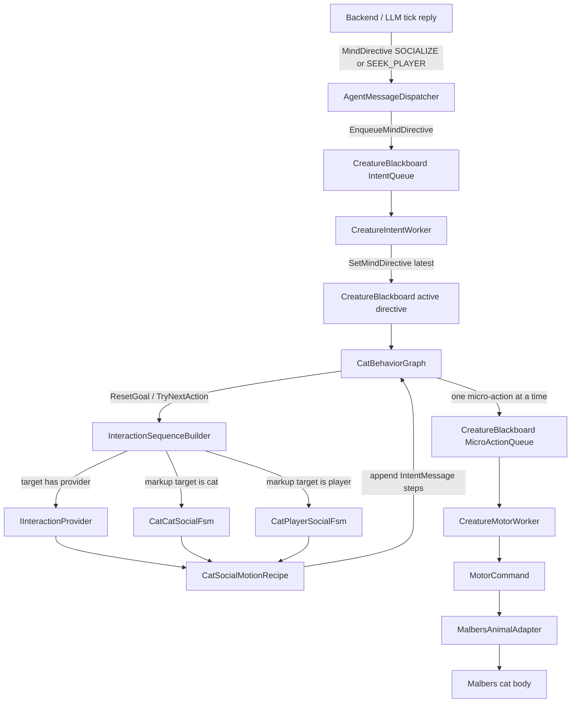
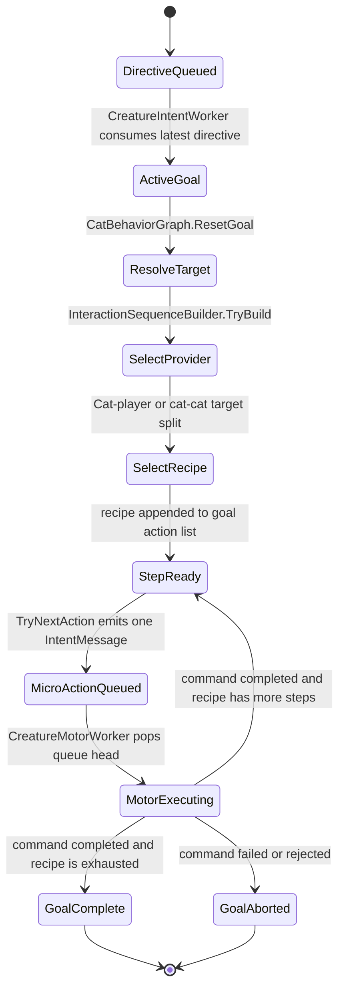

# ADR-028: Cat Social FSM Split

- **Status:** Accepted
- **Date:** 2026-06-05
- **Scope:** Unity interaction planning in
  `mewi-unity/app/Assets/Scripts/Creature/Motor/ActionFSM/`
  (`InteractionSequenceBuilder`, `CatPlayerSocialFsm`,
  `CatCatSocialFsm`, `CatSocialMotionRecipe`), the motor mappings in
  `mewi-unity/app/Assets/Scripts/Creature/Motor/ActionDoer/`, and the social
  motion contract documented in
  `mewi-unity/app/Assets/Scripts/Creature/Motor/behavior_graph.md`.
- **Builds on:** [ADR-022](ADR-022-dispatcher-intent-motor-workers.md)
  (dispatcher + intent/motor workers),
  [ADR-025](ADR-025-world-authored-interaction-fsm.md)
  (world-authored interaction FSM), and
  [ADR-027](ADR-027-malbers-action-vocabulary-and-micro-action-matching.md)
  (Malbers action vocabulary).

## Context

The Unity body now receives a high-level `MindDirective` such as `SOCIALIZE` or
`SEEK_PLAYER`, plus a resolved target id and optional `social_act` render hints.
The backend can choose *that the cat wants to socialize*, but Unity must still
own the safe body-level sequence. It should not let raw LLM words become raw
Malbers clips or direct body commands.

The first social provider mixed two different relationships:

- **cat-player social:** the NPC cat chooses to approach, meow, sit near, rub,
  invite play, or settle near the player target.
- **cat-cat social:** one NPC cat chooses to approach another cat, sniff, share
  space, invite play, hold a boundary, or reconcile.

Those two relationships have different authored vocabularies even though they
use the same queue and motor executor. A single generic provider made it too
easy for cat-cat behaviors to accidentally use player-facing concepts such as
`rub_request`, or for player-facing behaviors to inherit cat-cat boundary verbs.

## Decision

Replace the generic social provider with two explicit FSM/provider classes:

| Provider | Target relationship | Stable motion key set |
| --- | --- | --- |
| `CatPlayerSocialFsm` | NPC cat does something toward the player target | 20 cat-player keys, such as `greet_meow`, `slow_blink`, `head_bump`, `play_invite`, `settle_close` |
| `CatCatSocialFsm` | NPC cat does something toward another cat target | 20 cat-cat keys, such as `cat_greet`, `nose_touch`, `mutual_sniff`, `play_bow`, `boundary_hiss`, `settle_pair` |

Both providers implement `IInteractionProvider`. Both use the shared
`CatSocialMotionRecipe` / `CatSocialMotionStep` data shape:

- match `social_act.kind` exactly against a stable motion key;
- fall back through `style`, `social_act.tone`, `mood`, and live mood values;
- append safe `IntentMessage` micro-actions only;
- never execute Malbers or navigation directly.

`InteractionSequenceBuilder` owns the target split:

- another `CreatureBlackboard`, or a `SmartObject` tagged `entity.cat`, routes
  to `CatCatSocialFsm`;
- a `SmartObject` tagged `entity.player` / `player`, or a root object whose
  name contains `player`, routes to `CatPlayerSocialFsm`.

The old `CatSocialInteractionProvider` name is retired. Existing scenes should
attach `CatPlayerSocialFsm` to player targets and `CatCatSocialFsm` to cat
targets only when they need explicit target-local overrides. The markup fallback
works even without attached providers.

## Runtime Flow

## Goal-Owned Sequence State

The social FSM is finite and goal-owned. It does not run as an independent
agent. The intent worker asks the graph for the next micro-action only when the
motor is idle and the micro-action queue is empty.

## Stable Motion Contracts

Cat-player keys:

`greet_meow`, `soft_meow`, `answer_meow`, `slow_blink`, `sniff_greeting`,
`sit_near`, `lie_near`, `groom_near`, `rub_request`, `head_bump`, `tail_up`,
`play_invite`, `playful_paw`, `happy_yes`, `refuse_no`, `startled_freeze`,
`cautious_watch`, `alert_watch`, `excited_shake`, `settle_close`.

Cat-cat keys:

`cat_greet`, `nose_touch`, `mutual_sniff`, `circle_greeting`, `tail_greet`,
`parallel_sit`, `parallel_lie`, `groom_invite`, `share_space`, `play_bow`,
`play_paw`, `chase_invite`, `soft_chirp`, `answer_chirp`, `cautious_pause`,
`boundary_hiss`, `startled_break`, `dominance_stare`, `reconcile_blink`,
`settle_pair`.

The backend may send these strings in `social_act.kind`, but the backend does
not need to send body steps. Unity expands the selected key into the queue
vocabulary from ADR-027.

## Consequences

**Positive**

- Cat-player and cat-cat social semantics are no longer conflated.
- LLM wording stays high level; Unity keeps the body-safe string and ability
  mapping boundary.
- Designers can override recipes per target while the markup fallback remains
  useful in scenes without explicit providers.
- The worker queue architecture from ADR-022 is unchanged.

**Negative**

- There are now two visible social key sets for backend and design docs to keep
  straight.
- Cat-cat and cat-player recipes can still share low-level verbs, so bad
  Malbers mappings in ADR-027 affect both providers.
- Unity import must regenerate `.meta` files for the new scripts after the old
  provider file is removed.

**Follow-up implementation checklist**

1. Add lightweight Unity tests for target-type routing in
   `InteractionSequenceBuilder`.
2. Add recipe selection tests for exact `social_act.kind`, alias fallback, and
   mood fallback.
3. Add editor validation that flags a player provider on a cat target or a
   cat-cat provider on a player target.
4. Decide whether backend prompt docs should expose both key sets or only a
   smaller curated subset.
