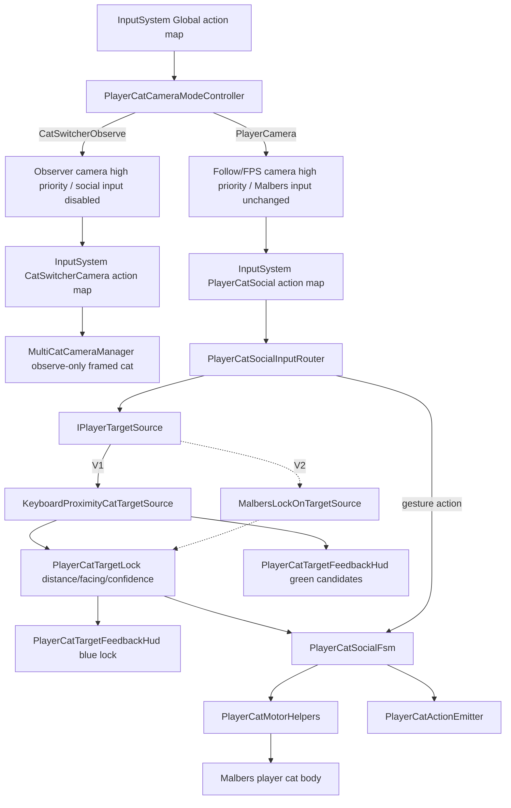
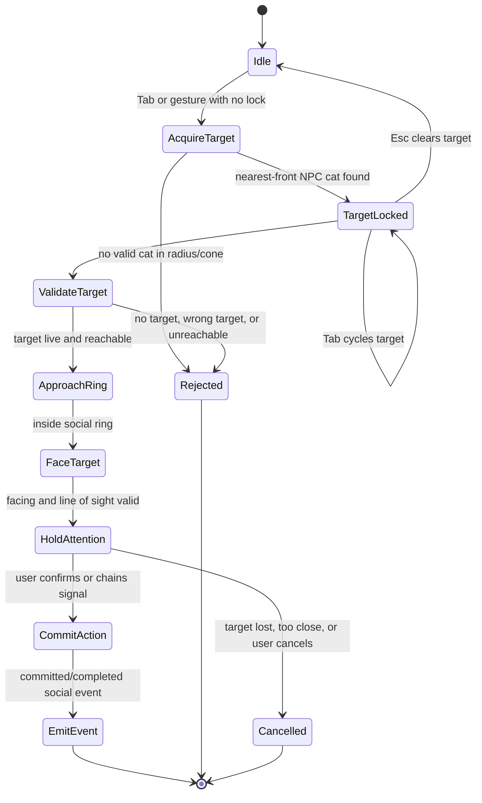
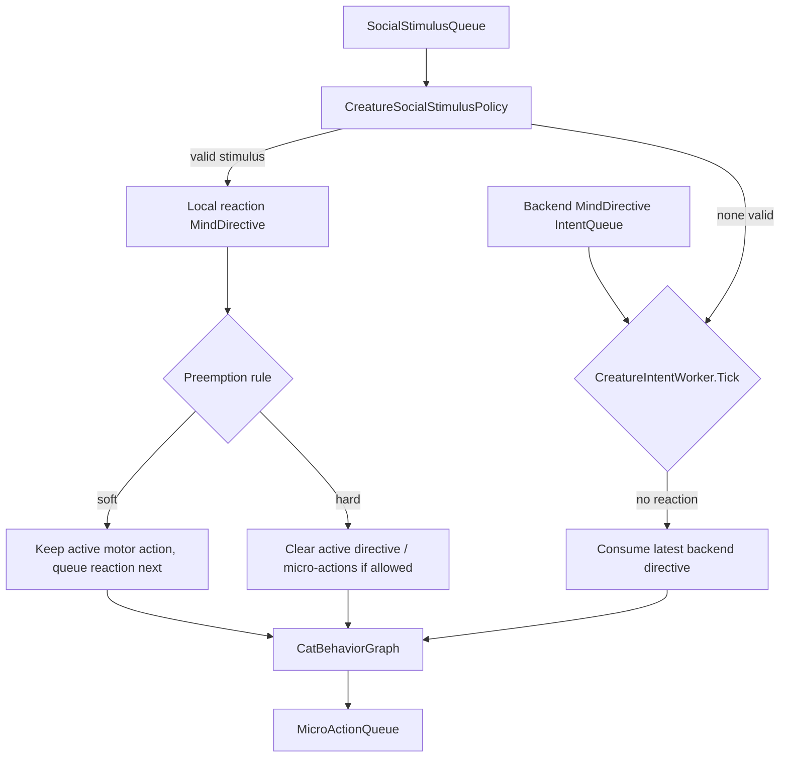
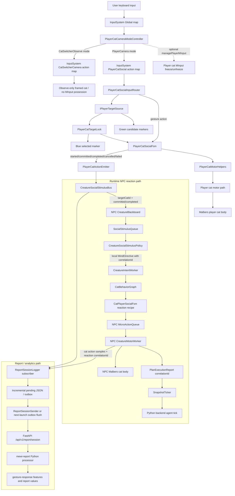

# ADR-029: PlayerCat Action FSM, NPC Interrupts, And Report Capture

- **Status:** Proposed
- **Date:** 2026-06-05
- **Scope:** Future Unity player-avatar social control for a player represented
  by a Malbers cat body, NPC cat perception/reaction plumbing in
  `mewi-unity/app/Assets/Scripts/Creature/Core/CreatureBlackBoard.cs`,
  `mewi-unity/app/Assets/Scripts/Creature/Motor/ActionFSM/`,
  `mewi-unity/app/Assets/Scripts/Creature/Motor/ActionDoer/`, the Unity Input
  System action asset `mewi-unity/app/Assets/InputSystem_Actions.inputactions`,
  and explicit report capture in
  `mewi-unity/app/Assets/Scripts/Report/Session/`.
- **Builds on:** [ADR-022](ADR-022-dispatcher-intent-motor-workers.md)
  (worker queues), [ADR-025](ADR-025-world-authored-interaction-fsm.md)
  (finite interaction recipes),
  [ADR-027](ADR-027-malbers-action-vocabulary-and-micro-action-matching.md)
  (Malbers action vocabulary), and
  [ADR-028](ADR-028-cat-social-fsm-split.md)
  (cat-player and cat-cat social providers).
- **Report schema authority:** [ADR-030](ADR-030-post-session-report-processing.md)
  owns `mewi.report.raw.v2` and the serialized `ReportSessionPayload` shape.
  This ADR defines the Unity gameplay events and required report rows, but not
  a competing JSON schema.

## Context

ADR-028 covers the case where an NPC cat chooses to socialize with a player or
another cat. The next needed path is the inverse direction:

> the user controls a player avatar, that avatar is also a Malbers cat body, and
> the player does something toward an NPC cat.

That has three separate effects that must not be confused:

1. **Player body execution:** the player cat approaches, faces, nods, meows,
   sits, backs off, or invites play using Malbers helpers.
2. **NPC cat awareness:** the target NPC cat learns that the player did a
   social action toward it and may react before the next backend directive.
3. **Research/report capture:** the explicit player gesture, the target cat's
   received stimulus, and the cat's later reaction must be recorded with a
   correlation id so Python can analyze "gesture -> response" loops.

The NPC should not guess player intent by scraping animation clip names. A
player nod or meow becomes meaningful when the player-side FSM emits an
explicit social action event with target, distance, facing, phase, and
correlation id.

The player avatar is already embodied: one Malbers cat has `MInput` enabled for
keyboard control, while NPC cats have `MInput` disabled and are driven through
`CreatureMotorWorker` / `MalbersAnimalAdapter`. Player identity is explicit via
`SmartObject` tag `entity.player` / `player`, or as a fallback a root name that
contains `player`. That means movement and facing are real body facts. The
missing layer is target acquisition plus social gesture input.

## Decision

Add a `PlayerCatSocialFsm` family in a later implementation. This FSM is not a
replacement for `CatPlayerSocialFsm`; it is the player-authored mirror:

| Direction | Owner | Meaning |
| --- | --- | --- |
| `CatPlayerSocialFsm` | NPC cat graph | NPC cat does something toward the player. |
| `PlayerCatSocialFsm` | player input/action layer | Player cat does something toward an NPC cat. |

The player FSM should use shared motor helpers rather than direct Malbers calls.
Suggested components:

| Component | Role |
| --- | --- |
| `PlayerCatCameraModeController` | Switches PlayerCamera / CatSwitcherObserve modes, Cinemachine priorities, player `MInput`, and Input System action maps together. |
| `PlayerCatSocialFsm` | Converts user social input into a finite player-cat episode. |
| `PlayerCatSocialInputRouter` | Owns the dedicated Input System social action map and forwards target/gesture commands to the FSM. |
| `IPlayerTargetSource` | Abstract target acquisition seam. V1 uses keyboard proximity-lock; V2 may wrap Malbers `LockOnTarget`. |
| `KeyboardProximityCatTargetSource` | V1 target source: nearest valid NPC cat within radius and facing cone, acquired by keyboard. |
| `PlayerCatTargetFeedbackHud` | Shows valid target candidates and the current lock. |
| `MultiCatCameraManager` observe-only refactor | Splits observed-cat framing from player-cat possession so Tab can frame another cat without changing the stable player actor. |
| `PlayerCatMotorHelpers` | Builds safe player `IntentMessage` or `MotorCommand` steps such as approach, face, action-mode signal, and stop. |
| `PlayerCatActionEmitter` | Emits observable social action events when the player starts, commits, completes, cancels, or fails an action. |
| `CreatureSocialStimulusBus` | Routes observable player-cat events to target NPC blackboards and report capture. |
| `SocialStimulusQueue` | Target-cat lane for short-lived observable social stimuli. |
| `CreatureSocialStimulusPolicy` | Single owner for TTL, cooldown, coalescing, priority, and preemption rules. |
| `ReportSessionLogger` subscription | Records player gesture, delivered stimulus, and cat reaction events with correlation ids. |

V1 is **keyboard proximity-lock only** and uses a **two-mode keyboard scheme**.
Inferred gaze-cone targeting and mouse hover/click targeting are intentionally
out of scope until explicit targeting has been measured and tested.

## Input And Targeting

The project already has Unity's Input System package. Player-cat social input
should use a dedicated action map named `PlayerCatSocial`, not piggyback on
Malbers' existing locomotion/action bindings.

V1 has two explicit modes. The same physical `Tab` key is allowed in both modes
because only one mode's action map is active at a time:

| Mode | Meaning | Player cat body | `Tab` means | Social gestures | Markers |
| --- | --- | --- | --- | --- | --- |
| `PlayerCamera` | The user is embodied as the stable player cat in third-person / FPS camera. | Drivable through the prefab's existing Malbers `MInput` / `MInputLink`. | Cycle the interaction target; acquire nearest valid cat if none is locked. | Enabled. | Green candidates and blue selected lock. |
| `CatSwitcherObserve` | The user is observing/framing cats without changing who the player is. | V1 leaves Malbers input ownership unchanged by default; optional freeze can be enabled explicitly. | Cycle which cat the camera frames. | Disabled. | Observation highlight only; no social selection markers. |

This is a mode distinction, not a body-possession system. The player cat remains
the same `actorId` for the whole session. If the project later wants true body
swap / possession, that should be a separate deliberate command with explicit
report semantics, not the same key as target cycling or camera observation.

`PlayerCatCameraModeController` owns the switch. It should raise/lower
Cinemachine priorities, enable/disable the social/switcher action maps, clear
target state, and hide/show social markers as one atomic mode change. It must
not manipulate Malbers `MInput` by default because the player prefab already
owns locomotion through Malbers `MInput` / `MInputLink`. Freezing the player cat
in observe mode is an explicit opt-in debug/design choice.

```csharp
void EnterPlayerCameraMode()
{
    catSwitcherCameraMap.Disable();
    playerCatSocialMap.Enable();
    targetFeedbackHud.ShowSocialMarkers(true);
    if (managePlayerMInput) playerMInput.enabled = true;
}

void EnterCatSwitcherObserveMode()
{
    playerCatSocialMap.Disable();
    catSwitcherCameraMap.Enable();
    targetSource.Clear();
    targetFeedbackHud.ShowSocialMarkers(false);
    playerCatSocialFsm.CancelActiveEpisode("camera_mode_observe");
    if (managePlayerMInput) playerMInput.enabled = false;
}

void FrameObservedCat(int observedCatIndex)
{
    // Camera target/highlight only. Do not enable this cat's MInput and do not
    // change the session's stable player actor id.
}
```

The existing `MultiCatCameraManager` currently makes `Tab` possess the next cat:
`SwitchCat` enables the selected cat's `MInput` and disables every other cat's
`MInput`. ADR-029 changes that contract. V1 should split the concepts into:

- `activePlayerCat`: the one cat controlled by the user and used as report
  `actorId`;
- `observedCatIndex`: the cat currently framed by the observer/switcher camera;
- `SwitchObservedCat`: updates camera targets and observation highlight only;
- optional future `PossessCat`: explicit body swap, disabled by default for
  report sessions.

Recommended modal key behavior:

| Key/action | `PlayerCamera` mode | `CatSwitcherObserve` mode |
| --- | --- | --- |
| `ToggleCameraMode` (`H` starting point) | Enter cat-switcher observe mode. | Return to player-camera mode. |
| `Tab` | `CycleLockedCat`: pick/cycle the blue social target among green candidates. | `FrameNextCat`: move the observer camera/highlight to the next cat. |
| `Esc` | Clear the blue lock and cancel active player-social episode. | Return to player-camera mode, or no-op if already configured elsewhere. |
| `NodYes` / `ShakeNo` / `Meow` / `SitNear` / `PlayInvite` | Emit gesture toward the blue locked cat. | Disabled. |
| `V` | Optional player-camera subview, such as back/FPS. | Optional observer subview, such as god/framed-cat. |

Do not maintain a hand-written "already used keys" inventory in this ADR. It is
too easy to over-claim from scripts while missing the serialized player prefab
bindings that matter most. Before assigning final keys, verify the active
bindings in three places:

- `InputSystem_Actions.inputactions`, especially the player and camera maps;
- scripts that call `Input.GetKey*` / `Keyboard.current`;
- the player cat prefab's Malbers `MInput` and `MInputLink` entries in the
  Inspector.

Reusing `Tab` is acceptable only because the active action map makes it modal.
`ToggleCameraMode = H` is a reasonable V1 starting point, but it still must be
verified in the same binding audit. Gesture bindings must avoid accidental
double-binding with Malbers `MInput`, `MInputLink`, camera switching, or debug
tools. If later social gestures are routed through Malbers `MInputLink`, those
entries must call `PlayerCatSocialInputRouter`; they must not directly activate
Malbers modes.

Action map ownership:

| Map | Active in | Owns |
| --- | --- | --- |
| `PlayerCatSocial` | `PlayerCamera` only | Target cycle/clear and social gestures. |
| `CatSwitcherCamera` | `CatSwitcherObserve` only | Observer camera movement/look, framed-cat cycling, and observer subviews. Existing `DemoGodCameraController` behavior should move behind this map or remain disabled outside observe mode. |
| `Global` | Always | Camera mode toggle, report send/debug, pause. |
| Malbers `MInput` | `PlayerCamera` only | Locomotion and existing player-cat movement/actions for the stable player cat. |

Target acquisition is a replaceable source:

```csharp
public interface IPlayerTargetSource
{
    bool TryAcquireNearest(out PlayerCatTargetLock target);
    bool TryCycle(int direction, out PlayerCatTargetLock target);
    bool TryGetCurrent(out PlayerCatTargetLock target);
    void Clear();
}

public readonly struct PlayerCatTargetLock
{
    public readonly CreatureBlackboard targetCat;
    public readonly string targetId;
    public readonly float distanceMeters;
    public readonly float facingDot;
    public readonly float confidence;
}
```

V1 implementation: `KeyboardProximityCatTargetSource`.

- Candidate must be an NPC cat: live `CreatureBlackboard`, not the player
  blackboard, not tagged `entity.player`, and preferably tagged `entity.cat`.
- Candidate must be within an acquisition radius, for example 3.5m.
- Candidate must be roughly in front of the player cat using the player body's
  `transform.forward`, not camera forward. A threshold such as
  `facingDot >= 0.35` gives a broad but debuggable cone.
- Candidate must be reachable or at least inside the social ring when the action
  commits.
- If several cats qualify, choose highest score:
  `facingDot * facingWeight - normalizedDistance * distanceWeight`.
- Cycling order should be stable, preferably by `targetId`, so repeated
  `CycleLockedCat` presses do not jitter as distances change.
- A target acquired through this source is deterministic and emits
  `confidence = 1.0`.
- If no cat is locked and the player fires a gesture, V1 may auto-lock the
  nearest valid candidate before emitting the gesture. This is a convenience
  path only; the resulting event still carries the explicit blue locked target.

Target feedback is part of the V1 contract, not polish:

| Marker | Meaning | Data implication |
| --- | --- | --- |
| Green | Valid `PlayerCatTargetLock` candidate in range/cone. | Can be selected, but is not yet the event target. |
| Blue | Current lock returned by `TryGetCurrent`. | This cat id becomes `targetCatId` / report `target_id`. |

`PlayerCatTargetFeedbackHud` should show green markers over valid candidates and
a blue marker over the selected cat. Markers are visible only in
`PlayerCamera` mode. They are hidden in `CatSwitcherObserve` mode because an
observer camera should not imply social selection. The switcher may use a
different observation highlight for the framed cat, but that highlight is not a
`targetCatId`. A blue lock clears when the player presses clear, the target
leaves range/cone, the player switches to observe mode, or the FSM cancels the
active episode. If the target is still valid after clear, it may remain green.

V2 may add `MalbersLockOnTargetSource`, wrapping Malbers `LockOnTarget` /
`AimTarget`. That should be promoted only after the active play camera is a
player-cat follow/FPS camera. With an observer/god camera, camera aim and
player-body facing diverge, so proximity-lock remains the safer target source.



## What Counts As Player Approach To A Cat

`player_approach_cat` is an intentional, target-locked episode, not just the
player happening to walk nearby.

V1 definition:

- the user has acquired a specific NPC cat target through `IPlayerTargetSource`;
- target resolution returns a live `CreatureBlackboard` or `SmartObject` tagged
  `entity.cat`;
- the player body is outside a configurable social ring and moving toward an
  approach point near that target;
- line of sight and facing are valid at commit/completion time;
- the player stops before collision, inside a social ring such as 1.1m to 2.2m.

If the player is already inside the social ring, approach can skip movement and
go straight to `look_at` / social signal.

Switching to `CatSwitcherObserve` mode during an active approach or gesture
cancels the episode, clears the blue lock, disables the social input map, and
freezes the player cat by disabling `MInput`. No half-finished `go_to(ring)`
should continue while the camera is in observer mode.



Recommended helper contract:

```csharp
public static class PlayerCatMotorHelpers
{
    public static bool TryBuildApproachCat(
        Transform player,
        CreatureBlackboard targetCat,
        float minRadius,
        float maxRadius,
        out IntentMessage goTo);

    public static IntentMessage BuildFaceTarget(
        string requestId,
        string targetId);

    public static IntentMessage BuildActionSignal(
        string requestId,
        string action,
        string targetId = "");
}
```

These helpers should reuse the ADR-027 vocabulary where possible:
`go_to`, `look_at`, `vocalize`, `sit`, `lie`, `groom`, `nod_yes`,
`shake_no`, `scratch`, `push`, `shake_water`, and `idle` / `stop`.

## Observable Event Contract

The target NPC cat should learn about player social actions through explicit
events, not through polling the player's animation state.

Proposed event shape:

```csharp
public readonly struct PlayerCatActionEvent
{
    public readonly string eventId;
    public readonly string correlationId;
    public readonly string actorId;       // player creature id
    public readonly string targetCatId;   // NPC creature id
    public readonly string kind;          // player_nod_yes, player_meow, ...
    public readonly string phase;         // started, committed, completed, cancelled, failed
    public readonly Vector3 actorPosition;
    public readonly Vector3 targetPosition;
    public readonly float distanceMeters;
    public readonly float facingDot;
    public readonly float confidence;
    public readonly double timestampSeconds;
}
```

The event is emitted by the player-side FSM at each meaningful phase. Only
`committed` and `completed` events are eligible for NPC reaction. `started`,
`cancelled`, and `failed` events are still reportable, but do not interrupt the
target cat.

TTL is measured from the emitted `committed` or `completed` event timestamp, not
from the first `started` phase. This avoids expiring a gesture while the player
body is still moving through the approach/signaling episode.

`confidence` and `facingDot` are not decorative fields. The reaction policy must
use them:

| Field | V1 policy use |
| --- | --- |
| `confidence` | Events below minimum confidence are report-only and cannot interrupt. Target-locked events should normally emit `1.0`. |
| `facingDot` | Events below the facing threshold cannot hard-preempt; at most they can queue a soft reaction. |
| `phase` | Only `committed` / `completed` can create a social stimulus. |
| `correlationId` | Copied to the resulting `SocialStimulus`, local reaction directive, NPC micro-action reports, and report-session events. |

Examples:

| User action | Player body step | Event kind to target cat |
| --- | --- | --- |
| nod yes at cat | `look_at(target)` -> `nod_yes` | `player_nod_yes` |
| shake no at cat | `look_at(target)` -> `shake_no` | `player_shake_no` |
| meow at cat | `look_at(target)` -> `vocalize(target)` | `player_meow` |
| sit near cat | `go_to(ring)` -> `sit` | `player_sit_near` |
| invite play | `go_to(ring)` -> `scratch` / `vocalize` | `player_play_invite` |
| approach too fast | player velocity crosses threshold toward target | `player_approach_fast` |
| bump / collision | collision relay confirms contact | `player_contact` |

## NPC Interrupt Lane

The player action itself should not be placed in the NPC's queue. The player
action is executed by the player's own input/action path. Once that action
becomes observable, the resulting social event is delivered to the target NPC
cat as a `SocialStimulus`.

The current `CreatureBlackboard` has:

- `_intentQueue` for backend-authored high-level directives;
- `_microActionQueue` for body actions;
- `_completedPlanReports` for execution reports.

Add a higher-priority, short-lived `SocialStimulusQueue` to the target NPC cat.
This can be implemented as a physical queue or a priority collection, but it
must remain semantically separate from backend-authored mind directives.

```csharp
readonly Queue<SocialStimulus> _socialStimulusQueue = new Queue<SocialStimulus>();

public void EnqueueSocialStimulus(SocialStimulus stimulus);
public bool TryPopSocialStimulus(out SocialStimulus stimulus);
public bool HasSocialStimulus { get; }
```

Why not only add a priority field to `_intentQueue`? Because social stimuli are
local, observable, TTL-bound events. They need coalescing and expiry by
`(actorId, targetCatId, kind)`, and they should not be collapsed by the
`CreatureIntentWorker` rule that consumes only the latest backend directive.

`CreatureIntentWorker` should ask a single policy object before ordinary
directive consumption:

```csharp
public sealed class CreatureSocialStimulusPolicy
{
    public bool TryBuildReactionDirective(
        CreatureBlackboard board,
        out CreatureBlackboard.MindDirective directive,
        out SocialStimulusPreemption preemption);
}
```

The policy owns TTL, cooldown, confidence/facing thresholds, coalescing,
preemption, and mapping from stimulus kind to reaction directive. Do not scatter
these checks directly through `CreatureIntentWorker`.

This is the highest-regression-risk runtime change in this ADR because it
touches the live loop that drives every NPC cat. The integration must be
null-safe and behind an explicit feature flag or serialized toggle. With no
`SocialStimulusQueue`, no policy, no valid stimulus, or the feature disabled,
`CreatureIntentWorker` must behave exactly as it does before this ADR.



Priority rules:

| Stimulus type | Queue behavior |
| --- | --- |
| soft signal: nod, slow blink, quiet meow | Do not hard-cancel current motor action. Queue as next reaction or insert after current micro-action. |
| target-locked approach into social ring | May preempt idle/explore/rest; should not preempt eat/flee/climb unless configured. |
| fast approach, collision, threatening signal | Can clear active directive and micro-action queue, then react immediately. |
| repeated spam within cooldown | Coalesce or drop repeated events by `(actorId, targetCatId, kind)`. |

The interrupt/stimulus TTL should be short, such as 2-4 seconds from the
committed/completed event time.

## Reaction Mapping

The first implementation can map player action events into existing cat-player
social recipes:

| Player event | Suggested NPC directive |
| --- | --- |
| `player_nod_yes` | `SOCIALIZE` toward player, `social_act.kind = happy_yes` or `answer_meow` |
| `player_shake_no` | `SOCIALIZE` toward player, `social_act.kind = cautious_watch` or `refuse_no` |
| `player_meow` | `SOCIALIZE` toward player, `social_act.kind = answer_meow` |
| `player_sit_near` | `SOCIALIZE` toward player, `social_act.kind = settle_close` |
| `player_play_invite` | `SOCIALIZE` toward player, `social_act.kind = play_invite` |
| `player_approach_fast` | `SAFETY` or `SOCIALIZE` with `startled_freeze` / `cautious_watch` |
| `player_contact` | `SOCIALIZE` or `SAFETY`, based on speed and mood |

The local reaction directive should carry the source event identity:

```text
RequestId = "stim:" + correlationId
Reason    = "player_cat_action:" + kind
SocialAct.kind = mapped recipe key
```

Mood should tune the mapping. A trusting, social cat may answer a meow; a
fearful cat may freeze or watch; a tired cat may acknowledge and settle instead
of playing.

## Report And Python Data Path

There are two Python-facing paths, and they solve different problems:

1. **Live agent tick path:** `SnapshotTicker` sends snapshots and
   `PlanExecutionReport` back to the backend agent loop. This lets Python know
   what the cat did recently and choose the next high-level directive.
2. **Report-session path:** `ReportSessionLogger` / `ReportSessionFileOutbox`
   sends raw behavioral session data to the report API. This is the research and
   analytics path, not the live motor-control path.

ADR-029 events must be recorded in the report-session path directly. Derived
proximity sampling is not enough. It cannot preserve "player nodded at this
cat" with phase, confidence, facing, and correlation id.



ADR-030 owns the raw report schema. ADR-029 must not define a second
`ReportEventParams` / JSON layout. Before this feature is accepted, Unity must
write ADR-030 `mewi.report.raw.v2` rows. In that schema, identity and lifecycle
fields such as `event_id`, `correlation_id`, `actor`, `actor_id`, `cat_id`,
`action`, `target_id`, `phase`, and `status` live on the event row, while
measurement and recipe details such as `behavior_key`, `motor_action`,
`social_act_kind`, `source_event_id`, `distance_to_nearest_cat_m`,
`facing_dot`, and `confidence` live in `params`.

Use `actor: player_cat` for the human-controlled cat in raw v2. Older raw v1
compatibility may still accept `human`, but ADR-029's player-cat feature should
emit v2 rows.

Recommended report rows:

| Row | Actor | Action | Required join fields |
| --- | --- | --- | --- |
| Player gesture emitted | `player_cat` | `player_nod_yes`, `player_meow`, etc. | `event_id`, `correlation_id`, `actor_id`, `target_id`, `phase`, `behavior_key`, `motor_action`, `distance_to_nearest_cat_m`, `facing_dot`, `confidence` |
| Stimulus delivered to NPC | `system` | `social_stimulus_delivered` | same `correlation_id`, `target_id`, `phase = delivered`, `source_event_id` |
| NPC reaction directive chosen | `cat` | mapped recipe key or directive name | same `correlation_id`, `cat_id`, `target_id = player`, `phase = chosen`, `social_act_kind`, `source_event_id` |
| NPC motor action sample/report | `cat` | `vocalize`, `sit`, `cautious_watch`, etc. | same `correlation_id`, `cat_id`, `target_id = player`, `status`, `behavior_key`, `motor_action`, `source_event_id` |

The existing session-batch delivery cadence is acceptable for volume, but not
for durability. Current report logging keeps `_events` in memory until
`EndSession`, and app quit deliberately skips backend upload. Before accepting
this ADR, report capture must add:

- incremental persistence during play, either append-on-event or periodic flush;
- pending-file outbox replay on next launch / next Play Mode;
- explicit mid-game send support for manual/debug uploads;
- no claim that quit-time upload is reliable.

## Consequences

**Positive**

- The player can deliberately communicate with NPC cats without bypassing the
  existing worker and Malbers safety boundaries.
- Keyboard proximity-lock keeps V1 independent of camera mode and mouse
  semantics while still producing real distance/facing/confidence data from the
  player body.
- Green/blue target feedback makes the selected cat visible to the player and
  makes report `target_id` unambiguous.
- Mode gating cleanly separates cat-switcher observation from player-cat
  movement and social input.
- Keeping cat switching observe-only preserves one stable player `actorId`
  across the report session.
- NPC cats get timely local reactions to player gestures, not only backend tick
  responses.
- Cat reaction remains explainable because event, stimulus, local directive,
  motor report, and report-session rows share one correlation id.
- Python receives both live agent feedback and durable report-session data.

**Negative**

- A small player-social input layer is required even though locomotion already
  works through Malbers `MInput`.
- A small camera/input mode controller is required so action maps and `MInput`
  cannot fight each other.
- The current `MultiCatCameraManager` Tab behavior must be refactored because it
  currently possesses the selected cat by toggling `MInput`.
- Marker rendering adds a little UI work, but it is also the source of
  trustworthy target attribution for reports.
- The blackboard gains a social-stimulus lane, and the project needs a dedicated
  policy object to keep priority/cancellation rules maintainable.
- ADR-030 raw v2 schema and durability work are required before this can be
  marked `Accepted`.
- V1 target-lock-only is less magical than inferred gaze targeting, but much
  safer to debug.
- Player and NPC bodies both use Malbers cat assets, so helper naming must make
  direction clear: `PlayerCatSocialFsm` is player-to-cat, while
  `CatPlayerSocialFsm` is NPC-cat-to-player.

**Follow-up implementation checklist**

1. Implement the ADR-030 schema slice first: add `mewi.report.raw.v2` Unity
   report DTOs, backend v1/v2 validation, and report normalization. Add
   `correlationId` to `IntentMessage` because micro-actions originate there,
   then copy it into `PlanExecutionReport` and `PlanStepExecutionReport` when
   the motor worker completes or reports steps.
2. Add the `PlayerCatSocial` Input System action map and bind it away from
   active Malbers/camera/debug keys.
3. Add `Global` camera-mode toggle and `CatSwitcherCamera` action maps, or wrap
   the existing observer camera input so it is active only in
   `CatSwitcherObserve` mode.
4. Add `PlayerCatCameraModeController` to switch Cinemachine priorities,
   player `MInput`, social input, switcher-camera input, target selection, and
   target marker visibility together.
5. Refactor `MultiCatCameraManager` so `Tab` in switcher mode frames the next
   observed cat without enabling that cat's `MInput` or changing the stable
   player `actorId`.
6. Add `IPlayerTargetSource`, `PlayerCatTargetLock`, and
   `KeyboardProximityCatTargetSource`.
7. Add `PlayerCatTargetFeedbackHud` with green candidate markers and blue
   current-lock marker.
8. Add `PlayerCatActionEvent`, `SocialStimulus`, and
   `CreatureSocialStimulusBus`.
9. Add `SocialStimulusQueue` APIs to `CreatureBlackboard`.
10. Add `CreatureSocialStimulusPolicy` and keep TTL, confidence/facing checks,
   cooldowns, coalescing, and preemption rules inside it.
11. Update `CreatureIntentWorker` to consult the policy before consuming backend
   directives. This integration must be null-safe and feature-gated so the
   no-stimulus/default path is byte-for-byte equivalent in behavior to the
   current worker.
12. Add `PlayerCatMotorHelpers` for approach-ring sampling, facing, and Malbers
   action signal construction.
13. Add `PlayerCatSocialFsm` states for target lock, approach, face, signal,
   emit event, cancel, and cooldown.
14. Map the first player events into existing `CatPlayerSocialFsm` reaction
   recipes.
15. Have `ReportSessionLogger` subscribe to the event/stimulus bus and record
   explicit player gestures and NPC reactions directly.
16. Add incremental report persistence and outbox replay.
17. Add tests alongside each implementation slice. Automated key tests may only
   assert that the new Input System action maps have no internal duplicates or
   script-level collisions. They cannot prove safety against the player prefab's
   serialized Malbers `MInput` / `MInputLink`; that remains a required manual
   Inspector gate when assigning final keys. Other tests should cover mode
   switching, observe-only cat framing, target marker visibility, target lock
   acquisition/cycling/clear, target-locked nod/meow, low-confidence rejection,
   facing-threshold behavior, guarded interrupt priority, TTL expiry,
   repeated-event coalescing, and report correlation.

**Suggested PR grouping**

1. **PR 0: Schema and correlation seam.** Implement ADR-030 raw v2 DTOs,
   backend v1/v2 validation, processor normalization, and
   `IntentMessage.correlationId -> PlanExecutionReport/PlanStepExecutionReport`.
   This ships independently and unblocks player-cat social capture.
2. **PR 1: Target source and markers.** Add `IPlayerTargetSource`,
   `KeyboardProximityCatTargetSource`, `PlayerCatTargetLock`, and
   `PlayerCatTargetFeedbackHud`. Human gate: marker prefab / scene wiring and
   radius/cone tuning.
3. **PR 2: Input maps and camera modes.** Add `PlayerCatCameraModeController`,
   action-map ownership, and observe-only `MultiCatCameraManager` behavior.
   Human gate: Malbers key audit, final key assignment, Cinemachine priority
   and rig verification.
4. **PR 3: Player FSM, emitter, logger.** Add player-side event emission,
   motor helpers, `PlayerCatSocialFsm`, v2 report logging, and outbox replay.
   This is the first milestone where real v2 gameplay data can flow without NPC
   reactions or cloud infrastructure.
5. **PR 4: NPC reaction lane.** Add `SocialStimulusQueue`,
   `CreatureSocialStimulusPolicy`, guarded `CreatureIntentWorker` integration,
   and reaction mapping into `CatPlayerSocialFsm`. This is the heaviest
   playtest/review slice.
6. **PR 5+: ADR-030 backend/infra.** Add the thin enqueueing FastAPI path,
   Step 1 / Step 2 split, then S3/Lambda/queue/RAGFlow/Astro production pieces.
   These are downstream of v2 gameplay data and should not block PR 3.
